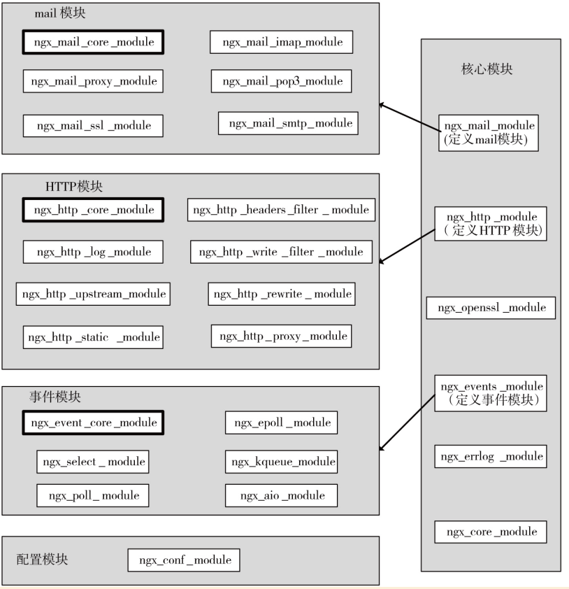

[TOC]

## Nginx介绍
是高性能的Web服务器

和Apache、Tomcat、Jetty、IIS做比较：
1. Tomcat、Jetty 面向java语言，先天就是重量级的WEB服务器，其性能与Nginx没有可比性；
2. IIS只能在Windows操作系统上运行。Windows作为服务器在稳定性与其他一些性能上都不如类UNIX操作系统，因此，在需要高性能Web服务器的场合下IIS并不占优；
3. Apache的发展时期很长，而且是目前毫无争议的世界第一大Web服务器，其有许多优点，如稳定、开源、跨平台等，但它出现的时间太长了，在它兴起的年代，互联网的产业规模远远比不上今天，所以它被设计成了一个重量级的、不支持高并发的Web服务器。在Apache服务器上，如果有数以万计的并发HTTP请求同时访问，就会导致服务器上消耗大量内存，操作系统内核对成百上千的Apache进程做进程间切换也会消耗大量CPU资源，并导致HTTP请求的平均响应速度降低，这些都决定了Apache不可能成为高性能Web服务器；

## 源码安装环境
1. linux 内核2.6及以上版本
只有2.6之后才支持epool ，在此之前使用select或pool多路复用的IO模型，无法解决高并发压力的问题。通过命令uname -a 即可查看。
```
#查看 linux 内核
uname -a  
```
2. GCC编译器：
GCC（GNU Compiler Collection）可用来编译C语言程序。Nginx不会直接提供二进制可执行程序,只能下载源码进行编译。
3. PCRE库：
PCRE（Perl Compatible Regular Expressions，Perl兼容正则表达式）是由Philip Hazel开发的函数库，目前为很多软件所使用，该库支持正则表达式。
4. zlib库：
zlib库用于对HTTP包的内容做gzip格式的压缩，如果我们在nginx.conf里配置了gzip on，并指定对于某些类型（content-type）的HTTP响应使用gzip来进行压缩以减少网络传输量。
5. OpenSSL开发库：
如果我们的服务器不只是要支持HTTP，还需要在更安全的SSL协议上传输HTTP，那么就需要拥有OpenSSL了。另外，如果我们想使用MD5、SHA1等散列函数，那么也需要安装它。
上面几个库都是Nginx 基础功能所必需的，为简单起见我们可以通过yum 命令统一安装。
```
#yum 安装nginx 环境
yum -y install make zlib zlib-devel gcc-c++ libtool openssl openssl-devel pcre pcre-devel
```

## CentOS中安装
这个不需要准备环境
注意：yum源没有nginx源需要第三方yum源
```bash
# 获取yum仓库源
sudo rpm -Uvh http://nginx.org/packages/centos/7/noarch/RPMS/nginx-release-centos-7-0.el7.ngx.noarch.rpm
# 安装nginx
sudo yum install -y nginx
```

可使用epel源
```bash
# 安装epel-release源并安装
yum install epel-release
yum update
yum install nginx
```

## Ressbian中安装
#### 源码安装
1. [官网下载](http://nginx.org/en/download.html)；
2. 准备环境：树莓派的缺PCRE，装一个；
```bash
# PCRE
sudo apt-get install libpcre3 libpcre3-dev
```
3. 简单安装：将tar包解压，直接用configure脚本`./configure`。此时会生成一个objs；
4. 在nginx目录下`make`产生二进制文件（报错了，看[安装报错](#jump1)）；
5. 在nginx目录下`make install`，安装到目录/usr/local/nginx；
6. 进入/usr/local/nginx，`sudo ./sbin/nginx`开启；
7. 检查是否开启：`curl 127.0.0.1`；

#### 添加其他模块
这里有模块的解释[documentation-Building nginx from Sources](http://nginx.org/en/docs/configure.html)
```bash
# 添加状态查查看模块
./configure --with-http_stub_status_module 
# 重新创建主文件，如果有报错看 坑-安装报错 的说明
make
# 将新生成的nginx 文件覆盖 旧文件。
cp objs/nginx /usr/local/nginx/sbin/
# 查看是否更新成功 显示了 configure 构建参数表示成功
/usr/local/nginx/sbin/nginx -V
# 输出：
#nginx version: nginx/1.14.0
#built by gcc 8.3.0 (Raspbian 8.3.0-6+rpi1) 
#configure arguments: --with-http_stub_status_module
```

#### 坑
1. <span id="jump1">安装报错</span>
```bash
src/http/ngx_http_script.c: In function ‘ngx_http_script_add_copy_code’:
src/http/ngx_http_script.c:698:18: error: 
cast between incompatible function types from 
‘size_t (*)(ngx_http_script_engine_t *)’ {aka ‘unsigned int (*)(struct <anonymous> *)’} to 
‘void (*)(ngx_http_script_engine_t *)’ {aka ‘void (*)(struct <anonymous> *)’} [-Werror=cast-function-type]
     code->code = (ngx_http_script_code_pt) ngx_http_script_copy_len_code;
                  ^
src/http/ngx_http_script.c: In function ‘ngx_http_script_add_var_code’:
src/http/ngx_http_script.c:787:18: error: 
cast between incompatible function types from 
‘size_t (*)(ngx_http_script_engine_t *)’ {aka ‘unsigned int (*)(struct <anonymous> *)’} to 
‘void (*)(ngx_http_script_engine_t *)’ {aka ‘void (*)(struct <anonymous> *)’} [-Werror=cast-function-type]
     code->code = (ngx_http_script_code_pt) ngx_http_script_copy_var_len_code;
                  ^
src/http/ngx_http_script.c: In function ‘ngx_http_script_add_capture_code’:
src/http/ngx_http_script.c:1181:18: error: 
cast between incompatible function types from 
‘size_t (*)(ngx_http_script_engine_t *)’ {aka ‘unsigned int (*)(struct <anonymous> *)’} to 
‘void (*)(ngx_http_script_engine_t *)’ {aka ‘void (*)(struct <anonymous> *)’} [-Werror=cast-function-type]
     code->code = (ngx_http_script_code_pt)
                  ^
src/http/ngx_http_script.c: In function ‘ngx_http_script_add_full_name_code’:
src/http/ngx_http_script.c:1296:18: 
error: cast between incompatible function types from 
‘size_t (*)(ngx_http_script_engine_t *)’ {aka ‘unsigned int (*)(struct <anonymous> *)’} to 
‘void (*)(ngx_http_script_engine_t *)’ {aka ‘void (*)(struct <anonymous> *)’} [-Werror=cast-function-type]
     code->code = (ngx_http_script_code_pt) ngx_http_script_full_name_len_code;

cc1: all warnings being treated as errors
make[1]: *** [objs/Makefile:886：objs/src/http/ngx_http_script.o] 错误 1
make[1]: 离开目录“/home/pi/practice/nginx-1.14.0”
make: *** [Makefile:8：build] 错误 2
```
仔细看这个提示：`cc1: all warnings being treated as errors`，所有警告当错误处理
解决办法：
- 找到源文件（objs下）所在目录下的Makefile文件
- 搜索Werror，一般为cflags = -Werror
- 将Werror注释掉，重新编译即可

## Ngingx架构简介

说明：
1）nginx启动时，会有一个master和若干个worker进程，master不处理网络请求，主要负责调度工作进程，也就是图示的三项：加载配置、启动工作进程及非停升级。所以，nginx启动以后，查看操作系统的进程列表，我们就能看到至少有两个nginx进程。
2）服务器实际处理网络请求及响应的是工作进程（worker），在类unix系统上，nginx可以配置多个worker，而每个worker进程都可以同时处理数以千计的网络请求。
3）模块化设计。nginx的worker，包括核心和功能性模块，核心模块负责维持一个运行循环（run-loop），执行网络请求处理的不同阶段的模块功能，如网络读写、存储读写、内容传输、外出过滤，以及将请求发往上游服务器等。而其代码的模块化设计，也使得我们可以根据需要对功能模块进行适当的选择和修改，编译成具有特定功能的服务器。
4）事件驱动、异步及非阻塞，可以说是nginx得以获得高并发、高性能的关键因素，同时也得益于对Linux、Solaris及类BSD等操作系统内核中事件通知及I/O性能增强功能的采用，如kqueue、epoll及event ports。

核心模块：


## Nginx配置与使用

#### 常用命令
```
#查看命令帮助
./sbin/nginx -?
#默认方式启动：
./sbin/nginx 
#指定配置文件启动 
./sbing/nginx -c /tmp/nginx.conf 
#指定nginx程序目录启动
./sbin/nginx -p /usr/local/nginx/

#快速停止
./sbin/nginx -s stop
#优雅停止
./sbin/nginx -s quit

# 热装载配置文件 
./sbin/nginx -s reload
# 重新打开日志文件
./sbin/nginx -s reopen
# 设置全局命令，如下表示设置启动用户为root
./sbin/nginx -g "user root;"
```
**注意**
reopen，是在日志做了备份，重新新建了一个日志文件要做的操作，否则还是会往已经修改文件名的文件写入日志 —— 这是因为文件句柄fd没有变，只是文件名变了。

#### 配置文件语法格式
```
worker_processes  1;
events {
    worker_connections  1024;
}
http {
    include       mime.types;
    default_type  application/octet-stream;
    sendfile        on;
    keepalive_timeout  65;
    server {
        listen       80;
        server_name  localhost;
        location / {
            root   html;
            index  index.html index.htm;
        }
        location /nginx_status {
    	   stub_status on;
    	   access_log   off;
  	    }
    }
}
```
说明：
1. 监听端口
语法：listen address：
默认：listen 80 (default);
配置块：server

2. 主机名称（域名）
语法：server_name name1 name2 *.name1;
默认：server_name "";
配置块：server
server_name后可以跟多个主机名称，如server_name [www.testweb.com](http://www.testweb.com)、download.testweb.com;。 支持通配符与正则
基于最大匹配原则，左边匹配大于右边匹配（`*.name1> name1.*`），若优先级一样，上面大于下面

3. location
是对于具体的目录，多个后台
语法：location[=|～|～*|^～|@]/uri/{……}
配置块：server
下面按优先级排序
- =表示把URI作为字符串，以便与参数中的uri做完全匹配。
- / 基于uri目录匹配
- ～表示正则匹配URI时是字母大小写敏感的。
- ～*表示正则匹配URI时忽略字母大小写问题。
- ^～表示正则匹配URI时只需要其前半部分与uri参数匹配即可。

**匹配优先规则：**
- 精确匹配优先 =；
- 正则匹配优先 ^~；
- 前缀最大匹配优先；
- 配置靠前优化；

4. root 
指定域名对应的根目录
可配置在 server与location中，基于ROOT路径+URL中路径去寻找指定文件。

5. alias
指定站点别名，只能配置location 中。基于alias 路径+ URL移除location  前缀后的路径来寻找文件。
如下示例：
```
location /V1 {
      alias  /www/old_site;
      index  index.html index.htm;
}
#防问规则如下
URL：http://xxx:xx/V1/a.html
最终寻址：/www/old_site/a.thml
```

#### 配置第一个静态WEB服务

重定向到百度
```bash
location = /old/baidu {
    proxy_pass http://www.baidu/com/;
}
```
这里注意不需要https，com后面加上“/”符号，否则`/old/baidu`就直接拼上com后面了。

#### 日志配置
###### 日志格式
```bash
log_format  main  '$remote_addr - $remote_user [$time_local]   "$request" '
                     '$status $body_bytes_sent "$http_referer" '
                  '"$http_user_agent" "$http_x_forwarded_for"';
access_log  logs/access.log  main;
#基于域名打印日志
access_log logs/$host.access.log main;
```
更改日志地址可能没起作用，关注worker进程有没有权限操作文件

###### error日志的设置
语法：error_log /path/file level;
默认：error_log logs/error.log error;
level是日志的输出级别，取值范围是debug、info、notice、warn、error、crit、alert、emerg，

###### debug级别的日志
> 针对指定的客户端输出

语法：debug_connection[IP|CIDR]
events {
debug_connection 192.168.0.147; 
debug_connection 10.224.57.0/200;
}
注意：debug 日志开启 必须在安装时 添加  --with-debug (允许debug)


#### 配置案例
###### 动静分离实现
- 配置 location /static
- 配置 ~* \.(gif|png|css|js)$ 
###### 防盗链
```bash
# 加入至指定location 即可实现
valid_referers none blocked *.xxx.com;
 if ($invalid_referer) {
       return 403;
}
```
###### 多域名站点

###### 下载限速
```bash
location /download {
    limit_rate 1m; // 限制每S下载速度
    limit_rate_after 30m; // 超过30 之 后在下载
}
```
###### IP 黑名单
```bash
#封禁指定IP
deny 192.168.0.1;
allow 192.168.0.1;
#开放指定IP 段
allow 192.168.0.0/24;
#封禁所有
deny    all;
#开放所有
allow    all;
# 创建黑名单文件
echo 'deny 192.168.0.132;' >> balck.ip
#http 配置块中引入 黑名单文件
include       black.ip;
```
###### 基于user-agent分流

## 性能优化
#### 正向、反向代理
反向代理与正向代理：技术上没什么区别，主要是看场景。
|  | 正向代理 | 反向代理 |
|--|--|--|
| 代理服务器位置 | 客户端与服务端都能连接的位置 | 目标服务器内部 |
| 主要作用 | 屏蔽客户IP，集中式缓存，解决客户端不能直接连服务器的问题 | 屏蔽服务端内部实现，负载均衡、缓存 |
| 应用场景 | VPN(FQ)，Maven(nexus) | Nginx |

Nginx 代理只需要配置 location 中配置proxy_pass 属性即可。其指向代理的服务器地址。
```bash
# 正向代理到baidu 服务
location = /baidu.html {
         proxy_pass http://www.baidu.com;
}
# 反向代理至 本机的8010服务
location /xx/ {
     proxy_pass http://127.0.0.1:8010;  
}
```

代理相关参数：
```bash
proxy_pass           # 代理服务
proxy_redirect off;   # 是否允许重定向。默认请求转发
proxy_set_header Host $host; # 传 header 参数至后端服务
proxy_set_header X-Forwarded-For $remote_addr; # 设置request header 即客户端IP 地址
proxy_connect_timeout 90; # 连接代理目标服务超时时间
proxy_send_timeout 90; # 请求发送给目标服务最大时间
proxy_read_timeout 90;  # 读取最大时间
proxy_buffer_size 4k; 
proxy_buffers 4 32k;
proxy_busy_buffers_size 64k; 
proxy_temp_file_write_size 64k;
```

#### 负载均衡
> 给多个后台服务发送请求。可以通过upstream 模块实现负载均衡。

简单配置
```bash
upstream backend {     
   server 127.0.0.1:8010 weight=1;
   server 127.0.0.1:8080 weight=2;

  server 127.0.0.1:8030 weight=1 backup;
}
location / {
    proxy_pass http://backend;
}
```

upstream 相关参数:
- server 反向服务地址 加端口
- weight 权重
- max_fails 失败多少次 认为主机已挂掉则，踢出
- fail_timeout	踢出后重新探测时间
- backup	备用服务
- max_conns	允许最大连接数
- slow_start	当节点恢复，不立即加入,而是等待slow_start后加入服务对列。

负载均衡算法介绍
- ll+weight： 轮询加权重 (默认)
- ip_hash：基于Hash 计算，用于保持session一至性
- url_hash：静态资源缓存，节约存储，加快速度（第三方）
- least_conn：最少链接（第三方）
- least_time：最小的响应时间，计算节点平均响应时间，然后取响应最快的那个，分配更高权重（第三方）

了解一下一致性哈希算法，虚拟节点。

#### 高速缓存
> 场景：一个请求，通过nginx，经过一个A服务，再分发到各个服务。各个服务组装给A，设组装后的有150k，那么当500～700QPS的时候，已经到达千兆级别的带宽，成为内网的瓶颈。可以在nginx中缓存，由nginx直接返回出去。

###### 基本配置
一、在http元素下添加缓存区声明。
```bash
#proxy_cache_path 缓存路径
#levels 缓存的文件夹层数 以及文件夹名称（从proxy_cache_key算出来的）
#keys_zone 缓存区内存大小
#inactive 有效期，从硬盘删除
#max_size 硬盘大小
proxy_cache_path /data/nginx/cache levels=1:2 keys_zone=cache_x:500m inactive=20d max_size=1g;
```

二、指定location 设定缓存策略
```bash
# 指定缓存区 keys_zone
proxy_cache cache_x;
#以全路径md5值做做为Key 
proxy_cache_key $host$uri$is_args$args;
#对不同的HTTP状态码设置不同的缓存时间
proxy_cache_valid 200 304 12h;
```

三、清除配置
```bash
location ~ /clear(/.*) {
  #允许访问的IP
   allow           127.0.0.1;
   allow           192.168.0.193;
   #禁止访问的IP
   deny            all;
   #配置清除指定缓存区和路径(与proxy_cache_key一至)
   proxy_cache_purge    cache_x $host$1$is_args$args;
}                        
```
配置好以后 直接访问 ：
```bash
# 访问生成缓存文件
http://www.xxx.com/?a=1
# 清除生成的缓存,如果指定缓存不存在 则会报404 错误。
http://www.xxx.com/clear/?a=1
```

#### 性能调优

**worker_processes number;**
每个worker进程都是单线程的进程，它们会调用各个模块以实现多种多样的功能。如果这些模块确认不会出现阻塞式的调用，那么，有多少CPU内核就应该配置多少个进程；反之，如果有可能出现阻塞式调用，那么需要配置稍多一些的worker进程。例如，如果业务方面会致使用户请求大量读取本地磁盘上的静态资源文件，而且服务器上的内存较小，以至于大部分的请求访问静态资源文件时都必须读取磁盘（磁头的寻址是缓慢的），而不是内存中的磁盘缓存，那么磁盘I/O调用可能会阻塞住worker进程少量时间，进而导致服务整体性能下降。

**每个worker 进程的最大连接数**
**语法**：worker_connections number;
**默认**：worker_connections 1024

**worker_cpu_affinity cpumask[cpumask……]**
**绑定Nginx worker进程到指定的CPU内核**
为什么要绑定worker进程到指定的CPU内核呢？假定每一个worker进程都是非常繁忙的，如果多个worker进程都在抢同一个CPU，那么这就会出现同步问题。反之，如果每一个worker进程都独享一个CPU，就在内核的调度策略上实现了完全的并发。
例如，如果有4颗CPU内核，就可以进行如下配置：
worker_processes 4;
worker_cpu_affinity 1000 0100 0010 0001;
注意 worker_cpu_affinity配置仅对Linux操作系统有效。

**Nginx worker 进程优先级设置**
**语法**：worker_priority nice;
**默认**：worker_priority 0;
优先级由静态优先级和内核根据进程执行情况所做的动态调整（目前只有±5的调整）共同决定。nice值是进程的静态优先级，它的取值范围是–20～+19，–20是最高优先级，+19是最低优先级。因此，如果用户希望Nginx占有更多的系统资源，那么可以把nice值配置得更小一些，但不建议比内核进程的nice值（通常为–5）还要小

**Nginx worker进程可以打开的最大句柄描述符个数**
**语法**： worker_rlimit_nofile limit;
**默认**：空
更改worker进程的最大打开文件数限制。如果没设置的话，这个值为操作系统的限制。设置后你的操作系统和Nginx可以处理比“ulimit -a”更多的文件，所以把这个值设高，这样nginx就不会有“too many open files”问题了。

**是否打开accept锁**
**语法**：accept_mutex[on|off]
**默认**：accept_mutext on;
accept_mutex是Nginx的负载均衡锁，当某一个worker进程建立的连接数量达到worker_connections配置的最大连接数的7/8时，会大大地减小该worker进程试图建立新TCP连接的机会，accept锁默认是打开的，如果关闭它，那么建立TCP连接的耗时会更短，但worker进程之间的负载会非常不均衡，因此不建议关闭它。

**使用accept锁后到真正建立连接之间的延迟时间**
语法：accept_mutex_delay Nms; 
默认：accept_mutex_delay 500ms; 
在使用accept锁后，同一时间只有一个worker进程能够取到accept锁。这个accept锁不是堵塞锁，如果取不到会立刻返回。如果只有一个worker进程试图取锁而没有取到，他至少要等待accept_mutex_delay定义的时间才能再次试图取锁。
