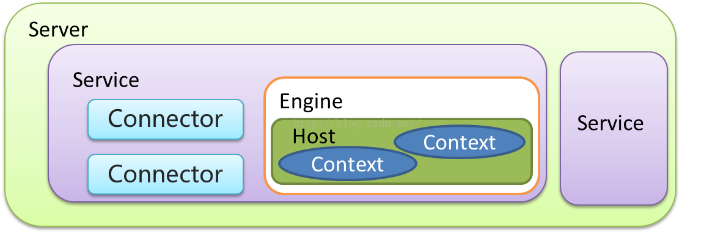

[TOC]

> Tomcat是一个基于JAVA的WEB容器，其实现了JAVA EE中的Servlet与jsp规范，与Nginx apache服务器不同在于一般用于动态请求处理。在架构设计上采用面向组件的方式设计。即整体功能是通过组件的方式拼装完成。另外每个组件都可以被替换以保证灵活性。

## 认识组件
> 总览核心组件（主要聚集在Server.xml中）


#### 各组件及关系

**简单的看图说话**：一个tomcat只有一个server（占用一个进程），一个server可以有多个service，可以在service中通过配置不同的connector连入，connector连到端口上。数据从端口进入后交由Engine处理，Engine在Service中只能有一个，通过域名的解析分发给不同的Host。Host可以配置多个Context，每个Context对于着我们的一个应用服务。

- Server 和 Service
- Connector 连接器
  - HTTP 1.1
  - SSL  https
  - AJP（ Apache JServ Protocol） apache 私有协议，用于apache 反向代理Tomcat
- Container 
  - Engine 引擎 catalina
  - Host 虚拟机 基于域名 分发请求
  - Context 隔离各个WEB应用 每个Context的  ClassLoader都是独立
- Component 
  - Manager （管理器）
  - logger （日志管理）
  - loader （载入器）
  - pipeline （管道）
  - valve （管道中的阀）

#### 相关配置
> server.xml

###### Server
root元素：server 的顶级配置
主要属性:
port：执行关闭命令的端口号
shutdown：关闭命令
```bash
#基于telent 执行SHUTDOWN 命令即可关闭(必须大写)
telent 127.0.0.1 8005
SHUTDOWN
```

###### Service
将多个connector与engine组合成一个服务。可以有多个service

###### Connector
连接器：用于接收 指定协议下的连接 并指定给唯一的Engine 进行处理。
主要属性：
- protocol 必填，监听的协议，默认是http/1.1，或者像下面的例子指定类名
- port 指定服务器端要创建的端口号
- minThread	服务器启动时创建的处理请求的线程数
- maxThread	最大可以创建的处理请求的线程数
- enableLookups	如果为true，则可以通过调用request.getRemoteHost()进行DNS查询来得到远程客户端的实际主机名，若为false则不进行DNS查询，而是返回其ip地址
- redirectPort	指定服务器正在处理http请求时收到了一个SSL传输请求后重定向的端口号
- acceptCount	指定当所有可以使用的处理请求的线程数都被使用时，可以放到处理队列中的请求数，超过这个数的请求将不予处理
- connectionTimeout	指定超时的时间数(以毫秒为单位)，是请求等待tomcat调用的
- SSLEnabled 是否开启 sll 验证，在Https 访问时需要开启。
- compression 是否压缩
- compressionMinSize 最小的压缩
- compressableMimeType 哪些需要压缩
- maxThreads 决定有多少worker进程来处理请求
- minSpareThreads 最小激活线程数
- acceptCount 能接受的并发连接
- enableLookups false是不做DNS查询，直接返回request.Host的ip
```xml
 <Connector port="8080" protocol="org.apache.coyote.http11.Http11NioProtocol"
            connectionTimeout="20000"
            redirectPort="8862"
            URIEncoding="UTF-8"
            useBodyEncodingForURI="true"
            compression="on"
            compressionMinSize="2048"
            compressableMimeType="text/html,text/xml,text/plain,text/javascript,text/css,application/x-json,application/json,application/x-javascript"
            maxThreads="1024" 
            minSpareThreads="200"
            acceptCount="800"
            enableLookups="false"
/>
```

###### Engine
引擎：用于处理连接的执行器，默认的引擎是catalina。一个service 中只能配置一个Engine。
主要属性：name 引擎名称 defaultHost 默认host

###### Host
虚拟机：基于域名匹配至指定虚拟机。类似于nginx 当中的server，默认的虚拟机是localhost。
- name 域名
- appBase 可以绝对/相对路径。只是各个站点所在的根目录，要再在根目录里面创建文件夹（比如下面的例子，dx做站点，才能通过 www.dx.com/dx 访问到里面的文件）
- unpackWARs 自动解开war包
- autoDeploy 自动部署

例子：
```bash
mkdir /Users/apple/tomcattest/dx
cd /Users/apple/tomcattest/dx
echo 'hello world' > index.html
```
配置：
```xml
<Host name="www.dx.com"  appBase="/Users/apple/tomcattest"
            unpackWARs="true" autoDeploy="true">
</Host>
```
访问：http://www.dx.com:8080/dx

注意：
- 如果Host没有配Context，那么appBase配的根目录下每个文件夹都被视为一个站点
- 像这种 http://www.dx.com:8080 没有给上下文的，则默认找ROOT

###### Context
path为空时，默认分发到tomcat自带的ROOT站点
- docBase 站点文件夹名称，也可以是绝对路径
- path 用于url访问站点的前缀（别名）
```xml
<Context docBase="dx" path="/h" reloadable="true"/>
```

如果不想每次都配置Server.xml，可以在`/Users/apple/apache-tomcat-9.0.34/conf/Catalina/`文件夹中 新建文件夹，名字与Host配置的域名一致`www.dx.com`。

注意：这`Catalina/`就是根据Server.xml -> Service -> Engine的属性name生成的，因为如果在server.xml新增一个Service，并给Engine命名Catalina_1，那么tomcat启动后会自动在`conf/`下再生成`Catalina_1/`

那么可以知道：`Catalina/`对应Engine，`www.dx.com/`就是Host。增加或者修改Context就在`www.dx.com/`中新增或者修改就可以了。至于Connector的配置还是要去Server.xml。只是减少了修改Context的失误。

在`www.dx.com/`新增ROOT.xml
```xml
<?xml version="1.0" encoding="UTF-8" ?>
<Context docBase="/Users/apple/tomcattest_1/dx" allowLinking="false"/>
```
这里属性path不起作用了，文件名相当于path，如果是ROOT则域名不再需要拼接前缀即可访问，如果是其他如hello，则需要拼接/hello才能访问dx站点。docBase直接配到对应的站点根目录上

###### Component

一、valve

日志。具体配置要基于具体的Valve 接口的子类。以下即为一个访问日志的Valve.
- directory 基于Catalina_base目录
- prefix 文件名
- suffix 文件的后缀
- pattern 日志格式
```xml
 <Valve className="org.apache.catalina.valves.AccessLogValve" directory="logs"
        prefix="www.xxx.com.access_log" suffix=".txt"
        pattern="%h %l %u %t &quot;%r&quot; %s %b" />
```

## 自动部署
常用的启动流程是
1. 复制WAR包至Tomcat webapp 目录；
2. 执行starut.bat 脚本启动；
3. 启动过程中war 包会被自动解压装载；

但是我们可以减少侵入性，在eclipse、idea中是在Tomcat程序文件之外创建了一个部署目录，在一般生产环境中也是这么做的 即：Tomcat 程序目录和部署目录分开。
我们只需要在启动时指定CATALINA_HOME与CATALINA_BASE参数即可实现。

| **启动参数** | **描述说明** | 
| - | - |
| JAVA_OPTS | jvm启动参数，设置内存编码等 -Xms100m -Xmx200m -Dfile.encoding=UTF-8 | 
| JAVA_HOME | 指定jdk目录，如果未设置从java环境变量当中去找。| 
| CATALINA_HOME | Tomcat 程序根目录 | 
| CATALINA_BASE | 应用部署目录，默认为$CATALINA_HOME | 
| CATALINA_OUT | 应用日志输出目录：默认$CATALINA_BASE/log | 
| CATALINA_TMPDIR | 应用临时目录：默认：$CATALINA_BASE/temp | 
其中：
- JAVA_OPTS 尽量不在catalina.sh中配置，因为这是个全局配置
- JAVA_HOME 尽量写成自己要的

例子：
可以拷一份conf出来，放在另一个文件夹A上，将tomcat和conf的配置分离开，下面两个脚本都放到A上运行。

tomcat.sh，注意脚本的CATALINA_BASE，用的是自己路径
```bash
#!/bin/bash 
export JAVA_OPTS="-Xms100m -Xmx200m"
export JAVA_HOME=/root/svr/jdk/
export CATALINA_HOME=/root/svr/apache-tomcat-7.0.81
export CATALINA_BASE="`pwd`"

case $1 in
        start)
        $CATALINA_HOME/bin/catalina.sh start
                echo start success!!
        ;;
        stop)
                $CATALINA_HOME/bin/catalina.sh stop
                echo stop success!!
        ;;
        restart)
        $CATALINA_HOME/bin/catalina.sh stop
                echo stop success!!
                sleep 3
        $CATALINA_HOME/bin/catalina.sh start
        echo start success!!
        ;;
        version)
        $CATALINA_HOME/bin/catalina.sh version
        ;;
        configtest)
        $CATALINA_HOME/bin/catalina.sh configtest
        ;;
        esac
exit 0
```

deploy.sh 自动下载并发布
```bash
#!/bin/bash -e
export now_time=$(date +%Y-%m-%d_%H-%M-%S)
echo "deploy time:$now_time"

app=$1
version=$2
mkdir -p war/
#从svn下载程序至 当前的war目录
war=war/${app}_${version}.war
echo "$war"
svn export svn://192.168.0.147/release/${app}_${version}.war $war

deploy_war() {
#解压版本至当前目录
target_dir=war/${app}_${version}_${now_time}
unzip -q $war -d $target_dir
# 清除软链接
rm -f appwar
# 建立新的软链接
ln -sf $target_dir appwar
target_ln=`pwd`/appwar
echo '<?xml version="1.0" encoding="UTF-8" ?>
<Context docBase="'$target_ln'" allowLinking="false">
</Context>' > conf/Catalina/localhost/ROOT.xml
#重启Tomcat服务
./tomcat.sh restart
}

deploy_war
```

## 网络通信模型