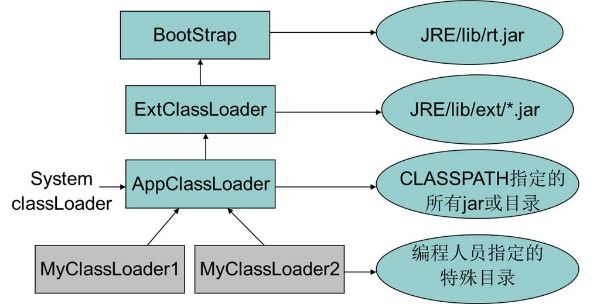

[TOC]

## 类加载过程
**不是一次性加载完成的，用到才会加载**。加载到使用的过程：加载 -> 验证 -> 准备 -> 解析 -> 初始化 -> 使用 -> 卸载。
- 加载：在硬盘上查找并通过IO读入字节码文件，使用到类时才会加载，例如调用 类的main()方法，new对象等等；
- 验证：校验字节码文件的正确性；
- 准备：给类的静态变量分配内存，并赋予默认值；
- 解析：将符号引用替换为直接引用，该阶段会把一些静态方法(符号引用，比如 main()方法)替换为指向数据所存内存的指针或句柄等(直接引用)，这是所谓的静态链 接过程(类加载期间完成)，动态链接是在程序运行期间完成的将符号引用替换为直接 引用，下节课会讲到动态链接；
- 初始化：对类的静态变量初始化为指定的值，执行静态代码块；

## 类加载器

上面加载过程主要是通过加载器来实现的，java有
- Boostrap类加载器：负责加载支撑JVM运行的位于JRE的lib目录下的核心类库，比如 rt.jar、charsets.jar等；
- Extension类加载器：负责加载支撑JVM运行的位于JRE的lib目录下的ext扩展目录中的JAR类包；
- App类加载器：负责加载ClassPath路径下的类包，主要就是加载你自己写的那些类自定义加载器：负责加载用户自定义路径下的类包；

#### 自定义一个类加载器
自定义类加载器只需要继承java.lang.ClassLoader类，该类有两个核心方法，一个是 loadClass(String, boolean)，实现了双亲委派机制，大体逻辑 ：
1. 首先，检查一下指定名称的类是否已经加载过，如果加载过了，就不需要再加载， 直接返回；
2. 如果此类没有加载过，那么，再判断一下是否有父加载器；如果有父加载器，则由 父加载器加载（即调用parent.loadClass(name, false);）.或者是调用bootstrap类加 载器来加载；
3. 如果父加载器及bootstrap类加载器都没有找到指定的类，那么调用当前类加载器 的findClass方法来完成类加载。

还有一个方法是findClass，默认实现是抛出异常，所以我们自定义类加载器主要是重写 findClass方法。

#### 双亲委派
加载某个类时会先委托父加载器寻找目标类，找不 到再委托上层父加载器加载，如果所有父加载器在自己的加载类路径下都找不到目标类，则 在自己的类加载路径中查找并载入目标类。

缘由：
- 沙箱安全机制：自己写的java.lang.String类不会被加载，这样便可以防止 核心API库被随意篡改
- 避免类的重复加载：当父亲已经加载了该类时，就没有必要子ClassLoader再加载一次，保证被加载类的唯一性

双亲委派的关键代码
```java
// 位置：jre/lib/rt.jar!/java/lang/ClassLoader.class
protected Class<?> loadClass(String name, boolean resolve)
    throws ClassNotFoundException{
    synchronized (getClassLoadingLock(name)) {
        // First, check if the class has already been loaded
        Class<?> c = findLoadedClass(name);
        if (c == null) {
            long t0 = System.nanoTime();
            try {
                // 如果有，先给双亲load
                if (parent != null) {
                    c = parent.loadClass(name, false);
                } else {
                    c = findBootstrapClassOrNull(name);
                }
            } catch (ClassNotFoundException e) {
                // ClassNotFoundException thrown if class not found
                // from the non-null parent class loader
            }

            if (c == null) {
                // If still not found, then invoke findClass in order
                // to find the class.
                long t1 = System.nanoTime();
                // 双亲没找到，自己再找
                c = findClass(name);

                // this is the defining class loader; record the stats
                sun.misc.PerfCounter.getParentDelegationTime().addTime(t1 - t0);
                sun.misc.PerfCounter.getFindClassTime().addElapsedTimeFrom(t1);
                sun.misc.PerfCounter.getFindClasses().increment();
            }
        }
        if (resolve) {
            resolveClass(c);
        }
        return c;
    }
}
```

#### 打破双亲委派机制
重写ClassLoader的loadClass。
Tomcat为例，为什么要打破？
1. 一个web容器可能需要部署两个应用程序，不同的应用程序可能会依赖同一个第三方类库的不同版本，要保证每个应用程序的类库都是独立的，保证相互隔离；
2. 部署在同一个web容器中相同的类库相同的版本可以共享。否则，如果服务器有n个应用程序，那么要有n份相同的类库加载进虚拟机；
3. web容器也有自己依赖的类库，不能与应用程序的类库混淆。基于安全考虑，应该让容器的类库和程序的类库隔离开来；
4. web容器要支持jsp的修改，我们知道，jsp 文件最终也是要编译成class文件才能在虚拟 机中运行，但程序运行后修改jsp已经是司空见惯的事情， web容器需要支持jsp修改后不用重启。

Tomcat自定义加载器功能
- commonLoader：Tomcat最基本的类加载器，加载路径中的class可以被 Tomcat容器本身以及各个Webapp访问；
- catalinaLoader：Tomcat容器私有的类加载器，加载路径中的class对于 Webapp不可见；
- sharedLoader：各个Webapp共享的类加载器，加载路径中的class对于所有 Webapp可见，但是对于Tomcat容器不可见； 
- WebappClassLoader：各个Webapp私有的类加载器，加载路径中的class只对 当前Webapp可见；

CommonClassLoader能加载的类都可以被CatalinaClassLoader和SharedClassLoader使用，从而实现了公有类库的共用，而CatalinaClassLoader和SharedClassLoader自己能加载的类则与对方相互隔离。 
WebAppClassLoader可以使用SharedClassLoader加载到的类，但各个 WebAppClassLoader实例之间相互隔离。
而JasperLoader的加载范围仅仅是这个JSP文件所编译出来的那一个.Class文件，它出现的目的就是为了被丢弃：当Web容器检测到JSP文件被修改时，会替换掉目前的 JasperLoader的实例，并通过再建立一个新的Jsp类加载器来实现JSP文件的热加载功能。

tomcat为了实现隔离性，没有遵守双亲委派这个约定，每个webappClassLoader加载自己的目录下的class文件，不会传递给父类加载器，打破了双 亲委派机制。