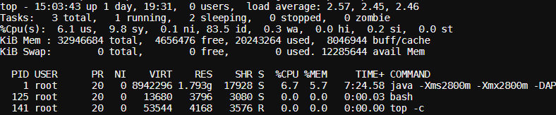

编号：1

> 某服务器上部署了若干tomcat实例，如何定位是哪个服务进程导致CPU过载，哪个线程导致CPU过载，哪段代码导致CPU过载？

步骤一：找到最耗CPU的进程
工具：top
方法：

- 执行`top -c`，显示进程运行信息列表
- 键入P (大写p)，进程按照CPU使用率排序
- 如下 PID 为1

步骤二：找到最耗CPU的线程
工具：top
方法：

- `top -Hp 1`，显示一个进程的线程运行信息列表
- 键入P (大写p)，线程按照CPU使用率排序
- 如下 PID 为60的最耗CPU

步骤三：将线程PID转化为16进制
工具：printf
方法：`printf “%x\n” 60`，结果为3c
之所以要转化为16进制，是因为堆栈里，线程id是用16进制表示的。

步骤四：查看堆栈，找到线程在干嘛
工具：pstack/jstack/grep
方法：`jstack 1 | grep ‘0x3c’ -C5 --color`
命令解释： 打印进程堆栈，通过线程id，过滤得到线程堆栈
如下 找到了耗CPU高的线程对应的线程名称“XXXXXsumer-thread-8”，以及看到了该线程正在执行代码的堆栈。
