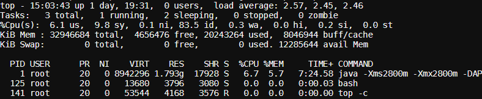
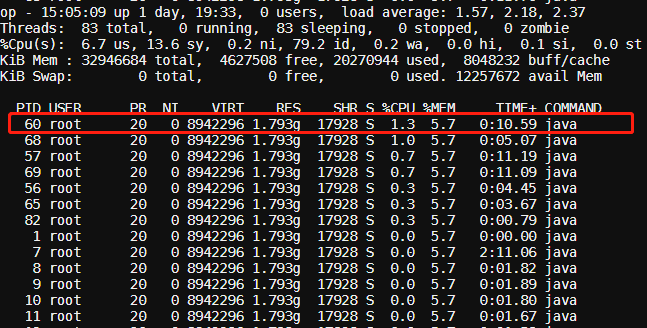
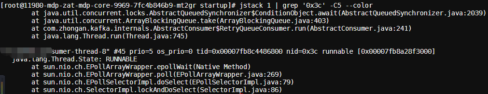
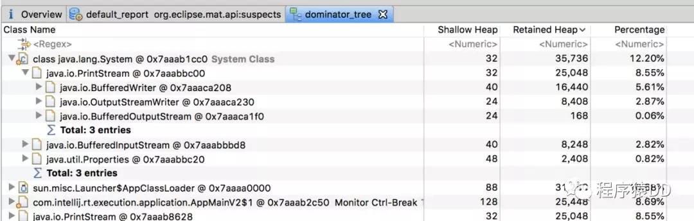

# 应用缓慢排查思路

[TOC]

参照：[系统运行缓慢，CPU 100%，以及Full GC次数过多问题的排查思路](https://mp.weixin.qq.com/s/wTEMbOGiXA8xfyFascoMpA)

> 某服务器上部署了若干tomcat实例，如何定位是哪个服务进程导致CPU过载，哪个线程导致CPU过载，哪段代码导致CPU过载？FULL GC了怎么办？

图片编号：1

## CPU占用率高

步骤一：找到最耗CPU的进程
工具：top
方法：

- 执行`top -c`，显示进程运行信息列表
- 键入P (大写p)，进程按照CPU使用率排序
- 如下 PID 为1



步骤二：找到最耗CPU的线程
工具：top
方法：

- `top -Hp 1`，显示一个进程的线程运行信息列表
- 键入P (大写p)，线程按照CPU使用率排序
- 如下 PID 为60的最耗CPU



步骤三：将线程PID转化为16进制
工具：printf
方法：`printf "%x\n" 60`，结果为3c
之所以要转化为16进制，是因为堆栈里，线程id是用16进制表示的。

步骤四：查看堆栈，找到线程在干嘛
工具：pstack/jstack/grep
方法：`jstack 1 | grep ‘0x3c’ -C5 --color`
命令解释： 打印进程堆栈，通过线程id，过滤得到线程堆栈
如下 找到了耗CPU高的线程对应的线程名称“XXXXXsumer-thread-8”，以及看到了该线程正在执行代码的堆栈。


## 发现和垃圾回收有关（进入GC分析阶段）

步骤五：如果是VM Thread，是指垃圾回收进程
工具：`jstat`
方法：`jstat -gcutil 9 1000 10`

```console
S0   S1   E    O     M     CCS   YGC  YGCT  FGC  FGCT  GCT
0.00 0.00 0.00 75.07 59.09 59.60 3259 0.919 6517 7.715 8.635
0.00 0.00 0.00 0.08  59.09 59.60 3306 0.930 6611 7.822 8.752
0.00 0.00 0.00 0.08  59.09 59.60 3351 0.943 6701 7.924 8.867
0.00 0.00 0.00 0.08  59.09 59.60 3397 0.955 6793 8.029 8.984
```

FGC指的是Full GC数量，这里高达6793，而且还在不断增长。从而进一步证实了是由于内存溢出导致的系统缓慢。那么这里确认了内存溢出，但是如何查看你是哪些对象导致的内存溢出呢，这个可以dump出内存日志，然后通过eclipse的mat工具进行查看



经过mat工具分析之后，我们基本上就能确定内存中主要是哪个对象比较消耗内存，然后找到该对象的创建位置，进行处理即可。这里的主要是PrintStream最多，但是我们也可以看到，其内存消耗量只有12.2%。也就是说，其还不足以导致大量的Full GC，此时我们需要考虑另外一种情况，就是代码或者第三方依赖的包中有显示的`System.gc()`调用。这种情况我们查看dump内存得到的文件即可判断，因为其会打印GC原因：

```console
[Full GC (System.gc()) [Tenured: 262546K->262546K(349568K), 0.0014879 secs] 262546K->262546K(506816K), [Metaspace: 3109K->3109K(1056768K)], 0.0015151 secs] [Times: user=0.00 sys=0.00, real=0.01 secs] 
[GC (Allocation Failure) [DefNew: 2795K->0K(157248K), 0.0001504 secs][Tenured: 262546K->402K(349568K), 0.0012949 secs] 265342K->402K(506816K), [Metaspace: 3109K->3109K(1056768K)], 0.0014699 secs] [Times: user=0.00
```

比如这里第一次GC是由于 System.gc()的显示调用导致的，而第二次GC则是JVM主动发起的。总结来说，对于Full GC次数过多，主要有以下两种原因：

- 代码中一次获取了大量的对象，导致内存溢出，此时可以通过eclipse的mat工具查看内存中有哪些对象比较多；
- 内存占用不高，但是Full GC次数还是比较多，此时可能是显示的 System.gc()调用导致GC次数过多，这可以通过添加 -XX:+DisableExplicitGC来禁用JVM对显示GC的响应。

## 不定期出现的接口耗时现象

对于这种情况，比较典型的例子就是，我们某个接口访问经常需要2~3s才能返回。这是比较麻烦的一种情况，因为一般来说，其消耗的CPU不多，而且占用的内存也不高，也就是说，我们通过上述两种方式进行排查是无法解决这种问题的。而且由于这样的接口耗时比较大的问题是不定时出现的，这就导致了我们在通过 jstack命令即使得到了线程访问的堆栈信息，我们也没法判断具体哪个线程是正在执行比较耗时操作的线程。

对于不定时出现的接口耗时比较严重的问题，我们的定位思路基本如下：首先找到该接口，通过压测工具不断加大访问力度，如果说该接口中有某个位置是比较耗时的，由于我们的访问的频率非常高，那么大多数的线程最终都将阻塞于该阻塞点，这样通过多个线程具有相同的堆栈日志，我们基本上就可以定位到该接口中比较耗时的代码的位置。如下是一个代码中有比较耗时的阻塞操作通过压测工具得到的线程堆栈日志：

```console
"http-nio-8080-exec-2" #29 daemon prio=5 os_prio=31 tid=0x00007fd08cb26000 nid=0x9603 waiting on condition [0x00007000031d5000]
java.lang.Thread.State: TIMED_WAITING (sleeping)
at java.lang.Thread.sleep(Native Method)
at java.lang.Thread.sleep(Thread.java:340)
at java.util.concurrent.TimeUnit.sleep(TimeUnit.java:386)
at com.aibaobei.user.controller.UserController.detail(UserController.java:18)

"http-nio-8080-exec-3" #30 daemon prio=5 os_prio=31 tid=0x00007fd08cb27000 nid=0x6203 waiting on condition [0x00007000032d8000]
java.lang.Thread.State: TIMED_WAITING (sleeping)
at java.lang.Thread.sleep(Native Method)
at java.lang.Thread.sleep(Thread.java:340)
at java.util.concurrent.TimeUnit.sleep(TimeUnit.java:386)
at com.aibaobei.user.controller.UserController.detail(UserController.java:18)

"http-nio-8080-exec-4" #31 daemon prio=5 os_prio=31 tid=0x00007fd08d0fa000 nid=0x6403 waiting on condition [0x00007000033db000]
java.lang.Thread.State: TIMED_WAITING (sleeping)
at java.lang.Thread.sleep(Native Method)
at java.lang.Thread.sleep(Thread.java:340)
at java.util.concurrent.TimeUnit.sleep(TimeUnit.java:386)
at com.aibaobei.user.controller.UserController.detail(UserController.java:18)
```

从上面的日志可以看你出，这里有多个线程都阻塞在了UserController的第18行，说明这是一个阻塞点，也就是导致该接口比较缓慢的原因。
