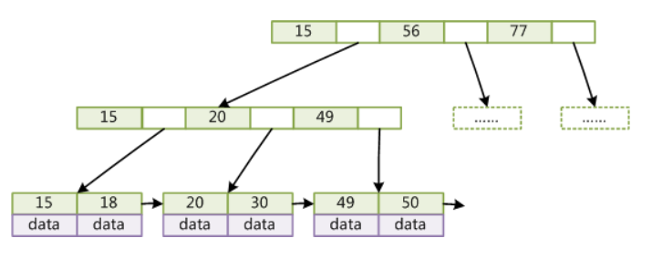
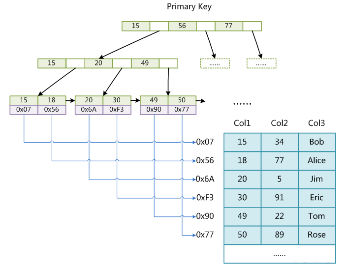
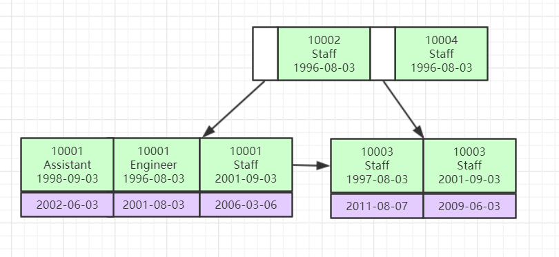

[TOC]

## 索引
是帮助MySQL高效获取数据的排好序的数据结构

## 红黑树、Hash、B树、B+树
简单介绍特性，目的是逐步理解B+
#### 红黑树
是半平衡的二叉树（不是AVL），不需要保证绝对平衡（因为有开销）解释如下
特点：
- 节点要么红色，要么黑色；
- 根结点必须是黑色；
- 所有叶子（NULL）节点是黑色的；
- 红色节点的两个自节点必须是黑色（不能有连续的红色）；
- 从根节点到任意叶子节点，黑色节点的数目是相等的；

从上面可以得出：所有叶子节点的深度相差不会超过一倍

#### Hash
对索引做Hash（MD5、SHA等）运算，可以直接定位到需要的数据上，速度很快，不受表大小的影响，但只能做等值运算，做不到对范围取值

#### B-树
即平衡多路查找树。二叉的查找次数取决于树的高度，每次查找都是一次IO，所以优化成一颗矮胖的树：每个父节点有多个子树

特点：
- 排序方式：所有节点关键字是按递增次序排列，并遵循左小右大原则；
- 子节点数：非叶节点的子节点数>1，且<=M ，且M>=2，空树除外（注：M阶代表一个树节点最多有多少个查找路径，M=M路,当M=2则是2叉树,M=3则是3叉）；
- 关键字数：子节点的关键字数量大于等于ceil(m/2)-1个且小于等于M-1个（注：ceil()是个朝正无穷方向取整的函数 如ceil(1.1)结果为2);
- 所有叶子节点均在同一层、叶子节点除了包含了关键字和关键字记录的指针外也有指向其子节点的指针只不过其指针地址都为null对应下图最后一层节点的空格子;

#### B+树
对B树的优化。
- B树中数据是存在每个节点上。而B+树是存在叶节点上，所以B+树非叶子节点可以容纳更多的关键字；
- 叶子节点保存了父节点的所有关键字记录的指针，每次查找都到叶子节点才能获取到地址，查询做的IO也是一样的；
- 非叶子节点的子节点树=关键字数；
- 叶子节点之间有指针，构成链表；


#### MySQL中的B+树
- 大概可以有2～4层的高度；
- 每个节点定为16K，可以保存多个关键字，同时可以在一页内一次性从硬盘读至内存；
- 叶子节点链表是双向的，可以快速实现排序、倒序等功能；

## 索引如何支撑千万级表的快速查找
根据上面MySQL对B+的优化可以初步估算：
- 设一个主键是BigInt，大约是8b大小，带上一个子节点索引6b，即14b；
- 一个节点可以有16 * 1024 / 14 = 1170；
- 则第二层有1170 * 1170=1368900；
- 在第三层存入数据，设一条数据占1KB，那么一个叶子能有16条数据：1368900 * 16 = 21902400 2千万

## 聚集、非聚集索引
聚集索引：索引和数据在一个文件上
非聚集索引：索引和数据不在一个文件上


#### MyISAM
- 非聚集
- 有三个文件构成.frm(表结构) .MYD(数据) .MYI(索引)
- 可以没有主键

#### InnoDB
- 聚集
- 两个文件组成.frm(表结构) .ibd(数据+索引)
- 必须有主键索引，没设置就会默认Rowid是索引
- 非主键索引存储的是主键值

## B+树常见问题
为什么InnoDB建议要有主键，而且要自增的？
必须要有索引。自增不会出现需要插入到叶节点的中间位置，只需要往后加。

为什么非主键索引结构叶子节点存储的是主键值？
两个索引树都要存数据，那数据量会成倍增长的，而且修改一条数据要修改所有索引下的数据

## 联合索引底层数据结构

多个字段，推荐建立联合索引，可以只建立一颗索引树。
如果联合索引字段是(a,b,c,d)，多个字段放入，大小按索引字段的顺序依此比较大小

识图判断：
- `select * from a where b=3 and c=4`这种不会走索引的，因为无法知道第一个索引是什么，走那条路
- `select * from a where a=3 and b>4 and c=3` 这种走到b索引就不会再走c了，因为无法知道第三个走到哪个b的下面，只能遍历

## Explain工具
可以模拟优化器执行SQL语句，分析查询语句的性能瓶颈。在select语句之前增加explain关键字，MySQL会在查询上设置一个标记，执行查询会返回执行计划的信息，而不会执行。
不过from包含子查询，仍会执行，并放入临时表中。

分析结果的结构：
| id | select_type | table | partitions | type | possible_keys | key | key_len | ref | rows | filtered | Extra |
| - | - | - | - | - | - | - | - | - | - | - | - |

#### Explain的两个变种
- explain extended：会在explain基础上提供一些查询优化的信息。紧随其后通过`show warnings`命令可以得到优化后的查询语句，看出优化器优化了什么。额外还有filtered列，是一个百分比的值，rows * filtered/100 可以估算出将要和explain中前一个表进行连接的行数（前一个表指 explain 中的id值比当前表id值小的表）；
- explain partitions：相比explain多了个partitions字段，如果查询是基于分区表的，会显示查询将访问的分区。（不过基本会用分库分表代替，不会分区的）；

#### id
id是select的序号，select有几个就有几条，id顺序按select出现的顺序增长的。id列越大执行优先级越高，id相同则从上往下执行，id为NULL最后执行

#### select_type列
表示对应行是简单还是复杂查询
- simple 简单查询。查询不包含子查询和union；`explain select * from film where id = 2;`
- primary 复杂查询中最外层的select；
- subquery 包含在select中的子查询（不在from子句中）；
- derived 包含在from子句中的子查询。MySQL会将结果存放在一个临时表中，也叫派生表；

例子：
`set session optimizer_switch='derived_merge=off';` #关闭mysql5.7新特性对衍生表的合并优化
` explain select (select 1 from actor where id = 1) from (select * from film where id = 1) der;`
| id | select_type | table | type | possible_keys | key | key_len | ref | rows | Extra |
| - | - | - | - | - | - | - | - | - | - |
| 1 | PRIMARY | `<derived3>` | system |  |  |  |  | 1 | |
| 3 | DERIVED | film | const | PRIMARY | PRIMARY | 4 | const | 1 |  |
| 3 | SUBQUERY | actor | const | PRIMARY | PRIMARY | 4 | const | 1 | Using index |
`set session optimizer_switch='derived_merge=on';` #还原默认配置

- union 在union中的第二个和随后的select

#### table
这列表示explain的一行正在访问哪个表
当from子句中有子查询时，table列是`<derivenN>`格式，表示当前查询依赖id=N的查询，于是先执行id=N的查询
当有union时，UNION RESULT的table列的值为`<union1,2>`, 1和2表示参与union的select行id

#### type
这列表示关联类型或访问类型，**即MySQL决定如何查找表中的行**，查找数据行记录的大概范围。
依此从优到差为：system > const > eq_ref > ref > range > index > ALL
保证查询达到range，最好ref
- NULL： MySQL在优化阶段分解查询语句，在执行阶段用不着再访问表或索引。如在索引列选取最小值，可单独查找索引完成，不需要访问表；`explain select min(id) from film;`
- const，system：MySQL能对查询的某部分进行优化并将其转化成一个常量（可以看show warnings的结果）。用于primary key 或unique key的所有列与常数比较时，所以表最多有一个匹配行，读取1次。system是const的特例，表里只有一条元素匹配时为system；`explain extended select * from (select * from film where id = 1) tmp;`

| id | select_type | table | type | possible_keys | key | key_len | ref | rows | filtered | Extra |
| - | - | - | - | - | - | - | - | - | - | - |
| 1 | PRIMARY | `<derived2>` | system |  |  |  |  | 1 | 100 | |
| 3 | DERIVED | film | const | PRIMARY | PRIMARY | 4 | const | 1 | 100 | |
- eq_ref：primary key或unique key索引的所有部分被连接使用，最多只会返回一条符合条件的记录。这可能是在const之外最好的连接类型，简单查询不会出现这种type；
- ref：相比eq_ref，不使用唯一索引，而是使用普通索引或者唯一性索引的部分前缀，索引要和某个值比较，可能会找到多个符合条件的行;
例子：
```sql
-- 简单查询，name是普通索引（非唯一索引）
explain select * from film where name = 'film1';
-- 关联表查询，film_id是联合索引
explain select film_id from film left join film_actor on film.id = film_actor.film_id;
```
- range：范围扫描，通常出现在in、between、>、<、=等操作中。使用一个索引来检索给定范围的行；
- index：扫描全表索引，比ALL快；
- ALL：即全表扫描，意味着MySQL需要从头到尾去查找所需要的行。这情况通常要加索引来优化了；

#### possible key
显示查询可能使用哪些索引来查找

#### key
显示MySQL实际采用哪个索引来优化访问
- 有可能possible key有列，但key显示NULL，这种情况是表中数据不多，MySQL认为索引帮助不大，选择全表查询。如果想强制使用或忽视，查询中使用force index、ignore index

#### key_len
显示MySQL在索引中使用的字节数，通过这个值可以算出具体使用了索引哪些列
每个数据类型长度：
- char(n) -> n；
- varchar(n) -> 2字节存储字符串长度，如果是utf-8，则3n+2；
- tinyint -> 1;
- smallint -> 2;
- int -> 4;
- bitint -> 8;
- date -> 3;
- timestamp -> 4;
- datetime -> 8;
- 如果字段允许NULL，需要1字节记录是否为NULL；
索引最大长度是768字节，如果过长，MySQL会有类似左前缀索引的处理，将前半部分的字符提取出来做索引。

#### ref
显示key列记录的索引中，表查找值所用到的列或常量，常见有：const、字段名

#### rows
估计要读取检测的行数，这不是结果集的行数

#### Extra
常见的有：
- Using index，覆盖索引，表示从索引就能得到要的数据；
- Using where，使用where语句处理结果，查询的列没有索引覆盖；
- Using index condition，查询的列不完全被索引覆盖，where条件中是一个前导列的范围；
- Using temporary，创建了一张临时表来处理查询。出现这种情况是要优化的，首先考虑索引；
- Using filesort，用外部排序而不是索引排序，数据较小时从内存排序，否则需要在磁盘完成排序。也是要考虑索引优化的；
- select tables optimized away，使用某些聚合函数（max、min）来访问存在索引的某个字段；