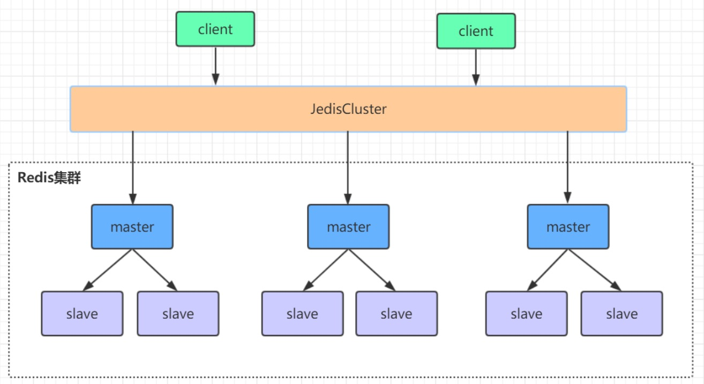
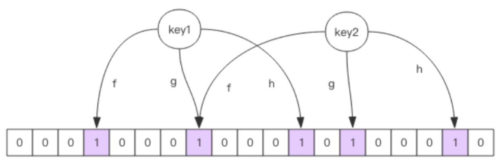

[TOC]

## 安装与使用
```bash
# 下载
wget http://download.redis.io/releases/redis-6.0.4.tar.gz
# 解压
tar -zxvf redis-6.0.4.tar.gz
# 进到解压后的redis目录下编译
make
# 编译靠gcc，没有就安装
yum install gcc
# 编译完会在redis目录下生成一个src目录，命令都在这里

# 修改redis.conf配置：daemonize yes，启动时指定配置文件。这样才能使用后台启动
src/redis‐server redis.conf

# set get简单使用
set dx 2020
get dx
quit

# 杀服务
pkill redis‐server
kill pid
src/redis‐cli shutdown
```

## 常用数据结构使用
#### String
```bash
# 命令：单值
set key value
get key
# 命令：多个
mset key value [key2 value2 ...]
mget key [key2 ...]
# 命令：存入不存在的键才返回成功（1），否则失败（0）。即不允许覆盖
setnx key value
# 命令：删除
del key

# 应用：缓存对象方式，mset好，方便修改。set还要反序列化回来操作
set user:1 json化数据
mset user:1:name dx user:1:age 18
# 应用：分布式锁，是对setnx的使用。
# 当对一个商品的库存进行增减前，多个服务先使用setnx product:sore clientId
# 只有成功的才能继续操作，其余的自旋等待。操作完了记得del。详细使用在后面。

# 命令：原子加减
incr key
decr key
incrby key increment
decrby key decrement 

# 应用：阅读量计数器
incr article:readcount:{id}
# 应用：web Session共享
# 应用：分布式系统全局序列号，注意减压：需要批量获取。
```

#### Hash
类似map中再嵌套map
适合将一类数据归类在一起，注意超时只能对key生效。
```bash
# 命令：单个
hset key field value
hget key field
# 命令：多个
hmset key field value [field1 value1 ...]
hmget ket field [field1 ...]
# 命令：同setnx效果
hsetnx key field value
# 命令：大小
hlen key
# 命令：删除
hdel key
# 命令：获取全部内容
hgetall key
# 命令：为key某个增加增量increament
hinreby key field increament

# 应用：适合存一张表中的对象。注意不能太大，比如大量用户全放里面
hmset user 1:name dx 1:age 18
hmget user 1:name 1:age
```

#### List
可以结合API做出队列、栈等线性数据结构的效果
```bash
# 命令：左边压入
lpush key value1 [value2 ...]
# 命令：右边压入
rpush key value1 [value2 ...]
# 命令：左边弹出
lpop key
# 命令：右边弹出
rpop key
# 命令：从左开始start到stop，闭区间。注意没有从右开始。
lrange key start stop
# 命令：阻塞弹出，没有则登台timeou，如果timeout=0则一直阻塞。考虑到redis是单线程的，少用
blpop key [key2 ...] timeout
brpop key [key2 ...] timeout

# 索引的说明：从左开始数0开始，从右开始数-1开始。即左数数字-总数=右数数字
# 应用：微博的消息流。关注的大V发了消息后可以往每个用户专属的队列放一个消息id
lpush msg:userId msgId
lrange msg:userId 0 5
```

#### Set
```bash
# 命令：添加元素
sadd key member [member2 ...]
# 命令：移除元素
srem key member [member2 ...]
# 命令：获取key中的全部元素
smembers key
# 命令：获取key的数量
scard key
# 命令：是否存在
sismember key member
# 命令：随机抽出count个元素，不删除set中的内容
srandmember key count
# 命令：随机弹出count个元素，并从中删除
spop key count

# 应用：点赞，点赞人列表，是否点赞。同理 收藏、标签功能
# 应用：抽奖，使用随机抽出的命令即可
```

特别注意：集合运算
```bash
# 集合的操作
# 命令：交集
sinter key [key1 ...]
# 命令：并集
sunion key [key1 ...]
# 命令：差集
sdiff key [key2 ...]

# 应用：关注模型
# 共同关注，交集
# 我关注的人也关注了他，对我关注的每个人做sismember他
# 可能认识，差集，别人关注集合减去我的关注集合

# 应用：手机商品筛选
# 对品牌、操作系统、内存、cpu、分辨率等各维度信息建立set，并放入手机商品id，然后对选择了的条件做一个交集即可。
```

#### ZSet有序集合
```bash
# 命令：添加有分值的
zadd key score member [score1 member1 ...]
# 命令：移除
zrem key member [member1 ...]
# 命令：返回分值
zscore key member
# 命令：增加增量为increment的分值
zincrby key increment member
# 命令：个数
zscrad key
# 命令：分值的正序获取有序集合key从start下标到stop下标的元素。WITHSCORES指带上分值返回
ZRANGE key start stop [WITHSCORES]
# 命令：分值的倒序获取有序集合key从start下标到stop下标的元素。WITHSCORES指带上分值返回
ZREVRANGE key start stop [WITHSCORES]
# 命令：并集计算，新建一个destkey存放结果，numkeys指多少个key
ZUNIONSTORE destkey numkeys key [key ...]
# 命令：交集计算，新建一个destkey存放结果，numkeys指多少个key
ZINTERSTORE destkey numkeys key [key ...]

# 应用：微博热搜排行榜，添加带分值的member，点击量加1，获取前20个member
# 应用：百度7日榜单，对7天做并集运算，获取前n个member
```

#### 其他
`keys *`：获取全部键，建议改名，不能使用。使用`scan`命令
`scan cursor [MATCH pattern] [COUNT count]`：利用游标渐进式遍历。这里返回两个结果，第一个是游标（用于执行下一个scan命令的游标值），第二个是结果。
注意：count指的是redis单次遍历字典槽的数量，不是设置返回结果的数量
`info`：查看redis服务运行信息，分为 9 大块，每个块都有非常多的参数 
- Server 服务器运行的环境参数；
- Clients 客户端相关信息；
- Memory 服务器运行内存统计数据；
- Persistence 持久化信息；
- Stats 通用统计数据；
- Replication 主从复制相关信息；
- CPU CPU 使用情况；
- Cluster 集群信息；
- KeySpace 键值对统计数量信息；

## redis的性能
> 每秒10qps/s
- 执行是在内存上操作的，速度较快；
- 单线程，没有切换上下文耗费的性能，但正因为是单线程的，需要注意每条命令不能执行耗时的操作；
- 单线程如何并发处理客户端的连接：IO的多路复用。将连接信息和事件放在队列中，给到事件分派器分发到事件处理器，处理完毕再回调返回连接

redis可以配置最大并发处理客户端的数量：maxclients 10000

#### 单线程与多线程
性能瓶颈不在CPU 官方：[为什么是单线程的](https://redis.io/topics/faq#redis-is-single-threaded-how-can-i-exploit-multiple-cpu--cores)

## redis持久化
#### RDB快照
默认生成dump.rdb的二进制数据。
- 配置文件：`save 900 1`（900s有一次变动，即查询不算）。每隔一定的时长，并执行了多少次命令就做一次快照。可以多个，是同时生效的。如果不要这种持久化注释即可。这是异步生成的。
- 客户端：执行`save`、`bgsave`生成快照，注意bgsave会fork一个子进程异步生成。

| 命令 | save | bgsave |
| :-- | :-- | :-- |
| IO类型 | 同步 | 异步 |
| 是否阻塞redis其它命令 | 是 | 否(在生成子进程执行调用fork函 数时会有短暂阻塞) |
| 复杂度 | O(n) | O(n) |
| 优点 | 不会消耗额外内存 | 不阻塞客户端命令 |
| 缺点 | 阻塞客户端命令 | 需要fork子进程，消耗内存 |

#### AOF
配置文件：appendonly yes
append-only file，每执行一条改变数据集的命令就追加至文件，启动时重新执行这些命令就可以恢复。
可以选择追加的策略：
- appendfsync always：每次有新命令追加到AOF文件时就执行一次fsync，非常慢，也非常安全；
- appendfsync everysec：每秒fsync一次，足够快（和使用RDB持久化差不多），并且在故障时只会丢失1秒钟的数据（推荐，兼顾性能与安全）；
- appendfsync no：从不fsync，将数据交给操作系统来处理。更快，也更不安全的选择；

aof文件的格式：（RESP命令）命令占的位数 字符串长度 字符串 [字符串长度 字符串]...（*3 $3 set $2 dx $2 18）

AOF的重写：是对一些命令的优化，比如执行了多次incr key，会优化成一条语句

可以配置AOF自动重写频率 
- `auto-aof-rewrite-min-size 64mb`：aof文件至少要达到64M才会自动重写，文件太小恢复速度本来就很快，重写的意义不大；
- `auto-aof-rewrite-percentage 100`：aof文件自上一次重写后文件大小增长了100%则再次触发重写；

客户端控制重写：`bgrewriteaof`（fork子进程）

#### 对比
| 命令 | RDB | AOF |
| :-- | :-- | :-- |
| 启动优先级 | 低 | 高 |
| 体积 | 小 | 大 |
| 恢复速度 | 快 | 慢 |
| 数据安全性 | 容易丢数据 | 根据策略决定 |

#### 混合持久化
Redis 4.0 为了解决这个问题，带来了一个新的持久化选项——混合持久化。配置开启混合持久化：`aof-use-rdb-preamble yes`
如果开启了混合持久化，AOF在重写时，将重写这一刻之前的内存做RDB快照处理，并且将RDB快照内容和增量的AOF修改内存数据的命令存在一起，都写入新的AOF文件，新的文件一开始不叫appendonly.aof，等到重写完新的AOF文件才会进行改名，原子的覆盖原有的AOF文件，完成新旧两个AOF文件的替换。
在 Redis 重启的时候，可以先加载RDB的内容，然后再重放增量AOF日志就可以完全替代之前的AOF全量文件重放，重启效率大幅得到提升。

## 主从
> 只是数据的复制，变更需要手动介入

#### 搭建
```bash
# 复制一份配置文件

# 如果端口有变化，配置文件修改
port 6380
pidfile /var/run/redis_6380.pid
logfile "6380.log"
dir /usr/local/redis‐5.0.3/data/6380

# 主从
replicaof 192.168.1.108 6379
replica‐read‐only yes

# 绑定ip
bing 192.168.1.108
# 用配置文件启动
```

问题：
从节点连接报错 Error condition on socket for SYNC: Operation now in progress
主节点配置文件`bind`有限定，127.0.0.1表示只能本机连接，配上从节点所在ip才能同步

注意：
- 配好logfile，更好查找问题
- 主库：`bind`，允许联入的ip配置是否正确，本机联入需要加127.0.0.1；
- 从库：`replicaof`，主库ip是否正确，`bind`是否正确；

#### 主从原理
全量复制
1. 从节点建立长连接，发送psync同步命令；
2. 主节点bgsave生成rdb文件，并缓存好这个持久化期间段产生的写命令（repl_back_buffer），发送rdb；
3. 从节点接收rdb，并接收后续的写命令，合成完整的rdb，load入内存

部分复制
1. 从节点连接断开；
2. 从节点连接；
3. 从节点发送psync(offset)同步命令；
4. 主节点检查offset是否在repl_back_buffer能找到，如果能找到则将offset后面的命令发送给从节点，如果找不到，则全量复制；

## 哨兵
> sentinel哨兵是特殊的redis服务，主要监控redis实例节点。

client在第一次从哨兵取得redis主节点，之后直接访问。当哨兵发现主节点无法连接，会选举出新的主节点，更改配置，并将新的主节点通知给client（有订阅功能）。

#### 搭建
```bash
# 端口、日志文件等
port 26379
daemonize yes
pidfile "/var/run/redis‐sentinel‐26379.pid"
logfile "26379.log"
dir "/usr/local/redis‐5.0.3/data" 

# sentinel monitor <master‐name> <ip> <redis‐port> <quorum>
# quorum是一个数字，指明当有多少个sentinel认为一个master失效时(值一般为：sentinel总数/2 + 1)，master才算真正失效
sentinel monitor mymaster 192.168.0.60 6379 2 13
```

问题：
哨兵配置文件似乎有问题。一主（A）一从（B）一哨兵，kill A节点后可以故障转移，但是A节点重启，再kill B，此时不能故障转移了。且A B全部重启，即使去除了replicaof，哨兵依旧配置A B成从节点。

#### 选举机制
1. 哨兵监测主节点无法连接，置为sdown（主观下线）；
2. 超过半数的哨兵置为sdown则可以变为odown（客观下线）；
3. 哨兵开启选举周期，选举出leader哨兵，先到先得，得到超过半数票则可成为leader（这里说明了哨兵最好是基数个）；
4. 该leader对redis进行故障转移，将其中的slave升级为master；

## 集群
在redis3.0以前，集群一般是借助哨兵sentinel工具来监控master节点的状态，如果master节点异常，则会做主从切换，将某一台slave作为master。在主从切换的瞬间存在访问瞬断的情况，而且哨兵模式只有一个主节点对外提供服务，没法支持很高的并发，且单个主节点内存也不宜设置得过大，否则会导致持久化文件过大，影响数据恢复或主从同步的效率。

redis集群是一个由多个主从节点群组成的分布式服务器群，它具有复制、高可用和分片特性。不需要sentinel哨兵也能完成节点移除和故障转移的功能。需要将每个节点设置成集群模式，这种集群模式没有中心节点，可水平扩展，据官方文档称可以线性扩展到上万个节点(官方推荐不超过1000个节点)。redis集群的性能和高可用性均优于之前版本的哨兵模式。


集群中的每个小主从存储着不同key，共同像外部提供服务，每个主从都能达到自己最高的QPS，在水平扩容后可以快速增加QPS。哨兵在选举出现的瞬断（服务无法交互）也通过分片的方式分担到各个小主从上，解决了大部分的问题。

#### 搭建
> 规模：3个一主一从的组成的集群
```bash
# 一、新建一个文件夹cluster专门放集群的配置、日志等。最好根据端口命名
mkdir ...../cluster

# 二、配置文件修改内容
# 将redis.conf复制到cluster中再修改
daemonize yes
port 8001
logfile 8001.log
dir /...../redis‐cluster/8001/
# 启动集群模式
cluster‐enabled yes
# 集群节点信息文件，这里800x最好和port对应上
cluster‐config‐file nodes‐8001.conf
cluster‐node‐timeout 5000
# 去掉bind绑定访问ip信息
bind 127.0.0.1
protected‐mode no
appendonly yes

# 如果要设置密码需要增加如下配置：
# redis访问密码
requirepass dx
# 设置集群节点间访问密码
masterauth dx

# 三、将上面的配置文件复制，修改端口、文件名等信息

# 四、 分别启动
src/redis‐server cluster/800*/redis.conf

# 五、建立集群
# 用redis‐cli创建整个redis集群(redis5以前的版本集群是依靠ruby脚本redis‐trib.rb实现) 
# 下面命令里的1代表为每个创建的主服务器节点创建一个从服务器节点
# 执行这条命令需要确认三台机器之间的redis实例要能相互访问，可以先简单把所有机器防火墙关掉，如果不关闭防火墙 则需要打开redis服务端口和集群节点gossip通信端口

# 关闭防火墙
# 临时关闭防火墙
# systemctl stop firewalld
# 禁止开机启动
# systemctl disable firewalld
src/redis-cli -a dx --cluster create --cluster-replicas 192.168.1.104:8001 192.168.1.104:8002 192.168.1.104:8003 192.168.1.104:8004 192.168.1.104:8005 192.168.1.104:8006

# 连接任意一个客户端即可：‐a访问服务端密码，‐c表示集群模式，指定ip地址和端口号
redis‐cli ‐c ‐h 192.168.1.104 ‐p 8001
# 查看集群信息
cluster info
# 查看节点列表
cluster nodes
# 关闭集群则需要逐个进行关闭
redis‐cli ‐c ‐h 192.168.1.104 ‐p 800* shutdown
```
问题：
requirepass没生效，带-a认证参数的不能执行，需要去掉。似乎6.0认证方式不一样了

#### 槽
redis会虚拟出16384的槽，均分到每个主节点上。
Cluster默认会对key值使用crc16算法进行hash得到一个整数值，然后用这个整数值对16384 - 1进行取模来得到具体槽位。
HASH_SLOT = CRC16(key) mod 16383

进行场景操作:
- set操作会计算key的hash，对16383取模，得到slot（槽位），据此决定放到某个主节点上；
- kill其中一个master，他的slave会升为master，槽位也会分配给这个新master，原master恢复了会变成slave；

#### 集群节点通信
> 维护集群的元数据有两种方式：集中式和gossip

集中式：
优点在于元数据的更新和读取，时效性非常好，一旦元数据出现变更立即就会更新到集中式的存储中，其他节点读取的 时候立即就可以立即感知到；
不足在于所有的元数据的更新压力全部集中在一个地方，可能导致元数据的存储压力。

gossip协议：
优点在于元数据的更新比较分散，不是集中在一个地方，更新请求会陆陆续续，打到所有节点上去更新，有一定的延时，降低了压力；
缺点在于元数据更新有延时可能导致集群的一些操作会有一些滞后。
包含ping、pong、meet、fail等。gossip的服务端口是在redis主功能端口加10000。
- 在故障转移后，会通知到其他节点。也可认为redis之间都有心跳维持关键信息。

#### 选举原理
当slave发现自己的master变为FAIL状态时，便尝试进行Failover，以期成为新的master。
存在多个slave竞争成为master节点的过程：
1. slave发现自己的master变为FAIL；
2. 开启新的选举周期（将自己记录的集群currentEpoch加1），并广播FAILOVER_AUTH_REQUEST信息；
3. 其他节点收到该信息，只有master响应，判断请求者的合法性，并发送FAILOVER_AUTH_ACK，对每个epoch只发送一次ack（即先来先得票）；
4. 尝试failover的slave收集master返回的FAILOVER_AUTH_ACK；
5. slave收到超过半数master的ack后变成新Master(解释了集群为什么至少需要三个主节点，只有两个的情况，只剩一个主节点是不能选举成功的)； 
6. 广播Pong消息通知其他集群节点；

发送FAILOVER_AUTH_ACK的逻辑：
- 让其他主节点知道有一个主节点FAIL了；
- 需要保证成为主节点的从节点与原主节点的数据差异最小；

`cluster-require-full-coverage no`：当负责一个插槽的主库下线且没有相应的从库进行故障恢复时，集群仍然可用，如果为yes则集群不可用。

#### 集群的添加与移除
> 集群在做迁移的时候是不能提供服务的
###### 添加
新建俩配置文件，注意日志文件名称、端口（设为8007、8008），以集群的方式开启。
```bash
# 新增节点，新redis ip后面跟上任意一个集群中已知存活的节点
redis-cli --cluster add-node 192.168.1.104 8007 192.168.1.104 8001
# 为新节点分slot，用集群中任意一个主节点
redis‐cli ‐‐cluster reshard 192.168.1.104:8001

How many slots do you want to move (from 1 to 16384)? 600 
What is the receiving node ID? 2728a594a0498e98e4b83a537e19f9a0a3790f38 # 把这600个hash槽移动到哪个节点上去，需要指定节点id
Please enter all the source node IDs.
Type 'all' to use all the nodes as source nodes for the hash slots. 
Type 'done' once you entered all the source nodes IDs. Source node 1:all # 输入all为从所有主节点(8001,8002,8003)中分别抽取相应的槽数指定到新节点中，抽取的总槽数为600个
... ... 
Do you want to proceed with the proposed reshard plan (yes/no)? yes # 开始执行

# 进入第二个redis，指定主节点是哪个（后面这串id为8007的节点id）
cluster replicate 45670we9r8f7gytfe7w8euyf 
```

###### 移除
```bash
# 从节点的移除
src/redis‐cli ‐‐cluster del‐node 192.168.1.104:8008 wytyuygy78yty765r45678u

# 主节点的删除 注意：需要归还slot槽
/src/redis‐cli ‐‐cluster reshard 192.168.1.104:8007

How many slots do you want to move (from 1 to 16384)? 600
What is the receiving node ID? dfca1388f124dec92f394a7cc85cf98cfa02f86f # 这里是需要把数据移动到哪？8001的主节点id) 
Please enter all the source node IDs. 
  Type 'all' to use all the nodes as source nodes for the hash slots. 
  Type 'done' once you entered all the source nodes IDs.
Source node 1:2728a594a0498e98e4b83a537e19f9a0a3790f38 # 是需要数据源，也就是我们的8007节点id
Source node 2:done # 这里直接输入done 开始生成迁移计划
... ... 
Do you want to proceed with the proposed reshard plan (yes/no)? Yes # 开始执行
```

注意：集群不支持mset，因为有可能不在同一个slot，会消耗性能。

## Redis命令对应的RedisTemplate中的方法
String类型结构 
| Redis | RedisTemplate rt |
| --- | --- |
| set key value | rt.opsForValue().set("key","value") |
| get key | rt.opsForValue().get("key") |
| del key | rt.delete("key") |
| strlen key | rt.opsForValue().size("key") |
| getset key value | rt.opsForValue().getAndSet("key","value") |
| getrange key start end | rt.opsForValue().get("key",start,end) |
| append key value | rt.opsForValue().append("key","value") |

Hash结构
| Redis | RedisTemplate rt |
| --- | --- |
| hmset key field1 value1 field2 value2... | rt.opsForHash().putAll("key",map) //map是一 个集合对象 |
| hset key field value | rt.opsForHash().put("key","field","value") |
| hexists key field | rt.opsForHash().hasKey("key","field") |
| hgetall key | rt.opsForHash().entries("key") //返回Map对象 |
| hvals key | rt.opsForHash().values("key") //返回List对象 |
| hkeys key | rt.opsForHash().keys("key") //返回List对象 |
| hmget key field1 field2... | rt.opsForHash().multiGet("key",keyList) |
| hsetnx key field value | rt.opsForHash().putIfAbsent("key","field","val ue" |
| hdel key field1 field2 | rt.opsForHash().delete("key","field1","field2") |
| hget key field | rt.opsForHash().get("key","field") |

List结构 
| Redis | RedisTemplate rt |
| --- | --- |
| lpush list node1 node2 node3... | rt.opsForList().leftPush("list","node") rt.opsForList().leftPushAll("list",list) //list是集 合对象 |
| rpush list node1 node2 node3... | rt.opsForList().rightPush("list","node") rt.opsForList().rightPushAll("list",list) //list是集 合对象 |
| lindex key index | rt.opsForList().index("list", index) |
| llen key | rt.opsForList().size("key") lpop key rt.opsForList().leftPop("key") |
| rpop key | rt.opsForList().rightPop("key") |
| lpushx list node | rt.opsForList().leftPushIfPresent("list","node") |
| rpushx list node | rt.opsForList().rightPushIfPresent("list","node ") |
| lrange list start end | rt.opsForList().range("list",start,end) |
| lrem list count value | rt.opsForList().remove("list",count,"value") |
| lset key index value | rt.opsForList().set("list",index,"value") |

Set结构 
| Redis | RedisTemplate rt |
| --- | --- |
| sadd key member1 member2... | rt.boundSetOps("key").add("member1","me mber2",...) rt.opsForSet().add("key", set) //set是一个集合 对象 |
| scard key | rt.opsForSet().size("key") |
| sidff key1 key2 | rt.opsForSet().difference("key1","key2") //返 回一个集合对象 |
| sinter key1 key2 | rt.opsForSet().intersect("key1","key2")//同上 |
| sunion key1 key2 | rt.opsForSet().union("key1","key2")//同上 |
| sdiffstore des key1 key2 | rt.opsForSet().differenceAndStore("key1","ke y2","des") |
| sinter des key1 key2 | rt.opsForSet().intersectAndStore("key1","key2 ","des") |
| sunionstore des key1 key2 | rt.opsForSet().unionAndStore("key1","key2"," des") |
| sismember key member | rt.opsForSet().isMember("key","member") |
| smembers key | rt.opsForSet().members("key") |
| spop key | rt.opsForSet().pop("key") |
| srandmember key count | rt.opsForSet().randomMember("key",count) |
| srem key member1 member2... | rt.opsForSet().remove("key","member1","member2",...)|

## 分布式锁
> 对共享资源的抢占

对redis单线程特性的利用。`setnx`可以保证只有一个客户设置同一个key能成功。如对商品库存的操作，取得商品的id作为键，只有设置成功才认为自己获得了操作许可。
实现一个简单的分布式锁考虑点：
- 自己加的锁只有自己能解锁；
- 面对应用可能异常处理不当，甚至宕机的情况，锁要能自我解锁，即设置超时时间；
- 超时时间的设定要能满足业务的处理时长，这时长不好把控，可以用守护线程来续超时时间；
- [时钟漂移（没有特别好的解决方案）](#jump1)

#### redisson

上面的考虑点都可以解决。对分布式场景的功能实现的比较好。有读写锁等。

使用：
```java
// 使用简单
String lockKey = "product001";
RLock redissonLock = redisson.getLock(lockKey);
try{
    redissonLock.lock();
    // ...业务代码
} finally {
    redissonLock.unlock();
}
```
源码用到了大量的Lua脚本

###### Lua
允许开发者使用Lua语言编写脚本传到Redis中执行。
好处: 
1. 减少网络开销：原先5次请求的逻辑放在redis服务器上完成。使用脚本，减少了网络往返时延。这点跟管道类似；
2. 原子操作：Redis会将整个脚本作为一个整体执行，中间不会被其他命令插入。管道不是原子的，不过redis的批量操作命令(类似mset)是原子的；
3. 替代redis的事务功能：redis自带的事务功能鸡肋，报错不支持回滚，而redis的lua脚本几乎实现了常规的事务功能，支持报错回滚操作，官方推荐如果要使用redis的事务功能可以用lua替代；

```bash
# 注意：数组从1开始
# redis命令，script是lua脚本，numkeys表示有多少key，key arg表示键、值
EVAL script numkeys key [key ...] arg [arg ...]
eval "return {KEYS[1],KEYS[2],ARGV[1],ARGV[2]}" 2 key1 key2 first second
```
```java
// java中的Lua
// 减10库存的操作
String script = "local count = redis.call('get', KEYS[1])" + 
                "local a = tonumber(count)" +
                "local b = tonumber(ARGV[1])" + 
                "if a > b then" +
                    "redis.call('set', KEYS[1], count - b)" + 
                    "return 1" + 
                "end" +
                "return 0";
Object obj = jedis.eval(script, Arrays.asList("product_id_1001"), Arrays.asList("10"))

// KEYS[1]指的是Arrays.asList("product_id_1001")，ARGV[1]指的是Arrays.asList("10")
```
注意：不要在Lua脚本中出现死循环和耗时的运算，否则redis会阻塞，将不接受其他的命令，redis是单进程、单线程执行脚本。管道不会阻塞redis。

源码：
```java
// RedissonLock.java
// 用到了线程id，Lua加锁用到hset、超时设置、还考虑到了可重入锁

// 续命方法：scheduleExpirationRenewal(treadId)
```

#### Zookeeper
redis实现的共享锁问题：线程1在主节点获取锁成功后主节点挂了，从节点没有这个锁的数据便成为了主节点，此时线程2是可以再次获取锁成功的。如果解决这个场景，使用zookeeper，他的强一致性可以保证这个问题不出现。

#### RedLock
往多个节点加锁，超过半数才算成功。
不建议使用这个，如果超过半数不成功，那成功的redis节点还需要考虑回滚数据的操作。

#### 高性能分布式锁解决方案
场景：一把锁只能支撑几万的QPS，如何能提高到十倍QPS
解决：将一把锁化解成多把锁，即商品库存可以分成好几份，用不同的锁管理。可以参考ConcurrentHashMap 分段锁的实现。

#### <span id="jump1">注：时钟漂移</span>
redis的过期时间是依赖系统时钟的，如果时钟漂移过大时会影响到过期时间的计算。

为什么系统时钟会存在漂移呢？先简单说下系统时间，linux提供了两个系统时间：clock realtime和clock monotonic。clock realtime也就是xtime/wall time，这个时间时可以被用户改变的，被NTP改变。gettimeofday拿的就是这个时间，redis的过期计算用的也是这个时间。
clock monotonic，直译是单调时间，不会被用户改变，但是会被NTP改变。

理想的情况时，所有系统的时钟都时刻与NTP服务器保持同步，但这很难。导致系统时钟漂移的原因有两个：

1. 系统的时钟和NTP服务器不同步。这个目前没有特别好的解决方案；
2. clock realtime被人为修改。在实现分布式锁时，不要使用clock realtime。不过很可惜，redis使用的就是这个时间，Redis 5.0源码，使用的还是clock realtime。也就是说，人为修改redis服务器的时间，就能让redis出问题了。

## 缓存优化相关

#### 缓存穿透
场景：查询一个根本不存在的东西（商品），避开缓存，直接到达数据库查询。
解决：
1. 查询为空的也缓存在redis中（需要超时时间，万一过一会儿有了）；
2. 布隆过滤器：可以事先把key放入，后面再通过key询问，布隆过滤器说某个值存在时，这个值可能不存在；当它说不存在时，那就肯定不存在。

###### 布隆过滤器

是一个大型的位数组和几个不一样的无偏hash函数。所谓无偏就是能够把元素的 hash值算得比较均匀。
向布隆过滤器中添加key时，会使用多个hash函数对key进行hash算得一个整数索引值然后对位数组长度进行取模运算得到一个位置，每个hash函数都会算得一个不同的位置。再把位数组的这几个位置都置为1就完成了add操作。

向布隆过滤器询问key是否存在时，也会把hash的几个位置都算出来，看看位数组中这几个位置是否都为1，只要有一个位为0，那么说明布隆过滤器中这个key不存在。如果都是1，这并不能说明这个key就一定存在，只是极有可能存在，因为这些位被置为1 可能是因为其它的key存在所致。如果这个位数组比较稀疏，这个概率就会很大，如果这个位数组比较拥挤，这个概率就会降低。 这种方法适用于数据命中不高、数据相对固定、实时性低（通常是数据集较大）的应用场景，代码维护较为复杂，但是缓存空间占用很少。

```java
// guava
BloomFilter<String> bloomFilter = BloomFilter.create(Funnels.stringFunnel(Charset.forName("utf‐8")), 1000, 0.001);
```

#### 缓存失效
场景：峰值前夕，为了提高响应速度，统一为热点数据缓存，失效时长一致，到时间后全部失效，导致全部请求到数据库。
解决：超时时间不需要设置一致，有意岔开过期时长。

#### 缓存雪崩
场景：redis宕了，请求全到数据库，数据库负荷过大宕，引起全部服务不可用
解决：
1. 保证缓存层服务高可用性，比如使用Redis Sentinel或Redis Cluster；
2. 依赖隔离组件为后端限流并降级。比如使用Hystrix限流降级组件；
3. 提前演练。在项目上线前，演练缓存层宕掉后，应用以及后端的负载情况以及可能出现的问题，在此基础上做一些预案设定；

#### 激增请求热点
场景：突然大量的请求获取缓存，但是没有缓存，全部请求到数据库；
解决：
分布式锁，第一个请求获取并设置缓存即可，其他请求等待即可；

## 参考规范
#### key的设计
- 可读性、可维护：以业务名(或数据库名)为前缀(防止key冲突)，用冒号分隔，比如业务名:表名:id；
- 简洁：保证语义的前提下，控制key的长度，key占用的内存需要引起注意；
- 不要包含特殊字符：禁止包含空格、换行、单双引号以及其他转义字符；
- 需要设置超时周期，不能当成垃圾桶；

#### value设计
###### 大小问题
- 小，不能大，字符串的不能超过10K，非字符串的元素个数不要超过5000；
- 如果有非字符串的bigkey，使用hscan、sscan、zsacn渐进删除；

Big Key的危害：
- 导致redis阻塞；
- 网络拥塞，过多的请求获取，导致带宽不够；
- 超时的自动删除，会执行del，导致阻塞；

解决：
- 利用好分拆技巧。Big Key多用规则拆小；
- 如果不可避免，那么取的时候注意不要全取的操作，删除同理；

###### 数据类型
选择合适的：如对象`hmset user:1 name tom age 19 favor football`

#### 命令相关
1. O(N)命令关注N的数量：例如hgetall、lrange、smembers、zrange、sinter等并非不能使用，但是需要明确N的值。有遍历的需求可以使用hscan、sscan、zscan代替； 
2. 禁止线上使用keys、flushall、flushdb等，通过redis的rename机制禁掉命令，或者使用scan的 方式渐进式处理；
3. 合理使用select，不同系统使用不同redis：redis的多数据库较弱，使用数字进行区分，很多客户端支持较差，同时多业务用多数据库实际还是单线程处理，会有干扰；
4. 使用批量操作提高效率
    - 原生命令（这是原子的）：例如mget、mset；
    - 非原生命令（这是非原子的）：可以使用pipeline提高效率（将命令收集起来，一次性执行）；
5. Redis事务功能较弱，不建议过多使用，可以用lua替代；

#### 客户端相关
使用带有连接池的数据库，可以有效控制连接，同时提高效率，标准使用方式
连接池参数
| 序号 | 参数名 | 含义 | 默认值 | 使用建议 |
| --- | --- | --- | --- | --- |
| 1 | maxTotal | 资源池中最大连接数 | 8 | 设置建议见下面 |
| 2 | maxIdle | 资源池允许最大空闲的连接数 | 8 | 设置建议见下面 |
| 3 | minIdle | 资源池确保最少空闲的连接数 | 0 | 设置建议见下面 |
| 4 | blockWhenExhausted | 当资源池用尽后，调用者是否要等待。只有当为true时，下面 的maxWaitMillis才会生效 | true | 建议使用默认值 |
| 5 | maxWaitMillis | 当资源池连接用尽后，调用者的最大等待时间(单位为毫秒) | -1：表示永不超时 | 不建议使用默认值 |
| 6 | testOnBorrow | 向资源池借用连接时 是否做连接有效性检测(ping)，无效连接会被移除 | false | 业务量很大时候建议设置为false(多一次 ping的开销)。| 
| 7 | testOnReturn | 向资源池归还连接时 是否做连接有效性检测(ping)，无效连接会被移除 | false | 业务量很大时候建议设置为false(多一次 ping的开销)。 |
| 8 | jmxEnabled | 是否开启jmx监控，可用于监控 | true | 建议开启，但应用本身也要开启 |

###### maxTotal
- 业务希望Redis并发量；
- 客户端执行命令时间；
- Redis资源：例如 nodes(例如应用个数) * maxTotal 是不能超过redis的最大连接数 maxclients（默认10000）。
- 资源开销：例如虽然希望控制空闲连接(连接池此刻可马上使用的连接)，但是不希望因 为连接池的频繁释放创建连接造成不必靠开销。

例子：
- 一次命令时间（borrow|return resource + Jedis执行命令(含网络) ）的平均耗时约为1ms，一个连接的QPS大约是1000；
- 业务期望的QPS是50000；

那么理论上需要的资源池大小是50000 / 1000 = 50个。但事实上这是个理论值，还要考虑到要比理论值预留一些资源，通常来讲maxTotal可以比理论值大一些。但这个值不是越大越好，一方面连接太多占用客户端和服务端资源，另一方面对于Redis这种单线程的服务器，一个大命令的阻塞即使设置再大资源池仍然会无济于事。

###### maxIdle和minIdle
maxIdle：最大存活多少个
minIdle：初始化多少个
- maxIdle是业务需要的最大连接数，maxTotal是为了给出余量，所以maxIdle不要设置过小，否则会有new Jedis(新连接)开销；
- 连接池的最佳性能是maxTotal = maxIdle，这样就避免连接池伸缩带来的性能干扰。但是如果并发量不大或者maxTotal设置过高，会导致不必要的连接资源浪费。一般推荐maxIdle可以设置为按上面的业务期望QPS计算出来的理论连接数，maxTotal可以再放大一倍；
- minIdle（最小空闲连接数），"至少需要保持的空闲连接数"，在使用连接的过程中，如果连接数超过了minIdle，那么继续建立连接，如果超过了maxIdle，当超过的连接执行完业务后会慢慢被移出连接池释放掉。有相关策略保持池子只有minIdle数量的连接；

连接池预热：如果系统启动完马上就会有很多的请求过来，那么可以给redis连接池做预热，比如快速的创建一些redis连接，执行简单命令，类似jedis.ping()，快速的将连接池里的空闲连接提升到minIdle的数量。

#### 清除策略
- 被动删除：当读/写一个已经过期的key时，会触发惰性删除策略，直接删除掉这个过期key；
- 主动删除：由于惰性删除策略无法保证冷数据被及时删掉，所以Redis会定期主动淘汰一批已过期的key；
- 当前已用内存超过maxmemory限定时，触发主动清理策略 当REDIS运行在主从模式时，只有主结点才会执行被动和主动这两种过期删除策略，然后把删除操作”del key”同步到从结点；

第三种策略的情况如下： 
当前已用内存超过maxmemory限定时，会触发主动清理策略。根据自身业务类型，选好maxmemory-policy(最大内存淘汰策略)，设置好过期时间。如果不设 置最大内存，当 Redis 内存超出物理内存限制时，内存的数据会开始和磁盘产生频繁的交换 (swap)， 会让 Redis 的性能急剧下降。 

默认策略是volatile-lru，即超过最大内存后，在过期键中使用lru算法进行key的剔除，保证不过 期数据不被删除，但是可能会出现OOM问题。

其他策略如下： 
- allkeys-lru：根据LRU算法删除键，不管数据有没有设置超时属性，直到腾出足够空间为止；
- allkeys-random：随机删除所有键，直到腾出足够空间为止；
- volatile-random: 随机删除过期键，直到腾出足够空间为止；
- volatile-ttl：根据键值对象的ttl属性，删除最近将要过期数据。如果没有，回退到noeviction策略；
- noeviction：不会剔除任何数据，拒绝所有写入操作并返回客户端错误信息"(error) OOM command not allowed when used memory"，此时Redis只响应读操作；