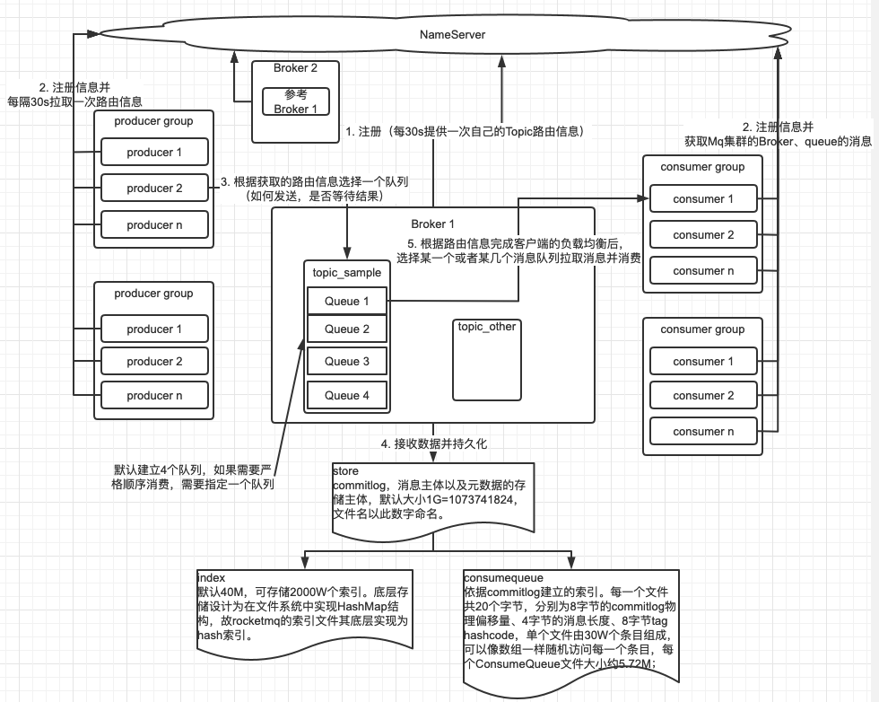

[TOC]

## 介绍
- 借鉴kafka；
- 客户端只能java使用；
- 使用NameServer管理集群，不支持主从切换。主服务宕机后，客户端只能根据从节点读取消息，不能再写入了

特点
- 可以支持大量的topic（5W），性能表现稳定
- 有定时消息的功能
- 有事务功能
- 支持消息的查询（SQL92）

[官方文档](https://github.com/apache/rocketmq/tree/rocketmq-all-4.7.1/docs/cn)有详细说明

## 概念
消息生产者（producer）：负责生产消息，一般由业务系统负责生产消息。一个消息生产者会把业务应用系统里产生的消息发送到broker服务器。RocketMQ提供多种发送方式，同步发送、异步发送、顺序发送、单向发送。同步和异步方式均需要Broker返回确认信息，单向发送不需要；

消息消费者（Consumer）：负责消费消息，一般是后台系统负责异步消费。一个消息消费者会从Broker服务器拉取消息、并将其提供给应用程序。从用户应用的角度而言提供了两种消费形式：拉取式消费 (pull consumer)、推动式消费(push consumer)；

主题（Topic）：表示一类消息的集合，每个主题包含若干条消息，每条消息只能属于一个主题，是 RocketMQ进行消息订阅的基本单位；

代理服务器（Broker Server）：消息中转角色，负责存储消息、转发消息。代理服务器在RocketMQ系统中负责接收从生产者发送来的消息并存储、同时为消费者的拉取请求作准备。代理服务器也存储消息相关的元数据，包括消费者组、消费进度偏移和主题和队列消息等；

名字服务（Name Server）：名称服务充当路由消息的提供者。生产者或消费者能够通过名字服务查找各主题相应的Broker IP列表。多个Namesrv实例组成集群，但相互独立，没有信息交换；

拉取式消费（Pull Consumer）：Consumer消费的一种类型，应用通常主动调用Consumer的拉消息方法从Broker服务器拉消息、主动权由应用控制。一旦获取了批量消息，应用就会启动消费过程；

推动式消费（Push Consumer）：Consumer消费的一种类型，该模式下Broker收到数据后会主动推送给消费端，该消费模式一般实时性较高；

生产者组（Producer Group）：同一类Producer的集合，这类Producer发送同一类消息且发送逻辑一致。如果发送的是事物消息且原始生产者在发送之后崩溃，则Broker服务器会联系同一生产者组的其他生 产者实例以提交或回溯消费；

消费者组（Consumer Group）：同一类Consumer的集合，这类Consumer通常消费同一类消息且消费逻辑一致。消费者组使得在消息消费方面，实现负载均衡和容错的目标变得非常容易。要注意的是，消费者组的消费者实例必须订阅完全相同的Topic。RocketMQ 支持两种消息模式：集群消费（Clustering）和广播消费（Broadcasting）；

集群消费（Clustering）：集群消费模式下,相同Consumer Group的每个Consumer实例平均分摊消息；

广播消费（Broadcasting）：广播消费模式下，相同Consumer Group的每个Consumer实例都接收全量的消息；

普通顺序消息（Normal Ordered Message）：普通顺序消费模式下，消费者通过同一个消费队列收到的消息是有顺序的，不同消息队列收到的消息则可能是无顺序的；

严格顺序消息（Strictly Ordered Message）：严格顺序消息模式下，消费者收到的所有消息均是有顺序的；

消息（Message）：消息系统所传输信息的物理载体，生产和消费数据的最小单位，每条消息必须属于一个主题。RocketMQ中每个消息拥有唯一的Message ID，且可以携带具有业务标识的Key。系统提供了通过Message ID和Key查询消息的功能；

标签（Tag）：为消息设置的标志，用于同一主题下区分不同类型的消息。来自同一业务单元的消息，可以根据不同业务目的在同一主题下设置不同标签。标签能够有效地保持代码的清晰度和连贯性，并优化RocketMQ提供的查询系统。消费者可以根据Tag实现对不同子主题的不同消费逻辑，实现更好的扩展性；


过程：
NameServer，所有的Broker的信息都会保存在NameServer。可以启动多个，是无状态的。Broker定时与NameServer心跳。客户端连接NameServer上，可以通过随机选择可用的NameServer来获取Broker、Topic的信息。获取到之后消费者可以有自己的负载均衡算法来消费队列。所以最重点是NameServer+Broker。

## 安装与使用
1. 参数调整，适应测试
```bash
# 添加JAVA_HOME
sudo vim /etc/profile
# 添加
export JAVA_HOME=/Library/Java/JavaVirtualMachines/jdk1.8.0_211.jdk/Contents/Home/jre/bin
export CLASSPATH=.:$JAVA_HOME/lib/dt.jar:$JAVA_HOME/lib/tools.jar
export PATH=$JAVA_HOME/bin:$PATH
# 调整java的启动参数
vim rocketmq-all-4.7.1-bin-release/bin/runserver.sh
vim rocketmq-all-4.7.1-bin-release/bin/runbroker.sh
```
2. 启动nameServer，输出日志：`nohup sh mqnamesrv -n 10.181.17.234:9876 &`。日志显示：The Name Server boot success. serializeType=JSON（查看java进程：`jps`）

3. Broker（主节点）：修改配置文件broker.conf
```bash
# 多网卡的情况可以明确使用这个IP
brokerIP1 = 10.181.17.234
# 指定nameServer位置
namesrvAddr = 10.181.17.234:9876
# 集群的名称
brokerClusterName = rocket-cluster
# 如果有slave，那么名称要保持一致
brokerName = broker-a
# 0是主节点（master），非0是从节点（slave）
brokerId = 0
# 4点删除
deleteWhen = 04
# 可保存48小时
fileReservedTime = 48
# 角色：SYNC_MASTER,ASYNC_MASTER,SLAVE。ASYNC_MASTER，master接到即返回。SYNC_MASTER，必须主从都同步到了；SLAVE是从节点时需要配置
brokerRole = ASYNC_MASTER
# 刷盘策略，同步是先到缓存，并马上刷盘到硬盘，可以保证消息不丢失。异步则是先到缓存。异步会出现消息丢失的问题，没有刷到硬盘就挂了。
flushDiskType = ASYNC_FLUSH
# topic存储位置
storePathRootDir=/Users/apple/rocketmq-all-4.7.1-bin-release/data
# broker通信端口
listenPort=10811

### 其他
# commitLog存储路径
storePathCommitLog = $HOME/store/commitlog/
# commitLog每个文件的大小，默认1G
storePathConsumerQueue = $HOME/store/consumequeue/
# commitLog每个文件的大小
mapedFileSizeCommitLog = 1024 * 1024 * 1024
# 在发送消息时，自动创建服务器不存在的topic，默认创建的队列数。
defaultTopicQueueNums = 4
# 是否自动创建topic
autoCreateTopicEnable = true
# 是否允许Broker自动创建订阅组，建议线下开启，线上关闭
autoCreateSubscriptionGroup = ture
# 是否拒绝事务消息接入
rejectTransactionMessage = false
# 是否从web服务器获取Name Server地址，针对大规模的Broker集群建议使用这
etchNamesrvAddrByAddressServer = false
# 消息索引存储路径
storePathIndex = $HOME/store/index
# checkpoint文件存储路径
storeCheckpoint = $HOME/store/checkpoint
# abort文件存储路径
abortFile = $HOME/store/abort
# 单次Pull消息（内存）传输的最大字节数
maxTransferBytesOnMessageInMemory = 262144
# 单次Pull消息（内存）传输的最大条数
maxTransferCountOnMessageInMemory = 32
# 单次Pull消息（磁盘）传输的最大字节数
maxTransferBytesOnMessageInDisk = 65536
# 单次Pull消息（磁盘）传输的最大条数
maxTransferCountOnMessageInDisk = 8
# 是否开启消息索引功能
messageIndexEnable = true
# 是否提供安全的消息索引机制，索引保证不丢
messageIndexSafe = false
# 在Slave上直接设置Master地址，默认从Name
# Server上自动获取，也可以手工强制配置
haMasterAddress = 
# 磁盘满、且无过期文件情况下TRUE表示强制删除文件，优先保证服务可用FALSE 标记服务不可用，文件不删除
cleanFileForciblyEnable = true
# 是否开启过滤查询
enablePropertyFilter = true
```
4. 启动，注意配置autoCreateTopicEnable是没有topic时允许自动创建
`nohup sh bin/mqbroker ‐n 10.181.17.234:9876 -c conf/broker.conf autoCreateTopicEnable=true &`

5. 测试
```bash
export NAMESRV_ADDR=10.181.17.234:9876 
# 测试发送端 
sh bin/tools.sh org.apache.rocketmq.example.quickstart.Producer 
# 测试消费端
sh bin/tools.sh org.apache.rocketmq.example.quickstart.Consumer
```

#### 配置注意
防火墙
客户端访问可能会出现的问题：`RemotingTooMuchRequestException: sendDefaultImpl call timeout`
在客户端运行Producer时，可能会出现如上异常，这是因为从Windows上开发连接虚拟机中的nameServer时要经过Linux系统的防火墙，而防火墙一般都会有超时的机 制，在网络连接长时间不传输数据时，会关闭这个 TCP 的会话，关闭后再读写，就有可能 导致这个异常。

#### 添加一个从节点
```bash
brokerIP1 = 10.181.17.234
namesrvAddr = 10.181.17.234:9876
brokerClusterName = rocket-cluster
# -> 主节点和从节点名称应保持一致
brokerName = broker-a
# -> 0是主节点（master），非0是从节点（slave）
brokerId = 1
deleteWhen = 04
fileReservedTime = 48
# -> 角色：SYNC_MASTER,ASYNC_MASTER,SLAVE。异步，master接到即返回。同步则必须主从都同步到了
brokerRole = SLAVE
flushDiskType = ASYNC_FLUSH
storePathRootDir=/Users/apple/rocketmq-all-4.7.1-bin-release/data/rocket-s
# -> broker通信端口
listenPort=10711
```

#### 集群部署
> 两台机器，各启动一个nameServer；两个broker，一主一从，互为主备

[参考官方文档](https://github.com/apache/rocketmq/blob/rocketmq-all-4.7.1/docs/cn/operation.md)

Broker（主节点）：修改配置文件broker.conf
```bash
brokerIP1 = 10.181.17.234
# 指定nameServer位置，多个用分号分割
namesrvAddr = 10.181.17.234:9876;10.181.17.235:9876
brokerClusterName = rocket-cluster
brokerName = broker-a
brokerId = 0
deleteWhen = 04
fileReservedTime = 48
brokerRole = ASYNC_MASTER
flushDiskType = ASYNC_FLUSH
storePathRootDir=/Users/apple/rocketmq-all-4.7.1-bin-release/data
listenPort=10811
```
查看集群状态：`sh mqadmin clusterlist ‐n 10.181.17.234:9876`

```bash
export NAMESRV_ADDR=10.181.17.234:9876;10.181.17.234:9877
# 测试发送端
sh bin/tools.sh org.apache.rocketmq.example.quickstart.Producer
# 测试消费端
sh bin/tools.sh org.apache.rocketmq.example.quickstart.Consumer
```

## 可视化后台
[mq后台下载](https://github.com/apache/rocketmq-externals)

## 整体架构

#### 过程细节
通信方式：连接方式是基于Netty的，默认使用Epoll，然后才是NIO

1. Broker启动后会向nameServer注册信息。每个Broker对应一个store（包含[CommitLog](#jump1)）、ConsumerOffset.json（记录消费的偏移量）、index（索引文件）；
2. Productor、Consumer启动后会向nameServer注册信息并获取Mq集群的Broker、queue的消息；
3. Productor[发送消息](#jump2)，有[多种等待方式](#jump3) ，初始会为该Topic默认会创建4个Queue，每个Queue对应一个持久化的文件queueLog；
4. 如果没有索引、存储文件，会各创建一个；
5. Productor此时会从若干个Broker取选择一个Queue，默认均匀的路由策略做分发，ConmmitLog记录内容，queueLog记录内容的位置等信息；
6. 若此Broker有从节点，会异步同步；
7. Consumer在[拉取消息](#jump4)（[消费模式](#jump5)、[过滤功能](#jump6)）时会提供偏移量，broker此时会记录下来；

#### 特性
###### <span id="jump1">CommitLog</span>
文件命名是以偏移量开始位置为基础的

###### <span id="jump2">发送消息</span>
可以设置Tag、设置属性供Comsumer过滤；
可以一条、可以批量，建议小于1M；

###### <span id="jump3">多种等待方式</span>
同步：等待发送结构再返回；
异步：Broker响应后再做回调；
Oneway：只管发送；
注意：消息发送成功也不意味着它是可靠的。要确保不会丢失任何 消息，还应启用同步Master服务器或同步刷盘，即SYNC_MASTER或SYNC_FLUSH

###### 顺序消息
> 指可以按照消息的发送顺序来消费(FIFO)。RocketMQ可以严格的保证消 息有序，可以分为分区有序或者全局有序。

默认的情况下消息发送会采取Round Robin轮询方式把消息 发送到不同的queue(分区队列)；而消费消息的时候从多个queue上拉取消息，这种情况发送和消费是只能保证分区顺序。但是如果控制发送的顺序消息只依次发送到同一个queue中，消费的时候只从这个queue上依次拉取，则保证全局顺序。

###### <span id="jump4">拉取消息</span>
push
pull：需要自己构造拉取的请求，不建议

###### <span id="jump5">消费模式</span>
集群消费：一个ConsumerGroup中的Consumer实例平均分摊消费消息；
广播消费：一条消息被多个consumer消费，即使这些consumer属于同一个ConsumerGroup,消息也会被ConsumerGroup中的每个Consumer都消费一次，广播消费中ConsumerGroup概念可以认为在消息划分方面无意义；

###### <span id="jump6">过滤功能</span>
> tag的粗犷式过滤如果消息过大，会给服务器网络造成过大的压力，更多是为了减少网卡的负担。用CPU来换取网卡的资源，但是也有布隆过滤器来做优化，加快过滤速度。（过滤联想到RabbitMq的*、#匹配）

1. tag过滤（常用），`consumer.subscribe("自己的TOPIC", ”tagA || tagB“)`；
2. 属性过滤，需要在配置文件（broker.conf）打开功能`enablePropertyFilter=true`。`consumer.subscribe("自己的TOPIC", MeesageSelector.bySql("a between 0 and 3 and b='asd'"))`；
3. 自定义java类过滤，将自定义过滤源码以文件流读取出来，转成字符串上传，Broker编译执行，根据要求过滤出结果；

###### 延时功能
原理：中间队列的中转。消息会发送到延时队列上（SCHEDULE_TOPIC_XXXX），定时任务（TimerTask）会扫描，到点了就会分发到真正的topic队列上。
缺点（开源版）：生产过快，但定时任务是单线程的，不能精准保证延时时长。
`message.setDelayTimeLevel(3)`

###### 事务
Apache RocketMQ在4.3.0版中已经支持分布式事务消息，采用了2PC的思想来实现了提交事务消息，同时增加一个补偿逻辑来处理二阶段超时或者失败的消息。
1.事务消息发送及提交：
(1) 发送消息（half消息）。
(2) 服务端响应消息写入结果。
(3) 根据发送结果执行本地事务（如果写入失败，此时half消息对业务不可见，本地逻辑不执行）。
(4) 根据本地事务状态执行Commit或者Rollback（Commit操作生成消息索引，消息对消费者可见）

2.补偿流程：
(1) 对没有Commit/Rollback的事务消息（pending状态的消息），从服务端发起一次“[回查](#jump7)”
(2) Producer收到回查消息，检查回查消息对应的本地事务的状态
(3) 根据本地事务状态，重新Commit或者Rollback
其中，补偿阶段用于解决消息Commit或者Rollback发生超时或者失败的情况。

原理：
如果消息是half消息，将备份原消息的主题与消息消费队列对消息的Topic和Queue等属性进行替换，同时将原来的Topic和Queue信息存储到消息的属性中，正因为消息主题被替换（改变主题为RMQ_SYS_TRANS_HALF_TOPIC），故消息并不会转发到该原主题的消息消费队列，消费者无法感知消息的存在，不会消费.
完成一阶段写入一条对用户不可见的消息后，二阶段如果是Commit操作，则需要让消息对用户可见；如果是Rollback则需要撤销一阶段的消息。
- Rollback：不需要真正撤销消息（实际上RocketMQ也无法去真正的删除一条消息，因为是顺序写文件的）。但是区别于这条消息没有确定状态（Pending状态，事务悬而未决），需要一个操作来标识这条消息的最终状态：[Op](#jump8)
- Commit：需要构建出Half消息的索引。一阶段的Half消息由于是写到一个特殊的Topic，所以二阶段构建索引时需要读取出Half消息，并将Topic和Queue替换成真正的目标的Topic和Queue，之后通过一次普通消息的写入操作来生成一条对用户可见的消息。所以RocketMQ事务消息二阶段其实是利用了一阶段存储的消息的内容，在二阶段时恢复出一条完整的普通消息，然后走一遍消息写入流程。

注：
<span id="jump7">回查</span>：
Broker端对未确定状态的消息发起回查，将消息发送到对应的Producer端（同一个Group的Producer），由Producer根据消息来检查本地事务的状态，进而执行Commit或者Rollback。Broker端通过对比Half消息和Op消息进行事务消息的回查并且推进CheckPoint（记录那些事务消息的状态是确定的）。
rocketmq并不会无休止的的信息事务状态回查，默认回查15次，如果15次回查还是无法得知事务状态，rocketmq默认回滚该消息。

<span id="jump8">Op</span>：
RocketMQ事务消息方案中引入了Op消息的概念，用Op消息标识事务消息已经确定的状态（Commit或者Rollback）。如果一条事务消息没有对应的Op消息，说明这个事务的状态还无法确定（可能是二阶段失败了）。引入Op消息后，事务消息无论是Commit或者Rollback都会记录一个Op操作。Commit相对于Rollback只是在写入Op消息前创建Half消息的索引。
RocketMQ将Op消息写入到全局一个特定的Topic中通过源码中的方法—TransactionalMessageUtil.buildOpTopic()；这个Topic是一个内部的Topic（像Half消息的Topic一样），不会被用户消费。Op消息的内容为对应的Half消息的存储的Offset，这样通过Op消息能索引到Half消息进行后续的回查操作。

## 源码
如何连接Broker，访问NameServer获取路由消息
```java
// DefaultMQPushConsumerImpl下，核心是MQClientInstance，即mQClientFactory
this.mQClientFactory = MQClientManager.getInstance().getOrCreateMQClientInstance(this.defaultMQPushConsumer, this.rpcHook);
// 这是consumer整个通信的核心
mQClientFactory.start();

// MQClientInstance#start里面有各种定时任务
// Start various schedule tasks
this.startScheduledTask();
// startScheduledTask中的详细：
private void startScheduledTask() {
    if (null == this.clientConfig.getNamesrvAddr()) {
        this.scheduledExecutorService.scheduleAtFixedRate(new Runnable() {

            @Override
            public void run() {
                try {
                    MQClientInstance.this.mQClientAPIImpl.fetchNameServerAddr();
                } catch (Exception e) {
                    log.error("ScheduledTask fetchNameServerAddr exception", e);
                }
            }
        }, 1000 * 10, 1000 * 60 * 2, TimeUnit.MILLISECONDS);
    }

    // 有30s定时从NameServer获取Topic路由消息
    this.scheduledExecutorService.scheduleAtFixedRate(new Runnable() {

        @Override
        public void run() {
            try {
                MQClientInstance.this.updateTopicRouteInfoFromNameServer();
            } catch (Exception e) {
                log.error("ScheduledTask updateTopicRouteInfoFromNameServer exception", e);
            }
        }
    }, 10, this.clientConfig.getPollNameServerInterval(), TimeUnit.MILLISECONDS);

    // 清理失效的Broker，这里有锁，一个发送通知即可
    this.scheduledExecutorService.scheduleAtFixedRate(new Runnable() {

        @Override
        public void run() {
            try {
                MQClientInstance.this.cleanOfflineBroker();
                MQClientInstance.this.sendHeartbeatToAllBrokerWithLock();
            } catch (Exception e) {
                log.error("ScheduledTask sendHeartbeatToAllBroker exception", e);
            }
        }
    }, 1000, this.clientConfig.getHeartbeatBrokerInterval(), TimeUnit.MILLISECONDS);

    // 每5s持久化一次偏移量
    this.scheduledExecutorService.scheduleAtFixedRate(new Runnable() {

        @Override
        public void run() {
            try {
                MQClientInstance.this.persistAllConsumerOffset();
            } catch (Exception e) {
                log.error("ScheduledTask persistAllConsumerOffset exception", e);
            }
        }
    }, 1000 * 10, this.clientConfig.getPersistConsumerOffsetInterval(), TimeUnit.MILLISECONDS);

    // 智能适配线程池大小
    this.scheduledExecutorService.scheduleAtFixedRate(new Runnable() {

        @Override
        public void run() {
            try {
                MQClientInstance.this.adjustThreadPool();
            } catch (Exception e) {
                log.error("ScheduledTask adjustThreadPool exception", e);
            }
        }
    }, 1, 1, TimeUnit.MINUTES);
}

// Start pull service
this.pullMessageService.start();
// 长轮询，阻塞拉取信息
@Override
public void run() {
    log.info(this.getServiceName() + " service started");

    while (!this.isStopped()) {
        try {
            PullRequest pullRequest = this.pullRequestQueue.take();
            this.pullMessage(pullRequest);
        } catch (InterruptedException ignored) {
        } catch (Exception e) {
            log.error("Pull Message Service Run Method exception", e);
        }
    }

    log.info(this.getServiceName() + " service end");
}
```
