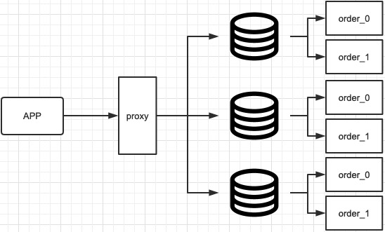
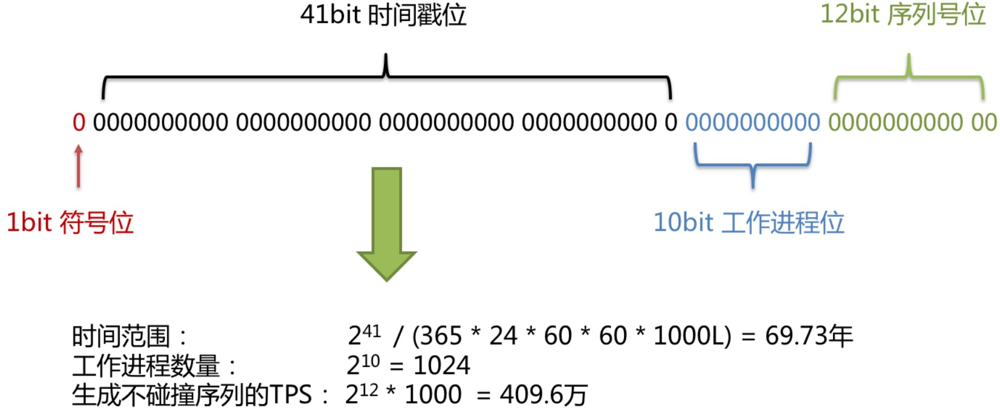
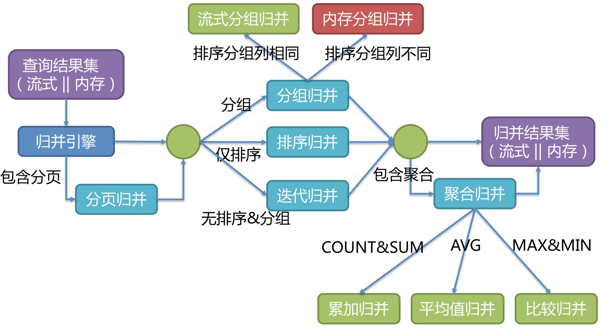

[TOC]

## 引子
- 业务发展，数据量越来越大，拖垮系统性能。比如kw的数据量，尽管有索引优化，但是索引树会变高，增加磁盘IO；
- 处理能力、存储能力、连接数有限；
- 要方便系统维护，减少耦合度；

#### 数据分片
指按照某个维度将存放在单一数据库中的数据分散地存放至多个数据库或表中以达到提升性能瓶颈以及可用性的效果。数据分片的有效手段是对关系型数据库进行分库和分表。分库和分表均可以有效的避免由数据量超过可承受阈值而产生的查询瓶颈。
除此之外，分库还能够用于有效的分散对数据库单点的访问量；分表虽然无法缓解数据库压力，但却能够提供尽量将分布式事务转化为本地事务的可能，一旦涉及到跨库的更新操作，分布式事务往往会使问题变得复杂。使用多主多从的分片方式，可以有效的避免数据单点，从而提升数据架构的可用性。

#### 分片方式
可以用表的分区解决大数量的问题，但是磁盘的读写能力有限，在高并发场景下，容易瓶颈
- 横向拆分
  - 而是通过某个字段（或某几个字段），根据某种规则将数据分散至多个库或表中，每个分片仅包含数据的一部分。
  - 主键怎么分
  - 表如何路由
- 纵向拆分
  - 根据业务类型拆

缺点
- 开发、运维人员操作繁重，需要了解分库分表规则；
- 跨库事务；
- 不支持部分sql（比如子查询包含聚合函数，看官网）；
- 需要在早期就要预留好扩展的可能性；
- 跨库Join；
- 主键生成重复，需要避免冲突；
- 分页查询(limit + order by)；
- DINSTINCT等函数；
- 。。。

建议：尽量不分

## 介绍
[ShardingSphere](https://shardingsphere.apache.org)，包括ShardingSphere-JDBC、ShardingSphere-Proxy、ShardingSphere-Sidecar（TODO）


- ShardingSphere-JDBC 是放在应用侧的，应用里做多个库、表的配置就能使用了。在应用侧就对sql已经解析完毕，路由好了。不过这个只支持Java；
- ShardingSphere-Proxy 把自己做成一个数据库，对应用透明，隐藏了数据库的复杂；
- ShardingSphere-Sidecar ？

## 使用-分库分表

#### 关键词相关解析
###### 表
**逻辑表**：水平拆分表后逻辑、数据结构相同表的总称，不是真正的名字；
**真实表**：在分片数据真实存在的物理表；
**逻辑语句**：对逻辑表的操作；
**真实语句**：最终路由到各个节点数据库真实表，能被正确运行的sql；
**绑定表**：将有关系的表做绑定，提高关联查询的速度，避免在join查询时出现组合的情况；
**广播表**：所有分片数据源都存在的表，适用于数据量不大且需要与大量数据关联查询，比如字典表；
**单表**：指所有的分片数据源中仅唯一存在的表。 适用于数据量不大且无需分片的表；
###### 分片
**分片键**：用于将数据库（表）水平拆分的数据库字段。
**分片算法**，针对database、表可做不同的策略：
- 标准：只支持单键分片。提供精确、范围两个分片算法接口供实现（PreciseShardingAlgorithm, Range...），精确分片算法必须实现，用以处理 `=, IN`。范围不是必须实现的，是用来处理`>, <, between`；
- 复合：按照自定义的多个分片键实现出路由；
- 行表达式：能用简单表达式完成路由，Groovy表达式（`ds$ -> {user_id%2}`)；
- Hint：按自己需要的方式指定路由；

**分片策略**：分片键 + 分片算法；
###### 分布式主键
**主键策略**：可以通过SPI自定义生成算法

支持DQL、DML、DDL、DCL。注意在建表时，如果已有表，最好手动创建，否则操作不当可能会被删表；

#### Maven
```xml
<dependency>
    <groupId>org.apache.shardingsphere</groupId>
    <artifactId>sharding-jdbc-spring-boot-starter</artifactId>
    <version>x.x.x</version>
</dependency>
<!-- 数据库驱动，mysql、oracle -->
<dependency>
    <groupId>mysql</groupId>
    <artifactId>mysql-connector-java</artifactId>
    <scope>runtime</scope>
</dependency>
```

#### 例子：properties配置
需要注意用的是什么版本，大版本之间配置的字段有变化的.
哪些表要分片，就必须配上

下面是4.1.1版本的配置：
```
#### 不分库，只分表
# 名字与数据库无需保持一致的，只是用来给后面配置引用的，不能有下划线"_"，springboot读取时会报错
spring.shardingsphere.datasource.names = ds0
# spring.shardingsphere.sharding.default-data-source-name = ds0
# 数据源属性（一个库配一个源）
spring.shardingsphere.datasource.ds0.type = com.zaxxer.hikari.HikariDataSource
spring.shardingsphere.datasource.ds0.driver-class-name = com.mysql.jdbc.Driver
spring.shardingsphere.datasource.ds0.jdbc-url = jdbc:mysql://rm-11112222333.mysql.rds.aliyuncs.com:3306/database_name_1?useUnicode=true&characterEncoding=UTF-8
spring.shardingsphere.datasource.ds0.username = rooooooot
spring.shardingsphere.datasource.ds0.password = **********
# 表规则
spring.shardingsphere.sharding.tables.supplement_property.actual-data-nodes=ds0.supplement_property$->{2021..2026}_$->{1..3}
# 配置分表策略
spring.shardingsphere.sharding.tables.supplement_property.table-strategy.standard.sharding-column=created_dt
spring.shardingsphere.sharding.tables.supplement_property.table-strategy.standard.precise-algorithm-class-name=com.supplier.mta.order.shardingsphere.SupplementPropertyPreciseSharding
# 主键生成策略
spring.shardingsphere.sharding.tables.supplement_property.key-generator.column=id
spring.shardingsphere.sharding.tables.supplement_property.key-generator.type=SNOWFLAKE
spring.shardingsphere.sharding.tables.supplement_property.key-generator.props.worker.id = ${workerId}
spring.shardingsphere.props.sql.show = true
```
#### 分布式主键
> 内置生成器支持：UUID、SNOWFLAKE、LEAF(进行中)，并抽离出分布式主键生成器的接口，方便实现自定义。

###### 雪花算法
能够保证不同进程主键的不重复性，相同进程主键的有序性。二进制形式包含4部分，从高位到低位分表为：
- 符号位（1bit）预留的符号位，恒为零。
- 时间戳位（41bit）
```
41位的时间戳可以容纳的毫秒数是2的41次幂，一年所使用的毫秒数是：365 * 24 * 60 * 60 * 1000
Math.pow(2, 41)/(365 * 24 * 60 * 60 * 1000L) = 69.73年 不重复
```
- 工作进程（10bit）该标志在Java进程内是唯一的，**如果是分布式应用部署应保证每个工作进程的id是不同的**。该值默认为0，可通过属性设置；
- 序列号位（12bit）该序列是用来在同一个毫秒内生成不同的ID。如果在这个毫秒内生成的数量超过 4096(2的12次幂)，那么生成器会等待到下个毫秒继续生成。


问题：时间漂移，高度依赖时钟的一致

#### 分页
主要是在做归并

#### [与各个框架整合](https://shardingsphere.apache.org/document/4.1.1/cn/manual/sharding-jdbc/)

## 使用-读写分离
配置master、slave

## 源码
每个版本之间的结构、包名都不一样。但大方向没变
#### 包划分
| 名称 | 作用 |
| -- | -- |
| sharding-Core | sharding内核模块；定义了核心api，SQL解析，SQL重写，SQL路由，spi，引擎等等核心功能 |
| sharding-distributiuon | 部署、运维相关zip包中的代码 |
| sharding-integration-test | 整合测试 |
| sharding-jdbc | app-分库分表jdbc增强 |
| sharding-opentracing | 应用性能监控 |
| sharding-orchestration | 数据库编排治理 |
| sharding-proxy | 服务端代理分库分表模块 |
| sharding-spring | 与spring集成 |
| sharding-sql-test | SQL测试用例 |
| sharding-transaction | 分布式事务 |

#### 搭建
1. 下载、导入源码。会下载插件，搭梯子会好一些；
2. sharding-core-parse编译：需要先编译此工程是因为：工程内的部分类需要依靠antlr4 SQL解析引擎生成，否则直接编译sharding工程报部分类找不到的错误。编译本工程注意用：lifecycle下的install；
3. 编译全工程：shardingsphere -> plugins -> install -> Create 'shdrdingsphere[...'，command line填跳过测试(install -Dmaven.test.skip=true)；
4. 编译时,sharding-sql-test工程会报错，忽略即可。编译完成：运行demo可正常执行则说明编译成功；

#### 分库分表的执行流程


解析引擎的迭代
3.0.x版本开始，ShardingSphere尝试使用ANTLR作为SQL解析的引擎，并计划根据`DDL -> TCL -> DAL –> DCL -> DML –>DQL`这个顺序，依次替换原有的解析引擎。ANTLR解析SQL的性能比自研的SQL解析引擎慢3-10倍左右。为了弥补这一差距，ShardingSphere将使用PreparedStatement的SQL解析的语法树放入缓存。 因此建议采用PreparedStatement这种SQL预编译的方式提升性能。




## 实际操作
1. 主键不能重复，考虑到有一个数据库要汇集所有数据，做统计报表需求；
2. 业务发展太快，避免多次分库分表；
3. 实现不停机迁移的方案：双写。迁移过程时新、旧表均需写入，迁移完毕时配置切到只操作新表即可。同一服务同时操作两个数据源会无法操作数据库
