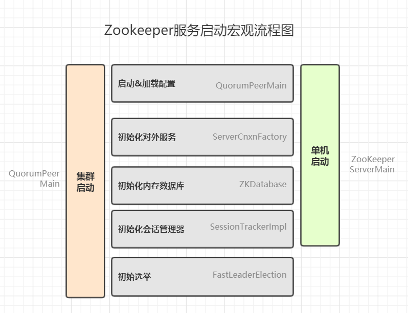

[TOC]

## 结构说明
- zookeeper-recipes：示例源码
- zookeeper-client：C语言客户端
- zookeeper-server：主体源码


入口
服务端：QuorumPeerMain、ZooKeeperServerMain
客户端：ZooKeeperMain

启动前注意：
1. 需要将log4J配置文件拷贝到target/class下面才能输出日志；
2. 启动时，入参加上配置文件的路径；
3. Maven有一些scope为provided，需要删除；

## 大致流程的堆栈
```
>QuorumPeerMain#main  //启动main方法
 >QuorumPeerConfig#parse // 加载zoo.cfg 文件
   >QuorumPeerConfig#parseProperties // 解析配置
 >DatadirCleanupManager#start // 启动定时任务清除日志
 >QuorumPeerConfig#isDistributed // 判断是否为集群模式
 >runFormConfig // 集群模式
  >ServerCnxnFactory#createFactory() // 创建服务默认为NIO，推荐netty（参数zookeeper.serverCnxnFactory不设置即可）
  >ServerCnxnFactory#configure() // 配置参数（还未启动）
  >QuorumPeerMain#getQuorumPeer // 创建初始化集群管理器，维护集群中节点通信
  >QuorumPeer#setTxnFactory 
  >new FileTxnSnapLog // 数据文件管理器，用于检测快照与日志文件
   /**  初始化数据库*/
  >new ZKDatabase 
    >ZKDatabase#createDataTree //创建数据树，所有的节点都会存储在这
  > QuorumPeer#start // 启动集群：同时启动线程
    > QuorumPeer#loadDataBase // 从快照文件以及日志文件 加载节点并填充到dataTree中去
    > QuorumPeer#startServerCnxnFactory // 启动netty 或java nio 服务，对外开放2181 端口
    > AdminServer#start// 启动管理服务，netty http服务，默认端口是8080
    > QuorumPeer#startLeaderElection // 开始执行选举流程
    > quorumPeer.join()  // 防止主进程退出 
```

#### 初始化对外服务
设置netty启动参数：`-Dzookeeper.serverCnxnFactory=org.apache.zookeeper.server.NettyServerCnxnFactory`

- pipeline的设置
```
NettyServerCnxnFactory#NettyServerCnxnFactory // 初始化netty服务工厂
  > NettyUtils.newNioOrEpollEventLoopGroup // 创建IO线程组
  > NettyUtils#newNioOrEpollEventLoopGroup() // 创建工作线程组
  > ** ServerBootstrap#childHandler#initChannel(io.netty.channel.ChannelHandler) // 初始化时会添加CnxnChannelHandler
>NettyServerCnxnFactory#start // 绑定端口，并启动netty服务
```

- 当有客户端新连接进来，就会进入该方法创建NettyServerCnxn对象。并添加至cnxns队列
```
CnxnChannelHandler#channelActive
 >new NettyServerCnxn // 构建连接器
 >NettyServerCnxnFactory#addCnxn // 添加至连接器保存，并根据客户端IP进行分组
 >ipMap.get(addr) // 基于IP进行分组
```

- 读取消息
```
CnxnChannelHandler#channelRead
>NettyServerCnxn#processMessage //  处理消息 
>NettyServerCnxn#receiveMessage // 接收消息
>ZooKeeperServer#processPacket //处理消息包
   >org.apache.zookeeper.server.Request // 封装request 对象
   >org.apache.zookeeper.server.ZooKeeperServer#submitRequest // 提交request  
   >org.apache.zookeeper.server.RequestProcessor#processRequest // 处理请求
```

## 快照与事务日志存储结构
ZK中所有的数据都是存储在内存中，即zkDataBase中。但同时所有对ZK数据的变更都会记录到事物日志中，并且当写入到一定的次数就会进行一次快照的生成。已保证数据的备份。其后缀就是ZXID（唯一事物ID）。

* 事物日志：每次增删改，的记录日志都会保存在文件当中
* 快照日志：存储了在指定时间节点下的所有的数据

zkDdataBase 是zk数据库基类，所有节点都会保存在该类当中，而对Zk进行任何的数据变更都会基于该类进行。zk数据的存储是通过DataTree 对象进行，其用了一个map 来进行存储。

读取快照日志：`org.apache.zookeeper.server.SnapshotFormatter`
读取事物日志：`org.apache.zookeeper.server.LogFormatter`

快照相关配置：
| dataLogDir | 事物日志目录 | 
| :- | :- |
| zookeeper.preAllocSize | 预先开辟磁盘空间，用于后续写入事务日志，默认64M | 
| zookeeper.snapCount | 每进行snapCount次事务日志输出后，触发一次快照，默认是100,000 | 
| autopurge.snapRetainCount | 自动清除时 保留的快照数 | 
| autopurge.purgeInterval |  清除时间间隔，小时为单位 -1 表示不自动清除。 | 

 快照装载流程：
```
>ZooKeeperServer#loadData // 加载数据
>FileTxnSnapLog#restore // 恢复数据
>FileSnap#deserialize() // 反序列化数据
>FileSnap#findNValidSnapshots // 查找有效的快照
  >Util#sortDataDir // 基于后缀排序文件
    >persistence.Util#isValidSnapshot // 验证是否有效快照文件
```
