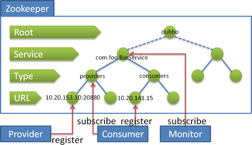

[TOC]

## 产生背景
项目从单体到分布式转变之后，将会产生多个节点之间协同的问题。如：
1. 每天的定时任务由谁哪个节点来执行？
2. RPC调用时的服务发现？
3. 如何保证并发请求的幂等？
4. ....

这些问题可以统一归纳为多节点协调问题，如果靠节点自身进行协调这是非常不可靠的，性能上也不可取。必须由**一个独立的服务做协调工作**，它必须可靠，而且保证性能。

ZooKeeper是用于分布式应用程序的协调服务。它公开了一组简单的API，分布式应用程序可以基于这些API用于同步，节点状态、配置等信息、服务注册等信息。其由JAVA编写，支持JAVA和C两种语言的客户端。

如何做到的：**znode 节点**，zookeeper中数据基本单元叫节点，节点之下可包含子节点，最后以树级方式程现。每个节点拥有唯一的路径path。客户端基于PATH上传节点数据，zookeeper收到后会实时通知对该路径进行监听的客户端。

## 部署+配置
```bash
# 下载
wget https://mirrors.tuna.tsinghua.edu.cn/apache/zookeeper/current/apache-zookeeper-3.6.1-bin.tar.gz
# 解压
tar -zxvf apache-zookeeper-3.6.1-bin.tar.gz
# 拷贝默认配置
cd {zookeeper_home}/conf
cp zoo_sample.cfg zoo.cfg
# 启动
{zookeeper_home}/bin/zkServer.sh start [可代配置文件，默认zoo.cfg]
# 客户端连接
{zookeeper_home}/bin/zkCli.sh 
```

配置文件说明：
```shell
# zookeeper时间配置中的基本单位 (毫秒)
tickTime=2000
# 允许follower初始化连接到leader最大时长，它表示tickTime时间倍数 即:initLimit*tickTime
initLimit=10
# 允许follower与leader数据同步最大时长,它表示tickTime时间倍数 
syncLimit=5
# zookeper 数据存储目录
dataDir=/tmp/zookeeper
#对客户端提供的端口号
clientPort=2181
#单个客户端与zookeeper最大并发连接数
maxClientCnxns=60
# 保存的数据快照数量，之外的将会被清除
autopurge.snapRetainCount=3
#自动触发清除任务时间间隔，小时为单位。默认为0，表示不自动清除。
autopurge.purgeInterval=1
```
## 命令行下的使用
#### 基本命令列表
```bash
# 关闭当前会话
close

# 重新连接指定Zookeeper服务
connect host:port

# 创建节点
create [-s] [-e] [-c] [-t ttl] path [data] [acl]
create /dx/1

#删除节点，(不能存在子节点）
delete [-v version] path

# 删除路径及所有子节点
deleteall path

# 设置节点限额 -n 子节点数 -b 字节数
setquota -n|-b val path

# 查看节点限额
listquota path

#删除节点限额
delquota [-n|-b] path

# 查看节点数据 -s 包含节点状态属性 -w 添加监听 
get [-s] [-w] path

getAcl [-s] path

# 列出子节点 -s状态 -R 递归查看所有子节点 -w 添加监听
ls [-s] [-w] [-R] path

# 是否打印监听事件
printwatches on|off

#退出客户端
quit

# 查看执行的历史记录
history

# 重复 执行命令，history中的命令编号
redo cmdno

# 删除指定监听
removewatches path [-c|-d|-a] [-l]

# 设置（修改）值
set [-s] [-v version] path data
set /dx "hello"

# 为节点设置ACL权限
setAcl [-s] [-v version] [-R] path acl

# 查看节点状态 -w 添加监听
stat [-w] path

# 强制同步节点
sync path
```

#### Znode节点
`set`在节点中存的是字节码，znode结构包含如下：
- path:唯一路径 
- childNode：子节点
- stat：状态属性
- type：节点类型

#### 节点类型
| 类型 | 描述 | 
| :- | :- |
| PERSISTENT | 持久节点 | 
| PERSISTENT_SEQUENTIAL | 持久序号节点 | 
| EPHEMERAL | 临时节点（不可再拥有子节点） | 
| EPHEMERAL_SEQUENTIAL | 临时序号节点（不可再拥有子节点） | 

**PERSISTENT（持久节点）**
```
#默认创建的就是持久节点
create /test
```

**PERSISTENT_SEQUENTIAL（持久序号节点）**
创建时zookeeper 会在路径上加上序号作为后缀。非常适合用于分布式锁、分布式选举等场景.
```
# 创建序号节点
create -s /test
# 返回创建的实际路径
Created /test0000000001
create -s /test
# 返回创建的实际路径2
Created /test0000000002
```

**EPHEMERAL（临时节点）**
临时节点会在客户端会话断开后自动删除。适用于心跳，服务发现等场景。
```
create -e /temp
```
`get -s path`的时候ephemeralOwner不是0x0，就表示是临时节点

**EPHEMERAL_SEQUENTIAL（临时序号节点）**
与持久序号节点类似，不同之处在于EPHEMERAL_SEQUENTIAL是临时的会在会话断开后删除.
```
create -e -s /temp/seq
```

#### 节点属性说明(stat)
```
# 查看节点属性，get多展示了给节点设置的值
stat /dx
get -s /dx
```

其属性说明如下表：
```
# 创建节点的事务ID
cZxid = 0x385
# 创建时间
ctime = Tue Sep 24 17:26:28 CST 2019
# 修改节点的事务ID
mZxid = 0x385
# 最后修改时间
mtime = Tue Sep 24 17:26:28 CST 2019
# 子节点变更的事务ID（儿子才会，孙子变更不会计入）
pZxid = 0x385
# 子节点变更的次数（儿子才会，孙子变更不会计入）
cversion = 0
# 数据的变更次数
dataVersion = 0
# 权限变更次数
aclVersion = 0
# 临时节点所属会话ID
ephemeralOwner = 0x0
# 数据长度
dataLength = 17
# 子节点数(不包括子子节点)
numChildren = 0
```

#### 节点的监听(watch)
客户添加 -w 参数可实时监听节点与子节点的变化，并且实时收到通知。非常适用保障分布式情况下的数据一至性。其使用方式如下：（只监听一次，要再次监听要继续执行）
| 命令 | 描述 | 
| :- | :- |
| ls -w path | 监听子节点的变化（增，删） | 
| get -w path | 监听节点数据的变化 | 
| stat -w path | 监听节点属性的变化 | 
| printwatches on\|off | 触发监听后，是否打印监听事件（默认on） | 

如果有临时节点，那退出的时候也会触发监听子节点

#### 权限设置(acl)
ACL全称为Access Control List（访问控制列表），用于控制资源的访问权限。ZooKeeper使用ACL来控制对其znode的防问。基于`scheme:id:permission`的方式进行权限控制。scheme表示授权模式、id模式对应值、permission即具体的增删改权限位。

**scheme:认证模型**
| 方案 | 描述 | 
| :- | :- |
| world | 开放模式，world表示全世界都可以访问（这是默认设置） | 
| ip | ip模式，限定客户端IP防问 | 
| auth | 用户密码认证模式，只有在会话中添加了认证才可以防问 | 
| digest | 与auth类似，区别在于auth用明文密码，而digest 用sha-1+base64加密后的密码。在实际使用中digest 更常见。 | 

**permission权限位**
| 权限位 | 权限 | 描述 | 
| :- | :- | :- |
| c | CREATE | 可以创建子节点 | 
| d | DELETE | 可以删除子节点（仅下一级节点） | 
| r | READ | 可以读取节点数据及显示子节点列表 | 
| w | WRITE | 可以设置节点数据 | 
| a | ADMIN | 可以设置节点访问控制列表权限 | 

**acl 相关命令**
| 命令 | 使用方式 | 描述 | 
| :- |:- | :- |
| getAcl | getAcl <path> | 读取ACL权限 | 
| setAcl | setAcl <path> <acl> | 设置ACL权限 | 
| addauth | addauth <scheme> <auth> | 添加认证用户 | 

```
# 查看默认节点权限：
# 创建一个节点
create -e /testAcl
# 查看节点权限
getAcl /testAcl
# 返回的默认权限表示 ，所有人拥有所有权限。
'world,'anyone: cdrwa

############

# 修改默认权限为 读写
# 设置为rw权限 
setAcl /testAcl world:anyone:rw
# 可以正常读
get /testAcl
# 无法正常创建子节点
create -e /testAcl/t "hi"
# 返回没有权限的异常
Authentication is not valid : /testAcl/t
```

IP权限语法： `setAcl <path> ip:<ip地址|地址段>:<权限位>`

auth模式语法： 
1. setAcl <path> auth:<用户名>:<密码>:<权限位>
2. addauth digest <用户名>:<密码>

digest语法：
语法： 
1. setAcl <path> digest :<用户名>:<密钥>:<权限位>
2. addauth digest <用户名>:<密码>

```
# 密钥 通过sha1与base64组合加密码生成，可通过以下命令生成
echo -n <用户名>:<密码> | openssl dgst -binary -sha1 | openssl base64
```
为节点设置digest权限后，访问前必须执行addauth，当前会话才可以防问
```
#先 sha1 加密，然后base64加密
echo -n dx:123456 | openssl dgst -binary -sha1 | openssl base64
#返回密钥
2Rz3ZtRZEs5RILjmwuXW/wT13Tk=
#设置digest权限
setAcl /dx digest:dx:2Rz3ZtRZEs5RILjmwuXW/wT13Tk=:cdrw

# 查看节点将显示没有权限
# 查看节点
get /dx
#显示没有权限访问
org.apache.zookeeper.KeeperException$NoAuthException: KeeperErrorCode = NoAuth for /dx

# 给当前会话添加认证后在次查看
# 给当前会话添加权限帐户
addauth digest dx:123456
# 再次查看
get /dx
# 获得返回结果
hello
```

ACL的特殊说明：
权限仅对当前节点有效，不会让子节点继承。如限制了IP防问A节点，但不妨碍该IP防问A的子节点 /A/B。

## 代码下的使用
zookeeper 提供了java与C两种语言的客户端。我们要学习的就是java客户端。引入最新的maven依赖：
```xml
<dependency>
    <groupId>org.apache.zookeeper</groupId>
    <artifactId>zookeeper</artifactId>
    <version>3.5.5</version>
</dependency>
```

#### 初始连接
org.apache.zookeeper.ZooKeeper，实例化该类之后将会自动与集群建立连接。构造参数说明如下：
| 参数名称 | 类型 | 说明 | 
| :- | :- | :- | :- |
| connectString | String | 连接串，包括ip+端口 ,集群模式下用逗号隔开  192.168.0.149:2181,192.168.0.150:2181 | 
| sessionTimeout | int | 会话超时时间，该值不能超过服务端所设置的  *minSessionTimeout 和maxSessionTimeout* | 
| watcher | Watcher | 设置全局默认会话监听器，服务端事件将会触该监听 | 
| sessionId | long | 自定义会话ID | 
| sessionPasswd | byte[] | 会话密码 | 
| canBeReadOnly | boolean | 该连接是否为只读的 | 
| hostProvider | HostProvider | 服务端地址提供者，指示客户端如何选择某个服务来调用，默认采用StaticHostProvider轮询实现 | 

#### 创建、查看节点
创建节点：`org.apache.zookeeper.ZooKeeper#create()`
| 参数名称 | 类型 | 说明 | 
| :- | :- | :- |
| path | String | | 
| data | byte[] | | 
| acl | `List<ACL>` | | 
| createMode   | CreateMode | | 
| cb | StringCallback | | 
| ctx | Object | | 

查看节点：`org.apache.zookeeper.ZooKeeper#getData()`
| 参数名称 | 类型 | 说明 | 
| :- | :- | :- |
| path | String  | | 
| watch | boolean | 是否监听，如果监听则用默认的监听处理方法 | 
| watcher | Watcher | 自定义一个监听的处理 | 
| cb | DataCallback | 回调 | 
| ctx | Object | 上下文 | 

查看子节点：`org.apache.zookeeper.ZooKeeper#getChildren()`
| 参数名称 | 类型 | 说明 | 
| :- | :- | :- |
| path | String | | 
| watch | boolean | | 
| watcher | Watcher | | 
| cb | Children2Callback | | 
| ctx | Object | | 

#### 监听节点
在`getData()`与`getChildren()`两个方法中可分别设置监听数据变化和子节点变化。通过设置watch为true，当前事件触发时会调用zookeeper()构建函数中Watcher.process()方法。也可以添加watcher参数来实现自定义监听。一般采用后者。
注：所有的监听都是一次性的，如果要持续监听需要触发后在添加一次监听。

#### 设置节点ACL权限
ACL包括结构为`scheme:id:permission`（有关ACL的介绍参照第一节课关于ACL的讲解）
客户端中由org.apache.zookeeper.data.ACL 类表示，类结构如下：
- ACL 
  - Id
    - scheme       // 对应权限模式scheme
    - id                 // 对应模式中的id值
  - perms               // 对应权限位permission

关于权限位的表示方式：
每个权限位都是一个唯一数字，将其合时通过或运行生成一个全新的数字即可
```java
@InterfaceAudience.Public
public interface Perms {
    int READ = 1 << 0;
    int WRITE = 1 << 1;
    int CREATE = 1 << 2;
    int DELETE = 1 << 3;
    int ADMIN = 1 << 4;

    int ALL = READ | WRITE | CREATE | DELETE | ADMIN;
}
```

#### zkClient
是在zookeeper客户端基础之上封装的。主要变化如下：
- 可以设置持久监听，或删除某个监听
- 可以插入JAVA对象，自动进行序列化和反序列化
- 简化了基本的增删改查操作。

## 集群相关
> zookeeper集群的目的是为了保证系统的性能承载更多的客户端连接设专门提供的机制。通过集群可以实现以下功能：
> - 读写分离：提高承载，为更多的客户端提供连接，并保障性能。
> - 主从自动切换：提高服务容错性，部分节点故障不会影响整个服务集群。

半数以上运行机制说明：集群至少需要三台服务器，并且强烈建议使用奇数个服务器。因为zookeeper 通过判断大多数节点的存活来判断整个服务是否可用。比如3个节点，挂掉了2个表示整个集群挂掉，而用偶数4个，挂掉了2个也表示其并不是大部分存活，因此也会挂掉。

#### 配置流程
> 单机集群做实验

配置文件示例：
```bash
tickTime=2000
dataDir=/var/lib/zookeeper/
clientPort=2181
initLimit=5
syncLimit=2

#以下为集群配置，必须配置在所有节点的zoo.cfg文件中
server.1=zoo1:2888:3888
server.2=zoo2:2888:3888
server.3=zoo3:2888:3888

# 语法：server.<节点ID>=<ip>:<数据同步端口>:<选举端口>
# 节点ID：服务id手动指定1至125之间的数字，并写到对应服务节点的 {dataDir}/myid 文件中。
# IP地址：节点的远程IP地址，可以相同。但生产环境就不能这么做，因为在同一台机器就无法达到容错的目的。所以这种称作为伪集群。
# 数据同步端口：主从同时数据复制端口，（做伪集群时端口号不能重复）。
# 远举端口：主从节点选举端口，（做伪集群时端口号不能重复）。
```

1. 分别创建3个data目录用于存储各节点数据
```
mkdir data
mkdir data/1
mkdir data/3
mkdir data/3
```
2. 编写myid文件
```
echo 1 > data/1/myid
echo 3 > data/3/myid
echo 2 > data/2/myid
```
3. 编写配置文件
```bash
# 配置文件1：conf/zoo1.cfg
tickTime=2000
initLimit=10
syncLimit=5
dataDir=data/1
clientPort=2181
server.1=127.0.0.1:2887:3887
server.2=127.0.0.1:2888:3888
server.3=127.0.0.1:2889:3889

# 配置文件2：conf/zoo1.cfg
tickTime=2000
initLimit=10
syncLimit=5
dataDir=data/2
clientPort=2182
server.1=127.0.0.1:2887:3887
server.2=127.0.0.1:2888:3888
server.3=127.0.0.1:2889:3889

# 这里是3... 
```
4. 分别启动
```bash
./bin/zkServer.sh start conf/zoo1.cfg
./bin/zkServer.sh start conf/zoo2.cfg
./bin/zkServer.sh start conf/zoo3.cfg
```

5. 分别查看状态
```bash
./bin/zkServer.sh status conf/zoo1.cfg
Mode: follower
./bin/zkServer.sh status conf/zoo2.cfg
Mode: leader
./bin/zkServer.sh status conf/zoo3.cfg
Mode: follower
```

#### 集群角色说明
集群中总共有三种角色，分别是leader（主节点）、follower(子节点) 、observer（次级子节点）
| 角色 | 描述 | 
| :- | :- |
| leader | 主节点，又名领导者。用于写入数据，通过选举产生，如果宕机将会选举新的主节点。 | 
| follower | 子节点，又名追随者。用于实现数据的读取。同时他也是主节点的备选节点，并用拥有投票权。 | 
| observer | 次级子节点，又名观察者。用于读取数据，与fllower区别在于没有投票权，不能选为主节点。并且在计算集群可用状态时不会将observer计算入内。 | 

只要在集群配置中加上observer后缀即可：`server.3=127.0.0.1:2889:3889:observer`

#### 投票机制说明
第一轮投票全部投给自己
第二轮投票给myid比自己大的相邻节点
如果得票超过半数，选举结束。

选举触发，当集群中的服务器出现已下两种情况时会进行Leader的选举
1. 服务节点初始化启动
2. 半数以上的节点无法和Leader建立连接

当节点初始起动时会在集群中寻找Leader节点，如果找到则与Leader建立连接，其自身状态变化follower或observer。如果没有找到Leader，当前节点状态将变化LOOKING，进入选举流程。
在集群运行其间如果有follower或observer节点宕机只要不超过半数并不会影响整个集群服务的正常运行。但如果leader宕机，将暂停对外服务，所有follower将进入LOOKING状态，进入选举流程。

#### 数据同步机制
> 为了保证各节点中数据的一至性，同步时涉及两个流程：一个是正常的客户端数据提交，另一个是集群某个节点宕机再恢复后的数据同步。


客户端写入请求：
写入请求的大至流程是，收leader接收客户端写请求，并同步给各个子节点。但实际情况要复杂的多，比如client 它并不知道哪个节点是leader 有可能写的请求会发给follower ，由follower在转发给leader进行同步处理。
1. client向zk中的server发送写请求，如果该server不是leader，则会将该写请求转发给leader server，leader将请求事务以proposal形式分发给follower；
2. 当follower收到收到leader的proposal时，根据接收的先后顺序处理proposal；
3. 当Leader收到follower针对某个proposal过半的ack后，则发起事务提交，重新发起一个commit的proposal；
4. Follower收到commit的proposal后，记录事务提交，并把数据更新到内存数据库；
5. 当写成功后，反馈给client；

###### 服务节点初始化同步：
在集群运行过程当中如果有一个follower节点宕机，由于宕机节点没过半，集群仍然能正常服务。当leader收到新的客户端请求，此时无法同步给宕机的节点。造成数据不一至。为了解决这个问题，当节点启动时，第一件事情就是找当前的Leader，比对数据是否一至。不一至则开始同步,同步完成之后在进行对外提供服务。
如何比对Leader的数据版本：通过ZXID事物ID来确认。比Leader就需要同步。

###### ZXID
ZXID是一个长度64位的数字，其中低32位是按照数字递增，任何数据的变更都会导致,低32位的数字简单加1。高32位是leader周期编号，每当选举出一个新的leader时，新的leader就从本地事物日志中取出ZXID,然后解析出高32位的周期编号，进行加1，再将低32位的全部设置为0。这样就保证了每次新选举的leader后，保证了ZXID的唯一性而且是保证递增的。

需要四字运维命令查看ZXID：`echo stat|nc 127.0.0.1:2181`

注意：
如果leader 节点宕机，在恢复后它还能被选为leader吗？不一定，会在ZXID最大的筛选。

## （其他）四字运维命令
ZooKeeper响应少量命令。每个命令由四个字母组成。可通过telnet或nc向ZooKeeper发出命令。
这些命令默认是关闭的，需要配置`4lw.commands.whitelist`来打开，可打开部分或全部示例如下：
```bash
# 打开指定命令
4lw.commands.whitelist=stat, ruok, conf, isro
# 打开全部
4lw.commands.whitelist=*
```

安装Netcat工具，已使用nc命令 
```bash
# 安装Netcat 工具
yum install -y nc
# 查看服务器及客户端连接状态
echo stat | nc localhost 2181
```
命令列表：
1. conf：3.3.0中的新增功能：打印有关服务配置的详细信息。
2. 缺点：3.3.0中的新增功能：列出了连接到该服务器的所有客户端的完整连接/会话详细信息。包括有关已接收/已发送的数据包数量，会话ID，操作等待时间，最后执行的操作等信息。
3. crst：3.3.0中的新增功能：重置所有连接的连接/会话统计信息。
4. dump：列出未完成的会话和临时节点。这仅适用于领导者。
5. envi：打印有关服务环境的详细信息
6. ruok：测试服务器是否以非错误状态运行。如果服务器正在运行，它将以imok响应。否则，它将完全不响应。响应“ imok”不一定表示服务器已加入仲裁，只是服务器进程处于活动状态并绑定到指定的客户端端口。使用“ stat”获取有关状态仲裁和客户端连接信息的详细信息。
7. srst：重置服务器统计信息。
8. srvr：3.3.0中的新功能：列出服务器的完整详细信息。
9. stat：列出服务器和连接的客户端的简要详细信息。
10. wchs：3.3.0中的新增功能：列出有关服务器监视的简要信息。
11. wchc：3.3.0中的新增功能：按会话列出有关服务器监视的详细信息。这将输出具有相关监视（路径）的会话（连接）列表。请注意，根据手表的数量，此操作可能会很昂贵（即影响服务器性能），请小心使用。
12. dirs：3.5.1中的新增功能：以字节为单位显示快照和日志文件的总大小
13. wchp：3.3.0中的新增功能：按路径列出有关服务器监视的详细信息。这将输出具有关联会话的路径（znode）列表。请注意，根据手表的数量，此操作可能会很昂贵（即影响服务器性能），请小心使用。
14. mntr：3.4.0中的新增功能：输出可用于监视集群运行状况的变量列表。

## 使用场景
#### 分布式集群管理
需求：
1. 主动查看线上服务节点；（临时节点）
2. 查看服务节点资源使用情况；（临时节点存储的数据）
3. 服务离线通知；（节点的监听）
4. 服务资源（CPU、内存、硬盘）超出阈值通知；

注意：会涉及到javaagent技术
客户端相关思路：连接zookeeper -> 创建根节点（需要判断是否存在） -> 创建临时节点 -> 建立定时上报数据的线程
服务端相关思路：清除所有监听 -> 监听根节点的变化 -> 重新遍历子节点并监听（数据的变化）

#### 分布式注册中心
服务节点有上万之多，这么多节点不可能手动配置在客户端，这里就需要一个中间服务，专门用于帮助客户端发现服务节点，即许多技术书籍经常提到的**服务发现**。


一个完整的注册中心涵盖以下功能特性：
- 服务注销：通知注册心提供者下线；
- 服务订阅：动态实时接收服务变更消息；
- 可靠：注册服务本身是集群的，数据冗余存储。避免单点故障，及数据丢失；
- 容错：当服务提供者出现宕机，断电等极情况时，注册中心能够动态感知并通知客户端服务提供者的状态；

###### Dubbo(具体的另写)
是一个基于JAVA的RCP框架，其中必不可少的注册中心可基于多种第三方组件实现，但其官方推荐的还是Zookeeper做为注册中心服务。

节点说明：
| 类别 | 属性 | 说明 | 
| :- | :- | :- |
| Root | 持久节点 | 根节点名称，默认是 "dubbo" | 
| Service | 持久节点 | 服务名称，完整的服务类名 | 
| type | 持久节点 | 可选值：providers(提供者)、consumers（消费者）、configurators(动态配置)、routers | 
| URL | 临时节点 | url名称 包含服务提供者的 IP 端口 及配置等信息。 | 

流程说明：
1. 服务提供者启动时: 向/dubbo/com.foo.BarService/providers目录下写入自己的URL地址；
2. 服务消费者启动时: 订阅/dubbo/com.foo.BarService/providers目录下的提供者URL地址。并向/dubbo/com.foo.BarService/consumers目录下写入自己的URL地址；
3. 监控中心启动时: 订阅/dubbo/com.foo.BarService目录下的所有提供者和消费者URL地址；

#### 分布式JOB
- 多个服务节点只允许其中一个主节点运行JOB任务；
- 当主节点挂掉后能自动切换主节点，继续执行JOB任务；

Master节点执行


实现思路：连接 -> 创建临时节点 -> 判断是否有Master节点 -> 有则监听根节点（等待master死掉做选举） -> 无则选举

选举策略：选举id最小的当master

#### 分布式锁
单体应用中我们可以通过synchronized或ReentrantLock来实现锁。但在分布式系统中，仅仅是加synchronized是不够的，需要借助第三组件来实现。比如一些简单的做法是使用关系型数据行级锁来实现不同进程之间的互斥，但大型分布式系统的性能瓶颈往往集中在数据库操作上。为了提高性能得采用如Redis、Zookeeper之内的组件实现分布式锁。

需要实现共享锁和独占锁

随便想的，会有漏洞
思路：
1. 创建临时节点（标志为共享，未获取状态）；
2. 获取比自己小的节点；
    - 如果是自己，则获取成功；
    - 如果都是共享，则获取成功；
    - 否则监听上一个子节点，并锁住当前线程，等待上一个节点的释放；
3. 监听上一个节点的消息变更（等待变成已获取的状态或者已释放的状态）；
4. 修改自己的消息（为下一个节点的监听）；
5. 定时查询，以防节点挂了无法收到通知；
两个操作：加锁、释放锁

注意：羊群效应，即同时监听根节点，一旦发生变化，所有节点监听到了就全部做查询操作，导致压力瞬间增大。用监听链，只监听上一个节点。

测试方法：1加到100