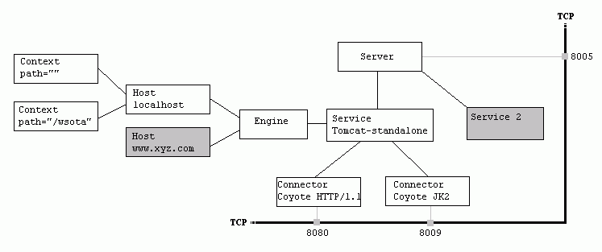

[TOC]

## Feign
> 默认使用`HttpURLConnection`

### HttpURLConnection
[源码参考](https://zhuanlan.zhihu.com/p/28593019)

如果不主动引入http连接池，会使用Feign的默认实现`HttpURLConnection`，链路如下：
SynchronousMethodHandler#invoke -> SynchronousMethodHandler#executeAndDecode -> SynchronousMethodHandler.client#execute -> TracingFeignClient#execute -> TracingFeignClient.delegate#execute -> Client.Default#execute

代码：
SynchronousMethodHandler.java
```java
public Object invoke(Object[] argv) throws Throwable {
    RequestTemplate template = this.buildTemplateFromArgs.create(argv);
    Retryer retryer = this.retryer.clone();

    while(true) {
        try {
            return this.executeAndDecode(template);
        } catch (RetryableException var8) {
            RetryableException e = var8;

            try {
                retryer.continueOrPropagate(e);
            } catch (RetryableException var7) {
                Throwable cause = var7.getCause();
                if (this.propagationPolicy == ExceptionPropagationPolicy.UNWRAP && cause != null) {
                    throw cause;
                }

                throw var7;
            }

            if (this.logLevel != Level.NONE) {
                this.logger.logRetry(this.metadata.configKey(), this.logLevel);
            }
        }
    }
}

Object executeAndDecode(RequestTemplate template) throws Throwable {
    Request request = targetRequest(template);
    ...//省略代码
    response = client.execute(request, options);
    ...//省略代码
}
```

Client接口的默认实现Default：
```java
// 省略
public Response execute(Request request, Options options) throws IOException {
    HttpURLConnection connection = this.convertAndSend(request, options);
    return this.convertResponse(connection, request);
}
// 省略
```

### 引入HttpClient

```xml
<dependency>
    <groupId>io.github.openfeign</groupId>
    <artifactId>feign-httpclient</artifactId>
</dependency>
```

1. 发现
2. 注入

3. AOP代理

通过jdk的代理，当请求Feign Client的方法时会被拦截，代码在`ReflectiveFeign`类，代码如下：
```java
public <T> T newInstance(Target<T> target) {
    Map<String, MethodHandler> nameToHandler = targetToHandlersByName.apply(target);
    Map<Method, MethodHandler> methodToHandler = new LinkedHashMap<Method, MethodHandler>();
    List<DefaultMethodHandler> defaultMethodHandlers = new LinkedList<DefaultMethodHandler>();

    for (Method method : target.type().getMethods()) {
      if (method.getDeclaringClass() == Object.class) {
        continue;
      } else if(Util.isDefault(method)) {
        DefaultMethodHandler handler = new DefaultMethodHandler(method);
        defaultMethodHandlers.add(handler);
        methodToHandler.put(method, handler);
      } else {
        methodToHandler.put(method, nameToHandler.get(Feign.configKey(target.type(), method)));
      }
    }
    InvocationHandler handler = factory.create(target, methodToHandler);
    T proxy = (T) Proxy.newProxyInstance(target.type().getClassLoader(), new Class<?>[]{target.type()}, handler);

    for(DefaultMethodHandler defaultMethodHandler : defaultMethodHandlers) {
      defaultMethodHandler.bindTo(proxy);
    }
    return proxy;
  }
```
引入http-client后，可以使用apache的http请求实现：MinimalHttpClient 和InternalHttpClient。

链路接上：
TracingFeignClient.delegate#execute -> ApacheHttpClient#execute -> HttpClient#execute -> CloseableHttpClient#execute -> CloseableHttpClient#doExecute -> ... ->  MainClientExec#execute -> this.connManager.requestConnection

> MainClientExec是HTTP请求处理链中最后一个请求执行环节，负责与另一终端的请求/响应交互，也是很重要的类。

疑问：如何替代Default的

#### Apache CloseableHttpClient
Apache CloseableHttpClient是Apache HttpComponents库中的一个接口，它是Apache HttpClient库的核心组件之一。CloseableHttpClient提供了一个支持连接池和会话管理的HTTP客户端，可以用来发送HTTP/HTTPS请求，接收HTTP/HTTPS响应。它提供了以下主要的功能：


    自动管理HTTP连接，包括连接池、连接的复用、连接的超时等；

    支持HTTP请求的重定向、gzip压缩等；

    支持SSL/TLS的HTTPS连接；

    支持HTTP代理和身份验证；

    支持通过CookieStore管理cookies，并自动发送cookies；

    支持Http参数设置和自定义重试策略等。


CloseableHttpClient提供了一种高效、易用、可定制的方式来执行HTTP请求和处理HTTP响应。通过CloseableHttpClient，可以实现多线程、高并发的HTTP请求和响应。另外，CloseableHttpClient还提供了基于HttpAsyncClient的异步处理模式，可以进一步提高HTTP请求的性能和响应速度。总之，CloseableHttpClient是一个非常重要的组件，它可以使得我们轻松地实现各种HTTP客户端的需求。

#### MinimalHttpClient
MinimalHttpClient是一个轻量级的HTTP客户端，它的设计思路是尽量精简和简化HTTP客户端的功能，提供HTTP请求和响应的基本功能。MinimalHttpClient不对HTTP协议进行太多的封装和处理，因此它的灵活性非常高，可以自由地操纵HTTP请求和响应的头部信息，适合对HTTP协议有深入了解并需要自定义HTTP请求的应用场景。

#### InternalHttpClient
InternalHttpClient是一个更加完备的HTTP客户端实现，它的设计思路是提供一个功能全面、高性能、易用的HTTP客户端框架，支持各种HTTP特性和协议，包括连接池、重试、负载均衡、认证、压缩、缓存、重定向等，一个完整的HTTP客户端应用可以基于InternalHttpClient进行开发。与MinimalHttpClient相比，InternalHttpClient的设计更加复杂，但是更适合构建复杂的应用场景。

总之，选择使用哪个HTTP客户端取决于具体的应用场景，如果相对简单的HTTP请求，MinimalHttpClient是一个不错的选择；如果需要构建复杂的支持各种HTTP特性和协议的应用，就需要使用InternalHttpClient。

#### 理解相关配置

```
# 使用HttpClient作为底层HTTP客户端
feign.httpclient.enabled=true

# 配置HttpClient连接池的参数，包括最大连接数、默认连接数、超时时间等：
# 整个连接池最大连接数，默认值为200
feign.httpclient.max-connections = 200
# 单个路径最大连接数，默认值为50
feign.httpclient.max-connections-per-route = 50
# 连接超时时间，单位毫秒；
connection-timeout: 10000
# 读写超时时间，单位毫秒
read-timeout: 10000

```

疑问：`max-connections-per-route`一个服务共用的，代码在哪里控制
疑问：`max-connections-per-route`多个服务下，超过`max-connections`会发生什么


#### 计算依据
HttpClient连接池的参数值可以根据以下因素进行计算:

预计最大并发请求数：预计系统中同时会产生多少个并发的HTTP请求，这个数字通常可以通过业务场景分析、历史数据统计等方式得出。
预计最大连接数：预计同时需要创建多少个HTTP连接，可以通过对系统负载进行观察、压测和分析来得出。
每个HTTP连接的最大保持时间：每个HTTP连接在保持一段时间后会被回收，这个时间一般根据业务场景和资源利用情况来决定。
连接重用策略：HttpClient中有三种连接重用策略，它们分别是NoConnectionReuseStrategy、DefaultConnectionReuseStrategy和KeepAliveStrategy，它们的性能和资源占用都不同，需要根据实际需要做出选择。
基于以上计算结果，我们需要根据应用场景来做出合理的参数设置，以满足高可用、高并发的需求。

假设有一个Web应用，它需要调用多个外部API接口来获取数据，每个接口都需要进行HTTP请求，而这些请求需要处理大量并发访问，我们可以通过以下方式计算并设置HttpClient连接池的参数值：

总共 3500*2=7000/s，每个pod 7000/20 = 350/s  。
假设平均响应60ms ，则1秒能处理16个请求，需350/16=22个连接。
假设如果按TP99 200ms计算，则1秒能处理5个请求，需350/7=50个连接
每个HTTP连接的最大保持时间：考虑到连接不可复用、被回收后需要重新创建带来的开销，每个连接最大保持时间设置为60秒。

## Tomcat

#### 结构


#### 理解相关配置

相关配置及说明在`ServerProperties`中的`public static class Tomcat`对象(spring-boot-autoconfigure版本为2.1.15.RELEASE)
```java
package org.springframework.boot.autoconfigure.web;
 
// ...
 
@ConfigurationProperties(prefix = "server", ignoreUnknownFields = true)
public class ServerProperties {

    public static class Tomcat {
        // ...
        /**
         * Maximum amount of worker threads.
         */
        private int maxThreads = 200;

        /**
         * Minimum amount of worker threads.
         */
        private int minSpareThreads = 10;

        /**
         * Maximum size of the HTTP message header.
         */
        private DataSize maxHttpHeaderSize = DataSize.ofBytes(0);

        /**
         * Maximum size of the form content in any HTTP post request.
         */
        private DataSize maxHttpFormPostSize = DataSize.ofMegabytes(2);

        /**
         * Maximum amount of request body to swallow.
         */
        private DataSize maxSwallowSize = DataSize.ofMegabytes(2);

        /**
         * Whether requests to the context root should be redirected by appending a / to
         * the path.
         */
        private Boolean redirectContextRoot = true;

        /**
         * Whether HTTP 1.1 and later location headers generated by a call to sendRedirect
         * will use relative or absolute redirects.
         */
        private Boolean useRelativeRedirects;

        /**
         * Character encoding to use to decode the URI.
         */
        private Charset uriEncoding = StandardCharsets.UTF_8;

        /**
         * Maximum number of connections that the server accepts and processes at any
         * given time. Once the limit has been reached, the operating system may still
         * accept connections based on the "acceptCount" property.
         */
        private int maxConnections = 8192;

        /**
         * Maximum queue length for incoming connection requests when all possible request
         * processing threads are in use.
         */
        private int acceptCount = 100;
    }
}
```
关注
默认最大连接数 maxConnections = 8192
默认队列长度 acceptCount = 100
默认最大工作线程数 maxThreads = 200
默认最小工作线程数 minSpareThreads = 10

即：
```
server.tomcat.accept-count = 100
server.tomcat.max-connections = 8192
server.tomcat.max-threads = 200
server.tomcat.min-spare-threads=10
```

一、accept-count
> 最大等待数，默认值为100。

当所有的请求处理线程都在使用时，所能接收的连接请求的队列的最大长度。
详细的来说：当调用HTTP请求数达到tomcat的最大线程数时，还有新的HTTP请求到来，这时tomcat会将该请求放在等待队列中，这个acceptCount就是指能够接受的最大等待数，默认100。如果等待队列也被放满了，这个时候再来新的请求就会被tomcat拒绝（connection refused）
报错：`java.net.ConnectException: Connection refused: connect `
设置的方向：
如果设的较小，可以保证接受的请求较快相应，但是超出的请求可能就直接被拒绝
如果设的较大，可能就会出现大量的请求超时的情况，因为我们系统的处理能力是一定的。

二、maxThreads
> 最大线程数，默认200，建议增加

每一次HTTP请求到达Web服务，tomcat都会创建一个线程来处理该请求，那么最大线程数决定了Web服务容器可以同时处理多少个请求。建议在默认配置基础上增加，但是，增加线程是有成本的，更多的线程，不仅仅会带来更多的线程上下文切换成本，而且意味着带来更多的内存消耗。JVM中默认情况下在创建新线程时会分配大小为1M的线程栈，所以，更多的线程意味着需要更多的内存。线程数的经验值为：1核2g内存，线程数经验值200；4核8g内存，线程数经验值800。

看应用(写的程序)复不复杂，需不需要依托计算机的算力，也就是会不会大量消耗cpu，如果大量消耗cpu，那么这个max-threads不能设置过大，如果仅仅只是普通的入库查询操作，增删改查，max-threads可以设置大一些，但是也不能过大，过大会导致请求的响应变慢 ，建议设置在200-1200之间，大概是min-space-threads的20倍

如果maxThreads到达某个阈值，单次请求的响应时间就会急剧的增加，cpu时间会大量花费在线程切换。在现实应用中，我们的操作都会包含以上两种类型（计算、等待），所以maxThreads的配置并没有一个最优值，一定要根据具体情况来配置。
最好的做法是：在不断测试的基础上，不断调整、优化，才能得到最合理的配置。

三、maxConnections
> 最大连接数，默认值看解释

官方文档的说明为：
这个参数是指在同一时间，tomcat能够接受的最大连接数。对于Java的阻塞式BIO，默认值是maxthreads的值；如果在BIO模式使用定制的Executor执行器，默认值将是执行器中maxthreads的值。对于Java 新的NIO模式，maxConnections 默认值是10000。
对于windows上APR/native IO模式，maxConnections默认值为8192，这是出于性能原因，如果配置的值不是1024的倍数，maxConnections 的实际值将减少到1024的最大倍数。
如果设置为-1，则禁用maxconnections功能，表示不限制tomcat容器的连接数。

maxConnections 和accept-count的关系为：当连接数达到最大值maxConnections后，系统会继续接收连接，但不会超过acceptCount的值。

#### 例子
https://blog.csdn.net/weixin_31322771/article/details/128788502
线程占满了，请求需要等待

## Hytrix
https://baijiahao.baidu.com/s?id=1710951202063692877&wfr=spider&for=pc
https://blog.csdn.net/qq_41125219/article/details/121346640

#### 线程隔离机制
在 Hystrix 机制中，当前服务与其他接口存在强依赖关系，且每个依赖都有一个隔离的线程池。

比如下面这张架构图，当前服务调用接口 A 时，并发线程的最大个数是 10，调用接口 M 时，并发线程的最大个数是 5。

一般来说，当前服务依赖的一个接口响应慢时，当前运行的线程会一直处于未释放状态，最终把所有的连接线程卷入慢接口中。为此，在隔离线程的过程中，Hystrix 的做法是每个依赖接口（也可以配置成几个接口共用）维护一个线程池，然后通过线程池的大小、排队数等隔离每个服务对依赖接口的调用，这样就不会出现前面的问题。

当然，在 Hystrix 机制中，我们除了使用线程池来隔离线程，还可以使用信号量（计数器）。

比如还是调用接口 A，因并发线程的最大个数是 10，在信号量隔离的机制中，Hystix 并不使用 1 个 size 为 10 的线程池来隔离，而是使用一个信号 semaphoresA，每当调用接口 A 时 semaphoresA++，A 调用完后 semaphoresA--，semaphoresA 一旦超过 10，不再调用。

    这里留一个小问题：semaphoresA 如果超过 10，业务代码会如何？

因为我们在使用线程池时经常需要切换线程，资源损耗较大，而信号量的优点恰巧就是切换快，大大解决了我们的烦恼。不过它也有一个缺点，即接口一旦开始调用就无法中断。因为调用依赖的线程是当前请求的主线程，不像线程隔离，调用依赖的是另外 1 个线程，当前请求的主线程可以根据超时时间把它中断。

#### 熔断机制

关于 Hystrix 熔断机制的设计思路，我们将从以下几个方面来说说。

1、在哪种条件下会触发熔断？

熔断判断规则是某段时间内调用失败数超过特定的数量或比率时，就会触发熔断。那这个数据是如何统计出来的呢？

在 Hystrix 机制中，我们会配置一个不断滚动的统计时间窗口 metrics.rollingStats.timeInMilliseconds，在每个统计时间窗口中，当调用接口的总数量达到 circuitBreakerRequestVolumeThreshold，且接口调用超时或异常的调用次数与总调用次数的占比超过 circuitBreakerErrorThresholdPercentage，此时就会触发熔断。

2、熔断了会怎么样？

如果熔断被触发了，在 circuitBreakerSleepWindowInMilliseconds 的时间内，我们便不再对外调用接口，而是直接调用本地的一个降级方法，如下代码所示：
```java
@HystrixCommand(fallbackMethod = "getCurrentCarLocationFallback")
```
3、熔断后怎么恢复？

circuitBreakerSleepWindowInMilliseconds 到时间后，Hystrix 首先会放开对接口的限制（断路器状态 HALF-OPEN），然后尝试使用 1 个请求去调用接口，如果调用成功，则恢复正常（断路器状态 CLOSED），如果调用失败或出现超时等待，就需要再重新等待circuitBreakerSleepWindowInMilliseconds 的时间，之后再重试。

学到这，你可能就想问了，这个不断滚动的时间窗口，到底是什么意思？

#### 滚动（滑动）时间窗口

比如我们把滑动事件的时间窗口设置为 10 秒，并不是说我们需要在 1 分 10 秒时统计一次，1 分 20 秒时再统计一次，而是我们需要统计每一个 10 秒的时间窗口。

因此，我们还需要设置一个 metrics.rollingStats.numBuckets，假设我们设置 metrics.rollingStats.numBuckets 为 10，表示时间窗口划分为 10 小份，每 1 份是 1 秒。然后我们就会 1 分 0 秒 - 1 分 10 秒统计 1 次、1 分 1 秒 - 1 分 11 秒统计 1 次、1 分 2 秒 - 1 分 12 秒统计 1 次……（即每隔 1 秒都有 1 个时间窗口。）

下图就是 1 个 10 秒时间窗口，我们把它分成了 10 个桶。

每个桶中 Hystrix 首先会统计调用请求的成功数、失败数、超时数和拒绝数，再单独统计每 10 个桶的数据（到了第 11 个桶时就是统计第 2 个桶到第 11 个桶的合计数据）。

```java
//========================All
@HystrixCommand(fallbackMethod = "fallbackMethod",
        groupKey = "strGroupCommand",
        commandKey = "strCommand",
        threadPoolKey = "strThreadPool",

        commandProperties = {
                // 设置隔离策略，THREAD 表示线程池 SEMAPHORE：信号池隔离
                @HystrixProperty(name = "execution.isolation.strategy", value = "THREAD"),
                // 当隔离策略选择信号池隔离的时候，用来设置信号池的大小（最大并发数）
                @HystrixProperty(name = "execution.isolation.semaphore.maxConcurrentRequests", value = "10"),
                // 配置命令执行的超时时间
                @HystrixProperty(name = "execution.isolation.thread.timeoutinMilliseconds", value = "10"),
                // 是否启用超时时间
                @HystrixProperty(name = "execution.timeout.enabled", value = "true"),
                // 执行超时的时候是否中断
                @HystrixProperty(name = "execution.isolation.thread.interruptOnTimeout", value = "true"),
                // 执行被取消的时候是否中断
                @HystrixProperty(name = "execution.isolation.thread.interruptOnCancel", value = "true"),
                // 允许回调方法执行的最大并发数
                @HystrixProperty(name = "fallback.isolation.semaphore.maxConcurrentRequests", value = "10"),
                // 服务降级是否启用，是否执行回调函数
                @HystrixProperty(name = "fallback.enabled", value = "true"),
                // 是否启用断路器
                @HystrixProperty(name = "circuitBreaker.enabled", value = "true"),
                // 该属性用来设置在滚动时间窗中，断路器熔断的最小请求数。例如，默认该值为 20 的时候，
                // 如果滚动时间窗（默认10秒）内仅收到了19个请求， 即使这19个请求都失败了，断路器也不会打开。
                @HystrixProperty(name = "circuitBreaker.requestVolumeThreshold", value = "20"),
                // 该属性用来设置在滚动时间窗中，表示在滚动时间窗中，在请求数量超过
                // circuitBreaker.requestVolumeThreshold 的情况下，如果错误请求数的百分比超过50,
                // 就把断路器设置为 "打开" 状态，否则就设置为 "关闭" 状态。
                @HystrixProperty(name = "circuitBreaker.errorThresholdPercentage", value = "50"),
                // 该属性用来设置当断路器打开之后的休眠时间窗。 休眠时间窗结束之后，
                // 会将断路器置为 "半开" 状态，尝试熔断的请求命令，如果依然失败就将断路器继续设置为 "打开" 状态，
                // 如果成功就设置为 "关闭" 状态。
                @HystrixProperty(name = "circuitBreaker.sleepWindowinMilliseconds", value = "5000"),
                // 断路器强制打开
                @HystrixProperty(name = "circuitBreaker.forceOpen", value = "false"),
                // 断路器强制关闭
                @HystrixProperty(name = "circuitBreaker.forceClosed", value = "false"),
                // 滚动时间窗设置，该时间用于断路器判断健康度时需要收集信息的持续时间
                @HystrixProperty(name = "metrics.rollingStats.timeinMilliseconds", value = "10000"),
                // 该属性用来设置滚动时间窗统计指标信息时划分"桶"的数量，断路器在收集指标信息的时候会根据
                // 设置的时间窗长度拆分成多个 "桶" 来累计各度量值，每个"桶"记录了一段时间内的采集指标。
                // 比如 10 秒内拆分成 10 个"桶"收集这样，所以 timeinMilliseconds 必须能被 numBuckets 整除。否则会抛异常
                @HystrixProperty(name = "metrics.rollingStats.numBuckets", value = "10"),
                // 该属性用来设置对命令执行的延迟是否使用百分位数来跟踪和计算。如果设置为 false, 那么所有的概要统计都将返回 -1。
                @HystrixProperty(name = "metrics.rollingPercentile.enabled", value = "false"),
                // 该属性用来设置百分位统计的滚动窗口的持续时间，单位为毫秒。
                @HystrixProperty(name = "metrics.rollingPercentile.timeInMilliseconds", value = "60000"),
                // 该属性用来设置百分位统计滚动窗口中使用 “ 桶 ”的数量。
                @HystrixProperty(name = "metrics.rollingPercentile.numBuckets", value = "60000"),
                // 该属性用来设置在执行过程中每个 “桶” 中保留的最大执行次数。如果在滚动时间窗内发生超过该设定值的执行次数，
                // 就从最初的位置开始重写。例如，将该值设置为100, 滚动窗口为10秒，若在10秒内一个 “桶 ”中发生了500次执行，
                // 那么该 “桶” 中只保留 最后的100次执行的统计。另外，增加该值的大小将会增加内存量的消耗，并增加排序百分位数所需的计算时间。
                @HystrixProperty(name = "metrics.rollingPercentile.bucketSize", value = "100"),
                // 该属性用来设置采集影响断路器状态的健康快照（请求的成功、 错误百分比）的间隔等待时间。
                @HystrixProperty(name = "metrics.healthSnapshot.intervalinMilliseconds", value = "500"),
                // 是否开启请求缓存
                @HystrixProperty(name = "requestCache.enabled", value = "true"),
                // HystrixCommand的执行和事件是否打印日志到 HystrixRequestLog 中
                @HystrixProperty(name = "requestLog.enabled", value = "true"),
        },
        threadPoolProperties = {
                // 该参数用来设置执行命令线程池的核心线程数，该值也就是命令执行的最大并发量
                @HystrixProperty(name = "coreSize", value = "10"),
                // 该参数用来设置线程池的最大队列大小。当设置为 -1 时，线程池将使用 SynchronousQueue 实现的队列，
                // 否则将使用 LinkedBlockingQueue 实现的队列。
                @HystrixProperty(name = "maxQueueSize", value = "-1"),
                // 该参数用来为队列设置拒绝阈值。 通过该参数， 即使队列没有达到最大值也能拒绝请求。
                // 该参数主要是对 LinkedBlockingQueue 队列的补充,因为 LinkedBlockingQueue
                // 队列不能动态修改它的对象大小，而通过该属性就可以调整拒绝请求的队列大小了。
                @HystrixProperty(name = "queueSizeRejectionThreshold", value = "5"),
        }
)
```