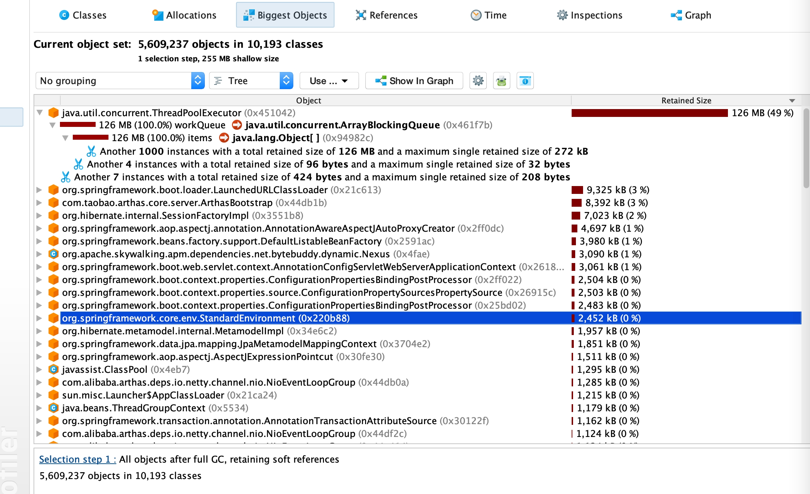

## 目的：找大对象
背景：有一个同步数据程序，凌晨开始执行，请求二方接口，次数大约在300w次上下。单线程耗时较慢，经常需要1个多小时。开线程池优化后减少到15min，但引出了新问题，所在的k8s容器经常在同步的时候因为OOMKilled，程序重启，导致同步一半就中断。看容器配置只配了2G。jvm也是分配了2G。

观察：此同步程序有很多不同性质的基础数据，暂停其他，只留优化后的那部分基础数据，发现可以正常完成任务。初步判断JVM内存未释放导致的问题。切到JVM监控，发现老年代在同步时逐步的申请了350+M大小的内存没有释放，与此同时Pod监控也涨到2G多一些。此时需要找出哪部分大对象直接进入了老年代。

操作：开启同步任务，执行一段时间后开始dump，取出分析
`heapdump /dir/xx/xx/heapdump.hprof`

发现是线程池队列设置比较长。而且大小是越来越大，分析对象sku牵涉到型号、属性模板、等级模板，尽管用了lazy，但jpa都关联查出来了，导致对象较大，250K上下。

解决：
- 缩小队列长度，线程池有拒绝策略，所以需要手动判断队列是和否满，延迟重试入队，不能出现拒绝入队的情况；
- sku对象是jpa的，只传必要的字段进队列，其他的可以交给垃圾回收器处理；

待解决：
- k8s内存设置和jvm内存设置一样是否合理