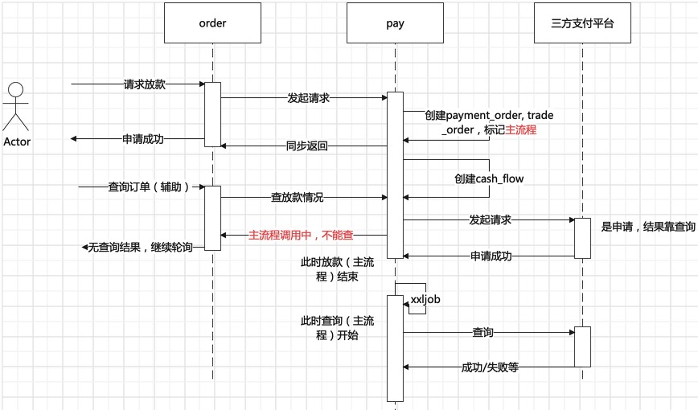
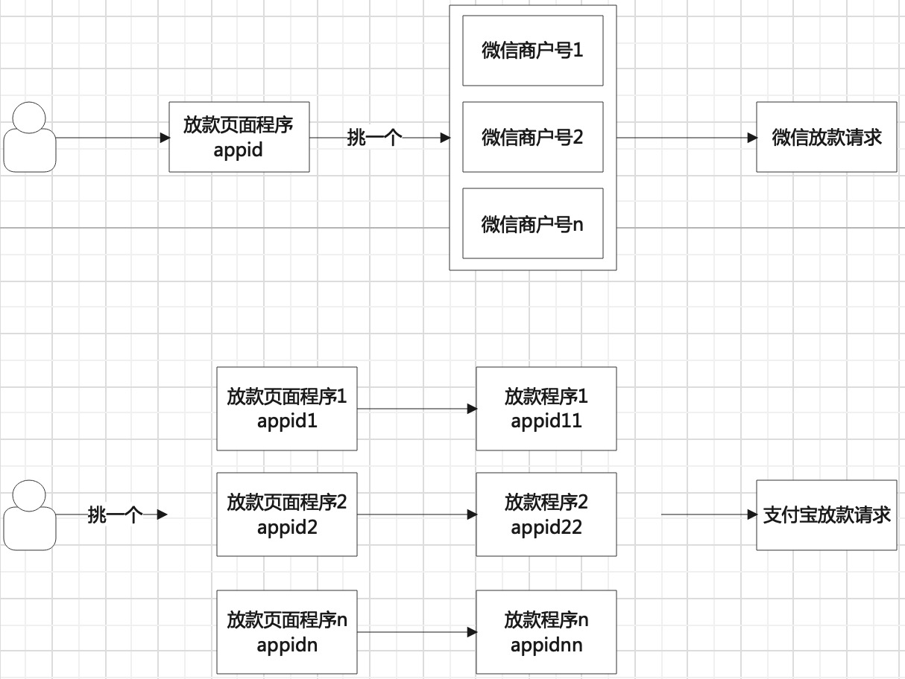

[TOC]

## 放款设计
订单服务与放款服务为两个服务，为了提高系统的并发量、吞吐量，采用的是**异步请求**。创建支付单成功即返回，**手机端轮询查订单状态**。支付单会异步发起支付请求获取放款结果，根据结果处理成功、处理中、失败的场景。**失败有job补偿机制**

- 接口要考虑幂等，重复发起的请求要识别好，只返回数据库记录的状态，并且做好并发情况下的处理；
- 发起支付前会创建三个实体：大支付单(payment_order) 1:n 打款单(trade_order) 1:1 资金流水明细单(cash_flow)；
- 创建后即可返回订单系统接收成功，自己发起异步开始处理；
- 异常失败的交由专门的程序处理，且同一时间只能处理一个；

因为涉及金额，在处理放款接口的**防御性原则**：只要不是明确失败、不需要重试的失败码，这个任务就不能停止重试。什么是不需要重试的：看接口文档，会说明需要用新单号，重新发起请求的，例如实名认证失败、账号未实名。

### 大支付订单 payment_order
创建后相当于有了任务单，后续操作交由线程异步处理，或者异常补偿job处理
- 一个payment_order构成简单，记二方业务单号、金额、状态、最新的trade_order
- 与trade_order关系是1:n，但只会关联最新一条，作用是如果trade_order失败，想要重新发起，新生成trade_order

### 打款单 trade_order & 资金流水明细 cash_flow
每一条都是向支付平台将要请求或者已请求的记录
- 关系为1:1
- trade_order构成有：单号、二方业务单号、payment_order、支付开发参数、金额、收款方信息、状态、是否需要重试、**主流程调用中标识**、完成时间；
- 即将请求三方支付平台时创建cash_flow，构成有：单号、金额、收款方信息、三方平台单号、三方返回结果code、三方返回结果msg、收款方账户、收款方姓名、放款方账户、状态。交易双方信息是重点；

### 状态
待处理、处理中、成功、失败、异常

### 抽象三方平台的入参、出参
公共入参：
支付开发参数、放款人信息、金额

公共出参：
响应code，响应信息，错误码（如果是额外字段给的），错误信息（如果是额外字段给的），三方单号，解析返回后应该转变的状态（成功、失败、处理中、关闭、订单不存在），**是否重试发起打款**，是否回掉二方系统告知结果

关于**解析返回后应该转变的状态**：解析三方平台结果要注意，如果不是明确失败，我们系统就不要关闭订单，需要重试查询。避免钱发出了，系统由于错误关闭订单，无法得知钱实际情况。造成损失，并且后知后觉影响后面的对账。

失败、关闭、订单不存在 就是需要重新发起放款请求的状态；
处理中 就是需要重试查询放款结果的状态，不要停；

### 接口调用
- 放款（主流程）：
业务服务发起请求，建立好任务单即可异步处理；

- 查询（主流程）：
等待异常补偿机制统一处理，每隔一段时间对处理中的trade_order做查询操作，这里的查询根据返回值，可作出成功、失败、是否要重新发起打款、回调二方系统 的反应；

- 查询（辅流程）：
暴露给二方查询的，保证在主流程之后调用，这里的查询结果，可作出成功、失败、回调二方系统 的反应；
是的，出于安全考虑，是否要重新发起打款是不会有的，这种只能由主流程能做。

在查询情况下，有种是没有订单，或者找不到批次的情况，这时**重试发起打款**字段就起到了作用。但这里是主流程查询可发起的。
重申，查询（辅流程）一定要注意是发生在打款发起之后的。为什么要注意这种场景？
如果你暴露了三方支付平台的查询接口，那一定无法保证调用方的调用时序，并且支付服务在发起请求是异步的，无法控制cpu的调度顺序，也无法控制三方系统的响应速度。所以要一定要做好保证。trade_order的**主流程调用中标识**可以用来保证，但要记得更改标记。主流程就是放款、异常补偿机制正在进行，没有结束前，暴露的查询接口都不可用。这里的查询只起到辅助的作用。

### 其他
有什么一般的方式可以不用考虑这么多？用mq就可以，发起成功后，就可以发出消息，可做查询了。为什么不用，这个项目本身就没有强烈的需求。不需要引进新的中间件增加技术复杂度，做一些小设计就可协调xxljob满足这种场景了。

## 演化路径
单账户放款 -> 多账户放款&额度限制 -> 微信接口升级

### 单账户放款
> 处理简单，跳转小程序，在向支付平台发起请求时读取配置文件的支付参数即可

需要注意的是，证书是文件，服务启动时保存至jvm中，用到直接取即可

### 多账户放款&额度限制
> 增加支付账户，并且每个支付账户可用的金额、优先级需要配置。

放款交互，后台的流程是：
微信，用户进入某一个公众号页面，放款时从多个账户挑一个。
支付宝，挑一个放款页面，放款。

为什么挑 是在不同的节点，因为两平台产品设计思路不一致，思路里会写到。

#### 思路
> 支付前根据金额、优先级、是否到上限，得到可用于放款的账户，获取支付开发参数，发起请求。

获取支付参数，需要把原本在配置文件的参数放入数据库中，并且加入新的支付账户参数

关于请求，有个基本问题要考虑：钱在哪里，转到哪个用户？
- 微信，小程序/公众号是一个账户的，**钱在另一个微信支付-商户号上**，商户号关联到小程序上，所以要申请多个微信支付商户号来用。
- 支付宝，**钱是在商户后台的**，小程序/公众号服务、支付服务是作为工具，关联到这个商户上的，所以要申请多个商户。

转成接口的语言，看入参：
微信入参，商户号id(machid)，小程序/公众号appid，用户所在appid的openid；
支付宝入参，商户 pid，支付服务的appid，用户pid。这支付的服务可以是同一个，但要从多个商户账户里扣钱，而且这种放款的功能有限制只能给自己商户用，不能提供给同一主体但账户不一样的使用。这支付服务appid就每个商户里都要建立一个。相应的小程序/公众号服务也是要有多个appid跟商户pid；

> 入参用户标识：
> 1. 微信，字段就是openid，但**openid是微信用户在公众号appid下的唯一用户标识**，即appid+openid才能确定用户。**这意味着用户在进入小程序的时候后，后台就要知道该用户在哪个小程序上**。如果业务上认为只有一个小程序，那这点可以无需注意；
> 2. 支付宝，字段就是pid。支付宝认为商家、个人都可用pid标识，是个全局标识；

#### 一些资料
由于微信、支付宝产品设计理念上有差异，需要先分清名词、概念。
- 微信的公众号、小程序、移动应用是开发平台体系的，都有appid（识别程序id）。而商户号（即放钱的地方），是微信支付体系的，有mchid。即较为独立，地位平级。如果要开发支付、付款相关功能，就从商户号为起点开发。开发好后再绑定appid。
- 支付宝有商户后台（即放钱的地方），商户号有唯一pid。以此为中心，地位最高。开发者在开发平台创建应用appid，并选择、实现好对应接口（各种接口，含支付，放款等），商户后台再绑定关联appid。
- 微信：一个appid可以关联多个商户号（即放钱的地方），一个商户号可关联多个appid[关联关系-账号关联（AppID绑定）](https://pay.weixin.qq.com/static/pay_setting/appid_protocol.shtml)
- 支付宝：两种应用模式，自研型应用、第三方应用。此放款功能仅支持自研型，一个商户（即放钱的地方）可关联多个appid（开发者开发的应用），一个appid只能关联一个商户。[关联关系-绑定应用](https://opendocs.alipay.com/open/0128wr)

#### 设计
根据上面的思路，既然支付宝在进页面就面临选择的问题，那微信也可出现这种场景，那这个流程就可以一般化。进页面就要开始判断，这次放款应该由哪个账户承担。那放款页面appid，放款请求参数放在同一条数据里强绑定。这样得到支付账户也可得到放款页面的appid。

**支付参数配置表**：id，微信/支付宝，优先级，账户名称，上限额度，已使用额度，微信+支付宝参数

而且由于用户进入放款页面 -> 考虑 ->放款 有时间的，那判断了由哪个账户承担，需要做一条额度预留的记录，并且标识是否使用的状态。**根据支付结果改变这个状态**。

**额度预留表**：业务系统订单号，payment_order_no，支付参数id，状态（使用，未使用，释放）

额度按照高并发库存扣减设计思路来。

### 微信接口升级
> 从同步返回结果，变成需要异步查询结果。

升级前处理简单，放款接口的同步结果即可判断并处理。手机端发起的查询也只是查订单状态。
转变异步查询接口后，由于服务本身没mq的需求，没有引进。出现异常单也是靠xxljob每5分钟来处理一次。如果这节点不改，那每个用户在放款结果页面，都要等5分钟之后才知道结果。

如何不引进mq，减少用户等待时间？利用原本移动端就有的轮询，查订单状态该查三方平台。这里要注意，支付服务的放款接口是异步的，所以一定要控制好 放款接口、查询接口1、xxljob端的查询接口2 的请求顺序。尤其要控制用户的查询请求只能处理成功、失败的情况，其他异常情况是xxljob发起处理的。所以两个查询职责是不一样的。
并且在新的接口中，需要处理用户姓名校验失败的情况，不能关闭订单，允许用户重新输入姓名，发起放款请求。
这里开设异常重试放款接口，就上了payment_order支持异常场景的功能，状态为异常的可开始处理，并创建最新的trade_order成功建立任务单后返回。

但这之前，不要忘记账户额度上限的问题，因为在姓名校验失败的时候，支付结果是失败，而服务对支付结果是统一处理的，额度已经释放了。
要重新获取，在前面我们已经知道了，放款页面和支付参数是绑定的，如果刚好账户没有额度了怎么办？所以有一个前提，保证重试必须申请成功。那姓名校验失败的额度就不能归还。再想多一步，如果一直校验失败，用户走了，无法归还了怎么办？还需要保证若干时间后额度要归还。那么跟支付时库存归还一样，设置放款剩余时间，到时间了还没成功，订单关闭，释放额度
