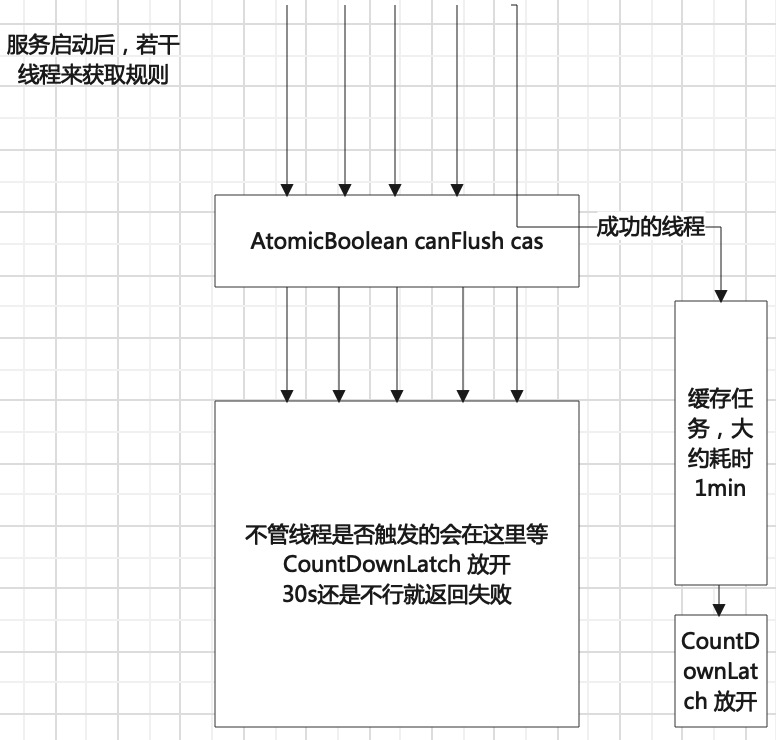
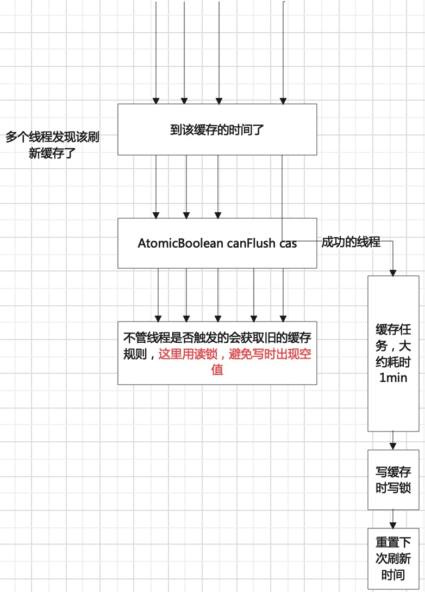

[TOC]

## 需求
数据库里存放着10条大规则，每个规则下包含几百条小规则，可以根据机器的读数，转成可描用于述商品的属性。不停的用sql匹配会影响所有用这库的服务，需要缓存至jvm内存/redis缓存中。

## 设计
> 机器读数来到时，可以迅速从缓存获取规则，计算结果。为了避免缓存击穿，在失效前重新获取数据库的最新规则，刷新缓存内容，而不能影响正常使用。
### 尽快缩小规则范围
大规则有适用范围，第一步可依据此大范围缩小。在缓存存放时可以将使用范围简单处理，作为关键字存入缓存。

### 第一次缓存
- 服务启动，多个线程进入，首次从数据库获取。如果空，触发缓存任务线程；
- 为了控制只有一个触发成功，用原子类AtomicBoolean canFlush cas操作标识能否刷新；
- 触发成功的线程启动**任务线程**建立任务，开始查数据库（耗时约1分钟左右）；
- 加入CountDownLatch，默认1，用于控制多个线程都要等**任务线程**规则写入成功后置零，其他线程才能继续获取规则；
- 多个线程等待CountDownLatch置0，设30s超时返回；



### 增加缓存失效时间
同样是触发任务线程的思路，只不过变成了判断时间是否超过了过期时间，超过了就可去触发。同样的只有一个可触发成功。
为了抹除用户的停顿感，jvm缓存的规则数据是强引用，不会消失，只靠任务线程刷新

- 多个线程进入，判断是否超过了过期时间
- 超过了则cas操作，成功的那个去触发任务；
- 不论成功还是失败的线程继续获取原来的规则缓存；
- 任务线程成功后，启用读写锁的写锁，其他线程要等待写入完毕才能继续；
- 任务线程释放写锁后，设置下一次需要刷新的时间点，注意这里有锁，逻辑写入finally中；



```java
@Service
@Slf4j
public class RuleService {

    @Autowired
    PpnMappingScopesRepository scopesRepository;
    @Autowired
    PpnMappingRepository ruleRepository;

    /**
     * 下一次刷新时间
     */
    private Long nextFlushTimestamp = 0L;

    /**
     * 缓存保持时长
     */
    private Long lastTime = 600 * 1000L;

    /**
     * 缓存刷新时需要互斥
     */
    private ReentrantReadWriteLock lock = new ReentrantReadWriteLock();

    /**
     * 规则缓存。ConcurrentHashMap针对多线程put操作还行。但这里用处不大，只需要一个线程写进去即可
     */
    private Map<String, List<PpnMappingRule>> ruleCache = new HashMap<>();

    /**
     * 控制一个线程做缓存刷新
     */
    private AtomicBoolean canFlush = new AtomicBoolean(Boolean.TRUE);

    /**
     * 用于控制第一次初始化，需要其他线程等待
     */
    private CountDownLatch latch = new CountDownLatch(1);

    /**
     * 匹配规则，先从缓存获取
     *
     * @param categoryId 品类
     * @param brandId    品牌
     * @param modelId    型号
     * @return 命中的规则
     */
    public List<PpnMappingRule> matchRule(Long categoryId, Long brandId, Long modelId) {
        this.cacheRuleFlush();

        // 等待APP属性映射初始化完成
        try {
            if (!latch.await(30, TimeUnit.SECONDS)) {
                // 超时
                throw new DomainException("规则映射初始化中，请重试");
            }
        } catch (InterruptedException e) {
            log.error("flush app property mapping interrupt", e);
            Thread.currentThread().interrupt();
            throw new DomainException("规则映射初始化被中断，请重试");
        }

        lock.readLock().lock();
        // 能进这里的是缓存中有可用的匹配规则
        try {
            List<PpnMappingRule> matchedRule = new ArrayList<>();
            List<PpnMappingRule> categoryRuleList = ruleCache.get(this.matchKey(ScopeType.CATEGORY, categoryId));
            List<PpnMappingRule> brandRuleList = ruleCache.get(this.matchKey(ScopeType.BRAND, brandId));
            List<PpnMappingRule> modelRuleList = ruleCache.get(this.matchKey(ScopeType.MODEL, modelId));
            if (!CollectionUtils.isEmpty(categoryRuleList)) {
                matchedRule.addAll(categoryRuleList);
            }
            if (!CollectionUtils.isEmpty(brandRuleList)) {
                matchedRule.addAll(brandRuleList);
            }
            if (!CollectionUtils.isEmpty(modelRuleList)) {
                matchedRule.addAll(modelRuleList);
            }
            if (CollectionUtils.isEmpty(matchedRule)) {
                throw new DomainException("规则属性值映射规则匹配为空，异常");
            }
            return matchedRule;
        } finally {
            lock.readLock().unlock();
        }
    }

    /**
     * 后台刷新缓存
     */
    private void cacheRuleFlush() {
        if (System.currentTimeMillis() <= this.nextFlushTimestamp) {
            // 未过期
           return;
        }

        if (!this.canFlush.compareAndSet(Boolean.TRUE, Boolean.FALSE)) {
            // 替换失败，表示已经有线程正在刷新
            log.info("flush app property mapping: other thread is flushing, skip and use cache");
            return;
        }

        PmsThreadPool.threadPool.execute(() -> {
            List<PpnMappingRule> ruleList = ruleRepository.findByStatus(Status.ENABLED);

            lock.writeLock().lock();
            // 独占，重新载入规则后才允许其他线程访问
            try {
                // 清空后再载入
                ruleCache.clear();
                ruleList.forEach(rule -> rule.getScopes().forEach(scope -> {
                    String key = this.matchKey(ScopeType.getByCode(scope.getScope()), scope.getTargetId());
                    if (null == ruleCache.get(key)) {
                        List<PpnMappingRule> rules = new ArrayList<>();
                        rules.add(rule);
                        ruleCache.put(key, rules);
                    } else {
                        ruleCache.get(key).add(rule);
                    }
                }));
                if (1 == this.latch.getCount()) {
                    // 第一次的初始化操作
                    this.latch.countDown();
                }
                log.info("flush app property mapping: finish");
            } finally {
                // 重置下一次更新时间，允许刷新
                this.nextFlushTimestamp = System.currentTimeMillis() + this.lastTime;
                canFlush.set(Boolean.TRUE);
                lock.writeLock().unlock();
            }
        });
    }

    /**
     * 缓存值的键拼接规则
     * @param scopeType 适用类型
     * @param targetId id
     * @return 键
     */
    private String matchKey(ScopeType scopeType, Long targetId) {
        return scopeType.getCode() + ":" + targetId;
    }
}

```

### 简单的缓存工具
guava，需要研究，有勾子函数可用