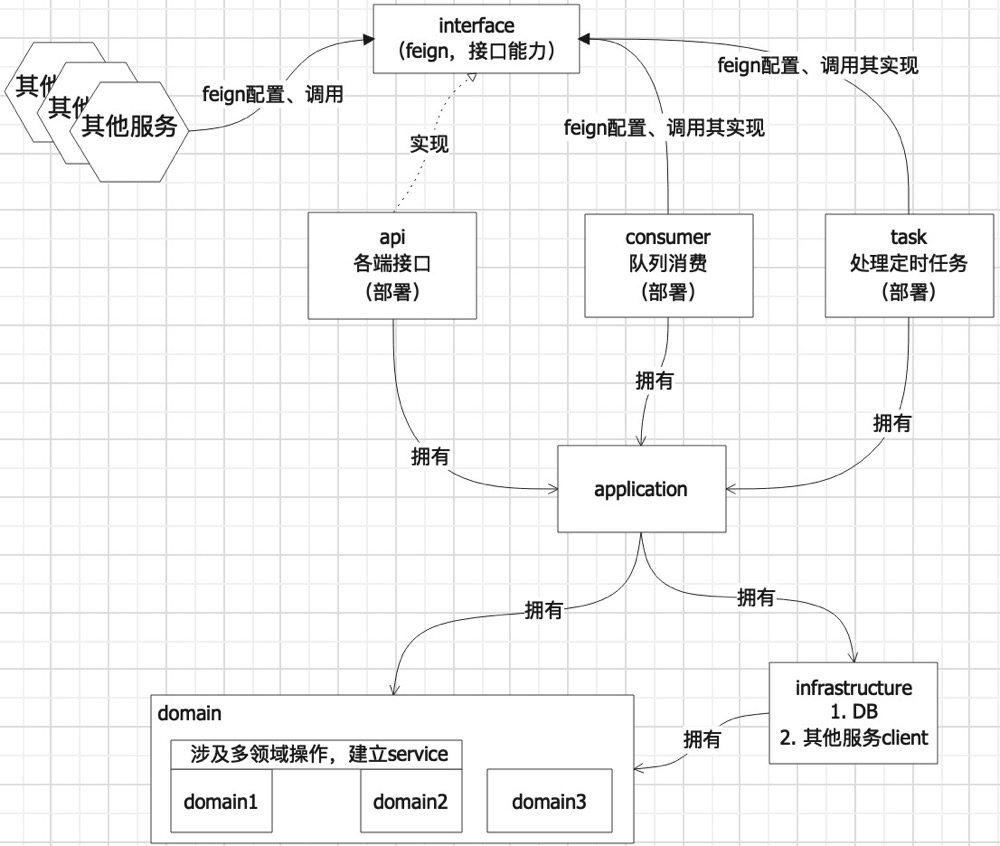
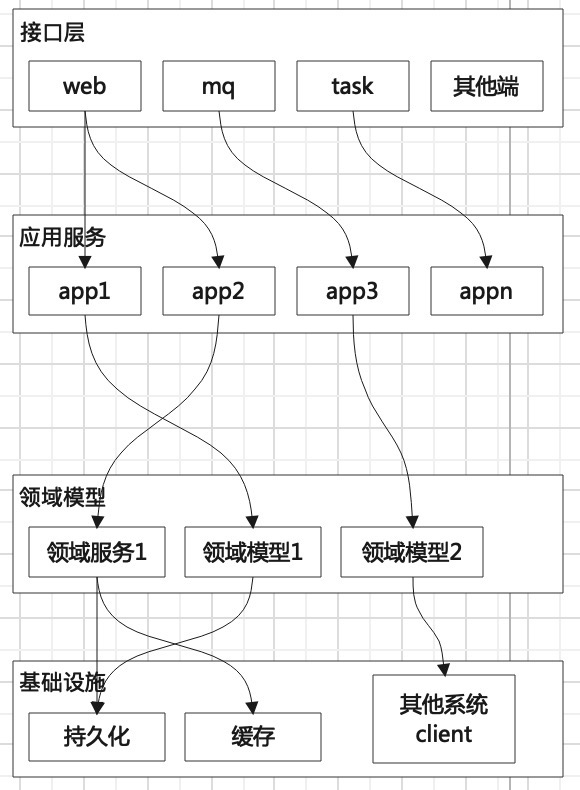
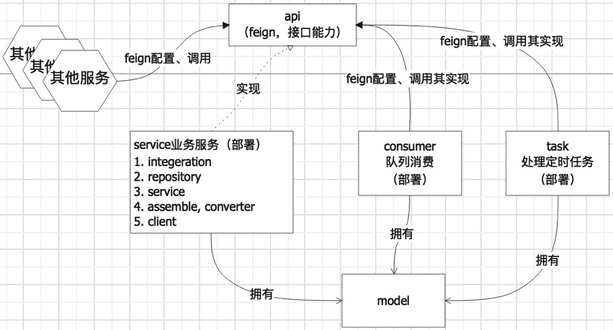

[TOC]

## 出发点
参考：领域驱动设计
保证代码写的又快又好。

### 项目结构
我们在分层架构中采用依赖倒置原则时，我们可能会发现，事实上已经不存在分层的概念了。无论是高层还是低层，它们都只依赖于抽象，好像把整个分层架构给推平了一样。
从分层架构转向六边形架构。事实上，这并不困难，只是需要从不同的角度来看待和使用Spring框架而已。

#### 1
下面项目分了7个子项目，利用maven管理。
1. interface，为接口定义 + 出入参VO
   - 带上spring的注解定义RequestMapping、PostMapping，用以提供二方引用使用。二方在使用的时候只需要引入此包使用；
   - 带上swagger的定义，用以提供接口文档管理；
2. api，实现interface，调用里层application
   - 面向各端，后台系统接口、手机端接口、小程序等
   - 可用不同的实现方式提供接口，restful风格、graphql等
   - 将VO转成applicatioin可理解的入参DTO
   - 将里层application的DTO转成VO（借助struct.mapper）
3. consumer，接收消息队列。引用interface，调用api提供的能力
   - 提高api服务的内聚
   - 或者引用appliction（丰富application编排的能力，提高复用度）
4. task，同3逻辑
5. application，领域编排
   - 每一个方法都代表着一个完整的业务能力。方法的**特点是不会出现if else的语句，如果有，那就是领域知识外泄，或者方法承载过多功能**。只会按步骤调用领域服务、领域模型提供的操作；
   - 领域消息在这里发出（如需要）；
   - 这层会调用domain提供的repository相关接口，了解domain的出参BO，并将其转为DTO提供给外层的api、consumer、task；
6. domain，领域，所有领域知识在这里得到体现
   - 单个领域的操作；
   - 涉及两个以上领域的操作；
   - 战术设计在这里发挥用处；
   - 将持久化的数据，封装在service层，转为BO提供给外层application；
7. infrastructure，基础设施，提供持久化、缓存、邮件发送、二方\三方接口调用、消息等
   - 提供基础能力

优点：
- 每个项目职责很明确，在物理上很大程度限制了开发人员的随意性，需要熟悉项目结构，每个项目的职责，才能写代码；
- 项目弹性高，如api提供的接口可以玩各种方式，不用担心业务字段缺失；
- 单元测试明确，保证domain的正确。用例单元测试靠application；

缺点：
- 上手较难，理解上会有难度；

应用层：你可以将应用服务看成是围绕着领域模型的一个环或者六边形，或者是介于用户界面和模型之间的一层，无论如何，我们都可以用“应用层”来描述这个概念性的位置。

#### 2
下面项目分了5个子项目，利用maven管理
1. api，为接口定义 + 出入参VO
   - 带上spring的注解定义RequestMapping、PostMapping，用以提供二方引用使用。二方在使用的时候只需要引入此包使用；
   - 带上swagger的定义，用以提供接口文档管理；
2. service，整个服务的功能在此，实现api接口，提供能力。靠包的管理来区分不同的用处。
   - controller 提供接口入口，大体操作是调servic，得到聚合根，交由assembler装配，converter剪裁，剪裁结果即返回结果
   - service 领域服务，包含业务知识，可操作repository，操作后出参为聚合根
   - repository 仓库，提供数据
   - assembler 装配者，对聚合根进行数据准备，可操作repository，返回BO
   - converter 转换器，对assembler返回的BO，取出需要的数据组成VO返回
   - integration 基础设施，提供持久化、二方/三方服务接口调用、消息等技术性强的设施
   - model 模型，存放BO（领域知识）、PO
   - 等等；
3. consumer，引用api，直接http使用service能力
4. task，引用api，直接http使用service能力
5. model，提供api的出入参

优点：
- 上手快，如果想3层架构转ddd思想开发，controller、service、repository同名，更为亲和，转变更自然

缺点：
- 重约定，项目基本所有功能都在service，开发人员在里面写代码有较大的自由（限制不大，全靠宣导和自觉，容易乱写）
