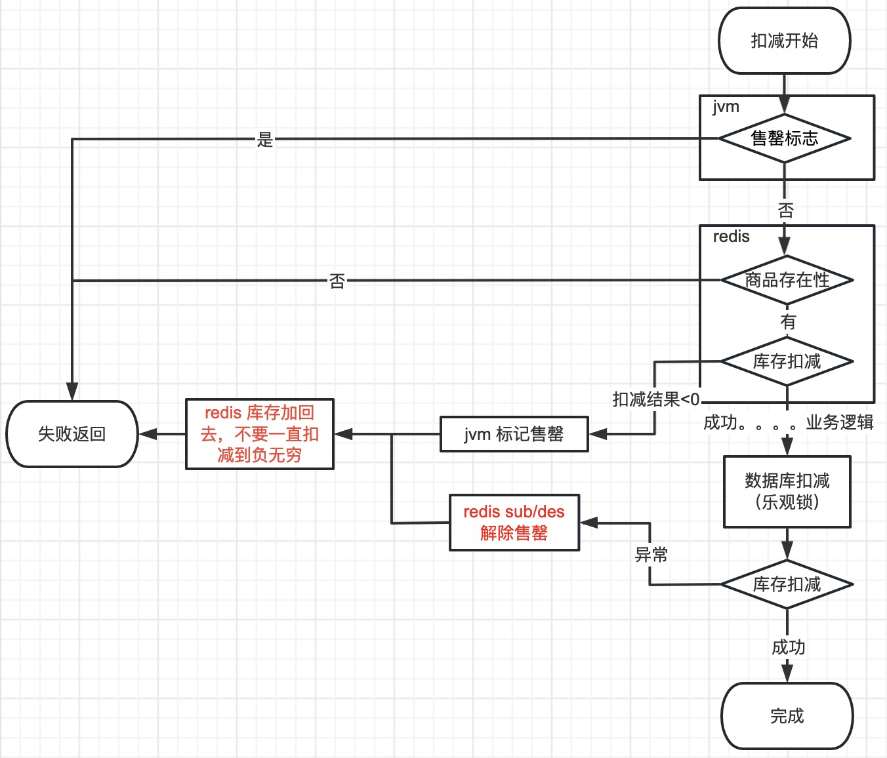
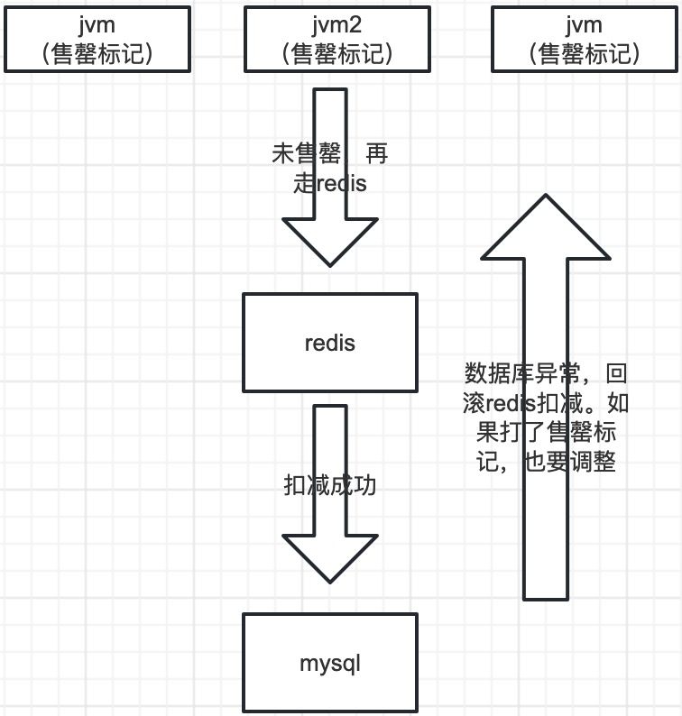

[TOC]

参考：[知乎专栏](https://zhuanlan.zhihu.com/p/85660050)

## 由己
### 需求
由一个支付账户扩展至多个支付账户，在交易完成时按`支付账户额度优先扣减`打款给顾客。n个微信账户，n个支付宝账户，打款给客户需要从这些账户按优先级给出，每个账户有不同的额度。
（可能跟银行提现有限额有关）

### 分析
题外：由于微信、支付宝设计理念上有差异，需要先分清名词、概念。
- 微信的公众号、小程序、移动应用是开发平台体系的，都有appid（识别程序id）。而商户号（即放钱的地方），是微信支付体系的，有mchid。即较为独立，地位平级。如果要开发支付、付款相关功能，就从商户号为起点开发。开发好后再绑定appid。
- 支付宝有商户后台（即放钱的地方），商户号有唯一pid。以此为中心，地位最高。开发者在开发平台创建应用appid，并选择、实现好对应接口（各种接口，含支付，放款等），商户后台再绑定关联appid。
- 微信：一个appid可以关联多个商户号（即放钱的地方），一个商户号可关联多个appid[关联关系-账号关联（AppID绑定）](https://pay.weixin.qq.com/static/pay_setting/appid_protocol.shtml)
- 支付宝：两种应用模式，自研型应用、第三方应用。此功能仅支持自研型，一个商户（即放钱的地方）可关联多个appid（开发者开发的应用），一个appid只能关联一个商户。[关联关系-绑定应用](https://opendocs.alipay.com/open/0128wr)

考究点：什么时候确定额度用在哪个微信支付商户号上？
付款接口入参要与商户有关：
- 支付宝是自研型的，只能从发起请求的商户号扣钱给顾客，入参给appid，用户的identity，钱从绑定的商户上扣。如果要走多个商户，额度优先扣减功能，那会要开发支持多个小程序，付款，并要关联。从成本讲，支付宝只会有一个账户，不太会有额度扣减的需求。
- 微信小程序appid可以绑定多个做支付的商户，支付入参时带上商户id，就指定了支付账户是哪个，与小程序无关。只需调整入参即可。

答案也清楚了：如果是支付宝要实现，那在获取小程序二维码时就要判定额度从哪个商户扣减。如果是微信，付款时判断即可，非常省心。但无法预测未来的需求，而且项目中，微信支付宝在设计上也是共用接口，所以按支付宝的要求来实现，在用户进入小程序的时候就要判定额度扣减从哪个商户来。

那么在设计的时候，从业务实际情况出发，商户小程序与支付配置直接做强关联，数据库里直接配在同一条，并写明放在一起的缘由。

（好处：微信在商家转账零钱给用户有限额，未来走向不定，支付宝也已经有口子实现额度优先扣减功能）

### 额度扣减功能
1. 生成小程序的码，此时做支付账户额度优先扣减的预操作，先占用掉额度（依赖sql悲观锁实现），增加一条记录，标记为占用中；
2. 真正放款成功后，将记录标记为使用完毕；

### 后台功能
- 基本信息：配置支付配置、小程序appid、商家id等支付涉及到的，支付入参要什么就加什么字段；
- 额度配置；
- 优先级配置；

### 潜在问题
额度扣减靠数据库，性能低，目前满足生产需求，但从业务发展角度看，是需要整改的。

## 及人
秒杀系统库存

### 需求：
1. 可支持高并发；
2. 先来先得（如抢红包）；

### 性能排行
数据库悲观锁 < 数据库乐观锁（version） < redis预扣减+数据库乐观锁

数据库悲观锁：锁住某一行a后，所有其他要操作a行的都会被阻塞，不分先来后到竞争资源，并发大时会快速消耗掉数据库的连接
数据库乐观锁：参考cas，只有version是预期值才会操作成功，并且同时给version+1。但其实对性能也会有影响，innodb有事物支持的，这种操作会带来很多redolog、undolog、binlog。

### 流程图

- redis扣减库存成负数后，即扣减失败，此要恢复redis的数量，否则redis没有真实的库存量，一个场景就是redis有1个库存，5个来扣减，4个redis会失败，如果不恢复那redi记录的就是-4，第5个redis扣减成功，但数据库失败了，此时redis的库存加1，也只是等于-3，那库存就是有问题的，造成少卖；
- 数据库异常后，如果标记了售罄，则所有jvm都要解除售罄，可以用redis pub/sub简单实现广播功能；
- redis这个功能没有ack确认，不会重试，jvm不一定能都刷成功，可以zk、mq。但是面对高性能，一致性要取舍，可以选择保证最终一致性；
- 这里的最终一致性是，jvm的缓存有有效时间的，缓存时间到了，一样会从redis取值，数据最终一致；

- 对于数据库扣减失败，可以用MQ异步处理，利用mq失败重试的功能。异步下单没有单号，在redis用用户+skud代替key键。最好是有一个标识id，这样前端好查，创建订单也可做到幂等；
- 柔性事物：用rocketmq事务消息，如加积分、购物车清理。等订单创建成功了，再commit消息。（commit的消息才能被消费）
- 20min后检查订单支付状态，未支付要回补redis、db库存；