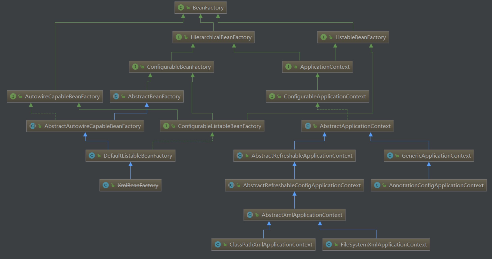

# IOC

[TOC]

> 核心：资源集中管理，实现可配置并且易于管理；降低资源之间的耦合度。

## 准备：BeanDefinition

是Spring容器中Bean的描述，一个 BeanDefinition 描述了一个 Bean 实例，实例包含属性值、构造方法参数值以及更多实现信息

## 准备：ApplicationListener

监听器，注册到多播器中`ApplicationEventMulticaster`，这里使用了观察者模式。

#### 用法

发布方式，见下
1. 实现`ApplicationListener`接口，可注册自己的监听器
2. `AnnotationConfigApplicationContext` `publishEvent`发布事件，事件可以继承`ApplicationContextEvent`
```java
// 建立自己的监听器
@Component
public class SelfApplicationListener implements ApplicationListener {
    @Override
    public void onApplicationEvent(ApplicationEvent applicationEvent) {
        System.out.println("通过容器发布了一个事件" + applicationEvent.toString());
    }
}

// 发布事件
public class App {
    public static void main(String[] args) {
        AnnotationConfigApplicationContext ctx = new AnnotationConfigApplicationContext(MainConfig.class);
        ctx.publishEvent(new ApplicationEvent("手动发布事件") {
            @Override
            public Object getSource() {
                return super.getSource();
            }
        });
    }
}

/*
输出：
通过容器发布了一个事件org.springframework.context.event.ContextRefreshedEvent[source=org.springframework.context.annotation.AnnotationConfigApplicationContext@31cefde0: startup date [Tue Jun 25 22:55:17 CST 2019]; root of context hierarchy]
通过容器发布了一个事件com.ronustine.testapplicationlistener.App$1[source=手动发布事件]
*/
```
使用默认的并不会有异步线程处理，需要自己写一个，@Component命名为`applicationEventMultiCaster`，并继承SimpleApplicationEventMultiCaster。设置线程池

#### 源码

位置：`AnnotationConfigApplicationContext`初始化 -> `refresh()` -> `initApplicationEventMulticaster()`
- 使用提供的多播器
- 没有则使用默认的多播器`SimpleApplicationEventMulticaster`，可以异步，但缺少线程池，需要自己 `setTaskExecutor()`

```java
@Component(value = "applicationEventMulticaster")
public class SelfMulticaster extends SimpleApplicationEventMulticaster{
    public SelfMulticaster () {
        setTaskExecutor(Executors.newSingleThreadExecutor());
    }

}
```

## 准备：BeanDefinitionRegistryPostProcessor​

所有的bean定义信息将要被加载到容器中，Bean实例还没有被初始化。继承自BeanFactoryPostProcessor，在解析成BeanDefinition之前的时候

#### 用法

```java
@Component
public class SelfBeanDefinationRegisterPostProcessor implements BeanDefinitionRegistryPostProcessor {
    @Override
    public void postProcessBeanDefinitionRegistry(BeanDefinitionRegistry registry) throws BeansException {
        System.out.println("SelfBeanDefinationRegisterPostProcessor的postProcessBeanDefinitionRegistry方法");
        System.out.println("bean定义的数据量:"+registry.getBeanDefinitionCount());
        RootBeanDefinition rootBeanDefinition = new RootBeanDefinition(SelfLog.class);
        registry.registerBeanDefinition("SelfLog",rootBeanDefinition);
    }

    @Override
    public void postProcessBeanFactory(ConfigurableListableBeanFactory beanFactory) throws BeansException {
        System.out.println("SelfBeanDefinationRegisterPostProcessor的postProcessBeanFactory方法");
        System.out.println(beanFactory.getBeanDefinitionCount());
    }
}
```

#### 源码


## 准备：BeanFactoryPostProcessor

Bean工厂的后置处理器。当Bean定义加载到容器中的时候会调用，此时还未实例化Bean。可以利用这个空隙修改BeanDefinition的相关内容。不常用。

#### 用法

```java
@Component
public class SelfBeanFactoryPostProcessor implements BeanFactoryPostProcessor {
    @Override
    public void postProcessBeanFactory(ConfigurableListableBeanFactory configurableListableBeanFactory) throws BeansException {
        System.out.println("调用了SelfBeanFactoryPostProcessor postProcessBeanFactory");

        for (String name: configurableListableBeanFactory.getBeanDefinitionNames()){
            if ("person".equals(name)) {
                System.out.println("这里有" + name);
                // 这里可以修改BeanDefinition相关内容
                BeanDefinition beanDefinition = configurableListableBeanFactory.getBeanDefinition(name);
                beanDefinition.setLazyInit(true);
            }
        }
    }
}

@ComponentScan(basePackages = "com.ronustine.testbeanfactorypostprocessor")
public class MainConfig {
}

@Component
public class Person {
    public Person(){
        System.out.println("初始化");
    }
}

/*
输出
调用了SelfBeanFactoryPostProcessor postProcessBeanFactory
这里有person
初始化
*/
```

#### 源码

## 正式：AnnotationConfigApplicationContext

> BeanFactory与ApplicationContext


这个对象做了什么操作？
`AnnotationConfigApplicationContext ctx = new AnnotationConfigApplicationContext(MainConfig.class);`

AnnotationConfigApplicationContext继承自GenericApplicationContext，此Generic..有一个BeanFactory: DefaultListableBeanFactory
```java
// 这里开始
public AnnotationConfigApplicationContext(Class<?>... annotatedClasses) {
    // 转1，初始化了 注解Bean定义读取器 & 扫描器
    this();

    // 注册传入的配置类annotatedClasses
    this.register(annotatedClasses);

    // 转2，重点
    this.refresh();
}

// 1. 接this();
public AnnotationConfigApplicationContext() {
    // 注解Bean定义读取器，设置@Condition的注解解析器、后置处理器
    // 重点在 -> AnnotationConfigUtils.registerAnnotationConfigProcessors(this.registry);
    // 里面还有这个：注册注解配置解析器（都是Spring内部需要使用的组件、解析器），把有用的都添加到BeanDefinitionMap中了（仅仅是BeanDefinition，还未实例）
	this.reader = new AnnotatedBeanDefinitionReader(this);

    // 类路径的Bean扫描器，使用默认的过滤器
    // 重点在 -> registerDefaultFilters();
    // 增加对@Component的解析支持
	this.scanner = new ClassPathBeanDefinitionScanner(this);
}

// 2. 接refresh。
// 该方法在AbstractApplicationContext中
public refresh() {

}
```
## BeanPostProcessor
> Bean后置处理器，它是Spring中定义的接口，在Spring容器的创建过程中（具体为Bean初始化前后）会回调BeanPostProcessor中定义的两个方法
```java
public interface BeanPostProcessor {

    // postProcessBeforeInitialization方法会在每一个bean对象的初始化方法调用之前回调
    Object postProcessBeforeInitialization(Object bean, String beanName) throws BeansException;
    
    // postProcessAfterInitialization方法会在每个bean对象的初始化方法调用之后被回调
    Object postProcessAfterInitialization(Object bean, String beanName) throws BeansException;

}
```