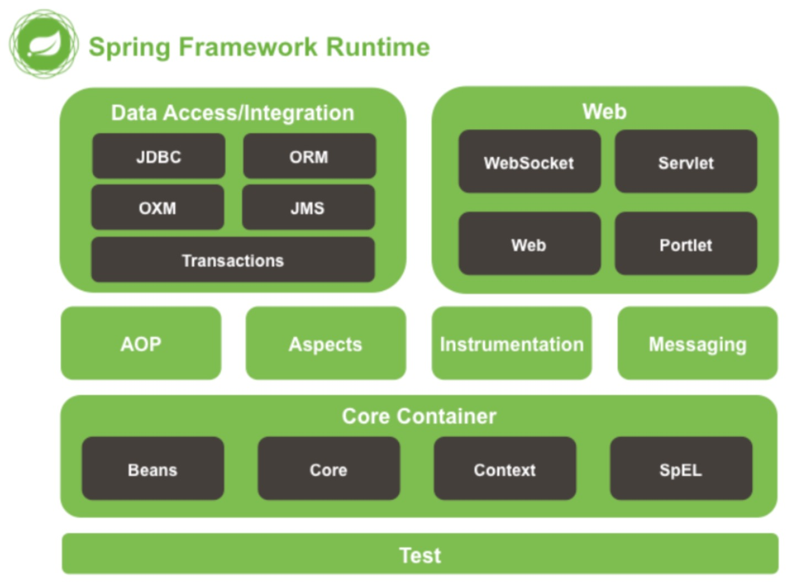

# Spring-Framwork介绍

参考：[spring-framework官网](https://spring.io/projects/spring-framework#learn)

[TOC]

## 功能

- Overview: history, design philosophy, feedback, getting started.
- Core: IoC Container, Events, Resources, i18n, Validation, Data Binding, Type Conversion, SpEL, AOP.
- Testing: Mock Objects, TestContext Framework, Spring MVC Test, WebTestClient.
- Data Access: Transactions, DAO Support, JDBC, O/R Mapping, XML Marshalling.
- Web Servlet: Spring MVC, WebSocket, SockJS, STOMP Messaging.
- Web Reactive: Spring WebFlux, WebClient, WebSocket.
- Integration: Remoting, JMS, JCA, JMX, Email, Tasks, Scheduling, Caching.
- Languages: Kotlin, Groovy, Dynamic Languages.

### Spring Core Container
作用：Core和Beans模块是框架的基础部分，提供IoC(转控制)和依赖注入特性。 这里的基础概念是BeanFactory，它提供对 Factory 模式的经典实现来消除对程序性单例模式的需要，并真正地允许你从程序逻辑中分离出依赖关系和配置
- Core
主要包含Spring框架基本的核心工具类，Spring的其他组件都要用到这个包 里的类，Core模块是其他组件的基 本核心。
- Beans (BeanFacotry的作用)
它包含访问配直文件、创建和管理bean以及进行Inversion of Controll Dependency Injection (IoC/DI)操作相关的所有类
- Context(处理BeanFactory，一下还是ApplicationContext的作用)
模构建于Core和Beans模块基础之上，提供了一种类似JNDI注册器的框架式的对象访问方法。Context模块继承了Beans的特性，为 Spring核心提供了大量扩展，添加了对国际化(例如资源绑定)、事件传播、资源加载和对Context的透明创建的支持。Context模块同时也支持J2EE的一些特性，ApplicationContext接口是Context模块的关键
- Expression Language
模块提供了强大的表达式语言，用于在运行时查询和操纵对象。它是JSP 2.1规范中定义的unifed expression language的扩展。该语言支持设直/获取属性的值，属性的分配，方法的调用，访问数组上下文( accessiong the context of arrays )、容器和索引器、逻辑和算术运算符、命名变量以及从Spring的IoC容器中根据名称检索对象。它也支持list投影、选择和一般的list聚合

### Spring Data Access/Integration
- JDBC
模块提供了一个JDBC抽象层，它可以消除冗长的JDBC编码和解析数据库厂 商特有的错误代码。
这个模块包含了Spring对JDBC数据访问进行封装的所有类
- ORM
模块为流行的对象-关系映射API，如JPA、JDO、Hibernate、iBatis 等，提供了一个交互层。利用ORM封装包，可以混合使用所有Spring提供的特性进行O/R映射，如前边提到的简单声明性事务管理。
- OXM
模块提供了一个对ObjecνXML映射实现的抽象层，Object/XML映射实现包括JAXB、Castor、XMLBeans、JiBX和XStrearn
- JMS (Java Messaging Service)模块主要包含了一些制造和消费消息的特性。
- Transaction
支持编程和声明性的事务管理，这些事务类必须实现特定的接口，并且对所有的POJO都适用

### Spring Web
- Web
提供了基础的面向Web的集成特性c例如，多文件上传、使用servlet listeners初始化IoC容器以及一个面向Web的应用上下文。它还包含 Spring远程支持中Web的相关部分

### Spring Aop
- Aspects
提供了对 AspectJ 的集成支持。
- Instrumentation
提供了class instrumentation支持和classloader实现，使得可以在特定的应用服务器上使用

### Test
Test模块支持使用JUnit和TestNG对Spring组件进行测试