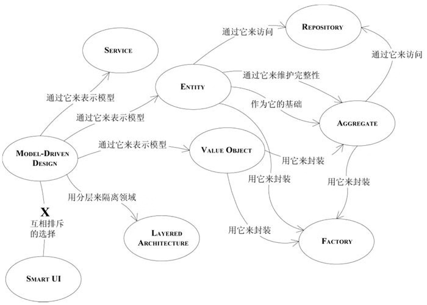
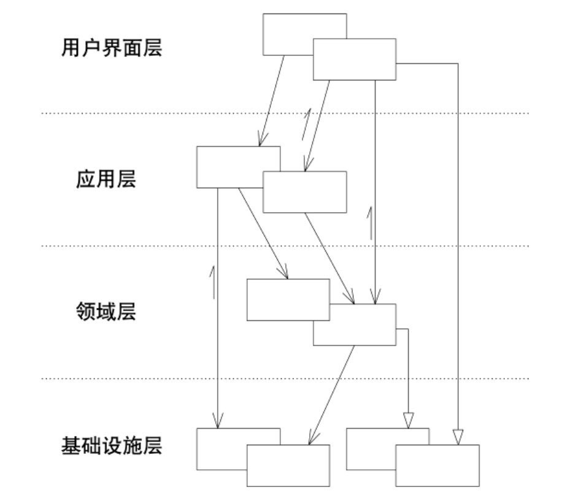
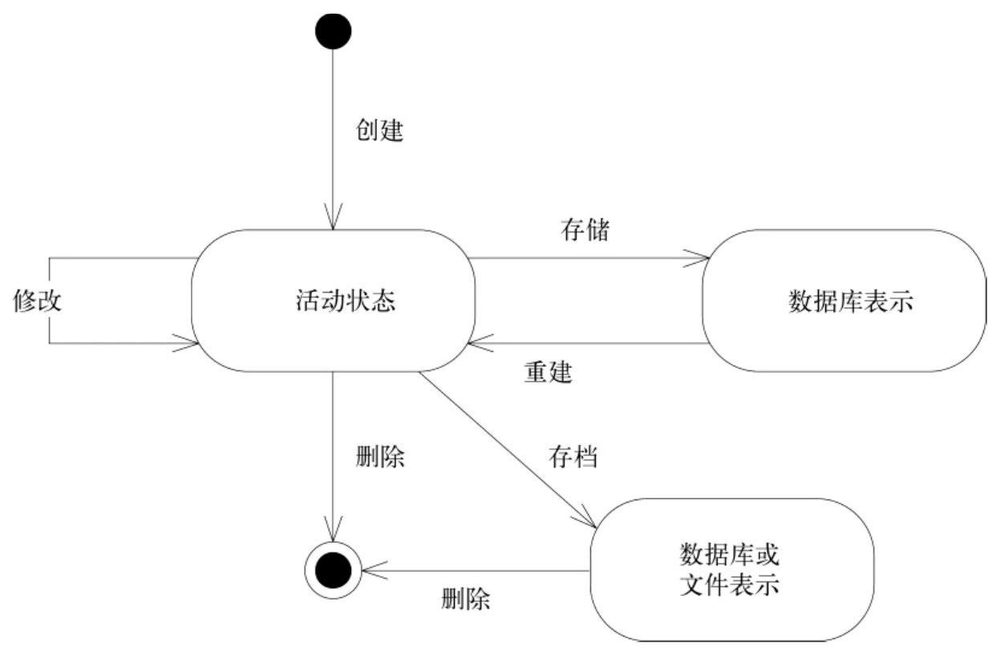

# 目录

[TOC]

> 细微的模型差别和设计决策是如何影响领域驱动设计过程的。
> 将领域设计与软件系统中的其他关注点分离会使设计与模型之间的关系非常清晰。根据不同的特征来定义模型元素则会使元素的意义更加鲜明。

本部分的模式以及关联的方式

## 1 分离领域
> **将领域实现独立出来是领域驱动设计的前提**
> 解决领域问题占软件系统很小一部分，但是非常重要。我们要着眼于模型中的元素，并将他们视为一个系统。将领域对象与系统中的其他功能进行分离，避免将领域概念和其他只与软件技术相关概念混淆。

#### 1.1 模式：LAYERED ARCHITECTURE

> **将领域层分离出来才是实现MODEL-DRIVEN DESIGN的关键**
> 要创建出能够处理复杂任务的程序，需要做到关注点分离——使设计的每个部分都得到单独的关注。分离的同时要维持系统内部复杂的交互关系。

状况：在业务对象中直接写入用户界面、数据库访问等支持代码，业务逻辑则会被嵌入到用户界面组建和数据库脚本中。只是为了以简单的方式在短期内完成开发工作。
如果与领域有关的代码分散在各处，那么查看和分析领域代码则会异常困难。在用户界面简单修改很可能会改变业务逻辑，调整业务规则也可能需要对用户界面代码、数据库操作或者其他的程序元素进行仔细的筛查。这样就不太可能实现一致的、模型驱动的对象了，同时也会给自动化测试带来困难。

大多数如下的分层
| 层 | 说明 |
|--|--|
| 用户界面层 | 负责向用户显示信息和解释用户指令。这里值得用户可以使另一个计算机系统 |
| 应用层 | 定义软件要完成的任务，并且只会表达领域概念的对象来解决问题。这一层所负责的工作对业务来说意义重大，也是与其他系统的应用层进行交互的必要渠道 /n  应用层要尽量简单，不包含业务规则或者知识，而只为下一层中的领域对象协调任务，分配工作，使他们相互协作。它没有反映业务情况的状态，但是却可以具有另外一种状态，为用户或程序显示某个任务的进度 |
| 领域层（模型层） | 负责表达业务概念，业务状态信息以及业务规则。尽管保存业务状态的技术细节使基础设施层实现的，但是反映业务情况的状态是由本层控制并且使用的。**领域层使业务软件的核心** |
| 基础设施层 | 为上面各层提供通用的技术能力：为应用层传递消息，为领域层提供持久化机制，为用户界面绘制屏幕组建等。基础设施层还能够通过架构框架来支持4个层次间的交互模式 |

**结论**
在复杂的应用程序划分层次。每一层内分别设计，使其具有内聚性并且只依赖于他的下层。采用标识的架构模式，只与上层进行松散的耦合。将所有与领域模型相关的代码放在一个层中，并与其他层的代码分开。领域对象应该将重点放在如何表达领域模型上，不需要考虑自己的显示和存储问题，无需惯例应用任务等内容。使得模型的含义足够丰富，结构足够清晰，可以捕捉到基本的业务知识，并有效地使用。

其他
1. Smalltalk语言发明的一种模式MODEL-VIEW-CONTROLLER(MVC)；
2. Fowler讨论了这种模式以及相关变体；
3. Larman在MODEL-VIEW SEPARATION模式有提到；（APPLICATION COORDINATOR是连接应用层的一种方法）

###### 1.1.1 将各层关联起来
> 分层好了，各层怎么联系

各层之间是松散的，层与层之间的依赖关系是**单向**的，上层可以之间使用或操作下层元素，方法是通过调用下层元素的公共接口，保持对下层元素的引用。如果下层元素需要与上层元素通信，则需要采用另一种通信机制，使用架构模式来连接上下层，如回调模式或者OBSERVERS模式。
只要连接方式能够维持领域层的独立性，保证在设计领域对象时不需要同时考虑可能与其交互的用户界面，那么这些连接方式都是可用的。

###### 1.1.2 架构框架
> 好的框架既能解决复杂技术问题，也能让领域开发人员集中精力去表达模型，而不考虑其他问题
> 使用框架的目的：建立一种可以表达领域模型的实现并且用它来解决重要问题。

如果一个架构能够把那些与领域相关的代码隔离出来，得到一个内聚的领域设计，同时又使领域与系统其他部分保持松散耦合，那么这种架构也许可以支持领域驱动设计。

1. 框架需要满足领域层的需求，即使意味着抛弃框架的一些功能
2. 审慎地选择框架中最具价值的功能能减少程序实现和框架之间的耦合，使随后的设计决策更加灵活

#### 1.2 领域层是模型的精髓
领域层是领域模型以及所有与其直接相关的设计元素的表现，由业务逻辑的设计和实现组成，在MODEL-DRIVEN DESIGN中，领域层的软件构造反映了模型的概念。

#### 1.3 模式：THE SMART UI “反模式”
> 帮助认清为什么、何时采用分离模型来分离出领域层
项目只需要简单的功能，以数据输入和显示为主，涉及业务规则很少；团队经验不多；时间少。
在用户界面实现所有的业务逻辑。将应用程序分成小的功能模块，分别将他们实现成用户界面，并嵌入业务规则。用关系数据库作为共享的数据存储库。使用自动化程度最高的用户界面创建工具和可用的可视化编程工具。

使用了这个模式，除非重写，否则不能改用其他的设计方法。

同样的，采用MODEL-DRIVEN DESIGN的项目团队从项目初始就应该采用模型驱动的设计。当然，即使是经验丰富的项目团队在开发大型软件系统，也不得不从简单的功能着手，然后在整个开发过程中使用连续的迭代开发。但最初试探性的工作应该是由模型驱动的，而且要分离出独立的领域层，否则项目进行到后面就变成THE SMART UI了

#### 1.4 其他分离方式
状况：考虑那些没有完全集成到模型中的领域元素、与同一领域中使用不同模型的其他开发团队合作。
参见BOUNDED CONTEXT和ANTICORRUPTION LAYER。
领域层内进行进一步区分，从次要细节凸显出领域的核心概念。

## 2 软件中所表示的模型
> 从细节出发，讨论基本模型元素。将模型与实现的各个细节联系起来，实现同时演进。
> 区分表示模型的3中模型元素模型：ENTITY、VALUE OBJECT、SERVICE。

>  难点：定义用来捕获领域概念的对象很容易，但要想反映其含义却很困难。我们将着重区分各种模型元素的含义，与设计时间结合起来

> 概要：
> 1. 一个对象是用来表示某种具有连续性和标识的事物，还是描述某种状态的属性呢？这是ENTITY与VALUE OBJECT之间的根本区别。领域中还有一些是适合动作或操作来表示，这比对象更清楚，最好用SERVICE来表示。SERVICE是应用客户端来完成某事，技术层有很多，在领域层也能使用，当对软件要做的某项无状态的活动时，就可以将这活动作为SERVICE；
> 2. 在一些情况下，不得不对对象模型进行折中的变更，会影响模型纯度，给出一些原则，确保正确的方向；
> 3. MODULE，每个设计决策都应该时深入理解领域中的某些深层知识之后做出的。高内聚，低耦合可以适应到概念本身；
> 4. 将这些体现模型的构造块组织在一起，并将这些思想组织到模型驱动开发的上下文中，可以创建符合领域驱动设计主要原的组件，有助于解决更大的模型和设计问题；

#### 2.1 联系
> 对象之间的关联使得建模与实现之间的交互更为复杂
> **模型中每个可遍历的关联，软件中都要有同样属性的机制**
> 尽可能对关系进行约束（减少联系）

简化联系：
生活中有大量的“多对多”关联，很多关联天生就是双向的。这些关联会导致实现和维护变得复杂，需要把握一些原则
1. 规定一个遍历方向；
2. 添加限定符，以便减少多重关联；
3. 消除不必要的关联；

双向关联：双向意味着两个对象放在一起考虑才能理解。当应用程序不要求双向遍历，可以指定一个方向，减少相互依赖，简化设计。**理解领域后可以自然推断出这种方向，坚持将关联限定为领域所倾向的方向，还能突出剩余双向关联的重要性**。

如：美国有很多总统，在提到“乔治·华盛顿”却很少问是哪个国家的。从实用角度看，关系可以简化到国家到总统的但想关联，更为深入的，可以带上时间（一个国家在一个时间段只有一个总统，可以化成1对1的关联）

#### 2.2 模式：ENTITY(REFERENCE OBJECT)
> 对象不是通过属性定义的，而是通过连续性和标识定义的。
> 主要由标识定义的对象被称作ENTITY。
> 满足两个条件：在生命周期中具有连续性；他的区别不是由那些对用户非常重要的属性决定的。
> ENTITY有特殊的建模和设计思路。具有生命周期，期间他们的形式和内容可能发生根本改变，但必须保持一种内在的连续性。

对象模型可能把我们的注意力引到对象的属性上，但实体的基本概念是一种贯穿整个生命周期（或多种形式）的抽象的连续性。一些对象主要不是由他们属性定义的。实际上表示了一条“表示线”，这条线跨越时间，常常经历多种不同的表示。

注意：
1. 即使对于不发生根本变化或者生命周期不太复杂的ENTITY，也应该在语义上把它们作为ENTITY来对待，这样可以得到更清晰的模型和更健壮的实现；
2. 面向对象语言在每个对象中都构建了一些与“标识”有关的操作（内存地址），在应用领域没太大意义；
3. 当一个对象由标识区分时，那么在模型中应该主要通过标识来确定该对象的定义，使定义变得简单，并集中关注生命周期的连续性和标识。定义标识操作时，要确保这种操作为每个对象生成唯一的结果，可以附加一个保证唯一性的符号来实现（数据库主键），**模型必须定义出“符合什么条件才算是相同的事物”**；

###### 2.2.1 ENTITY建模
1. 考虑属性；
2. 最基本的是确保连续性；
3. 保持实体简练，抓住对象定义的最基本特征，尤其是识别、查找或匹配对象的特征；
4. 将行为和属性转移到与核心实体关联的其他对象（可能是ENTITY、VALUE OBJECT）中；
5. 实体往往通过协调关联对象的操作来完成自己的职责；

###### 2.2.2 设计标识操作
1. 每个ENTITY都必须有一种建立标识的操作方式，以便与其他对象区分开；
2. 有些数据属性或者属性组合可以确保他们在系统中的唯一性，或者在属性上加简单约束；
3. 当对象属性没法形成真正唯一键时，为每个实例附加一个在类中唯一的符号，一旦这个ID被创建并存储为ENTITY的属性，必须指定为不可变的。这个ID是系统自动生成的，且算法必须确保ID是唯一的；
4. 跟踪ENTITY的标识是非常重要的，但为其他对象加上标识会影响系统性能并增加分析工作，而且使模型变得混乱，因为所有对象看起来都是相同的；

#### 2.3 模式：VALUE OBJECT
> 很多对象没有概念上的标识，他们描述了一个事务的某种特征。
> 用于描述领域的某个方面而本身没有概念标识的对象称为VALUE OBJECT（值对象）。
> 只关心他们是什么，不关心是谁。

- VALUE OBJECT可以是字符串和数字
- VALUE OBJECT可以是其他对象的集合
- VALUE OBJECT可以引用ENTITY
- 作为参数在对象之间传递消息，常常是临时对象
- VALUE OBJECT用作ENTITY的属性
- VALUE OBJECT是不可变的，不要分配任何标识，不要设计成ENTITY那么复杂

关心一个模型元素的属性时，应归类为VALUE OBJECT。我们要使这个模型元素能够表示出属性的意义，并为他提供相关功能。

###### 2.3.1 设计VALUE OBJECT
1. 不关心使用的是VALUE OBJECT哪个实例。在设计时可以多种选择：复制、共享或保持VALUE OBJECT不变；
2. 注意：多个ENTITY共享同一个VALUE OBJECT对象，会出现修改一处（即对象逸出）。影响到其他ENTITY的情况(FLYWEIGHT模式 是相对的)；
3. 复制和共享哪个好，取决于实现环境。复制可能导致大量对象，共享会减慢分布式系统；

采用共享的情况：
1. 节省数据库空间或减少对象数量是一个关键要求时；
2. 通信开销很低时（如在中央服务器中）；
3. 共享的对象被严格限定为不可变时；

VALUE OBJECT不可变时，变更管理就会很简单，因为除了整体替换之外没有其他改变。可以确保共享和引用传递的安全性。可以根据技术需求来决定时使用复制还是共享，因为没有后顾之忧——应用程序不依赖于对象的特殊实例。

出于性能考虑，何时允许可变：
1. VALUE 频繁改变；
2. 创建和删除对象开销很大；
3. 替换（不是修改）打乱集群；
4. VALUE 共享不多，或者共享不会提高集群性能，或其他某种技术原因；

**注意**：VALUE实现是可变的，那就不能共享它。不论是否共享VALUE OBJECT，在可能的情况下都设计为不可变。

例子：
通过VALUE OBJECT优化数据库：一个对象被许多对象引用，其中有些对象将不会在它附近（不在同一分页），这要通过额外无力操作来获取数据。通过复制（不是共享实例的引用），可以将这种作为很多ENTITY属性的VALUE OBJECT存储在ENTITY所在的同一分页上。这种存储相同数据的多个副本技术称为**非规范化**，当访问时间比存储空间或维护的简单性更重要时常用。

###### 2.3.2 设计包含VALUE OBJECT的关联
ENTITY的双向关联很难维护，VALUE OBJECT的双向关联没有意义，应该完全清除双向关联。如果模型中确实需要，应重新考虑是不是VALUE OBJECT。

#### 2.4 模式：SERVICE
> ENTITY和VALUE OBJECT是传统对象模型的主要元素，对象有时不是一个事物。有些情况下，最清楚、最实用的设计会包含特殊的操作，这些操作从概念上讲不属于任何对象。引进新的元素——SERVICE。
> 它们没有自己的状态，而且出了所承载的操作之外在领域中也没有其他意义。但至少为特里独行的行为找到的容身之所，避免打乱真正的模型对象。（这意味着SERVICE除了是技术框架中的一种常见模式，也可以在领域层中使用）
> 有时，它是表示领域概念最自然的方式。

重要领域操作无法放到ENTITY或VALUE OBJECT中。这当中有些操作从本质上将是活动或动作，而不是事物，但由于我们的建模范式是对象，因此要想办法将他们划归到对象这个范畴中。

难点：
没有努力为这类行为找到适当的对象，而是逐渐转为过程化的编程。但是，如果我们勉强将一个操作放到不符合对象定义的对象中时，这个对象就会产生概念上的混淆，而且会变得很难理解和重构。复杂操作很容易把一个简单对象搞乱，使对象的角色变得模糊。此外，由于这些操作会牵扯很多领域对象——需要协调这些对象以便使他们工作，会产生耦合，本来可以单独理解的概念参杂在一起。

SERVICE：
1. SERVICE强调的是与其他对象的关系。与ENTITY、VALUE OBJECT不同，它只是定义了能够为客户做什么。他是一个动词，不是名词；
2. 可以有抽象而有意义的定义，只是它使用了一种与对象不同的定义风格；
3. 应该有定义的职责，而且这种职责以及履行他的接口也应该作为领域模型的一部分来定义；
4. 操作名称应来自于UBIQUITOUS LANGUAGE，如果没有，应该将其引入UBIQUITOUS LANGUAGE；

好的SERVICE具有的特征：
1. 与领域概念相关的操作不是ENTITY或VALUE OBJECT的一个自然组成部分；
2. 接口是根据领域模型的其他元素定义的；
3. 操作是无状态的；

**将模型建立为一个SERVICE**：
当领域中的某个重要的过程或转换操作不是ENTITY或VALUE OBJECT的自然职责时，应该在模型中添加一个作为独立接口的操作，并将其声明为SERVICE。定义接口时要使用模型语言，并确保操作名称是UBIQUITOUS LANGUAGE中的术语。此外，SERVICE是无状态的。

注意：
1. 不应该替代ENTITY和VALUE OBJECT的所有行为，但当操作实际上是一个重要的领域概念时，SERVICE很自然就成为MODEL-DRIVEN DESIGN的一部分；
2. 将模型中的独立操作声明为一个SERIVCE，而不是声明为一个不代表任何使其的虚拟对象，可以避免对任何人产生误导；

###### 2.4.1 SERVICE与孤立的领域层
SERVICE不仅仅在领域层使用，要区分开其他层的SERVICE，划分好责任，明确的区分。

1. 文献中的SERVICE大多数是纯技术的，属于基础设施层（如消息队列、发邮件、发短信等）。领域层和应用层的SERVICE与这些基础层SERVICE进行协作；
2. 应用层SERVICE负责通知的设置，领域层负责确定是否满足临界值；
3. 领域或应用层SERVICE是在ENTITY和VALUE OBJECT的基础上建立的，它们的行为类似于将领域的一些潜在功能组织起来以执行某种任务的脚本，说到底是ENTITY和VALUE OBJECT粒度过细，而无法提供对领域层功能的便捷访问；

###### 2.4.2 粒度
控制领域层接口的粒度，避免客户端与ENTITY和VALUE OBJECT耦合

1. 中等粒度的，无状态的SERVICE更容易被复用，因为在简单的接口背后封装了重要的功能；
2. 细粒度可能导致分布式系统的消息传递的效率地下；
3. **引入领域层服务有助于在应用层和领域层之间保持明确的界限**；

###### 2.4.3 对SERVICE的访问
J2EE和CORBA这样的分布式系统架构有特殊的SERVICE发布机制，它有一些使用上的惯例，并且增加了发布和访问功能。但并非所有项目都会使用这样的框架，如果只是为了在逻辑上实现关注点的分离，太大材小用了，在今天有SpringBoot全家桶的支持下，J2EE这样的的机制显得太鸡肋了。

#### 2.5 模式：MODULE (PACKAGE)
> 是一个传统，较为成熟的设计元素。
> 作为更粗粒度的建模和设计元素，采用低耦合高内聚原则显得更为重要。
> “认知超载”导致使用起来不方便。
> 有两种观察模型的方式：在MODULE查看细节，不会被整个模型淹没；观察MODULE之间的关系，不考虑内部细节。
> 是UBIQUITOUS LANGUAGE的术语，应该反映出领域的深层知识。

现状：
每个人都会使用，但不会当作模型中一个成熟的组成部分。可能照各种各样的形式分解，比如按技术架构，按开发负责人员等
MODULE之间应该是低耦合的，内部是高内聚的。不仅仅是代码的划分，也是概念的划分。

现在从两个模型元素出发观察：
1. 被划分到不同的MODULE中，它们的关系就不如原来直接。MODULE低耦合可以将这种负面作用减至最小，并且在分析一个MODULE的内容时，只需要很少地参考那些与之交互的其他MODULE；
2. 同时，在一个好的模型中，元素之间要协同工作，仔细选择的MODULE可以将具有紧密概念关系的模型元素集中到一起。有相关职责的对象元素聚合在一起，可以吧建模和设计工作集中到单一的MODULE中，可以极大降低建模和设计的复杂性；
3. MODULE和较小的元素应该共同演变，实际上不是这样，被用来组织早期对象。之后对象变化时不脱离现有模块定义的边界。重构MODULE需要比重构类做更多工作，破坏性也更大，不应该频繁变更。但一旦变更，就应该逐渐反映更深层次的本质一样。

**结论**：
选择能够描述系统的MODULE，并使之包含一个内聚的概念集合。这通常会实现MODULE之间的低耦合，如果效果不理想，则应该寻找一种更改模型的方式来消除概念之间的耦合，或者找到一个可作为MODULE基础的概念（这概念之前被忽视了），基于这个概念组织的MODULE可以以一种有意义的方式将元素集中到一起，找到一种低耦合的概念组织方式，从而可以相互独立的理解和分析这些概念。对模型进行精化，直到可以根据高层领域概念对模型进行划分，同时相应的代码也不会产生耦合。

###### 2.5.1 敏捷的MODULE
MODULE需要和模型的其他部分一同演变。意味着MODULE的重构必须与模型和代码一起进行。更改MODULE会导致大范围更新代码。在MODULE选择的早期，有些错误是正常的，这些错误导致了高耦合，导致难以重构。但缺乏重构会导致更严重的问题。需要仔细分析问题，并重新组织MODULE。
重构MODULE对团队沟通会有破坏作用，甚至影响开发工具（版本控制），要尽可能减少重构MODULE的工作量。

建议：
如果一个类确实依赖于另一个包中的某个类，而且本地MODULE对MODULE并没有概念上的依赖关系，那么或许应该移动一个类，或者重新组织MODULE

###### 2.5.2 通过基础设施打包时存在的隐患
技术框架对打包决策有极大的影响，有些时有帮助的，有些则要坚决抵制。

如LAYERED ARCHITECTURE，将基础设施和用户界面代码放到两组不同的包中，并且从物理上把领域层隔离到自己的一组包中。但另一方面看，他可能导致模型对象实现的分裂。有些分层方法是把一个领域对象的职责分散到多个对象中，然后再分散到不同的包中。

常见分层：第一层是数据持久层；第二层是负责处理对象在所有情况的固有行为；第三层是放置于特定于应用程序的功能；第四层是一个公共接口
分析：
1. 每层定义的很好，清楚的实现了关注点的分离；
2. 每层放到一个单独的一组包中，根据标识惯例来命名。这一下就把所有注意力吸引到分层；
3. 导致领域开发人员尽量避免创建太多MODULE，几乎不能更改模块（重构的工作量不允许）；
4. 由于很难跟踪定义了一个概念类的所有数据和行为，开发人员没有太多的精力思考模型；
5. 这个框架是尝试解决两个合理的问题：一是关注点的逻辑划分（数据库访问和业务逻辑）。容易理解每层的功能；

建议：
1. 除非真正有必要将代码分不到不同的服务器上，否则就把实现单一概念对象的所有代码放在同一个模块中（如果不能放在同一个对象中）；
2. 利用打包把领域层从其他代码中分离出来，否则，就尽可能让领域开发人员自由决定领域打包方式，以便支持他们的模型和设计选择；
3. 声明式设计则是另一种例外情况，开发人员无需阅读代码，最好把代码放到一个单独的包中；

#### 2.6 建模范式
> MODEL-DRIVEN DESIGN并不是必须将每个元素都建模为对象。目前主流范式是面向对象设计。一些工具还有其他模式范式，如规则引擎。是MODEL-DRIVE NDESIGN的补充。

###### 2.6.1 对象范式流行的原因
1. 对象建模在简单性和复杂性实现了一个很好的平衡；
2. 大部分人都比较容易理解面向对象设计的基本知识；
3. 它的丰富功能足以捕获重要的领域知识，一开始就获得了开发工具的支持；
4. 发展成熟并且广泛运用；
5. 大多数新技术提供了与主流面向对象平台集成的方式；
6. 开发者社区和设计文化成熟；

###### 2.6.2 对象世界中的非对象
领域模型不一定是对象模型，如Prolog。模型范式为人们提供思考领域的方式。这些领域模型由范式塑造。结果就得到遵守范式的模型，这样的模型可以用支持建模风格的工具来有效地实现。

1. 领域中都会有一部分更容易用某种其他范式来表达，当领域中只有个别元素适合用其他范式时，可以接受一些憋足的对象，使整个模型保持一致；
2. 当领域主要部分明显属于不同范式，应该用适合各个部分的范式对其建模，并使用混合工具集来进行实现；
3. 领域各部分依赖小时，可以用另一范式建立的子系统封装起来（如工作流引擎、规则引擎）；

###### 2.6.3 在混合范式中坚持使用MODEL-DRIVEN DESIGN
包含丰富知识的领域模型可能有显示的规则，但是对象范式缺少用于表达规则和规则交互的具体语义。对象封装使得那些针对整个系统的全局规则很难应用。规则引擎提供了更自然、声明式的规则定义方式，能有效将规则范式融合到对象范式中。

但是，常见的结果是应用程序被割裂成两部分：一个是使用了对象的静态数据存储系统，另一个是几乎完全与对象模型使其联系的某种规则处理应用程序。重要的事使用规则的同时要继续考虑模型。团队必须找到能够同时适用两种实现范式的单一模型。如果没有无缝的环境，就要完全靠开发人员提炼出一个由清晰的基本概念组成的模型，以便完全支撑整个设计。
最有效的工具就是健壮的UBIQUITOUS LANGUAGE，是构成整个异构模型的基础。

MODEL-DRIVE NDESIGN不一定是面向对象的，但确实需要一种富有表达力的模型结构实现，无论是对象、规则还是工作流。如果没有可用工具来提高表达力，就要重新选择工具。缺乏表达力的实现会削弱各种范式的优势。

非对象元素混合到以面向对象为主的系统时，需要遵循：
1. 不要和实现范式对抗；
2. 把通用的语言作为依靠的基础；
3. 不要一味依赖UML（他不是万能的）；
4. 保持怀疑态度（不要为了用而用）；

## 3 领域对象的生命周期
> 每个对象都有生命周期。存档或者消亡，大部分是临时对象，仅仅调用构造函数来创建，做一些技术，然后垃圾收集器回收。有部分时间不是在活动内存中度过的。与其他对象具有复杂的相互依赖性。状态变化时会遵守一些固定规则。管理时会面临许多挑战（在整个生命周期维护完整性；防止模型陷入管理生命周期复杂性造成的困境中）

AGGREGATE划分出一个范围，在范围内，生命周期的每个阶段都必须满足一些固定规则，FACTORY、REPOSITORY都在上面执行操作，将特定生命周期转换的复杂性封装起来。

#### 3.1 模式：AGGREGATE
> 减少关联可以简化对象的关系。实际上大多数业务领域中的对象有非常复杂的联系，最终形成很长很深的对象引用路径。它反映了现实中混乱的世界，因为很少有清晰的边界。

困难：复杂关联的模型中，保证对象更改的一致性很困难。不仅互不关联的对象需要遵守一些固定规则，而且紧密关联的各组对象也要遵守一些固定规则。但是过于谨慎的锁定机制优惠导致多个用户之间毫无意义的干扰，从而是系统不可用。
具体说明：知道一个由其他对象组成的对象从哪儿开始，到哪儿结束。对数据库进行修改的事物必须要由范围，而且要保持数据一致性，保持数据遵守固定规则。要想解决兼顾各种问题的解决方案，要求对领域由深刻的理解。表面上是数据库事务方面的难题，根源上是模型的问题，缺乏明确定义的边界。

**建立AGGREGATE 解决**：
用一个抽象来封装模型中的引用。AGGREGATE是一组相关对象的集合，我们把它作为数据修改的单元。每个AGGREGATE都有一个根和一个边界。边界定义了AGGREGATE的内部有什么。根是AGGREGATE所包含的一个特定ENTITY。对于AGGREGATE而言，外部只可以引用根，边界内部对象可以相互引用。除根以外的其他ENTITY都有本地标识，但这些标识只在AGGREGATE内部才需要加以区别，因为外部对象除了根ENTITY之外看不到其他对象。
还需要一组规则：
1. 根ENTITY具有全局标识，负责坚持固定规则；
2. 根ENTITY具有全局标识。边界内的ENTITY具有本地标识，在AGGREGATE内部是唯一的；
3. AGGREGATE外部对象不能引用除根ENTITY之外的任何内部对象。根可以把对内部ENTITY的引用传递给他们。但只能临时使用，不能保持。根可以把一个VALUE OBJECT的副本传递给另一个对象，不必关心它发生什么变化，因为它只是一个VALUE，不再与AGGREGATE有任何关联；
4. 上一条的推论：只有AGGREGATE的根才能直接通过数据库查询。所有其他对象必须通过遍历关联来发现；
5. AGGREGATE内部对象可以保持对其他AGGREGATE根的引用；
6. 删除操作必须一次删除AGGREGATE边界之内的所有对象；
7. 当提交AGGREGATE、边界内部的任何修改，整个AGGREGATE说的所有固定规则都必须满足；
8. 由于根控制访问，不能绕过它来修改内部对象。有利于确保对象满足所有固定规则。

例子：
汽车和他的四个轮子，汽车是全局标识的ENTITY，这些轮子脱离汽车后这个上下文后，很可能不再关心这些轮胎的标识了。

固定关系：是数据变化时必须保持的一致性，涉及AGGREGATE成员之间的内部关系。跨越AGGREGATE的规则将不要每时每刻保持最新关系。通过事件、批处理或其他更新关系，会在一定时间内解决。

#### 3.2 模式：FACTORY
> 创建一个对象或穿件整个AGGREGATE时，如果创建工作很复杂，或者暴露了过多的内部结构，可以用FACTORY封装。**它是领域层的职责，但不属于用于表达模型的对象。**
> 虽然语言有提供创建对象的机制，但我们需要一种更为抽象且不与其他对象发生耦合的构造机制，FACTORY是负责创建其他对象的程序元素。

原因：
1. 对象的功能主要体现在复杂的内部配置以及关联方面，应该一直对对象进行提炼，直到所有与其意义或在交互中的角色无关的内容被完全剔除为止；
2. 一个对象在他的生命周期中要承担大量职责，如果再让复杂对象负责自身的创建，那么职责过载将会导致问题；

设想一个具体场景：发动机组，自己抓去活塞并塞到气缸中，火花塞也可以自己找到插孔把自己拧进去。但是这样复杂的机器可能没有我们常见的发动机那样可靠高效。装零配件的工作与使轴旋转的工作完全无关，只有在生产汽车才需要装配工，在驾驶的时候不需要这些，因此将这两种功能合并到同一个机制中是毫无价值的。同理，装配复杂的复合对象也要和对象要执行的工作分开。

注意：
这种职责交给应用程序中的客户对象，会产生更严重的问题：客户知道要完成什么工作，而且需要了解领域内的对象和结构、依赖、固定规则。
1. 这直接导致在领域对象做的任何结构调整，都要求客户做出相应调整，难以重构；
2. 如果客户是应用层，那么领域层的的职责就泄露到了应用层，并且增大了耦合；
3. **违背了AGGREGATE的封装要求**；

**结论**：
1. 将创建复杂对象的实例和AGGREGATE的职责转移给单独的对象，这个对象本身可能没有承担领域模型中的职责，但它仍是领域设计的一部分；
2. 提供一个封装所有复杂装配操作的接口，这个接口不需要客户引用要被实例化的对象的具体类；
3. 在创建AGGREGATE时要把它作为一个整体，并确保它满足固定规则；

包括FACTORY METHOD（工厂方法）、ABSTRACT FACTORY（抽象工厂）和BUILDER（构建器）
好的FACTORY：
1. 每个创建方法都是原子的，并且保证被创建对象或AGGREGATE的所有固定规则。FACTORY生成的对象要处于一致的状态；
2. 生成ENTITY时，意味着创建满足所有固定条件的AGGREGATE，创建完后可以向聚合添加元素；
3. 创建不变的VALUE OBJECT时，意味着所有属性必须初始化为正确的最终状态；
4. 无法创建的时候应该报异常，或者其他机制来保证不会返回错误的值；
5. FACTORY应该被抽象为所需的类型，而不是所要创建的具体的类；

###### 3.2.1 选择FACTORY及其应用位置
