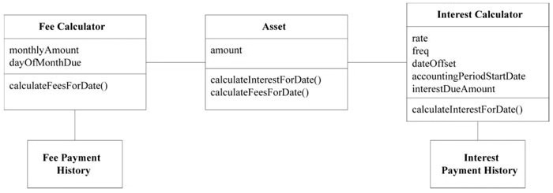
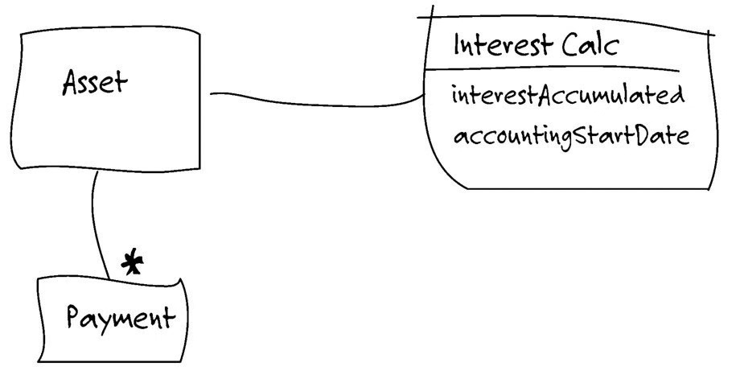
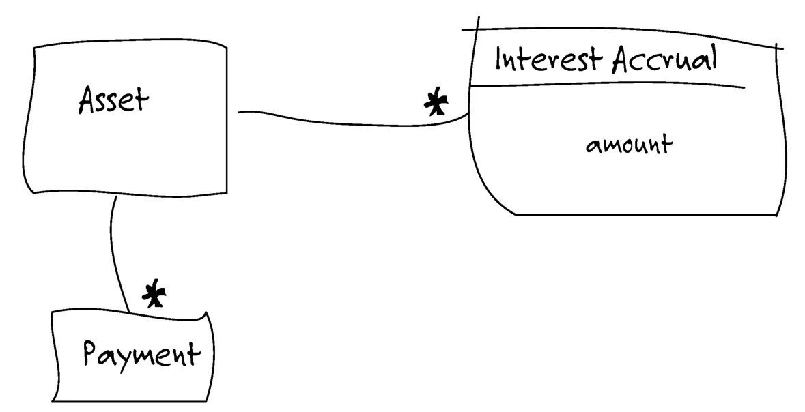
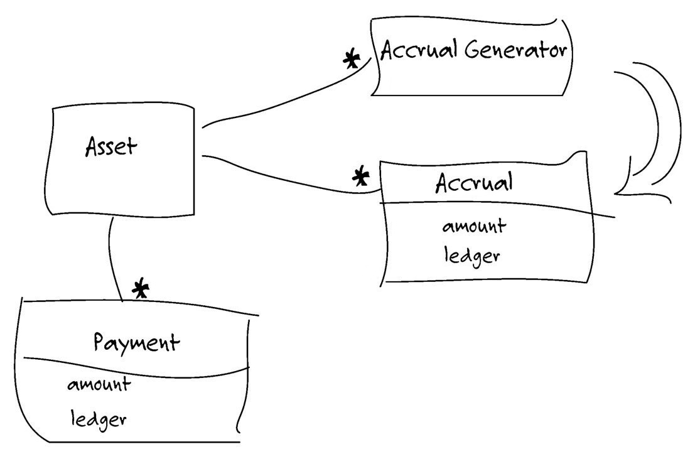
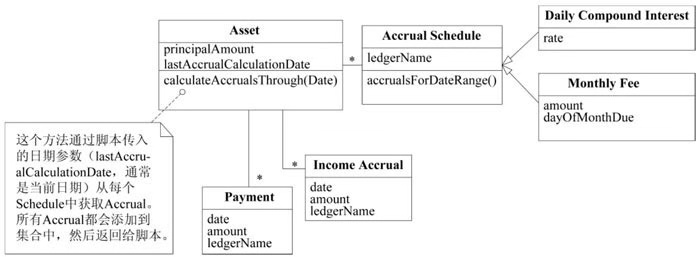

# 目录

[TOC]

> 真正挑战、目的是找到深层次的模型，它不但能捕捉到领域专家的微妙关注点，还可驱动切实可行的设计。
> 深层领域之所以强大是因为它包含了领域的核心概念和抽象，可以简单灵活的方式表达出基本的用户活动、问题以及解决方案。
> 第一步是设法在模型中表达出领域的基本概念，随后在不断消化知识

实用模型的开发，有三点注意：
1. 复杂巧妙的领域模型是可以实现的，也是值得我们去花费力气去实现的；
2. 这样的模型离不开不断的重构，重构需要领域专家和热爱学习领域知识的开发人员密切参与进来；
3. 要实现并有效地运用模型，需要精通设计技巧；

目前，几乎所有关于重构的文献都专注于如何机械修改代码，以使其更具有可读性或在非常细节的层次上有所改进。利用成熟的设计模式进行开发，那么通过重构得到模式 这种方式就能让重构过程更上一层楼。但依然是技术视角来评估设计的质量。

**两种重构，要么源于对领域的新认知，要么能够通过代码清晰表达模型含义。**这些重构不能取代设计模式重构和代码细节重构，这两种重构应该持续进行。前者有另一种重构层次：为实现更深层模型而进行的重构。我们要在深入理解领域的基础上进行重构，通常需要实现一系列的代码细节重构，这么做绝不仅仅是为了改进代码状态，代码细节重构是一组操作方便的修改单元，通过这些重构可以得到更深层的模型。可以让我们不仅能够了解代码实现的功能，还能明白个中原因，并与领域专家交流。

**深层模型**能够穿过领域表象，清楚地表达出领域专家们的主要关注点以及最相关的知识。恰当反映领域的模型通常都具有功能多样、简单易用和解释力强的特性。这种模型的共同之处在于：提供了一种业务专家青睐的简单语言，尽管这种语言也可能是抽象的。
每次对模型和代码所进行的修改都能反映出对领域的新理解，那通过不断的重构就能给系统最需要修改的地方增添灵活性，并找到简单快捷的方式来实现普通的功能。**柔性设计**除了便于修改，还有助于改进模型本身。

发现过程：
1. 要想创建出确实能够解决当前问题的设计，首先必须拥有可捕捉到领域核心概念的模型。我们要**主动搜寻（接下来分析）**这些概念并融入设计中；
2. 代码重构难易也会影响建模的过程，要知道**如何编写软件（接下来分析）**，让我们能高效地扩展和修改代码。这设计过程和模型的进一步精化是密不可分的；

## 1 突破
重构的投入与回报并非呈线性关系。通常小的调整会带来小的回报，小的改进也会积少成多。小改进可防止系统退化，是避免模型变得陈腐的第一道防线。但有些重要的理解也会突然出现，给整个项目带来巨大的冲击。
项目团队会积累、消化知识，并将其转化呈模型，一系列微小的重构会主键汇聚成深层模型。

好处：
1. 持续重构让事务逐步变得有序；
2. 代码和模型的每一次精华都让开发人员有了更加清晰的认知；
3. 一系列快速的改变得到更符合用户的需要和更加切合实际的模型；
4. 功能性及说明性极速增强，复杂性随之消失；

为突破做好准备，应专注于只是消化过程，同时也要逐渐建立健壮的UBIQUITOUS LANGUAGE。寻找重要的领域概念，在模型中清晰的表达（**显式概念**）。**精化模型**，使其更具**柔性**。**提炼模型**。

## 2 隐式概念转变为显式概念
> 我们识别出设计中隐含的某个概念或是在讨论中收到启发而发现一个概念，就会对领域模型和相应代码进行许多转换，在模型中加入一个或多个对象关系，从而将此概念显示地表达出来。
> 从隐式概念到显式概念的转换可能是一次突破，使我们得到一个深层模型。但更多的时候，突破不会马上到来，需要我们在模型中显式表达出许多重要概念，并通过一系列重构不断调整对象职责、改变它们与其他对象的关系、甚至多次修改对象名称，之后突破才有可能到来。

#### 2.1 概念挖掘
主动寻找线索。挖掘大部分的隐含概念，需要我们倾听团队语言、仔细检查设计中的不足之处以及与专家观点相矛盾的地方、研究领域相关文献并进行大量的实验。

倾听领域专家使用的语言。有没有一些术语可以简洁地表达出复杂的概念？有没有被纠正过用词？是否不再迷惑你说的词语？这些都说明了某个概念可以改进模型。

###### 2.1.1 倾听
这个与“名词即对象”概念使不同的。听到新单词只是个开头，我们还需要进行对话、消化知识，这样才能挖掘出清晰实用的概念。如果用户或领域专家使用了设计中没有的词汇，这就是个告警信号。如果双方都在使用设计中没有的词汇，那这是加倍告警了。我们应该把它看成一个机会。可以丰富进我们的UBIQUITOUS LANGUAGE。

例子：
背景情况：运输系统已经有可用来预订货物的应用程序，现需要开发“作业支持”应用程序，用来管理工作单，这些工作单用于**安排起始地和目的地的货物装卸以及在不同货轮之间转运时需要的货物装卸**。目前货物（Cargo）预订应用程序使用路线引擎（Routing Service）安排货物行程。运输过程的每段行程在路线引擎中都作为一行数据存储在数据库表中（cargo_bookings, 货物Id，航班ID，装货、卸货地点）

寻找模型：我们在与专家交流的时候注意到：专家需要Cargo的全部航海日程（Itinerary）中的信息，还需要日期。而且预订应用程序已经有一个功能：可以打印航海日程。

动工：据此，我们可以知道 航海日程实际把预订程序和作业程序连接起来了。那我们可以改进路线引擎（Routing Service），返回一个Itinerary，预订应用程序可以做保存操作。原先的cargo_bookings分解成两个表：Itinerary（包含起点和终点，到达时间）、Leg（包含装卸地点、时间）

从上面可以知道：
1. 我们更明确的定义Routing Service；
2. Routing Service与预订单数据库表解耦，不用关心存储逻辑；
3. 明确了预订应用系统和作业支持应用程序之间的关系；
4. 减少重复，可以同时为预订报表和作业支持应用程序提供装卸货时间；
5. 从预订报表中删除领域逻辑，并将其移至独立的领域层；
6. 扩充了UBIQUITOUS LANGUAGE；

###### 2.1.2 不足之处
概念不是总是浮在表面，也不是通过对话和文档就能让他显现。可能需要自己去挖掘和创造，挖掘的地方就是设计中最不足的地方，也就是操作复杂且难于解释的地方。每当有新的需求时，似乎都会让这个地方变得更加复杂。
有时很难意识到模型中丢失了什么概念，也许对象能够实现所有功能，但是有些职责的实现却很笨拙。有时能够意识到丢失了某些东西，但却找不到解决方案。这时我们要积极让领域专家参与到讨论中来，如果足够幸运，这些专家可能会愿意一起思考各种想法，并用模型来进行验证。如果没有那么幸运，我们不得不思索出不同的想法，让领域专家对这些想法进行判断，并注意观察专家的表情是认同还是反对。

例子：
**摸索利息计算模型**

背景情况：晚间批处理脚本会遍历每笔Asset（资产），让其执行calculateInterestForDate()，按照当天的日期计算利息。然后该脚本会接收返回值（收益金额），并将它和指定分类账的名称一起发送给SERVICE（提供记账程序的公共接口）。再由记账软件将收入金额过账到指定的分类账中。这个脚本会对每笔Asset当日的手续费做类似的处理，并记录到另一个不同的分类账中。

寻找模型：
专家：利息收入和付款是完全独立的过账。
我们可以拆出Payment做付款。Interest Calculator只负责追踪利息收入。

专家：那就同时保留利息的历史记录，就像Payment Histoty的结构。每天都会把应计利息过账到收支总账中，而支付的过账方法则完全不同。应计利息不需要在Interest Calculator中累加。
我们保留“应计利息”列表，这些利息可以根据需要来进行计算总计。

专家：在应计日期过账，但可以在任意时间内累加。费用的处理也一样，只不过是另一个分类账中。
我们只计算一天或者一段时间的利息。

专家：资产之所以有价值，是可以通过它积累利息、费用。手续费和利息是一样的。只是过账到不同的分类账中。
合并利息、费用，而且可以添加不同类型的费用了。

最后：
Calculete类没有直接与设计中的其他部分关联

新模型的优点：
1. 术语“应计费用”使UBIQUITOUS LANGUAGE更加丰富；
2. 将应计费用从付款中分离出来；
3. 将领域知识（过账到哪个分类账）从脚本移出来，并放到领域层中；
4. 费用与利息统一，既符合业务逻辑，又可消除重复代码；
5. 新形式的费用和利息可以通过Acrrual Schedule直接添加到模型中；

###### 2.1.3 思考矛盾之处
不同的领域专家对同样的事情有不同的看法。即便是同一个人，仔细分析后也会发现逻辑不一致的地方。这些矛盾也为深层模型的实现提供了重要线索。有些矛盾只是术语的不一致，有些是误解，但有些是专家们会给出相互矛盾的两种说法。我们可以将矛盾统一起来，助我们透过问题表面获得更深层的理解。
当然不是所有矛盾都是需要解决的，但我们也要仔细思考对立的两种看法是如何同时应用于同一个外部实现的，这会给我们带来启示。

###### 2.1.4 查阅书籍
寻找模型概念，很多领域，都可以找到解释本概念和传统思想的书籍。查阅书籍也许能够使我们一开始就形成一致且深层的认知。

#### 2.2 如何为那些不太明显的概念建模
面向对象范式对引导我们寻找和创建特定类型的概念。**所有事物及其操作行为是大部分对象模型的主要部分**。他们就是对象设计入门所讲到的“名词和动词”。**但是，其他重要类别的概念也可以在模型中显式地表现出来**
下面三节，每节可以让设计变得更加清晰深刻

###### 2.2.1 显式的约束
约束是模型概念中非常重要的类别，通常是隐含的，显式的表达出来可以提高设计质量。
比如桶——有一个**固定规则**——容量的限制，每次变更桶中的内容都会受到容量的约束，这种约束提取到单独的方法中，**用清晰直观的名词**来表达它的意义。

很多时候，约束条件无法用单独的方法来轻松表达。即便方法自身能够保持简单性，但它可能会调用一些信息，但对于对象的主要职责而言，这些信息是毫无用处。这种规则可能就不适合放到现有对象中。
约束扰乱“宿主对象”的设计：
1. 计算约束所需的数据从定义上看并不属于这个对象；
2. 相关规则在多个对象出现，造成代码重复或导致不属于同一族的对象之间产生了继承关系；
3. 很多设计和需求讨论是围绕这些约束进行的，但在代码中，他们却应藏在过程代码中；

如果约束的存在掩盖了对象的基本职责，或者如果约束在领域中非常突出但在模型中却不明显，那么就可以**将其提取到一个显式的对象中，甚至可以把它建模为一个对象和关系的集合**

###### 2.2.2 将过程建模为领域对象
我们都不希望过程变成模型的主要部分。对象是用来封装过程的，这样我们只需考虑对象的业务目的或意图就可以了。

约束和过程是两大类模型概念，意识到这点，可以让我们设计更为清晰。

如果过程的执行有多种方式，可以讲算法本身或关键部分放到一个单独的对象中——策略模式

###### 2.2.3 模式：SPECIFICATION
规格（SPECIFICATION）是更特殊但也非常常用的概念。提供了用于表达特性类型的规则的精确方式，它把这些规则从条件逻辑中提取出来，并在模型中把他们显式的表示出来。

规则会越来越复杂，可能的发展路线：
1. Invoice有一条规则判断是否过时，但随着发展，根据客户账户状态不同，可能有宽限期政策。一些拖欠票据准备再次发出催款通知，有些准备发给收账公司。考虑客户付款历史记录、公司在不同产品线的政策。这么下去，会淹没在大量杂乱的规则计算中；
2. 我们可能会将规则计算代码重构到应用层中。规则从领域层中分离，留下纯粹的数据对象。这些规则需要留在领域层中，但是把他们放到了被其约束的对象又不合适，此外计算规则方法中到处都是条件代码；
3. 使用逻辑编程范式会用一种不同的方式来处理。这种规则成为谓词。谓词是指计算结果是“真”或“假”的函数，可以用与或非连接，用以表达更复杂的规则；
4. 人们开始尝试以对象的形式来实现逻辑规则，但是要明白一件事情：完全用对象实现逻辑是个大工程，逻辑编程本身就是一套建模的设计范式。

实际上，业务规则不适合作为ENTITY和VALUE OBJECT的职责，规则的变化和组合也会掩盖领域对象的基本含义，但规则移出领域层结果会更糟，这样一来，领域代码就不再表达模型了。
逻辑编程提供了一种概念，即谓词这种可分离、组合的规则对象，但是把这种概念用对象完全实现是很麻烦的。这种概念过于通用，在表达设计意图方面，针对性不如专门设计的那么好。

我们也不需要完全实现逻辑编程即可从中受益。

SPECIFICATION中声明的是限制另一个对象状态的约束，被约束对象可以存在，也可以不存在。SPECIFICATION有多种用途，其中一种体现了基本概念：SPECIFICATION可以测试任何对象以检验他们是否满足指定的标准。

因此：为特殊目的创建谓词形式的显式VALUE OBJECT。SPECIFICATION是一个谓词，可用来确定对象是否满足某些标准

对简单规格进行组合，像用逻辑运算符把多个谓词组合起来，可以组成复杂的规则。SPECIFICATION将规则留在领域层。他是个完备的对象，能够更加清晰地反映模型。用工厂（避免与这些资源直接关联，发生不正确的关联），可以用来自其他资源或系统的信息对规格配置。

**结论**
SPECIFICATION基本概念非常简单，这能帮助我们思考领域建模问题。

###### 2.2.4 SPECIFICATION的应用和实现
最有价值的地方是可以将看起来完全不同的应用功能统一起来。出于下面3个目的中的一个或者多个，我们需要指定对象的状态。
1. **验证**对象，检查它是否能满足某些需求或者是否已经为实现某个目标做好了准备；
2. 从集合中**选择**一个对象；
3. 指定在**创建**新对象时必须满足某种需求；
这仨用法在概念上来讲是相同的，我们在概念上统一，实现上分开处理。

**验证**
最简单，最直观的展示它的概念。直接写一个方法给一个独立对象进行测试。

**选择**
SPECIFICATION与REPOSITORY的搭配

**创建**
创建或重新配置满足SPECIFICATION的全新对象或对象集合
两种方式：可以FACTORY 或者使用描述性的SPECIFICATION来定义生成器的接口，这个接口显示地约束了生成器产生的结果。
后一个的优点：
1. 生成器的实现和接口分离。SPECIFICATION声明输出的需求，但没有定义如何得到输出结果；
2. 接口把规则显示地表示，开发人员无需理解所有操作细节即可知道结果。如果生成器是过程化的，就要研究每行代码了；
3. 接口更灵活，需求由客户给出，生成器唯一职责就是实现SPECIFICATION的要求；
4. 这种接口便于测试，接口显示地定义了生成器的输入，而这同时也可以用来验证输出。也就是说，传入生成器接口的用于约束创建过程的同一个SPECIFICATION也可发挥验证的作用；

## 柔性设计
> 