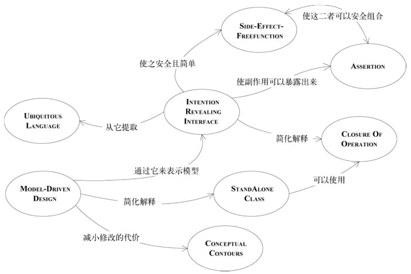

# 目录

[TOC]

> 真正挑战、目的是找到深层次的模型，它不但能捕捉到领域专家的微妙关注点，还可驱动切实可行的设计。
> 深层领域之所以强大是因为它包含了领域的核心概念和抽象，可以简单灵活的方式表达出基本的用户活动、问题以及解决方案。
> 第一步是设法在模型中表达出领域的基本概念，随后在不断消化知识

实用模型的开发，有三点注意：
1. 复杂巧妙的领域模型是可以实现的，也是值得我们去花费力气去实现的；
2. 这样的模型离不开不断的重构，重构需要领域专家和热爱学习领域知识的开发人员密切参与进来；
3. 要实现并有效地运用模型，需要精通设计技巧；

目前，几乎所有关于重构的文献都专注于如何机械修改代码，以使其更具有可读性或在非常细节的层次上有所改进。利用成熟的设计模式进行开发，那么通过重构得到模式 这种方式就能让重构过程更上一层楼。但依然是技术视角来评估设计的质量。

**两种重构，要么源于对领域的新认知，要么能够通过代码清晰表达模型含义。**这些重构不能取代设计模式重构和代码细节重构，这两种重构应该持续进行。前者有另一种重构层次：为实现更深层模型而进行的重构。我们要在深入理解领域的基础上进行重构，通常需要实现一系列的代码细节重构，这么做绝不仅仅是为了改进代码状态，代码细节重构是一组操作方便的修改单元，通过这些重构可以得到更深层的模型。可以让我们不仅能够了解代码实现的功能，还能明白个中原因，并与领域专家交流。

**深层模型**能够穿过领域表象，清楚地表达出领域专家们的主要关注点以及最相关的知识。恰当反映领域的模型通常都具有功能多样、简单易用和解释力强的特性。这种模型的共同之处在于：提供了一种业务专家青睐的简单语言，尽管这种语言也可能是抽象的。
每次对模型和代码所进行的修改都能反映出对领域的新理解，那通过不断的重构就能给系统最需要修改的地方增添灵活性，并找到简单快捷的方式来实现普通的功能。**柔性设计**除了便于修改，还有助于改进模型本身。

发现过程：
1. 要想创建出确实能够解决当前问题的设计，首先必须拥有可捕捉到领域核心概念的模型。我们要**主动搜寻（接下来分析）**这些概念并融入设计中；
2. 代码重构难易也会影响建模的过程，要知道**如何编写软件（接下来分析）**，让我们能高效地扩展和修改代码。这设计过程和模型的进一步精化是密不可分的；

## 1 突破
重构的投入与回报并非呈线性关系。通常小的调整会带来小的回报，小的改进也会积少成多。小改进可防止系统退化，是避免模型变得陈腐的第一道防线。但有些重要的理解也会突然出现，给整个项目带来巨大的冲击。
项目团队会积累、消化知识，并将其转化呈模型，一系列微小的重构会主键汇聚成深层模型。

好处：
1. 持续重构让事务逐步变得有序；
2. 代码和模型的每一次精华都让开发人员有了更加清晰的认知；
3. 一系列快速的改变得到更符合用户的需要和更加切合实际的模型；
4. 功能性及说明性极速增强，复杂性随之消失；

为突破做好准备，应专注于只是消化过程，同时也要逐渐建立健壮的UBIQUITOUS LANGUAGE。寻找重要的领域概念，在模型中清晰的表达（**显式概念**）。**精化模型**，使其更具**柔性**。**提炼模型**。

## 2 隐式概念转变为显式概念
> 我们识别出设计中隐含的某个概念或是在讨论中收到启发而发现一个概念，就会对领域模型和相应代码进行许多转换，在模型中加入一个或多个对象关系，从而将此概念显示地表达出来。
> 从隐式概念到显式概念的转换可能是一次突破，使我们得到一个深层模型。但更多的时候，突破不会马上到来，需要我们在模型中显式表达出许多重要概念，并通过一系列重构不断调整对象职责、改变它们与其他对象的关系、甚至多次修改对象名称，之后突破才有可能到来。

#### 2.1 概念挖掘
主动寻找线索。挖掘大部分的隐含概念，需要我们倾听团队语言、仔细检查设计中的不足之处以及与专家观点相矛盾的地方、研究领域相关文献并进行大量的实验。

倾听领域专家使用的语言。有没有一些术语可以简洁地表达出复杂的概念？有没有被纠正过用词？是否不再迷惑你说的词语？这些都说明了某个概念可以改进模型。

###### 2.1.1 倾听
这个与“名词即对象”概念是不同的。听到新单词只是个开头，我们还需要进行对话、消化知识，这样才能挖掘出清晰实用的概念。如果用户或领域专家使用了设计中没有的词汇，这就是个告警信号。如果双方都在使用设计中没有的词汇，那这是加倍告警了。我们应该把它看成一个机会。可以丰富进我们的UBIQUITOUS LANGUAGE。

例子：
背景情况：运输系统已经有可用来预订货物的应用程序，现需要开发 **“作业支持”应用程序**，用来管理工作单，这些工作单用于**安排起始地和目的地的货物装卸以及在不同货轮之间转运时需要的货物装卸**。目前货物（Cargo）预订应用程序使用路线引擎（Routing Service）安排货物行程。运输过程的每段行程在路线引擎中都作为一行数据存储在数据库表中（cargo_bookings, 货物Id，航班ID，装货、卸货地点）

寻找模型：我们在与专家交流的时候注意到：专家需要Cargo的全部航海日程（Itinerary）中的信息，还需要日期。而且**预订应用程序**已经有一个功能：可以打印航海日程。

动工：据此，我们可以知道 航海日程实际把预订程序和作业程序连接起来了。那我们可以改进路线引擎（Routing Service），返回一个Itinerary，预订应用程序可以做保存操作。原先的cargo_bookings分解成两个表：Itinerary（包含起点和终点，到达时间）、Leg（包含装卸地点、时间）

从上面可以知道：
1. 我们更明确的定义Routing Service；
2. Routing Service与预订单数据库表解耦，不用关心存储逻辑；
3. 明确了预订应用系统和作业支持应用程序之间的关系；
4. 减少重复，可以同时为预订报表和作业支持应用程序提供装卸货时间；
5. 从预订报表中删除领域逻辑，并将其移至独立的领域层；
6. 扩充了UBIQUITOUS LANGUAGE；

###### 2.1.2 不足之处
概念不是总是浮在表面，也不是通过对话和文档就能让他显现。可能需要自己去挖掘和创造，挖掘的地方就是设计中最不足的地方，也就是操作复杂且难于解释的地方。每当有新的需求时，似乎都会让这个地方变得更加复杂。
有时很难意识到模型中丢失了什么概念，也许对象能够实现所有功能，但是有些职责的实现却很笨拙。有时能够意识到丢失了某些东西，但却找不到解决方案。这时我们要积极让领域专家参与到讨论中来，如果足够幸运，这些专家可能会愿意一起思考各种想法，并用模型来进行验证。如果没有那么幸运，我们不得不思索出不同的想法，让领域专家对这些想法进行判断，并注意观察专家的表情是认同还是反对。

例子：
**摸索利息计算模型**

背景情况：晚间批处理脚本会遍历每笔Asset（资产），让其执行calculateInterestForDate()，按照当天的日期计算利息。然后该脚本会接收返回值（收益金额），并将它和指定分类账的名称一起发送给SERVICE（提供记账程序的公共接口）。再由记账软件将收入金额过账到指定的分类账中。这个脚本会对每笔Asset当日的手续费做类似的处理，并记录到另一个不同的分类账中。

寻找模型：
专家：利息收入和付款是完全独立的过账。
我们可以拆出Payment做付款。Interest Calculator只负责追踪利息收入。


专家：那就同时保留利息的历史记录，就像Payment Histoty的结构。每天都会把应计利息过账到收支总账中，而支付的过账方法则完全不同。应计利息不需要在Interest Calculator中累加。
我们保留“应计利息”列表，这些利息可以根据需要来进行计算总计。

专家：在应计日期过账，但可以在任意时间内累加。费用的处理也一样，只不过是另一个分类账中。
我们只计算一天或者一段时间的利息。


专家：资产之所以有价值，是可以通过它积累利息、费用。手续费和利息是一样的。只是过账到不同的分类账中。
合并利息、费用，而且可以添加不同类型的费用了。


最后：
Calculete类没有直接与设计中的其他部分关联


新模型的优点：
1. 术语“应计费用”使UBIQUITOUS LANGUAGE更加丰富；
2. 将应计费用从付款中分离出来；
3. 将领域知识（过账到哪个分类账）从脚本移出来，并放到领域层中；
4. 费用与利息统一，既符合业务逻辑，又可消除重复代码；
5. 新形式的费用和利息可以通过Acrrual Schedule直接添加到模型中；

###### 2.1.3 思考矛盾之处
不同的领域专家对同样的事情有不同的看法。即便是同一个人，仔细分析后也会发现逻辑不一致的地方。这些矛盾也为深层模型的实现提供了重要线索。有些矛盾只是术语的不一致，有些是误解，但有些是专家们会给出相互矛盾的两种说法。我们可以将矛盾统一起来，助我们透过问题表面获得更深层的理解。
当然不是所有矛盾都是需要解决的，但我们也要仔细思考对立的两种看法是如何同时应用于同一个外部实现的，这会给我们带来启示。

###### 2.1.4 查阅书籍
**寻找模型概念，很多领域，都可以找到解释本概念和传统思想的书籍。查阅书籍也许能够使我们一开始就形成一致且深层的认知。**

#### 2.2 如何为那些不太明显的概念建模
面向对象范式对引导我们寻找和创建特定类型的概念。**所有事物及其操作行为是大部分对象模型的主要部分**。他们就是对象设计入门所讲到的“名词和动词”。**但是，其他重要类别的概念也可以在模型中显式地表现出来**
下面三节，每节可以让设计变得更加清晰深刻

###### 2.2.1 显式的约束
约束是模型概念中非常重要的类别，通常是隐含的，显式的表达出来可以提高设计质量。
比如桶——有一个**固定规则**——容量的限制，每次变更桶中的内容都会受到容量的约束，这种约束提取到单独的方法中，**用清晰直观的名词**来表达它的意义。

很多时候，约束条件无法用单独的方法来轻松表达。即便方法自身能够保持简单性，但它可能会调用一些信息，但对于对象的主要职责而言，这些信息是毫无用处。这种规则可能就不适合放到现有对象中。
约束扰乱“宿主对象”的设计：
1. 计算约束所需的数据从定义上看并不属于这个对象；
2. 相关规则在多个对象出现，造成代码重复或导致不属于同一族的对象之间产生了继承关系；
3. 很多设计和需求讨论是围绕这些约束进行的，但在代码中，他们却应藏在过程代码中；

如果约束的存在掩盖了对象的基本职责，或者如果约束在领域中非常突出但在模型中却不明显，那么就可以**将其提取到一个显式的对象中，甚至可以把它建模为一个对象和关系的集合**

###### 2.2.2 将过程建模为领域对象
我们都不希望过程变成模型的主要部分。对象是用来封装过程的，这样我们只需考虑对象的业务目的或意图就可以了。

约束和过程是两大类模型概念，意识到这点，可以让我们设计更为清晰。

如果过程的执行有多种方式，可以讲算法本身或关键部分放到一个单独的对象中——策略模式

###### 2.2.3 模式：SPECIFICATION
规格（SPECIFICATION）是更特殊但也非常常用的概念。提供了用于表达特性类型的规则的精确方式，它把这些规则从条件逻辑中提取出来，并在模型中把他们显式的表示出来。

规则会越来越复杂，可能的发展路线：
1. Invoice有一条规则判断是否过时，但随着发展，根据客户账户状态不同，可能有宽限期政策。一些拖欠票据准备再次发出催款通知，有些准备发给收账公司。考虑客户付款历史记录、公司在不同产品线的政策。这么下去，会淹没在大量杂乱的规则计算中；
2. 我们可能会将规则计算代码重构到应用层中。规则从领域层中分离，留下纯粹的数据对象。这些规则需要留在领域层中，但是把他们放到了被其约束的对象又不合适，此外计算规则方法中到处都是条件代码；
3. 使用逻辑编程范式会用一种不同的方式来处理。这种规则成为谓词。谓词是指计算结果是“真”或“假”的函数，可以用与或非连接，用以表达更复杂的规则；
4. 人们开始尝试以对象的形式来实现逻辑规则，但是要明白一件事情：完全用对象实现逻辑是个大工程，逻辑编程本身就是一套建模的设计范式。

实际上，业务规则不适合作为ENTITY和VALUE OBJECT的职责，规则的变化和组合也会掩盖领域对象的基本含义，但规则移出领域层结果会更糟，这样一来，领域代码就不再表达模型了。
逻辑编程提供了一种概念，即谓词这种可分离、组合的规则对象，但是把这种概念用对象完全实现是很麻烦的。这种概念过于通用，在表达设计意图方面，针对性不如专门设计的那么好。

我们也不需要完全实现逻辑编程即可从中受益。

SPECIFICATION中声明的是限制另一个对象状态的约束，被约束对象可以存在，也可以不存在。SPECIFICATION有多种用途，其中一种体现了基本概念：SPECIFICATION可以测试任何对象以检验他们是否满足指定的标准。

因此：为特殊目的创建谓词形式的显式VALUE OBJECT。SPECIFICATION是一个谓词，可用来确定对象是否满足某些标准

对简单规格进行组合，像用逻辑运算符把多个谓词组合起来，可以组成复杂的规则。SPECIFICATION将规则留在领域层。他是个完备的对象，能够更加清晰地反映模型。用工厂（避免与这些资源直接关联，发生不正确的关联），可以用来自其他资源或系统的信息对规格配置。

**结论**
SPECIFICATION基本概念非常简单，这能帮助我们思考领域建模问题。

###### 2.2.4 SPECIFICATION的应用和实现
最有价值的地方是可以将看起来完全不同的应用功能统一起来。出于下面3个目的中的一个或者多个，我们需要指定对象的状态。
1. **验证**对象，检查它是否能满足某些需求或者是否已经为实现某个目标做好了准备；
2. 从集合中**选择**一个对象；
3. 指定在**创建**新对象时必须满足某种需求；
这仨用法在概念上来讲是相同的，我们在概念上统一，实现上分开处理。

**验证**
最简单，最直观的展示它的概念。直接写一个方法给一个独立对象进行测试。

**选择**
SPECIFICATION与REPOSITORY的搭配

**创建**
创建或重新配置满足SPECIFICATION的全新对象或对象集合
两种方式：可以FACTORY 或者使用描述性的SPECIFICATION来定义生成器的接口，这个接口显示地约束了生成器产生的结果。
后一个的优点：
1. 生成器的实现和接口分离。SPECIFICATION声明输出的需求，但没有定义如何得到输出结果；
2. 接口把规则显示地表示，开发人员无需理解所有操作细节即可知道结果。如果生成器是过程化的，就要研究每行代码了；
3. 接口更灵活，需求由客户给出，生成器唯一职责就是实现SPECIFICATION的要求；
4. 这种接口便于测试，接口显示地定义了生成器的输入，而这同时也可以用来验证输出。也就是说，传入生成器接口的用于约束创建过程的同一个SPECIFICATION也可发挥验证的作用；

## 3 柔性设计
> 柔性设计是深层建模的补充。当我们挖掘出隐式概念，并把他们显式的表达出来后，就有了原料。可以把这些原料打造成有用的形式：**建立的模型能够简单而星系的捕获主要关注点**。
> 能够揭示深层次的底层模型，并把它潜在的部分明确地展现出来。
> 反复重构最终会实现柔性设计。
> 本章介绍的通用设计风格和思考设计的方式。把软件设计的意图明显、容易预测且富有表达力，可以有效发挥抽象和封装的作用。
> 柔性设计使得客户代码可以使用声明式的设计风格。

过多的抽象层和间接设计是项目的绊脚石，很多过度设计都借着灵活性的名义而得到合理的外衣。把创建的元素装配到复杂系统中，而且装配后仍然能够理解它们，需要坚持模型驱动的设计方法。
当复杂性阻碍了项目的前进，就需要仔细修改最关键、最复杂的地方，使之变成一个柔性设计，这样才能突破复杂性带给我们的限制，而不会陷入遗留代码维护的麻烦中。

我们在开发中扮演者两个角色：
客户开发人员，负责将领域对象组织成应用程序代码或其他领域层代码。灵活使用最小化、松散耦合的概念集合，并用这些概念表示领域中的众多场景；
修改代码的开发人员，为了便于修改，设计必须易于理解，必须把客户开发人员正在使用的同一个底层模型表示出来。

目标：
可以组合在一起来表达意义的元素，使作用具体化或明朗化，甚或是完全没有明显副作用。

一些有助于获得柔性设计的模式：


#### 3.1 模式：INTEION-REVEALING INTERFACES
为了使用一个组件必须研究实现，那么失去了封装的价值。某个人开发的对象或操作被别人使用时，如果使用这个组件的新的开发者不得不根据其实现来推测用途，那么他推测出来的可能不是哪个操作或类的主要用途，这时设计的概念基础就被误用了。

解决：为程序元素赋予一个能够反映概念的名字。类型名称、方法名称、参数名称组合在一起，共同形成INTENTION-REVEALING INTERFACE

**结论**
在命名类和操作时要描述它们的效果和目的，不要表露它们是通过何种方式达到目的的。这样客户开发人员可以不必理会内部细节。这些名称应该与UBIQUITOUS LANGUAGE保持一致，以便团队成员可以迅速推断出它们的意义。
所有复杂的机制都应该封装到抽象接口的后面，只表明意图，不表明方式。

#### 3.2 模式：SIDE-EFFECT-FREE FUNCTION
操作分为两大类别：命令、查询。
命令是修改系统的操作；查询是从系统获取信息，查询的方式只是简单地访问变量中的数据，也可能是用这些数据执行计算。

**SIDE-EFFECT，“副作用”**，对系统状态产生影响的都叫副作用。有可能是很难预测调用一个操作将要产生的所有后果，在复杂设计中，元素之间的交互同样会产生无法预料的结果。副作用强调了这种交互的不可避免性。

多规则的相互作用或计算的组合所产生的结果是很难预测的。我们在调用一个操作时，为了预测操作的结果，必须理解它的实现以及它所调用的其他方法的实现。如果我们不得不这么干，那接口的抽象作用就受到了限制。如果没有了可以安全预见结果的抽象，我们就要限制“组合爆炸”，这就限制了系统行为的丰富性。

返回结果不产生副作用的操作成为**函数**。函数可以被多次调用，每次调用都返回相同的值。一个函数可以调用其他函数。函数比有副作用的操作更易于测试，使用函数可以降低风险。

减少命令产生的问题：
1. 把命令和查询严格放在不同的操作中。确保导致状态改变的方法不返回领域数据，尽可能保持简单。在不引起任何可观测到的副作用的方法中执行所有查询和计算；
2. 会有一些代替的模型和设计，不要求对现有对象做修改。相反，它们创建并返回一个VALUE OBJECT，表示计算结果；（VALUE OBJECT是不可变的，除了在创建期间调用的初始化程序之外，所有操作都是函数。）

**结论**
尽可能把程序的逻辑放到函数中，函数只是返回结果而不产生明显副作用的操作。严格将命令（引起明显的状态改变的方法）隔离到不返回领域信息的，非常简单的操作中，当发现了非常适合承担复杂逻辑职责的概念时，就可以把这个复杂逻辑移到VALUE OBJECT中，可以进一步控制副作用。

例子：TODO

#### 3.3 模式：ASSERTION
把复杂的计算封装到SIDE-EFFECT-FREE FUNCTION中可以简化问题，但实体仍然会留有副作用的命令，使用这些ENTITY的人必须了解这些命令的后果，我们使用ASSERTION可以把副作用明确地表示出来。

如果操作的副作用仅仅是由他们的实现隐式定义的，那么在一个具有大量相互调用关系的系统中，起因和结果会变得一团糟。理解程序的唯一方式是沿着分支路径来跟踪程序执行。封装完全失去了价值。跟踪具体的执行也使抽象失去了意义。

阐明一个元素意义和执行操作的后果：
1. 通过INTENTION-REVEALING INTERFACE可以起到一部分作用，但这样的接口只能非正式给出操作用途，这常常是不够的；
2. 可以通过“契约式设计”，向前再推进一步，通过给出类和方法的“断言”使我们知道肯定会发生的结果。**“后置条件”**描述了一个操作的副作用，也是调用方法之后必然会发生的结果；
3. “前置条件”则像是合同条款，即为了满足后置条件必须要满足的前置条件；
4. 类的固定规则规定了在操作结束时对象的状态。也可以把AGGREGATE作为整体来为它声明固定规则，这些都是严格定义的完整性规则；

**结论**
把操作的后置条件和类及AGGREGATE的固定规则表述清楚。如果在编程语言中不能直接编写ASSERTION，那么把他们编写成自动的单元测试。还能写到文档或者图中。寻找概念上内聚的模型，以便开发人员更容易推断出预期的ASSERTION，从而加快学习过程并避免代码矛盾。

到现在，INTENTION-REVEALING INTERFACE清楚地表明用途，SIDE-EFFECT-FREE FUNCTION和ASSERTION使我们能更准确地预测结果，我们封装和抽象更加安全。

#### 3.4 模式：CONCEPTUAL CONTOUR
> 代码不断适应新理解的概念或需求，CONCEPTUAL CONTOUR也就逐渐形成了

模型或设计的所有元素放在一个整体的大结构中，那么他们的功能会发生重复。外部接口无法给出客户可能关心的全部信息。**不同的概念被混合在一起，它们的意义变得很难理解**。另一个角度来看，**把类和方法分解开也可能是毫无意义的**，会使客户更复杂，迫使客户对象失去理解各个细微部分是如何组合在一起的。有的概念可能完全丢失。铀原子的一半不是铀，**而且粒度大小并不是唯一要考虑的问题，还要考虑粒度是在那种场合下使用的**。

领域都隐含着逻辑一致性，否则也不会形成领域。领域有较为复杂的原理，这种隐藏在底层的一致性，当找到一个模型与领域的某个部分特别吻合时，这个模型可能也会与我们后续发现的这个领域的其他部分一致。当新发现与模型不符时，我们需要对模型进行重构，以便获取更深层的理解，并希望下一次新发现能与模型一致。

从单个方法的设计，到类和MODULE的设计，再到大型结构设计，**高内聚低耦合这基本原则都起着重要作用。它适合代码，也适合概念。** 我们在做每个决定都要明确：这是根据当前模型和代码中的特定关系做出的权宜之计，还是反映底层领域的某种轮廓。

寻找概念上有意义的功能单元，可以使设计既灵活易懂。如果两个对象是一个连贯的整体操作，那么就作为整体来实现。每个对象都应该是一个独立、完整的概念，是一个“WHOLE VALUE”（整体值）。

**结论**
把设计元素（操作、接口、类和AAGREGATE）分解为内聚的单元，在这个过程中，你对领域中一切重要划分的直观认识也要考虑在内。在连续的重构过程中观察发生变化和保证稳定的规律性，并寻找能够解释这些变化模式的底层CONCEPTUAL CONTOUR。使模型与领域中那些一致的方面相匹配。

通过这个模式可以知道：当连续的重构往往只是做一些局部修改，这就是模型已经与领域相吻合的信号。如果遇到一个需求，要求我们必须大幅度地修改对象和方法的划分，那么这代表着我们对领域的理解还需要精化。它提供了一个深化模型并且使设计变得更具柔性的机会。

#### 3.5 模式：STANDLONE CLASS
依赖使模型和设计变得难以理解、测试和维护。相互依赖会越来越多。要理解一个类，必须理解它与哪些对象有联系。与这个类有联系的其他对象还会与更多的对象有联系，而这些联系也是必须弄清楚的。

MODULE和AGGREGATE的目的都是为了限制互相依赖的关系网。当我们识别出一个高度内聚的子领域并把它提取到一个MODULE中的时候，一组对象也随之与系统的其他部分解除了联系。

**将模型一直精炼下去，直到每个剩下的概念关系都标示出概念的基本含义为止。在一个重要的子集中，依赖关系的个数可以减小到零，这样就得到一个完全独立的类，只有很少的几个基本类型和基础库的概念。**

比如整数，这个概念不会增加思考负担。为了理解对象而必须保留大脑中的其他概念，都会增加思考负担。隐式概念不论是否被识别出来，都会与显示引用一样增加思考负担。

**低耦合是对象设计的基本要素。尽一切可能保持低耦合。把其他所有无关概念提取到对象之外。这样类就变得完全独立，可是使得我们单独地研究和理解。每个这样的独立类都减轻了因理解MODULE而带来的负担。**

注意：
1. 不是消除所有依赖，而是消除所有不重要的依赖。集中精力处理剩下的概念依赖关系;
2. 依赖是概念的一个基本属性，他就不是坏事；

用法：可以将最复杂的计算提取到STANDALONE CLASS中，实现此目的的一种方法是从存在大量依赖的类中将VALUE OBJECT建模出来

**低耦合是减少概念过载的最基本的方法。独立的类是低耦合的极致**

#### 3.6 模式：CLOSURE OF OPERATION
> 这是一个在减小依赖性的同时保持丰富接口的技术（闭包，参考实数的加减乘除，运算结果仍是实数这个集合）。

接口被精简到只处理一些基本类型，也会极大地被削弱接口的能力。但我们也会为接口引入很多不必要的依赖，甚至是概念。大部分引起我们兴趣的对象所产生的行为，仅仅用基本类型是无法描述的，

**结论**
在定义操作时，让它的返回类型与参数的类型相同。如果实现者的状态在计算中会被用到，那么实现者实际上就是操作的一个参数，因此参数和返回值应该与实现者有相同的类型。这样的操作就是在该类型的实例集合中闭合的操作。闭合操作提供了一个高层接口，同时不会引入对其他概念的任何依赖。

注意：
这种模式更常用于VALUE OBJECT的操作。ENTITY的生命周期在领域十分重要，不能为了解决某一问题而草率创建ENTITY。虽然可以通过员工来获取主管，但ENTITY不会成为计算结果。

有时会有半个闭合操作的情况：参数类型与实现者的类型一致，但返回类型不同；或者返回类型与接收者的类型相同但参数类型不同。

#### 3.7 声明式设计
> 好的声明式设计能够使我们不必做单调乏味的工作，但又完全不限制我们的设计自由。
> ASSERTION可以带来更好的设计，但只要代码还有没有被专门排除在外的副作用，那断言就失去了作用。无论我们的设计多么遵守MODEL-DRIVEN开发方法，最后仍要通过编写过程代码来实现概念交互的结果。前面的模式虽然有一定的帮助作用，但它们永远也不会使用传统的面向对象技术达到非常严密的程度。这引出**声明式设计**，通常是指一种编程方式——把程序或程序的一部分写成一种可执行的规格。
> 这种方法使其他开发人员能够根据字面意义来使用声明，是绝对的保证。

从模型属性的声明来生成可运行的程序是MODEL-DRIVEN DESIGN的理想目标，但会有问题：
1. 声明式语言不足以表达一切所需的东西，它把软件束缚在一个自动部分构成的框架之内，使软件很难扩展到这个框架之外；
2. 代码生成技术破坏了迭代循环——把生成的代码合并到手写的代码中，有破坏作用；

用法：
最大价值是用一个范围非常窄的框架来自动处理设计中某个特别单调且易出错的方面，如持久化和对象关系映射。

**领域特定语言**
采用这种编码风格时，客户代码是用一种专门为特定领域的特定模型定制的语言编写的。程序通常会被编译成传统的面向对象语言，由一个类库为这些术语提供实现。在这样的语言中，程序可能具有极强的表达能力，并且与UBIQUITOUS LANGUAGE之间形成最紧密的结合。领域特定语言是一个令人振奋的概念

#### 3.8 声明式设计风格
设计中具有INTENTION-REVEALING INTERFACE、SIDE-EFFECT-FREE FUNCTION和ASSERTION，那就具备了使用声明式设计的条件。

**用声明式的风格来扩展SPECIFICATION**
使用逻辑运算对SPECIFICATION进行组合，这是个闭合的操作
```java
/**
 * 接口
 */
public interface Specification {
    boolean isSatisfiedBy(Object candidate);

    Specification and(Specification other);

    Specification or(Specification other);

    Specification not();
}

/**
 * 与或非的操作
 */
public abstract class AbstractSpecification implements Specification {
    Specification and(Specification other) {
        return new AndSpecification(this, other);
    }

    Specification or(Specification other) {
        return new OrSpecification(this, other);
    }

    Specification not() {
        return new NotSpecification(this);
    }
}

/**
 * 与
 */
public class AndSpecification extends AbstractSpecification {
    Specification one;
    Specification other;

    public AndSpecification(Specification x, Specification y) {
        one = x;
        other = y;
    }

    public boolean isSatisfiedBy(Object candidate) {
        return one.isSatisfiedBy(candidate) &&
            other.isSatisfiedBy(candidate);
    }
}

/**
 * 或
 */
public class OrSpecification extends AbstractSpecification {
    Specification one;
    Specification other;
...
}

/**
 * 非
 */
public class NotSpecification extends AbstractSpecification {
    Specification wrapped;
...
}

```

这个是嵌套的，受限于线程的地址空间，可以改为栈设计。

**包容**
> 这相当于**逻辑蕴含**

这个特性不是经常需要，实现也难，但能够解决很困难的问题。
更严格的SPECIFICSTION包容不太严格的SPECIFICATION。但当OR和NOT也包括进来时，这些证明会变得更复杂。

#### 3.9 切入问题的角度
给出可以把上面的模式结合使用的主要方法。

###### 3.9.1 分割子领域
1. 从系统的某些方面看出适合用哪种方法处理，那么就把它们提取出来加以处理；
2. 如果模型的某个部分可以被看作是专门的数学，那么就把这部分分离出来；
3. 如果应用程序实施了某些用来限制状态改变的复杂规则，那么可以把这部分提取到一个单独的模型中，或者提取到一个允许声明规则的简单框架中；

###### 3.9.2 尽可能利用已有的形式
即使用已有的成熟的领域知识，更容易获得柔性、深层次的模型。少走弯路。

## 4 应用分析模式
> 开发人员在研究领域问题时，如果发现了熟悉的某种职责或某个关系网，会想起这个问题是如何解决的。以前尝试过哪些模型，哪些是有效的，在实现中有哪些难题、如何解决的。这些经验与前面的**构造块**和**柔性设计**相比，这些模式属于更高级和专用的模式，其中还涉及使用少量对象来表示某种概念。

在《分析模式》—— Martin Fowler这样定义分析模式：分析模式是一种概念集合，用来表示业务建模中的常见结构。它可能只与一个领域有关，也可能跨越多个领域。
Fowler提出的分析模式来自于实践经验，因此只要在合适的情况下，他们会非常实用。对于那些面对着具有挑战性领域的人们，这些模式为他们的迭代开发过程提供了一个非常有价值的起点。**“分析模式”这个名字本身就强调了其概念本质**。分析模式不是技术解决方案，他们只是些参考，用来指导人们设计特定领域中的模型。不考虑实际情况的设计下单纯进行分析是有缺陷的。

当我们使用一种分析模式时，它一般不会直接满足你的需求。但它为你的研究提供了有价值的线索，而且提供了明确抽象的词汇。能指导我们的实现。

注意，不管表面形式的变化有多大，都不要改变它所表示的基本概念。因为模式中蕴含的基本概念帮助我们避免问题。使用广泛理解或至少是被明确解释的术语可以增加UBIQUTOUS LANGUAGE。如果在模型的自然演变过程中模型的定义也发生改变，那么就要修改模型名称了。

## 5 将设计模式应用于模型
> 设计模式与领域模式之间有什么区别？

《设计模式》指出：立场不同会影响人们如何看待什么是模式以及什么不是模式。在此书中（《设计模式》）设计模式并不是链表和散列表那样可以被封装到类中供人们直接重用的设计，也不是用于整个应用程序或子系统的复杂的、领域特定的设计。它是对一些交互的对象和类的描述，我们通过定制这些对象和类来解决特定上下文中的一般设计问题。

《设计模式》把相关设计元素归为一类，这些元素能够解决在各种上下文中经常遇到的问题。这些模式的动机以及模式本身都是从纯技术角度描述的。但这些元素中的一部分在更广泛的领域和设计上下文中也适用，因为这些元素所对应的基本概念在很多领域中都会出现。近年来还出现了其他很多技术设计模式。有些模式反映了在一些领域中出现的深层概念。我们从两个角度看待他们：从代码角度看，他们是技术设计模式，从模型角度看，他们是概念模式。

**例子**

#### 5.1 模式：STRATEGY（POLICY）
策略模式。
领域模型包含一些并非用于解决技术问题的过程，将他们包含进来是因为他们对处理问题领域具有实际的价值。当必须从多个过程中进行选择时，选择的复杂性再加上多个过程本身的复杂性会使局面失去控制。
我们需要把过程中以便部分提取到单独的“策略”对象中。将规则与它所控制的行为区分开。按照STRATEGY设计模式来实现规则或可替换的过程。策略对象的多个版本表示了完成过程的不同方式。

作为设计模式的STRATEGY侧重于替换不同算法的能力，而当其作为领域模式时，其侧重点则是表示概念的能力，这里的概念通常是指过程或侧策略规则。
设计模式的结论完全适用于领域层。

#### 5.2 模式：COMPOSITE
树形结构常用。

## 6. 通过重构得到更深层的理解
要点：
1. 以领域为本；
2. 用一种不同的方式来看待事物；
3. 始终坚持于领域专家对话；

#### 6.1 开始重构
> 找到问题的病灶往往是最难和最不确定的部分。可以与领域专家头脑风暴，可以利用已经对知识做了系统性总结的分析模式或设计模式。
1. 模型在没有于领域专家保持一致时，再整洁的代码也是需要重构的；
2. 新需求不能被自然的添加到模型中；
3. 开发人员获得了深刻的理解，发现了一个得到更清晰或更有用的模型的机会；

#### 6.2 探索团队
开发人员要擅长思考该类问题，了解领域或者掌握深厚的建模技巧。如果涉及到难以捉摸的问题，还需要一位领域专家的加入。采用UML，试着用对象走查场景。直到保证主题专家能够理解模型并认为模型有用。
1. 自主决定。可随时组成小团队来研究某个设计问题；
2. 注意范围和休息。几天内的两三次短会就应该能产生出一个值得尝试的设计，可以较好的集中讨论和设计；
3. 联系使用UBIQUITOUS LANGUAGE；

#### 6.3 借鉴先前的经验
借鉴书籍和领域自身的其他知识源获得思路

#### 6.4 针对开发人员的设计
软件不仅仅是为用户提供的，也是为开发人员提供的。注意设计好模型，减轻思考负担

#### 6.5 重构的时机
持续重构。要明白一个道理：尽管看到了修改代码会有风险，还要花费时间，但是维持一个拙劣设计也有风险，而且迁就这个设计也要付出代价。

#### 6.6 危机就是机遇
重构听起来是一个非常稳定的过程。实际上在对模型进行一段时间稳定的改进后，你可能有顿悟，而这个会改变模型中的一切。这种突破不会每天都发生，然而很大一部分深层模型和柔性设计都来自这些突破。这样的情况往往看起来像是危机。例如，突然发现模型有一些明显的缺陷，或者没有表达清楚的关键区域，或者描述是完全错误的。这些都表明了团队对模型的理解到达了一个新的水平。站在更高的层次发现了原有模型的弱点，可以构思一个更好的模型。