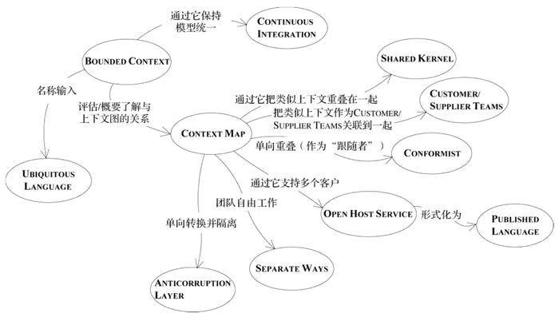

# 目录

[TOC]

> 随着系统增长，会变得越来越复杂，当我们无法通过分析对象来理解系统的时候，就需要掌握一些操控和理解大模型的技术了。这部分的决策都需要由团队来制定，甚至需要多个团队共同协商制定。这些决策往往是把设计和策略综合到一起的结果。
> 负有雄心的企业总是想实现一个涵盖所有业务，紧密集成的系统。但几乎所有这种规模的组织中，整体业务模型太大也太复杂了，难以管理，甚至难以作为一个整体来理解。我们需要在概念和实现上把系统分解为较小的部分，应该如何保证实现这种模块化的同时，不失去集成所具备的好处。从而使系统的不同部分能够进行互操作，以便协调各种业务操作。

如果设计一个把所有概念都涵盖进来的单一领域模型，又会非常笨拙，而且会出现大量难以察觉的重复和矛盾；
如果用临时拼凑的接口把一组小的、各自不同的子系统集成到一起，有不具备解决企业级问题的能力，并且每个集成点上都有可能出现不一致。
通过采用系统的、不断演变的设计策略，就可以避免这两种极端问题。

在这种规模的系统中采用领域驱动设计方法，也不要脱离实现去开发模型，每个决策都必须对系统开发产生直接的影响，否则就是无关的决策。战略设计原则必须指导设计决策，以减少各个部分之间的相互依赖，在使设计意图更为清晰的同时而又不失去关键的互操作性和协同性。战略设计原则必须把模型的重点放在捕获系统的概念核心，也就是系统的“远景”上。而且在完成这些目标的同时又不能为项目带来麻烦。我们探索三个主题：上下文、精炼、大型结构。

- 上下文使我们在不同的部分中进行工作，而不会破坏模型或是无意间导致模型的分裂；
- 精炼能够帮助我们理解各个部分之间的复杂关系，同时保持整体视图的清晰；
- 大型结构感能够保持各个不同部分之间的一致性，有助于这些部分的集成；

**上下文**
最根本的一个原则。成功的模型必须逻辑自洽。要把不同来源的子系统或者应用程序隐含的模型统一起来要求太高了。通过为每一个模型定义一个BOUNDED CONTEXT，然后在必要的情况下定义它与其他上下文的关系，建模人员就可以避免模型变得纠缠不清。

**精炼**
可以减少混乱，把注意力集中到正确的地方。主次分明。整体领域模型需要突出系统中最有价值和最特殊的那方面，在构造领域模型应该尽可能把注意力集中在这部分上，使系统不会偏离预期方向。战略精炼可以使大的模型保持清晰。有了更清晰的视图后，CORE DOMAIN的设计就会发挥更大作用。

**大型结构**
用来描述整个系统的。如果不贯彻某个主旨来应用一些系统级的设计元素和模式的话，关系仍然可能非常混乱。

上面三种原则各有各的用处，结合起来使用发挥更大的力量，遵守这些原则就可以创建出好的设计，即使是对一个非常庞大的没有人能够完全理解的系统也是如此。

## 1 保持模型的完整性
场景：两个团队在对同一个模型修改。实际上两个团队用的是不同的模型，他们都对模型做了一些假设，使之能够在自己的上下文中使用。当两个团队被组合到一起而没有消除矛盾时，结果就产生了不可靠的软件。

明确边界，各模型只在各自边界内使用。模型的基本要求是保持内部的一致性（统一）。每个术语都不会有模凌两可的意义，也不会有规则冲突。除非模型在逻辑上是一致的。否则就没有意义。
理想情况下，我们可以得到涵盖整个企业领域的单一模型，但实际上大型系统开发并非如此理想。在整个企业系统中保持这种水平统一是得不偿失的。在系统的各个不同部分中开发多个模型是很有必要的，**但我们必须慎重地选择系统的哪些部分可以分开，以及他们之间是什么关系。** 我们需要用一些方法来保持模型关键部分的统一。大型系统领域模型的完全统一既不可行，也不划算。

通常，多个模型会限制集成，并且使沟通变得麻烦，看起来也不够雅致。对多个模型的抵制有可能会导致另一种尝试——将大型项目中所有软件统一到单一模型中。一定要考虑风险：
1. 一次尝试对遗留系统做过多的替换；
2. 大项目可能会陷入困境，因为协调的开销太大，超出了这些项目的能力范围；
3. 具有特殊需求的应用程序可能不得不使用无法充分满足需求的模型，而只能将这些无法满足的行为放到其他地方；
4. 另一方面，试图用一个模型来满足所有人的需求可能会导致模型中包含过于复杂的选择，而很难使用；
这还只是从技术角度来看待问题，权力上的划分和管理级别的不同也可能要求把模型分开，而且不同模型的出现也可能是团队组织和开发过程导致的结果。因此，即使完全的集成没有来自技术方面的阻力，项目也可能会面临多个模型。

既然不能维护一个涵盖整个企业的统一模型，那就不要再受到这种思路的限制。通过预先决定什么应该统一，并认识到什么不能统一，我们就能创建一个清晰的，共同的视图。保证需要统一的部分保持一致，不需要统一的部分不会引起混乱或破坏模型。

本章解释用于识别、沟通和选择模型边界及关系的技术。BOUNDED CONTEXT（限界上下文）定义了每个模型的应用范围，CONTEXG MAP(上下文图)给出项目上下文及他们之间关系的总体视图。这些都可以降低模糊性的技术。确立了CONTEXT边界之后，仍然需要CONTINUOUS INTEGRATION（持续集成），使得模型保持统一。在这稳定基础之上，可以开始实施在界定和关联CONTEXT方面更有效的策略了——从通过SHARED KERNEL（共享内核）来紧密关联上下文，到那些SEPARATE WAYS（各行其道）地进行松耦合的模型。

## 1.1 模式：BOUNDED CONTEXT
任何大型项目都会存在多个模型。而当基于不同模型的代码被组合到一起后，软件就会出现BUG，变得不可靠和难以理解。团队成员之间的沟通变得混乱。人们往往弄不清楚一个模型不应该在哪个上下文中使用。
一个模型只在一个上下文中使用。这个上下文可以是代码的一个特定部分，也可以是某个特定团队的工作。

**结论**
明确地定义模型所应用的上下文。根据团队的组织、软件系统的各个部分的用法以及无力表现（代码和数据库模式等）来设置模型的边界。在这些边界中严格保持模型的一致性，而不要受到边界之外问题的干扰和混淆。
