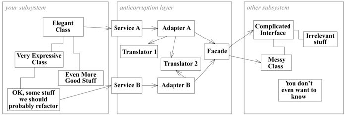

# 目录

[TOC]

> 随着系统增长，会变得越来越复杂，当我们无法通过分析对象来理解系统的时候，就需要掌握一些操控和理解大模型的技术了。这部分的决策都需要由团队来制定，甚至需要多个团队共同协商制定。这些决策往往是把设计和策略综合到一起的结果。
> 负有雄心的企业总是想实现一个涵盖所有业务，紧密集成的系统。但几乎所有这种规模的组织中，整体业务模型太大也太复杂了，难以管理，甚至难以作为一个整体来理解。我们需要在概念和实现上把系统分解为较小的部分，应该如何保证实现这种模块化的同时，不失去集成所具备的好处。从而使系统的不同部分能够进行互操作，以便协调各种业务操作。

如果设计一个把所有概念都涵盖进来的单一领域模型，又会非常笨拙，而且会出现大量难以察觉的重复和矛盾；
如果用临时拼凑的接口把一组小的、各自不同的子系统集成到一起，有不具备解决企业级问题的能力，并且每个集成点上都有可能出现不一致。
通过采用系统的、不断演变的设计策略，就可以避免这两种极端问题。

在这种规模的系统中采用领域驱动设计方法，也不要脱离实现去开发模型，每个决策都必须对系统开发产生直接的影响，否则就是无关的决策。战略设计原则必须指导设计决策，以减少各个部分之间的相互依赖，在使设计意图更为清晰的同时而又不失去关键的互操作性和协同性。战略设计原则必须把模型的重点放在捕获系统的概念核心，也就是系统的“远景”上。而且在完成这些目标的同时又不能为项目带来麻烦。我们探索三个主题：上下文、精炼、大型结构。

- 上下文使我们在不同的部分中进行工作，而不会破坏模型或是无意间导致模型的分裂；
- 精炼能够帮助我们理解各个部分之间的复杂关系，同时保持整体视图的清晰；
- 大型结构感能够保持各个不同部分之间的一致性，有助于这些部分的集成；

**上下文**
最根本的一个原则。成功的模型必须逻辑自洽。要把不同来源的子系统或者应用程序隐含的模型统一起来要求太高了。通过为每一个模型定义一个BOUNDED CONTEXT，然后在必要的情况下定义它与其他上下文的关系，建模人员就可以避免模型变得纠缠不清。

**精炼**
可以减少混乱，把注意力集中到正确的地方。主次分明。整体领域模型需要突出系统中最有价值和最特殊的那方面，在构造领域模型应该尽可能把注意力集中在这部分上，使系统不会偏离预期方向。战略精炼可以使大的模型保持清晰。有了更清晰的视图后，CORE DOMAIN的设计就会发挥更大作用。

**大型结构**
用来描述整个系统的。如果不贯彻某个主旨来应用一些系统级的设计元素和模式的话，关系仍然可能非常混乱。

上面三种原则各有各的用处，结合起来使用发挥更大的力量，遵守这些原则就可以创建出好的设计，即使是对一个非常庞大的没有人能够完全理解的系统也是如此。

## 1 保持模型的完整性
场景：两个团队在对同一个模型修改。实际上两个团队用的是不同的模型，他们都对模型做了一些假设，使之能够在自己的上下文中使用。当两个团队被组合到一起而没有消除矛盾时，结果就产生了不可靠的软件。

明确边界，各模型只在各自边界内使用。模型的基本要求是保持内部的一致性（统一）。每个术语都不会有模凌两可的意义，也不会有规则冲突。除非模型在逻辑上是一致的。否则就没有意义。
理想情况下，我们可以得到涵盖整个企业领域的单一模型，但实际上大型系统开发并非如此理想。在整个企业系统中保持这种水平统一是得不偿失的。在系统的各个不同部分中开发多个模型是很有必要的，**但我们必须慎重地选择系统的哪些部分可以分开，以及他们之间是什么关系。** 我们需要用一些方法来保持模型关键部分的统一。大型系统领域模型的完全统一既不可行，也不划算。

通常，多个模型会限制集成，并且使沟通变得麻烦，看起来也不够雅致。对多个模型的抵制有可能会导致另一种尝试——将大型项目中所有软件统一到单一模型中。一定要考虑风险：
1. 一次尝试对遗留系统做过多的替换；
2. 大项目可能会陷入困境，因为协调的开销太大，超出了这些项目的能力范围；
3. 具有特殊需求的应用程序可能不得不使用无法充分满足需求的模型，而只能将这些无法满足的行为放到其他地方；
4. 另一方面，试图用一个模型来满足所有人的需求可能会导致模型中包含过于复杂的选择，而很难使用；
这还只是从技术角度来看待问题，权力上的划分和管理级别的不同也可能要求把模型分开，而且不同模型的出现也可能是团队组织和开发过程导致的结果。因此，即使完全的集成没有来自技术方面的阻力，项目也可能会面临多个模型。

既然不能维护一个涵盖整个企业的统一模型，那就不要再受到这种思路的限制。通过预先决定什么应该统一，并认识到什么不能统一，我们就能创建一个清晰的，共同的视图。保证需要统一的部分保持一致，不需要统一的部分不会引起混乱或破坏模型。

本章解释用于识别、沟通和选择模型边界及关系的技术。BOUNDED CONTEXT（限界上下文）定义了每个模型的应用范围，CONTEXG MAP(上下文图)给出项目上下文及他们之间关系的总体视图。这些都可以降低模糊性的技术。确立了CONTEXT边界之后，仍然需要CONTINUOUS INTEGRATION（持续集成），使得模型保持统一。在这稳定基础之上，可以开始实施在界定和关联CONTEXT方面更有效的策略了——从通过SHARED KERNEL（共享内核）来紧密关联上下文，到那些SEPARATE WAYS（各行其道）地进行松耦合的模型。

#### 1.1 模式：BOUNDED CONTEXT
任何大型项目都会存在多个模型。而当基于不同模型的代码被组合到一起后，软件就会出现BUG，变得不可靠和难以理解。团队成员之间的沟通变得混乱。人们往往弄不清楚一个模型不应该在哪个上下文中使用。
一个模型只在一个上下文中使用。这个上下文可以是代码的一个特定部分，也可以是某个特定团队的工作。

**结论**
明确地定义模型所应用的上下文。根据团队的组织、软件系统的各个部分的用法以及无力表现（代码和数据库模式等）来设置模型的边界。在这些边界中严格保持模型的一致性，而不要受到边界之外问题的干扰和混淆。

BOUNDED CONTEXT明确地限定了模型的应用范围，以便让团队成员对什么应该保持一致以及上下文之间如何关联有一个明确和共同的理解。在CONTEXT中，要保证模型在逻辑上统一，而不用考虑它是不是适用于边界之外的情况。通过划定明确的边界，可保持模型纯粹，因而在它所适用的CONTEXT中更有效。同时，也避免了将注意力切换到其他CONTEXT时引起的混淆。

**区分BOUNDED CONTEXT与MODULE**
？？？

新旧模型之间的必要转换由原有系统团队处理。转换机制不是由新模型驱动的。因此它不在BOUNDED CONTEXT中，实际是边界本身的一部分，这一点在CONTEXT MAP讨论

**识别BOUNDED CONTEXT中的不一致**
最明显的是已编码的接口不匹配。采用了自动测试的CONTINUOUS INTERGRATION可以捕捉这类问题。**但是，语言上的混乱往往是一种早期的警告信号**。

注意：不同模型的元素组合到一起可能会引发两类问题：**重复的概念、假同源**。
1. 重复的概念是指两个模型元素实际上表示同一个概念，明显的感觉是这个概念的信息发生变化时，必须同时更新两个地方，每次新知识导致一个对象被修改时，必须重新分析和修改另一个对象。
2. 危害更大，是指对不一样的概念使用了相同的术语的两个人认为是谈论同一个事情。当两个定义都与同一个领域方面有关，而只是概念上稍有区别，这种冲突更难实现。

发现不一致要尽快解决。可能将模型重新合成整体，预防分裂。也可能独立开来。可以参考下一节

#### 1.2 模式：CONTINUOUS INTEGRATION
> 把一个上下文中的所有工作足够频繁的合并到一起，并使他们保持一致，当模型发生分裂时，可以迅速发现并纠正问题。有两个级别的操作：模型概念的集成、实现的集成。
> **范围**：只有在BOUNDED CONTEXT中才是重要的。

问题：
当很多人在**同一个BOUNDED CONTEXT中工作**时，模型很容易发生分裂。即使是3～4人团队也有可能遇到严重问题。然而，将系统分解为更小的CONTEXT，最终又难以保持集成度和一致性。

具体表现：
- 没有理解其他人创建的对象或者交互意图就修改，使其失去了原来的作用；
- 没意识到正在开发的概念已经在模型的另一个部分实现了，导致重复；
- 担心破坏现有功能而不去改动，重新开发；

在持续集成时，团队成员之间通过经常沟通来保证概念的集成。团队必须对不断变化的模型形成共同的理解。基本方法是对UBIQUITOUS LANGUAGE多加锤炼，同时，实际工件通过系统性的合并\构建\测试过程来集成，可以尽早暴露模型的分裂问题。

用来集成的过程很多，有效的过程都具备以下特征：
- （最根本）**概念集成**，讨论模型和应用程序时要坚持使用UBIQUITOUS LANGUAGE；
- 分步集成，采用可重现的合并\构建技术；
- 自动测试套件；
- 有一些规则，用来为尚未集成的改动设置一个想当小的生命期上限；

在MODEL-DRIVEN-DESIGN中，概念集成为实现集成铺平了道路，而实现集成验证了模型的有效性和一致性，并暴露模型的分裂问题。

**结论**
建立一个把所有代码和其他实现工件频繁地合并到一起的过程，并通过自动化测试来快速查明模型的分裂问题。严格坚持使用UBIQUITOUS LANGUAGE，以便在不同人的头脑中演变出不同的概念时，使所有人对模型都能达成一个共识。

#### 1.3 模型：CONTEXT MAP
只有一个BOUNDED CONTEXT并不能提供全局视图。其他模型的上下文仍不清楚而且还在不断变化。定义不同上下文之间的关系，在项目中创建一个所有模型上下文的全局视图。CONTEXT MAP位于项目管理和软件设计的重叠部分。无需拘泥特定的文档格式，重在人员之间共享并理解。

问题：
当其他团队的人员并不清楚CONTEXT的边界，会不知不觉地作出一些更改，从而使边界变得模糊或者使互连变得复杂。当不同的上下必须互相连接时，它们可能会相互重叠。

- BOUNDED CONTEXT之间的代码重用需要避免。功能和数据的集成必须要通过转换去实现；

**结论**
- 识别项目中起作用的每个模型，并定义其BOUNDED CONTEXT。这包括非面向对象子系统的隐含模型；
- 为每个BOUNDED CONTEXT命名，并把名称添至UBIQUITOUS LANGUAGE；
- 描述模型之间的联系点，明确所有通信需要的转换，并突出任何共享的内容；
- 先将当前的情况描绘出来，以后再做变更；

在每个BOUNDED CONTEXT中，都将有一种一致的UBIQUITOUS LANGUAGE的“方言”。我们需要包BOUNDED CONTEXT的名称添加到该方言中，只要通过明确CONTEXT就可以清楚地讨论任意设计部分的模型。

**BOUNDED CONTEXT之间的关系有很多，接下来的几节会介绍**。注意只需要描述所发现的关系，不要生搬硬套。过后再向更加标准的关系过渡。如果模型产生了分裂，而且关系很模糊，可以选择一种最接近的模型，向他靠拢。最重要的是画出一个清晰的CONTEXT MAP。但不要因为修复必要的问题而重组整个结构，只需要修改明显的矛盾。

在更改实际上完成以前，不要先修改CONTEXT MAP。

例子：运输应用程序中的两个CONTEXT
创建一个用于转换的对象，两个团队一起维护。设计应易于单元测试。与其他CONTEXT和谐共存的一个秘诀就是拥有有效的接口测试集

###### 1.3.1 测试CONTEXT的边界
对各个BOUNDED CONTEXT的联系点侧测试特别重要。可以解决转换时所存在的一些细微问题以及弥补边界沟通上存在的不足。测试充当了早期报警系统。

###### 1.3.2 CONTEXT MAP的组织和文档化
两个重点：
- BOUNDED CONTEXT应该有名称，以便可以讨论，需要添加到团队的UBIQUITOUS LANGUAGE中；
- 每个人都要知道边界在哪里，而且能够分辨出任何代码段的CONTEXT，或任何情况的CONTEXT；

#### 1.4 BOUNDED CONTEXT之间的关系
把模型连接到一起后，就能把整个企业笼括在内，可以成功地组织开发工作设定目标，为描述现有组织提供术语。
现有关系可能与这些模式中的某一种很接近——可能是由于巧合，也可能是有意设计的——这个情况下可以使用这个模式的术语来描述关系，但差异之处应该引起重视。随着每次小的设计修改，关系会与所选定的模式越来越接近。

- 如果团队需要为不同的用户群体提供服务，或者团队的协调能力有限，可能需要采用SHARED KERNEL或CUSTOMER\SUPPLIER关系。
- 有时研究需求之后可能发现集成并不重要，而系统最好采用SEPARATE WAY。
- 大多数项目需要与遗留系统或外部系统进行一定程度的集成，这需要OPEN HOST SERVICE或ANTICORRUPTION LAYER

#### 1.5 模式：SHARED KERNEL
> 定义单独的BOUNDED CONTEXT，并组织多个团队。用于减少重复，不是消除

问题：
持续集成收到局限。
- 比如团队技能水平或行政组织影响，又或者有一个庞大笨拙的团队。
- 不同的团队开发一些紧密相关的应用程序，团队之间不进行协调，即使短时间内能够取得快速进展，但开发出的产品可能无法结合在一起。最后不得不耗费大量精力在转换层上，并频繁改动。

**结论**
从领域模型中选出两个团队都同意共享的一个子集。当然，除了这个模型子集以外，还包括与该模型部分相关的代码子集，或数据库设计的子集。这部分明确共享的内容有特殊地位，一个团队在没与另一个团队商量的情况下不应擅自更改。集成的频率比CONTINUOUS INTEGRATION低，集成的时候两个团队都要运行测试。

SHARED KERNEL通常是CORE DOMAIN，或是一组GENERIC SUBDOMAIN。可以是两个团队都需要的任何一部分模型。

#### 1.6 模式：CUSTOMER/SUPPLIER DEVELOPMENT TEAM
> 关键因素：关系必须是客户与供应商的关系，其中客户的需求是至关重要的；必须有自动测试套件，使上游团队在修改代码不必担心破坏下游团队产生副作用。

问题：
一个子系统主要服务于另一个子系统：“下游”组件执行分析或其他功能，这些功能向“上游”组件反馈的信息非常少，依赖是单向的。两个子系统通常服务于完全不同的用户群，执行任务也不同，在这种情况下使用不同的模型会很有帮助。

上下游自然是分隔到两个BOUNDED CONTEXT中。复杂点：如果下游团队对变更具有否决权，或请求变更的程序太复杂，那么上游的开发自由度就受到限制。由于担心破坏下游系统，上游团队甚至会受到抑制。同时，上游团队掌握优先权，下游团队有时也会无能为力。

**结论**
两个团队之间建立一种明确的客户/供应商关系。在计划会议中，下游团队相当于上游团队的客户。根据下游团队的需求来协商需要执行的任务并为这些任务做预算，以便每个人都知道双方的约定和进度。两个团队共同开发自动化验收测试，用来验证预期的接口。把这些测试添加到上游团队的测试套件中，以便作为其持续集成的一部分来运行。

自动化验收测试是这种客户关系的一个重要部分。

#### 1.7 模式：CONFORMIST
> 这个模式类似SHARED KERNEL，都有一个重叠的区域，在这个区域内的模型都是相同的。区别在于决策和开发过程不同。SHARED KERNEL是两个高度协调的团队之间合作。而这个是与一个对合作不感兴趣的团队进行集成。
> 具有上下游关系的团队不归同一个管理者指挥时，如果上游团队没有动力来满足下游团队的需求，那么下游团队也无能为力。

- 可以完全放弃上游 —— 走向SEPARATE WAY的道路；
- 上游的设计很难用，下游需要开发自己的模型，需要承担起开发转换层的全部责任 —— 走向ANTICORRUPTION LAYER
- 上游设计还好，风格也兼容，那么直接跟随 —— CONFORMIST

使用一个很大接口的现成组件时，一般应该遵循组件的隐含模型，可以使用一些适配器进行一点点格式转换，但模型一定要保持相同，否则就该质疑使用该组件是否正确。如果确实能够提供价值，说明设计中已经消化吸收了一些知识，比自己的理解要深入。遵从组件的领导，可以被带到更好更贴合的设计中。

**结论**
严格遵从上游团队的模型，可以消除BOUNDED CONTEXT之间转换的复杂性。尽管会限制下游设计人员的风格，可能会得不到理想的应用程序模型，但可以极大简化集成。好可以与供应商团队共享UBIQUITOUS LANGUAGE。供应商团队处于统治地位，使用可以使沟通变得容易。

#### 1.8 模式：ANTICORRUPTION LAYER

> 当把参与集成的BOUNDED CONTEXT设计完善并且团队相互合作时，转换层可能很简单，但当边界侧发生渗透时，转换层就承担起更多的防护职责。他是在不同模型和协议之间转换概念对象和操作的机制。**概念模型差别是使用此模型的动机。**

当正在构建的新系统与另一个系统接口很大时，为了克服连接两个模型带来的困难，新模型所表达的意图可能会完全改变，最终导致被修改得像另一个系统的模型。集成遗留系统有很大的价值，有时还是绝对必要的。

要把外部系统的数据类型转换为自己系统的数据类型，但是外部系统肯定不会使用相同的概念领域模型。我们需要在不同模型的关联部分之间建立转换机制，这样模型就不会被未经笑话的外来模型元素所破坏。

I**结论**
创建一个隔离层，以便根据客户自己的领域模型来为客户提供相关功能。这个层通过另一个系统现有接口与其进行对话，而只需对哪个系统作出很少修改，甚至无需修改。在内部，这个层在两个模型之间进行必要的双向转换。

###### 1.8.1 设计ANTICORRUPTION LAYER的接口
公共接口通常是一组SERVICE形式出现，但偶尔也会采用ENTITY的形式。这层使我们能够重新对外部系统的行为进行抽象，使外部按照与我们模型一致的方式把服务和信息提供出来。把外部系统表示为一个单独的组件可能没有意义，最好使用多个SERVICE（或ENTITY），每个都使用我们的模型来履行一致的职责。

###### 1.8.2 实现ANTICORRUPTION LAYER
对ANTICORRUPTION LAYER进行组织的一种方式是把他实现为FACADE、ADAPTER和转换器的组合，外加两个系统之间进行对话所需的通信和传输机制。

FACADE，是子系统可供替换的接口。当从一个模型转换到另一个模型的时候，可以同时处理那些难于沟通的子系统接口。他简化了客户访问，使子系统更易于使用。他应该严格按照另一个系统的模型来编写。否则会导致转换职责蔓延到多个对象中，加重负担，甚至创建出另一个预料之外的模型。

ADAPTER，是包装器，允许客户使用另外一种协议，可以是行为实现者不理解的协议。当客户向适配器发送一条消息时，ADAPTER把消息转换为一条在语义上等同的消息，并将其发送给被适配者。

转换器，概念对象或数据的实际转换是完全不同的复杂任务，可以用一个单独的对象来承担。

ANTICORRUPTION LAYER可以是双向的：其他系统可能需要向我们的子系统提交某种请求或者把某个通知给我们的系统

#### 1.9 模式：SEPARATE WAY
> 两组功能之间并非必不可少，二者完全可以彼此独立

集成总是代价高昂，有时获益很小。集成会迫使我们作出一些折中。仅仅是因为特性在用例中相关，并不意味着他们必须集成到一起。

**结论**
声明一个与其他上下文毫无关联的BOUNDED CONTEXT，使开发人员能够在这个小范围内找到简单、专用的解决方案。

#### 1.10 模式：OPEN HOST SERVICE
> 子系统必须与大量其他系统进行集成时，为每个集成都定制一个转换层可能会减慢团队的工作速度。需要维护的东西会越来越多，而且修改的时候担心的事情也会越来越多。

大量与其他系统集成，意味着是一项基础设施了。可以描述为一组SERVICE，满足其他子系统的公共需求。

**结论**
定义一个协议，把我们的子系统作为一组SERVICE供其他系统访问。开发这个协议，以便所有需要与你子系统集成的人都可以使用它。当有新的集成需求时，就增强并扩展这个协议。但个别团队的特殊需求除外。满足这种特殊需求的方法是使用一次性的转换器来扩充协议，以便使共享协议简单且内聚。

其他团队必须学习HOST团队所使用的专用术语

#### 1.11 模式：PUBLISHED LANGUAGE
> 两个BOUNDED CONTEXT之间的模型转换需要一种公共语言。

问题：
- 两个领域模型必须共存而且必须交换信息时，转换过程本身就可能很复杂，很难文档化和理解；
- 不同的业务之间需要交换信息，让一个业务采用另一个业务的领域模型是不现实的；
- 尽管把一个应用程序的模型用作通信媒介，那么它必须非常稳定，用以支持通信职责，不能满足新需求而自由修改了；

**结论**
把一个良好文档化的、能够表达出所需领域信息的共享语言作为通信媒介，必要时在其他信息与该语言之间进行转换。

#### 1.12 大象的统一
盲人根据自己触摸到的部位来扩展自身的认知。
第一步将各部分模型集成成整体只需要弄清楚各个部分如何相连就够了。如果两个模型描述同一部分，两个人之间就会产生矛盾的认知，事实上需要一个新的抽象统一起来。
第二部去掉各个模型中偶然或不正确的方面，并创建新的概念。尽可能精简。

承认多个相互冲突的领域模型实际上正是面对显示的做法，通过明确每个模型都适用的上下文，可以维护每个模型的完整性，并清楚地看到要在两个模型之间创建的任何特殊接口的含义。

#### 1.13 选择你的模型上下文策略
> 绘制出CONTEXT MAP后，可以开始有意识地选择CONTEXT的边界和关系，下面给出指导

###### 1.13.1 团队决策或更高层决策
- 团队决定BOUNDED CONTEXT，以及他们之间的关系，至少要传达给整个团队并被每个人理解；
- 权衡团队独立工作的价值以及能产生丰富集成的价值，这两种价值的成本-效益作为决策的依据；
- 实践中，团队之间的行政关系决定了系统的集成方式。有技术优势的统一可能无法实现、管理层所要求的合并可能并不实用。不会总能得到想要的结果，但可以评估出这些决策的代价，反映给管理层，以便采取相应的措施减小代价；
- 从一个现实的CONTEXT MAP开始，根据实际的情况来选择改变；

###### 1.13.2 置身上下文中
开发时，我们对自己团队正在开发的部分感兴趣，其次是与我们交互的系统。
典型情况下，设计中的系统会划分为一到两个BOUNDED CONTEXT，主力在这些上下文中，可能会有另外一到两个起支持作用的CONTEXT。除此之外，就是这些CONTEXT与外部系统之间的关系。
知道自己的部分，能意识到超出该CONTEXT的应用边界。

###### 1.13.3 转换边界
> 画出边界时需要做权衡，在不同的BOUNDED CONTEXT之间进行深度功能集成是不切实际的。在一个模型中，只有能够严格按照另一个模型来表述的部分才能进行集成
首选较大的BOUNDED CONTEXT
- 一个统一的模型处理更多的任务时，用户任务之间流动更流畅；
- 一个内聚模型比两个不同模型再加他们之间的映射更容易理解；
- 两个模型转换可能很困难甚至不可能；
- 可以共同使用UBIQUITOUS LANGUAGE；

首选较小的BOUNDED CONTEXT
- 开发人员之间的开销较少；
- 团队、代码规模较小，CONTINUOUS INTEGRATION更容易了；
- 较大的上下文要求更加通用的抽象模型，而掌握所需技巧的人员会出现短缺；
- 不同的模型可以满足特殊需求，或者是能把一些特殊用户群的专门术语和UBIQUITOUS LANGUAGE的专门术语包括进来；

###### 1.13.4 接受那些我们无法更改的事物：描述外部系统
> 一些子系统不在开发中系统的任何BOUNDED CONTEXT，比如无法立即淘汰的大型遗留系统和那些提供所需服务的外部系统。识别，隔离它。

我们会轻易的认为这些系统构成了自己的BOUNED CONTEXT，但大多数外部系统只是勉强满足定义。
定义BOUNDED CONTEXT目的是把模型统一在特定边界内。集成时仔细检查，小心语义矛盾。

###### 1.13.5 与外部系统的关系
三种。
不需要集成，要真正确定不需要集成，SEPARATE WAY，只为用户提供对两个系统的简单访问，尽可能为项目减轻负担。
集成很重要，CONFORMIST，对创新的选择会受到限制，对一个大的系统进行外围扩展时，这个系统还是主系统，继续使用遗留模型就会很合适。约束自己只能扩展现有模型，不能修改。
当设计的功能不仅仅是扩展，而且与另一个系统接口很小，或者另一个系统设计很糟糕，我们会希望使用自己的BOUNDED CONTEXT，这时需要ANTICORRUPTION LAYER。

###### 1.13.6 设计中的系统
> 一个BOUNDED CONTEXT对应一个团队。一个团队也可以维护多个BOUNDED CONTEXT，但多个团队在一个上下文工作却是比较难的。
每个BOUNDED CONTEXT中应用CONTINUOUS INTEGRATION，但应该有几个上下文，各个上下文的关系是什么？
随着团队扩大，CONTINUOUS INTEGRATION会开始困难，可以采用SHARED KERNEL模式，把几组相对独立的功能划分到不同的BOUNDED CONTEXT中，使得每个BOUNDED CONTEXT中工作的人员少于10人。如果有两个上下文之间的所有依赖都是单向的，可以建成CUSTOMER/SUPPLIER DEVELOPMENT TEAM。
你可能会意识到两个团队的思想截然不同，导致建模工作总是相互矛盾，这种矛盾的原因是无法改变或不想改变的，可以采用SEPARATE WAY模式。在需要集成的地方共同维护一个转换层，把它作为CONTINUOUS INTEGRATION的点

###### 1.13.7 用不同模型满足特殊需要
> 同一业务的不同小组常常有各自的专用术语，而且可能各不相同，这些本地术语是非常精确的，想要实行标准化的企业级术语，需要大量培训和分析，即便如此，新术语也不会有原来的精确的术语好用。

通过不同的BOUNDED CONTEXT来满足这些特殊需求，除了转换层的CONTINUOUS INTEGRATION以外，让模型采用SEPARATE WAY模式。UBIQUITOUS LANGUAGE的不同专用术语将围绕这些模型。如果两种专用术语有很多重叠，SHARED KERNEL就可以满足特殊化要求，并发转换成本减至最小。
当不需要集成或者集成相对有限，可以继续使用已经习惯的术语，以免破坏模型。
为了满足特殊的需要，需要对系统这一部分进行多大的定制？最重要的是，这个用户群的专门术语有多大的价值。我们必须在团队独立操作的价值与转换的风险之间作出权衡，并留心合理地处理一些没有价值的术语变化。
有时会出现深层次模型，把不同语言统一起来，并满足双方的要求，只有经过大量开发工作和知识消化之后，深层次模型才会在生命周期后期出现。

###### 1.13.8 部署
> BOUNDED CONTEXT策略的选择将影响部署

例如CUSTOMER/SUPPLIER TEAM部署时，他们要相互协调发布。
有些版本需要进行代码和数据转移，好的做法是把CONTEXT之间的转换层放在同一个进程中。当数据迁移可能很花时间或者分布式系统无法同步更新，即使是单一BOUNDED CONTEXT中的组件部署也是很困难的，这回导致代码和数据有两个版本共存。
由于部署环境和技术存在不同，有很多技术因素需要考虑。但BOUNDED CONTEXT关系可以指出重点问题，转换接口已经被标出。
绘制CONTEXT边界时应该反映出部署计划的可能性。

###### 1.13.9 权衡

通过总结这些指导原则可知有很多统一集成模型的策略。一般来说我们需要在无缝功能集成的益处和额外协调和沟通工作之间作出权衡，还要在更独立的操作与更流畅的沟通之间作出权衡。更积极的统一需要对有关子系统的设计有更多控制。

###### 1.13.10 当项目正在进行时
大多数情况下我们是改进一个正在开发的项目。第一步是根据当前的状况来定义BOUNDED CONTEXT。为了有效定义上下文，CONTEXT MAP必须反映出团队的实际工作，而不是反映那个通过遵守以上表述的指导原则而得出的理想组织。
描述了真实的BOUNDED CONTEXT以及关系后，围绕当前组织结构来加强团队的工作。在CONTEXT中加强CONTINUOUS INTEGRATION。把分散的转换代码重构到ANTICORRUPTION LAYER。命名现有的BOUNDED CONTEXT，并确保处于项目的UBIQUITOUS LANGUAGE。
现在可以开始考虑修改边界和他们的关系了。
下节讨论修改CONTEXT的边界。

#### 1.14 转换
> 通常我们必须改变最初有关边界及BOUNDED CONTEXT之间关系的决策。分割很容易，但合并或者改变他们之间的关系却很难。转换往往很大，无法再一次重构中完成，甚至无法在一次项目迭代中完成。将转换划分为一系列简单的步骤（只是指导原则）

合并动机很多：翻译开销高，重复现象明显

###### 1.14.1 合并CONTEXT：SEPARATE WAY -> SHARED KERNEL
> 即使最终目标是完全合并成一个采用CONTINUOUS INTEGRATION的CONTEXT也应该先过渡到SHARED KERNEL
> SHARED KERNEL的有点多是它具有CONTINUOUS INTEGRATION的部分优势，同时保留了SEPARATE WAY的一些优点

1. 评估出事状况。在同一两个CONTEXT之前，一定要确信他们确实统一；
2. 建立合并过程，需要决定代码的共享方式以及模块应该采用哪种命名约定，SHARED KERNEL每周至少集成一次，而且要有测试套件；
3. 选择小的子领域开始，它应该是两个CONTEXT中重复出现的子领域，但不是CORE DOMAIN的一部分。最初合并主要是为了建立合并过程，先选择一些简单且相对通用或不重要的部分。坚持已存在的集成和转换。选择经过转换的部分，其优势在于一开始就有用于验证的转换机制，此外还可以简化转换层；

此时我们有两个对应相同子领域的模型。有三种合并方法，1）可以选择一个模型，并重构另一个，使之与第一个兼容。2）从整体上作出这个决策，把目标设置为系统性地替换一个CONTEXT模型，并保持被开发模型的内聚性。也可以一次选择一部分，到最后两个模型可能会两全其美。3）找到一个更为深刻的模型，承担两个模型的职责。

4. 两个团队选出2～4位开发人员组成小组，由他们来给子领域开发一个共享的模型，不管模型是如何得出的，他的内容必须详尽。难点：找出同义词和映射那些尚未被翻译的术语。这个联合团队要为模型开发一个基本的测试集；
5. 两个团队的开发人员一起负责实现模型（或修改共享的现有代码）、确定各种细节并使模型开始工作。如果开发人员在模型中遇到了问题，从第3步重新组织团队，并进行必要的概念修订工作；
6. 每个团队开发人员都承担新的SHARED KERNEL集成的任务；
7. 清除不再需要的翻译；

这时会得到一个非常小的SHARED KERNEL，并且有一个过程来维护。在后续的项目迭代中，重复3～7步来共享更多内容。

###### 1.14.2 合并CONTEXT：SHARED KERNEL -> CONTINUOUS INTEGRATION
> 如果SHARED KERNEL扩大，你可能会向完全统一BOUNDED CONTEXT。这不只是解决模型差异的问题，你将改变团队的结构，最终改变人们所使用的语言。

这个从人员和团队的准备开始
1. 确保每个团队都已经建立了CONTINUOUS INTEGRATION所欲的所有过程（共享代码所有权、频繁集成）。两个团队协商集成步骤，以便所有人都以同一步调工作。
2. 团队成员在团队之间流动。这样可以形成一大批同时理解两个模型的人员，并且可以把两个团队的人员联系起来；
3. 澄清每个模型的精髓；
4. 现在，团队可以把CORE DOMAIN合并到SHARED KERNEL中。可能需要多次迭代，有时需要在新共享的部分与尚未共享的部分之间使用临时的转换层。一旦进入到合并CORE DOMAIN的过程中，最好能快速完成。这是一个开销高且易出错的阶段，尽可能缩短时间，要优先新的开发任务；
5. 随着SHARED KERNEL的增长集成频率提高到每天一次，最后实现CONTINUOUS INTEGRATION；
6. 当SHARED KERNEL逐渐把先前两个BOUNDED CONTEXT所有内容都包括进来的时候，你要么形成了一个大团队，要么形成了两个较小的团队，这两个较小的团队共享一个CONTINUOUS INTEGRATION的代码库，而且团队成员可以经常在两个团队之间来回流动；

#### 1.14.3 逐步淘汰遗留系统
> 老系统与业务及其他系统紧密交织在一起，因此淘汰他们可能需要很多年，但不需要一次把所有东西都淘汰掉。

一种常见的情况：用一系列更现代的系统来补充业务中每天都在使用的老系统，新系统通过一个ANTICORRUPTION LAYER与老系统进行通信。
首先要执行的步骤是确定测试策略。应该为新系统中的新功能编写自动的单元测试，但逐步淘汰系统还有一些特殊的测试需求。一些组织在某段时间会同时运行新旧两个系统。

在任何一次迭代中
1. 确定遗留系统的那个功能可以在一个迭代中被添加到某个新系统中；
2. 确定需要在ANTICORRUPTION LAYER中添加的功能；
3. 实现；
4. 部署；

有时需要多次迭代才能编写一个与遗留系统某个功能等价的功能单元，这时在计划新的替代功能时仍以小规模的迭代为单元，最后一次性部署多次迭代。
进入运行阶段后：
5. 找出ANTICORRUPTION LAYER中不必要的部分，去掉他们；
6. 考虑删除遗留系统中目前未被使用的模块；

不断重复，遗留系统应该越来越少地参与业务。

#### 1.14.4 OPEN HOST SERVICE -> PUBLISHED LANGUAGE
> 随着需要访问的系统增多，维护负担不断增加，交互变得难以理解。需要通过PUBLISHED LANGUAGE来规范系统之间的关系

1. 如果有一种行业标准语言可用，尽可能评估并使用；
2. 如果没有标准语言或预先公开发布的语言，则完善作为HOST系统的CORE DOMAIN；
3. 使用CORE DOMAIN作为交换语言的基础，尽可能使用像XML这样的标准交互范式；
4. 向所有参与协作的各方发布新语言；
5. 如果设计新的系统架构，也要发布；
6. 为每个协作系统构建转换层；
7. 切换；

当加入更多的协作系统时，对整个系统的破坏已经减至最小了。
PUBLISHED LANGUAGE必须是稳定的。但是当继续进行重构时，仍然需要能够自由地更改HOST的模型。不要把交换语言和HOST的模型等同。保持他们密切的关系可以见效转换开销，而你的HOST可以采用CONFORMIST模式。但应该保留对转换层进行补充的权利。在成本-效益折中需要时，可以把这个权利分离出去。

## 2 精炼
> **精炼是把一堆混在一起的组件分开的过程。（目的）提取出重要内容。** 模型是知识的精炼。
> 关注核心问题。方法：LYAERED ARCHITECTURE可以把领域概念从技术逻辑中分离出来。但在大型系统中，即使领域被分离出来，它的复杂性也可能难以管理。

精炼过程所分离出来的副产品本身也很有价值，但精炼的主要动机是把最有价值的部分提取出来。这部分就是CORE DOMAIN。

战略精炼包括：
- 帮助所有团队成员掌握系统的总体设计以及各部分如何协调工作；
- 找到一个具有适度规模核心模型并把它添加到通用语言中，促进沟通；
- 指导重构；
- 专注于模型中最有价值的那部分；
- 指导外包、现成组件的使用以及任务委派；

#### 2.1 模式：CORE DOMAIN
> 大型系统中有非常多组成部分，但是要注意真正的业务资产——领域模型最精华的部分。

我们不可能对所有设计部分进行同等的精化，必须分出优先级。为了使领域模型成为有价值的资产，必须整齐地梳理出模型的真正核心，并完全根据这个核心来创建应用程序的功能。

不过高水平开发人员往往会把工作重心放在技术基础设施上，或者只是且解决那些不需要专门领域知识就能理解的领域问题。

在制定项目规划的时候，必须把资源分配给模型和设计中最关键的部分。在规划和开发期间每个人都必须识别和理解这些关键部分。这部分是应用程序的标志性部分，也是目标应用程序的核心诉求，构成了CORE DOMAIN。

**结论**
对模型进行提炼。找到CORE DOMAIN并提供一种易于区分的方法把它与起辅助作用的模型和代码分开。最有价值和最专业的概念要轮廓分明。尽量压缩CORE DOMAIN。
在CORE DOMAIN中努力开发能够确保实现系统蓝图的深层模型和柔性设计。仔细判断任何其他部分的投入，看它是否能够支持这个提炼出来的CORE。

它可以使决策变得容易。投入大量的工作使你的CORE鲜明突出，其他设计部分只需依照常规做得实用即可。如果某个设计部分需要保密以便保持竞争优势，那么它就是你的CORE DOAMIN。其他部分则没有必要隐藏起来。当必须在两个看起来都很有用的重构之间进行抉择时，应该首选对CORE DOMAIN影响最大的那个重构。

###### 2.1.1 选择核心
关注能够表示业务领域并解决业务问题的模型部分。
对CORE DOMAIN的选择取决于看问题的角度。一个应用程序的CORE DOMAIN在另一个应用程序中可能只是通用的支持组件。人们对CORE DOAMIN的认知也会随着迭代而发展。

###### 2.1.2 工作的分配
团队中，技术能力最强的任用往往缺乏丰富的领域知识，也更倾向于分派他们做支持组件，从而形成了一个恶性循环——知识的缺乏使他们远离能够学到领域知识的工作。
打破这种恶性循环是很重要的，方法是建立一支由开发人员和多位领域专家组成的联合团队，开发人员必须能力很强，能够长期稳定地工作并且对学习领域知识非常感兴趣。领域专家则要掌握深厚的业务知识。

从外部聘请短期的专业人员来设计CORE DOMAIN的关键环节通常是行不通的，因为团队需要累积领域知识，短期人员会造成知识流失。不过充当培训和知道角色的专家可能会有价值，可以帮助团队建立领域设计技巧，促成团队成员实用尚未掌握的高级设计原则。

自主开发的软件最大价值来自于对CORE DOMAIN的完全控制。一个设计良好的框架可能会提供满足你的专门实用需求的高水平抽象，可以节省开发那些更通用部分的时间，使我们更专注于CORE。如果它对我们的约束超过了限度，可能原因有：
- 正在失去一项重要的软件资产。应该让这些限制性的框架退出CORE DOMAIN；
- 框架处理的部分并不是你所认为的核心。此时应该重新划定CORE DOMAIN的边界，把真正标志性部分识别出来；
- 我们的CORE DOMAIN没有特殊需求。应该考虑采用风险更低的解决方案，如购买软件与我们的应用程序进行集成；

最终我们需要一支稳定工作的团队，不断累积和消化专业知识，将知识转换为一个丰富的模型。

#### 2.2 精炼的逐步提升
> 接下来会介绍各种精炼技术，在使用顺序基本没要求，对设计的改动却大不相同

各个技术的简介：
- DOMAIN VISION STATEMENT（领域愿景说明），只需很少投入，它传达了基本概念以及价值；
- HIGHLIGHTED CORE（突出核心）可以增进沟通，并指导决策制定，这也只需对设计进行很少的改动甚至无需改动；
- 更积极的精炼方法是通过重构和重新打包显示地分离出GENERIC SUBDOMAIN，单独进行处理；
- 在使用COHESIVE MECHANISM同时，也要保持设计的通用性、易懂性和柔性，这两个方面可以结合起来；
- 重新打包出SEGREGATED CORE（分离的核心），也可以使这个CORE清晰可见，并且促进将来在CORE模型上的工作；
- 最富雄心的精炼是ABSTRACT CORE（抽象内核），用纯粹的形式表示了最基本的概念和关系（这需要对模型进行全面的重新组织和重构）；

#### 2.3 模式：GENERIC SUBDOMAIN
> 这是充分利用外部设计专家的地方，因为专家不需要深入理解我们的领域。机密性问题不用过多关注。

模型中有部分除了增加复杂性以外没有捕捉或传递任何专门的知识。任何外来因素都会使CORE DOMAIN愈发的难以分辨和理解。模型中充斥这大量众所周知的一般原则。这些细节不是我们的主要关注点，而只是起到支持作用。不论多么通用的元素，他们对实现系统功能和充分表达模型都是极为重要的。

即使通用模型元素确实非常重要，整个领域模型仍然需要把系统中最有价值和最特别的方面突出出来，而且整个模型的组织应该尽可能把重点放到这部分上。

**结论**
识别出与项目意图无关的内聚子领域。把这些子领域的通用模型提取出来，放到单独的MODULE中。任何专用的东西都不应放在这些模块中。
分离出来以后，在继续开发的过程中，他们的优先级应低于CORE DOMAIN的优先级，不要分派核心人员来完成这些任务。可以考虑为这些GENERIC SUBDOMAIN使用现成的解决方案或“公开发布的模型”（PUBLISHED MODULE）

**可以找现成已经实现好的解决方案**
分析：
优：可以减少代码开发；维护负担转移到了外部；被多次使用，较为成熟；
缺：但是要评估和理解；无法保证正确性和稳定性；可能设计过于细致，比开发一个最小化的内部实现更大；可能引进一个与你项目完全不同的BOUNDED CONTEXT；会引入对平台、编译器版本的依赖等；

**公开发布的设计或模型**
如果领域中已经有了非常正式且严格的模型，那就使用它（比如会计、物理、医疗系统）。如果在一个公开发布的模式能够发现一个简化的子集，本身是一致的而且能够满足我们的要求，就不需要完全实现一个这样的模型。
分析：
优：比自己开发的模型更成熟，反映了很多人的深层知识；有随时可用的高质量文档；
缺：但是可能过于细致，超出了我们的需要，或者不符合我们的需要；

**外包出去**
自动测试在外包中可能起到重要作用。要求外包人员为他们交付的代码提供单元测试。为外包的组件详细说明甚至编写自动验收测试，助于确保质量、明确规格并使组件再集成变得顺利。
分析：
优：核心团队可以处理CORE DOMAIN；开发工作的增加不会使团队规模无限扩大，同时不会导致CORE DOMAIN知识的分散；强制团队采用面向接口的设计，有助于保持子领域的通用型，因为规格已经被传递到外部；
缺：但是仍需要核心团队花费时间在与外包人员商量接口、编码标准和其他重要方面；当把代码移交回团队时，团队需要耗费大量精力理解这些代码（也不会有专用子领域复杂）；代码质量高低取决于团队能力；

**内部实现**
分析：
优：易于集成；只开发自己需要的，不做多余工作；可临时把工作分包出去；
缺：需要承受后续的维护和培训负担；容易低谷开发这些软件所需的时间和成本；

###### 2.3.1 通用不等于可重用
不必开发成万能的模型，只需把业务所需的部分建模并实现即可。
尽管很少需要考虑设计的可重用行，但通用子领域的设计必须严格地限定在通用概念的范围之内。

###### 2.3.2 项目风险管理
敏捷过程通常要求通过尽早解决最具风险的任务来管理风险（如XP过程）。这种初步的系统通常用来检验某种技术架构，而且人们会试图建立一个外围系统，用来处理一些支持性的GENERIC DOMAIN，因为这些子领域通常更易于分析。
这可能会不利于风险管理。有些项目的技术风险更大，有些项目是领域建模的风险更大。

除非团队拥有精湛的技术并且对领域非常熟悉，否则第一个雏形系统应该以CORE DOMAIN的某个部分作为基础，不管有多么简单。相同的原则适用于任何把高风险的任务放到前面处理的过程。

接下来展示DOMAIN VISION STATEMENT和HIGHLIGHTED CORE用最少的投入通过补充文档来增进沟通、提高人们对核心的认识并使之把开发工作集中到CORE上来。

#### 2.4 模式：DOMAIN VISION STATEMENT
> 它指出了一个方向。从宽泛的角度对CORE DOMAIN进行说明。

项目开始时，模型通常不存在。但模型开发的需求是早就确定的重点。在后面的开发阶段，我们需要解释清楚系统的价值，但这并不需要深入地分析模型。此外，领域模型的关键方面可能跨越多个BOUNDED CONTEXT，而且从定义上看，无法将这些彼此不同的模型组织起来表面其共同的关注点。

最好的愿景说明会展示应用程序为组织带来的具体价值。一些愿景会把创建领域模型当作一项战略资产。DOMAIN VISION STATEMENT是模仿这类文档创建的，但它关注的重点是领域模型的本质。可以直接用领域愿景说明来知道资源分配、建模选择和团队成员的培训。

**结论**
写一份CORE DOMAIN的简短描述以及它将会创造的价值，也就是“价值主张”。不能将我们的领域模型与其他领域模型区分开的方面就不要写了。展示出领域模型是如何实现和均衡各方利益的。要精简、尽早写出，随着新的理解随时修改。

#### 2.5 模式：HIGHLIGHTED CORE
> 把模型一个特别部分连同它的实现一起区分出来，这只是对模型的一种反映，而不必是模型自身的一部分。任何使人们易于了解CORE DOMAIN的技术都可以采用。

经过领域愿景可以知道核心领域是由什么构成的，但CORE DOMAIN中到底包含那些元素，这要求CORE DOMAIN必须很容易被分辨出来。
对代码做重大结构性改动是识别CORE DOMAIN的理想方式，但这些改动往往不能在短期内完成。事实上，如果团队认识不够全面，这样重大代码修改是很难进行的。

用一些轻量级的解决方案来补充这些激进的技术手段。可能有一些约束使你无法从物理上分离出CORE，或者你可能是从已有代码开始工作的，而这些代码没有很好地区分出CORE，但你确实需要知道什么是CORE并建立共识，以便有效通过重构进行更好的精炼。通过仔细挑选几个图或文档，也能为团队提供思考的定位点和思考点。

###### 2.5.1 精炼文档
> 应当能被团队中非技术人员理解。是一个简单的切入点，描述并解释核心，给出进一步研究核心部分的理由。提供一个总体视图，指出各个部分是如何组合在一起的，并指导读者到相应的代码部分寻找更多细节。

创建单独的文档来描述和解释CORE DOMAIN。只是最核心概念对象的清单。可以是一组描述对象的图，显示他们之间的关系。可以是在抽象层次上通过事例描述基本交互。精炼文档并不是完备的设计文档。

**结论**
编写一个简短的文档，用于描述CORE DOMAIN以及CORE元素之间的主要交互过程。

风险：文档得不到维护；没人阅读；多个信息涞源，不能达到简化复杂性的目的。
控制这些风险最好就是保持绝对的精简，剔除不重要的细节，只关注核心抽象以及交互，这样文档老化速度就会减慢，因为这个层次的模型通常更稳定。

###### 2.5.2 标明CORE
面对一大堆模型、类图，依赖专业的分析师帮助，把体现出基本的、区别于其他系统概念的部分标志性出来，这些是我们真正需要处理的部分。

**结论**
把模型的主要在存储库中的CORE DOMAIN标记出来，不用特意去阐明其角色。使开发人员很容易就知道什么在核心内，什么在核心外。

###### 2.5.3 把精炼文档作为过程工具
把精炼文档作为一个指南。如果开发人员发现精炼文档本身需要修改以便与他们的代码或模型修改保持同步，那么这样的修改需要大家一起协商。这种修改要么是从根本上修改CORE DOAMIN元素或关系；要么是修改CORE DOMAIN的边界，把一些元素包含进来，或者把一些元素排除出去。模型的修改都必须传达到整个团队。

可以指示模型改变的重要程度。当模型或代码的修改影响到精炼文档时，需要与团队其他成员一起协商。当对精炼文档作出修改时，需要立即通知所有团队成员，把新版本文档分发出去。CORE外部的修改或精炼文档外部的细节修改则无需协商或通知，可以直接集成到系统中，其他成员在后续工作过程中自然会看到这些修改。这样开发人员就拥有了XP所建议的完全自治性。

接下来的模式着眼于从结构上修改模型和设计本身，目的是使CORE DOMAIN更明显，易于管理。

#### 2.6 模式：COHESIVE MECHANISM
封装机制是面向对象设计的基本原则，把复杂算法隐藏到方法中，为方法起一个一看就知道用途的名字，把做什么和如何做分开了。

问题：
但有时计算会变得非常复杂，使设计变得膨胀。机械性的如何做大量增加，把概念性的做什么完全掩盖了。为解决问题提供算法的大量方法掩盖了那些用于表达问题的方法。

这种方法的扩散是模型出问题的症状。需要重构得到更深层的理解，找到更适合解决问题的模型和设计元素。首先要寻找的解决方案是找到能使计算机制变得简单的模型。

**结论**
把概念上的COHESIVE MECHANISM分离到一个单独的轻量级框架中。要特别注意公式或那些有完备文档的算法。用INTENTION-REVEALING INTERFACE来暴露这个框架的功能。现在，领域中的其他元素就可以只专注与如何表达问题了，把解决方案的复杂细节（如何做）转移给了框架。

例子：
有一个非常详尽的组织结构图，可以表示一个人正在为谁工作，所属哪个分支部门，这个模型有一个接口，大部分问题类似于谁有权批准这件事或者这个部门谁能处理这样的问题。我们可以意识到大部分复杂性是来自于便利组织树的特定分支，这恰好是成熟的图系统能解决的问题，即遍历图所需的规则和算法组成。

###### 2.6.1 GENERIC SUBDOMAIN与COHESIVE MECHANISM的比较
> 模型提出问题，COHESIVE MECHANISM解决问题

动机都是为CORE DOMAIN减负。但二者承担的职责性质不同。
- GENERIC SUBDOMAIN是描述性的模型作为基础，它用这个模型表示团队会如何看到领域的某个方面，与CORE DOMAIN没什么区别，只是重要性和专门程度较低；
- COHESIVE MECHANISM不表示领域，目的是解决描述性模型所提出一些复杂计算问题；

###### 2.6.2 MECHANISM是CORE DOMAIN的一部分
非常专用的算法（非常高效的算法）机制就可以被认为是概念核心的一部分。

实用的重构在保留中间阶段的重要价值的同时还能够去除不必要的复杂性。

#### 2.7 通过精炼得到声名式风格
深层模型往往与相对应的柔性设计一起产生。柔性设计变得成熟的时候，就可以提供一组易于理解的元素，我们可以明确地把它们组合到一起来完成复杂的任务，或者表达复杂的信息，就像单词组成句子一样。此时，客户代码就可以采用声名式风格，而且更为精炼。

#### 2.8 模式：SEGREGATED CORE
> 对核心提高内聚

模型中元素有一部分术语CORE DOMAIN，另一部分起支持作用。核心元素可能与一般元素紧密耦合。CORE的概念内聚性不是很强，看上去也不明显。这种混乱性和耦合关系抑制了CORE。设计人员如果无法清晰看到最重要的关系，就会开发出脆弱的设计。

**结论**
对模型重构，把核心概念从支持性元素分离出来，增强CORE的内聚性，同时减少与其他代码的耦合。把所有通用元素或支持性元素提取到其他对象中，并把这些对象放到其他包中——即使会把一些紧密耦合的元素分开。

步骤：
1. 识别一个CORE子领域；
2. 把相关的类移到新的MODULE中，并根据与这些类有关的概念为模块命名；
3. 对代码进行重构，把那些不直接表示概念的数据和功能分离出来。把分离出来的元素放到其他包的类中。尽量把他们与概念上相关的任务放在一起。把注意力放在提炼CORE子领域上，并且使CORE子领域对其他包的引用变得更明显且易于理解；
4. 对新的SEGREGATED CORE MODULE进行重构，使其中的关系和交互变得简单，表达更清除，最大限度减少并澄清它与其他MODULE的关系；（持续进行的）
5. 对另一个CORE子领域重复这个过程，直到完成SEGREGATED CORE的工作；

###### 2.8.1 创建SEGREGATED CORE的代价
有时CORE分离出来会使那些紧密耦合的非CORE类的关系变得更晦涩，甚至更复杂，但CORE DOMAIN更清晰、易于处理，这是值得的。
有时会把一个内聚性很好的MODULE拆开，通过牺牲这种内聚性来换取CORE DOMAIN的内聚性，最有价值的都在这里。
另一个代价是分离CORE需要付出很大的工作量。我们要认识到，作出SEGREGATED CORE的决定时，有可能需要开发人员对整个系统作出修改。

###### 2.8.2 不断发展演变的团队决策
新的理解必须持续不断的在整个团队中共享，但个人不能单方面根据这些理解擅自采取行动，无论团队采用了什么样的决策过程，团队一致通过也好，由领导者下命令决定也好，决策过程都必须具有足够的敏捷性，可以反复纠正。

#### 2.9 模式：ABSTRACT CORE

问题：
即便是CORE DOMAIN模型也会包含太多的细节，以至于它很难表达出整体视图。

当不同MODULE的子领域之间有大量交互，要么需要在MODULE之间创建很多引用，这在很大程度抵消了划分模块的价值；要么就必须间接地实现这些交互，而后者会使模型变得晦涩难懂。
可以采用横向切割而不是纵向切割的方式。多态性允许我们忽略抽象类型实例的很多细节变化。如果MODULE之间的大部分交互都可以在多态接口这个层次上表达出来，那么就可以把这些类型重构到一个特定的CORE MODULE中。

这并不是寻找技术上的技巧。只有当领域中的基本概念能够用多态接口来表达时，这才是一种有价值的技术。这种情况下，把这些分散注意力的细节分离出来可以使MODULE解耦，同时精炼出一个更小、更内聚的CORE DOMAIN

**结论**
把模型中最基本的概念识别出来，并分离到不同的类、抽象类或接口中。设计这个抽象模型。使之能够表达出重要组件之间的大部分交互。把这个完整的抽象模型放到它自己的MODULE中，而专用的、详细的实现类则留在由子领域定义的MODULE。

它的抽象结果应该与精炼文档非常类似。

#### 2.10 深层模型精炼
精炼不仅限于从整体上把领域中的一些部分从CORE分离出来。他也意味着对子领域（特别是CORE DOMAIN）进行精炼，通过持续重构得到更深层的理解，从而向深层模型和柔性设计推进。精炼的目的是把模型设计的更明显，使我们可以用模型简单的把领域表示出来。深层模型把领域中最本质的方面精炼成一些简单的元素，使我们可以把这些元素组合起来解决应用程序的重要问题

尽管任何带来深层模型的突破都有价值，但只有CORE DOMAIN中的突破才能改变整个项目的轨道

#### 2.11 选择重构目标
如何入手
1. 如果采用哪儿不对重构哪儿，要管礤根源问题是否设计CORE DOMAIN或CORE与支持元素的关系。如果涉及，接受挑战，修复核心；
2. 当可以自然选择重构部分时，集中精力把CORE DOMAIN更好地提取出来，完善CORE的分离，并且把支持性的子领域提炼成通用子领域

## 3. 大型结构
> 大型结构是一种语言，可以用它来从大局上讨论和理解系统。用一组高级概念或规则（或两者兼有）来为整个系统的设计建立一种模式。这种组织原则技能知道设计，又能帮助理解设计。另外还能协调不同人员的工作，因为它提供了共享的整体视图，让人们知道各个部分在整体中的角色。它可以被限制在一个BOUNDED CONTEXT中，但通常情况会跨越多个BOUNDED CONTEXT，并通过提供一种概念组织把项目涉及的所有团队和子系统紧密结合在一起。

好处：
- 好的结构可以帮助人们深入理解模型，还能对精炼起补充作用；
- 能够为设计决策提供捷径（比研究各个对象做决策好）；
- 帮助重构更易于管理，使不同的人能够得到一致的解决方案；

注意：
- 团队规模较小而且模型也不太复杂时，只需将模型分解为合理命名的MODULE，再进行一定承担的精炼，在开发人员之间进行非正式的协调，这些就足以使模型保持良好的组织结构了；
- 大型结构通常需要跨越BOUNDED CONTEXT来使用。项目迭代后，结构将失去与特定模型模型紧密联系的特性，也会得到符合领域的CONCEPTUAL CONTOUR的特性。这不意味它不能对模型作出任何假设，而是不会把专门针对局部情况而做的假设强加于整个项目。它应该为在不同CONTEXT中工作的开发团队保留自由，允许为了局部而修改模型；
- 它是可选的，当某种结构可以节省成本并带来益处时，并且发现了一种适当的结构，就应该使用它。实际上，如果一个系统简单到把它分解为MODULE就足以理解它，那就不需要使用这种结构了。不合适的结构不如不用，不要为追求设计的完整性而勉强使用一种结构，应该找到尽可能精简的方式解决所出现问题。宁缺毋滥；
- 有少数不适用的情况，这些例外情况应该以某种方式标记出来，以便让开发人员在没有特殊注名时可以遵循这种结构。如果不适用情况很多，修改这种结构，不要用了；

例子：
一家公司为卫星通信系统创建模拟器，正在开发一个MODEL-DRIVEN DESIGN，这设计能够表示和模拟各种网络条件和故障。但问题太复杂，为了澄清模型中的复杂关系。已经把设计分解为一些在规模上便于管理的内聚MODULE，于是现在面对海量的MODULE。
问题：
1. 查找某个功能，应该到哪个MODULE？
2. 如果有了一个新类，应该放在哪里？
3. 每个小软件包实际意义是什么？它们怎么协同工作的？
4. 以后怎么创建更多的MODULE？

需要某种组织设计的方式，以便在项目进入到更复杂的阶段时能够理解和掌控它。文档给出系统全貌，建模工具绘制类图等，不够彻底，可以用模型把模拟器的工作流程简单描述出来，也可以说清楚基础设施是如何序列化数据的，以及电信技术层怎样保证数据完整性和路由选择。模型包含了所有细节，却没有一条清晰的主线。
领域的一些重要概念丢失了，但这次丢失的不是对象模型中的一两个类，而是整个模型的结构。

把设计放到一个结构中。整个模拟器将被看作由一系列层组成，这些层分别对应于通信系统的各个方面。最下面的层用来表示物理基础设施，它具有将数据位从一个节点传送到另一个节点的基本能力。它的上面是封包路由层，与数据流定向有关的问题都被集中到这一层中。其他的层则表示其他概念层次的问题。这些层共同描述了系统的大致情况。
他们按照新的结构来重构代码。为了不让MODULE跨越多个层，必须对它们重新定义。在一些情况下，还需要重构对象职责，以便明确地让每个对象只属于一个层。另一方面，借由这些新思路的实际经验，概念层本身的定义也得到了精化。层、MODULE和对象一起演变，最后，整个设计都符合了这种分层结构的大体轮廓。

经验：
- 这些层并不是MODULE，也不是任何其他的代码工件。它们是一种全局性的规则集，用于约束整个设计中的任何MODULE多对象的边界和关系。
- 实施了这种分层级别之后，设计重新变得易于理解了。基本上知道到哪里寻找某个特定功能。分工不同的开发人员所做的设计决策可以大体上互相保持一致。这样就可以处理更加复杂的设计了。

即使将MODULE分解，一个大模型的复杂性也可能会使它变得很难掌握。MODULE确实把设计分解为更容易管理的小部分，但MODULE的数量可能会很多。此外，模块化并不一定能保证设计的一致性。对象与对象之间，包与包之间，可能应用了一堆的设计决策，每个决策看起来都合情合理，但总的来看却很怪异。

精炼可以把注意力集中在CORE DOMAIN，并将子领域分离出来，让它们承担支持性的职责。但我们仍然需要理解这些支持性元素，以及它们与CORE DOMAIN的关系，还有它们相互之间的关系。理想的情况是，整个CORE DOMAIN非常清楚和易于理解，因此不再需要额外的指导，但事实并不会如愿。

无论如何，人们会有各自分工来负责系统不同部分。如果没有任何协调机制或规则，那么相同问题的不同风格和截然不同的解决方案就会混杂在一起，使人们难以理解各个部分是如何组织的，不能看到整个系统的统一视图。从设计的一个部分学到的东西并不适用于这个设计的其他部分，因此项目最后结果是开发人员成为各自MODULE的专家，一旦脱离了自己的小圈子就无法互相帮助。在这种情况下，CONTINUOUS INTEGRATION根本你无法实现，而BOUNDED CONTEXT也使项目变得支离破碎。
在大系统中，如果因为缺少一种全局性的原则而使人们无法根据元素在模式（这些模式被应用于整个设计）中的角色来解释这些元素，那么开发人员就会陷入“只见树木，不见森林”的境地。

我们需要理解各个部分在整体中的角色，不必深究细节。

#### 3.1 模式：EVOLVING ORDER
问题：
设计结构混乱产生各种问题，项目通过架构从各个方面对开发进行约束。一些技术架构确实能够解决技术问题，如网络或数据持久化，但在应用层和领域模型中使用架构时，他们可能会产生自己的问题。往往会妨碍开发人员创建适合于解决特定问题的设计和模型。一些要求过高的架构甚至会妨碍变成语言本身的使用。无论架构还是面向技术的，还是面向领域的，如果其限度了很多前期的设计决策，那么随着需求的变更和理解的深入，这些架构会变得束手束脚。

- 项目前期使用大型结构可能需要很大成本。随着开发的进行，我们肯定会发现更适当的结构，甚至会发现先前使用的结构起到了阻碍。这种结构一部分是有用的，但却是我们失去了其他机会。导致要寻找解决办法或与架构师进行协商。经理会认为架构定下来，为什么要在架构问题上纠缠不清。尽管经理和架构团队能够接受问题，但每次修改都像攻坚战，那人们很快疲乏不堪；
- 没有任何规则的随意设计会产生一些无法理解整体含义且很难维护的系统。但架构中早期的设计假设又会使项目变得束手束脚。而且会极大地限制应用程序中某些特定部分的开发人员/设计人员的能力。开发人员会为了适应结构而不得不在开发上委曲求全，要么完全推翻框架而又回到没有协调的老路上。

**结论**
让概念上的大型结构随着应用程序一起演变，甚至可以变成一种完全不同的结构风格。不要依此过分限制详细的设计和模型决策，这些决策和模型决策必须在掌握了详细知识之后才能确定。

个别部分有很自然且有用的组织和表示方式，但不适用于整体，如果施加全局规则会使这部分设计不够理想。在选择大型结构，应该侧重于整理模型额管理，而不是优化个别部分。在“结构同一”和“个别组件”之间要做一些折中选择。

#### 3.2 模式：SYSTEM METAPHOR
> 隐喻，是松散、易于理解的，与对象范式是协调的。软件设计往往抽象且难以掌握。开发人员和用户需要一些切实可行的方式来理解系统，并共享系统的一个整体视图。

隐喻对人们的思考方式有深刻的影响，它渗透到每个设计中。系统有很多层，层与层之间依此叠放。系统有内核，位于层的中心。有时隐喻可以传达整个设计的中心主题，能在团队所有成员中形成共同理解。
实际上，系统是由这个隐喻塑造的。开发人员所做的设计决策也与系统隐喻保持一致。这种一致使开发人员能根据同一个隐喻来解释复杂系统中的多个部分。
是对领域的一种类比，因此不同模型可以用近似的方法来与他关联，使得人们能够在多个BOUNDED CONTEXT使用系统隐喻，有助于协调各个BOUNDED CONTEXT。

注意：
- 有些类比太强，会使设计掺杂与当前问题无关的类比，会不恰当。
- 不适用于所有项目

**结论**
当系统的具体类比正好符合团队成员对系统的印象，并且能够引导他们向着一个有用的方向进行思考，就应该把这个类比用作一种大型结构。围绕这个隐喻来组织设计，并把它吸收到UBIQUITOUS LANGUAGE中。能促进系统交流，又能知道系统开发。可以增加系统不同部分之间的一致性，甚至跨越不同的BOUNDED CONTEXT。但所有隐喻都不是完全精确的，要不断检查隐喻是否过渡或不恰当，当发现有防癌作用，要随时准备放弃。

幼稚隐喻
成熟的领域模型绝对不会是幼稚的。

#### 3.3 模式：RESPONSIBILITY LYAER
> 职责驱动的设计在更大的规模上也适用。对领域有了深入理解后，大的模式会变得清晰。一些领域具有自然的层次结构。某些概念和活动处在其他元素形成的一个大背景下，而那些元素会因不同原因且以不同频率独立发送变化。

层，就是对系统进行划分，每个层的元素都知道或能够使用在它下面那些层的服务，但不知道上面的层，与上面层保持独立。
当把MODULE的依赖性画出来时，图的布局通常是具有依赖性的MODULE出现在它所依赖的模块上面，按这种方式，可以将各层顺序梳理出来，最终，底层对象在概念上不依赖高层的对象，这种自发的分层虽然使跟踪依赖性变得更容易，而且有一定的只管意义，但对模型的理解没有多大帮助，也不能指导建模决策。需要一种更明确目的的分层方式。

在一个具有自然层次结构的模型中，可以围绕主要职责进行概念上的分层，这样可以把分层和职责驱动的设计这两个强有力的原则结合起来使用。这些职责必须比分配给单个对象的职责广泛得多才行。设计单独的MODULE和AGGREGATE时，要将其限定在其中一个主要职责上。这种明确的职责分组可以提高模块化系统的可理解性，因为MODULE的职责会变得更易于解释。而高层次的职责与分层的结合为我们提高了一种系统的组织原则。

有一种变体——RELAXED LAYERED SYSTEM，这种分层模式，某一层的组件可以访问任何比它低的层，而不限于只能访问直接与它相邻的下一层。

**结论**
注意观察模型中的概念依赖性，以及领域中不同部分的变化频率和变化的原因。如果在领域中发现了自然的层次结构，就把它们转换为宽泛的抽象职责。这些职责应该描述系统的高层目的和设计。对模型进行重构，使得每个领域对象、AGGREGATE和MODULE的职责都清晰地位于一个职责层当中。

注意：
分层系统保持简单，超过4～5就比较难处理。无法有效描述领域。

###### 潜能层
反映了公司在执行作业时所能利用的资源；

###### 作业层
公司的活动，利用能力层，无论是过去、现在还是计划的活动，都组织到这层；

###### 策略层
规则和目标，约束这其他层，有时策略会作为一个参数传给较低层的方法。有时会使用STRATEGY模式。可以和决策支持层进行很好的协作；
可以和其他层使用同一种语言来编写，但有时是使用规则引擎实现的。这并不是说一定要把它们放到一个单独的BOUNDED CONTEXT中。实际上，通过两种不同的实现技术中严格使用同一个模型，可以减小在这两种实现技术之间进行协调的难度。当规则与它们所应用的对象是基于不同模型编写的时候，复杂度会大大增加，或者对象变得十分笨拙而难以管理。

###### 决策支持层
为用户提供用于制定计划和决策的工具，它根据来自较低层的信息进行分析，具有自动指导一些决策的潜能；
决策支持系统对其他底层有概念上的依赖，很多项目都是利用数据仓库技术来实现决策支持。但也可以作为一个独特的BOUNDED CONTEXT，于作业具有一种CUSTOMER/SUPPLIER关系。

很多企业并不是依靠工厂和设备能力来运营的。在金融服务或保险业中，潜能在很大程度是由当前运营状况决定的。在考虑签保单承担理赔责任时，要根据当前业务的多样性来判断是否有能力承担它所带来的风险。潜能层有可能会合并到作业层中：

###### 承诺层
具有策略层的性质，它表述了一些指导未来运营的目标；但也有作业层的性质，因为承诺是作为后续业务活动的一部分而出现和变化的。
潜能和承诺不是互相排斥的，有的领域两个层都很重要。

###### 大比例结构如何影响后续设计
一旦采用了大比例结构，后续建模和设计决策就必须把它考虑在内。项目的所有人员采用一致的方式来制定决策，那么整体设计就更容易理解，因此值得在细小的设计选择上作出一些适度的这种。

###### 选择适当的层
找到一种适当的RESPONSIBILITY LAYER或大比例结构，需要理解问题领域并反复进行实验。如果遵循EVOLVING ORDER，那么最初的起点并不是很重要，尽管差劲的选择会加大工作量，结构会演变得面目全非。下面给出指导方针，这适用于刚开始选择一种结构，还是对已有结构进行转换：

对层进行删除、合并、拆分和重新定义等操作时，应寻找并保留以下一些有用的特征
- 场景描述。层应该能表达领域的基本现实或优先级。选择一种大比例结构与其说是一种技术决策，不如说是一种业务建模决策。层应该显示出业务的优先级；
- 概念依赖性。“较高”层概念的意义应该依赖“较低”层，而底层概念的意义应该独立于较高的层；
- CONCEPTUAL CONTOUR。如果不同层的对象必须具有不同的变化频率或原因，那么层应该能够容许它们之间的变化；

#### 3.4 模式：KNOWLEDGE LEVEL
> 是一组描述了另一组对象应该有哪些行为的对象。可以与其他大部分的大比例结构共存，它提供了另一种用来组织模型的维度。

当我们需要让用户对模型的一部分有所控制，而模型又必须满足更大的一组规则时，可以使用这个。它可以使软件具有可配置的行为。它并不像其他分析模式那样对领域进行建模，而是用来构造模型的。

两个特性：
- 关注的是应用领域
- 不追求完全的通用性

例子：
中等规模公司人力资源部门的计算工资和养老金代扣程序
退休计划有两种，与员工类别（时薪、月薪）分别对应，现在管理层决定办公室行政人员应该进入另一种退休计划，但是行政人员是时薪类别，如果要变退休计划，那么就要调整时薪对应的退休计划，但这么做会导致办公室行政人员之外的其他人也能选择其他退休计划。
于是模型描述是这样的：办公室行政人员按小时付薪酬，且是固定受益退休计划。
这暗示工作头衔表示了一个重要的领域概念。
UBIQUITOUS LANGUAGE表述：一个EMPLOYEE TYPE可以被指定两种RETIREMENT PLAN中的任何一种，也可以被指定两种工资中的任何一种。EMPLOYEE 受EMPLOYEE TYPE的约束
只有超级用户可以编辑EMPLOYEE对象，只有当公司策略变更时，才能修改此对象。人事部门的普通用户只能修改EMPLOYEE对象，或只能将这些对象指定为另一种EMPLOYEE TYPE

我们在模型中嵌入了另一个模型，而它的作用只是描述我们的模型。KNOWLEDGE LEVEL分离了模型的这个自我定义方面，并清楚地显示了它的限制。

KNOWLEDGE LEVEL是REFLECTION模式在领域层中的一种应用，很多软件架构和技术基础设施都使用了它。REFLECTION模式能够使软件具有“自我感知”的特性，并使所选中的结构和行为可以接受调整和修改，从而满足变化需要。这是通过将软件分为两个层来实现的，一个层是“基础级别”，承担应用程序的操作职责；另一个是“元级别”，表示有关软件结构和行为方面的知识。

这不是“知识层”，虽然和分层类似，但反射包含双向依赖关系。

**结论**
创建一组不同的对象，用他们来描述和约束基本模型的结构和行为。把这些对象分为两个“级别”，一个是非常具体的级别，另一个级别则提供了一些可供用户或超级用户定制的规则和知识。

注意：
不应滥用。它确实能够使对象不必为了满足各种不同情形下的需求变得过于复杂，但它所引入的间接性也会使系统变得更模糊。如果KNOWLEDGE LEVEL太复杂，开发人员和用户就很难理解系统行为。负责配置的用户最终将需要具备程序员的技能，甚至掌握处理元数据的技能。如果他们出错，应用程序也将产生错误行为。
而且数据迁移的基本问题并没有完全得到解决。当KNOWLEDGE LEVEL中的某个结构发送变化时，必须对现有的操作级别中的对象进行相应的处理。新旧对象可以共存，但要仔细分析。
设计必须足够健壮，因为不仅要解决开发中可能出现的各种问题，而且还要考虑将来用户在配置软件遇到的各种问题。

#### 3.5 模式：PLUGGABLE COMPONENT FREAMEWORK
> 在同一个领域实现了多个应用程序后，才有机会使用这个

一些成功的项目将它们设计分解为组件，每个组件负责提供某些类别的功能。通常所有组件都插入到一个中央HUB上，这个hub支持组件所需的所有协议，并且知道如何与他们所提供的接口进行对话。还有其他一些将组件连在一起的可行模式。对这些接口以及用于连接它们的设计必须要协调，而组件内部的设计则可以更独立一些。一种技术框架只有在能够解决某类重要技术问题的时候才有必要使用，如在设计分布式系统或在不同应用程序中共享一个组件时。可插入式组件框架的基本模式是职责的概念组织。

**结论**
从接口和交互提炼出一个ABSTRACT CORE，并创建一个框架，这个框架要允许这些接口的各种不同实现被自由替换。同样，无论是什么应用程序，只要它严格地通过ABSTRACT CORE的接口进行操作，那么就可以允许它使用这些组件。

高层抽象被识别出来，在整个系统范围共享，而特化（specialization）发生在MODULE中。应用程序的中央hub是SHARED KERNEL内部的ABSTRACT CORE。但封装的组件接口可以把多个BOUNDED CINTEXT，这样，当很多组件来自多个不同地方时，或者当组件中封装了用于集成的已有软件时，可以很方便地使用这种结构。

缺点：
- 非常难以使用，需要高精度的接口设计和一个非常深入的模型，以便把一些必要的行为捕获到ABSTRACT CORE中；
- 只为应用程序提供了有限的选择。如果一个应用程序需要对CORE DOMAIN使用一种非常不同的方法，那么可插入式组件框架将起到妨碍作用，影响CORE的持续精化过程；

例子：
微信、支付宝支付
各种银行支付

#### 3.6 结构应该有一种什么样的约束
本章从宽松的SYSTEM METAPHOR到严格的PLUGGABLE COMPONENT FRAMEWORK。
我们可以为每种不同的情况设计不同的事件机制，也可以让特殊层中的对象在交互时遵守一种一致的模式。结构越严格，一致性就越高，设计也越容易理解。另一方面，约束也会限制开发人员所需的灵活性。
不要滥用框架和死板地实现大比例结构。大比例结构最重要的贡献在于它具有概念上的一致性，帮助我们更深入地理解领域

#### 3.7 通过重构得到更适当的结构
如今软件开发行业努力摆脱过多的预先设计，会有人把大比例结构看作是倒退了瀑布架构的令人痛苦的年代。实际上，只有深入地理解领域和问题才能发现一种非常有用的结构，而获得这种深刻的理解的有效方式就是迭代开发过程。

团队想要坚持EVOLVING ORDER，必须在项目的整个生命周期中大胆反复思考大比例结构。团队不应该一成不变使用早期构思出来的结构，因为那时所有人对领域或需求的理解都不完善。这种演变意味着我们必须在开发过程中进行重构，以便得到最终的结构。这可能很难实现，而且需要高昂的代价，但这样是非常必要的。有一些通用的方法可以帮助控制成本并最大化收益。

###### 3.7.1 最小化
不要试图使结构面面俱到。只需解决主要问题，其他问题可以留到后面一个个解决。开始最好选择松散的结构，如SYSTEM METAPHOR或几个RESPONSIBILITY LAYER。不管怎样，最小化的松散结构可以起到轻量级的指导作用，它有助于避免混乱。

###### 3.7.2 沟通和自律
整个团队在新开发和重构中必须遵守结构。要做到这一点，整个团队必须理解这种结构。必须把术语和关系纳入到UBIQUITOUS LANGUAGE中。
大比例结构为项目提供了一个术语表，它概要地描述了整个系统，并且使不同人员能够作出一致的决策。但由于大多数大比例结构只是松散的概念指导，因此团队必须要自觉地遵守。如果不遵守结构，它慢慢就会失去作用。这时，结构与模型和实现的各个部分之间的关系无法总是在代码中明确反映出来，而且功能测试也不再依赖结构了。

###### 3.7.3 通过重构得到柔性设计
对结构的任何修改都可能导致大量的重构工作。随着系统复杂度的增加和人们理解的加深，结构会不断演变。每次修改结构，必须修改整个系统，以便遵守新的秩序。但实际上采用了大比例结构设计往往比未采用的设计更容易转换。即使是从一种结构更改为另一种结构。

###### 3.7.4 通过精炼可以减轻负担
对模型施加的另一项关键工作是持续精炼。这可以从各个方面减小修改结构的难度。首先，从CORE DOMAIN中去掉一些机制、GENERIC SUBDOMAIN和其他支持结构，需要重构的内容就少多了。

通过精炼和重构得到更深层理解的原理甚至也适用于大比例结构本身。例如最初可以根据对领域的初步理解来选择分层结构，然后逐步用更深层次的抽象带代替。这种极高的清晰度使人们能够透彻地理解领域，这也是我们的目标。也是一种使系统的整体控制变得更容易】更安全的手段。

## 4 领域驱动设计的综合运用

#### 4.1 把大型结构与BOUNDED CONTEXT结合起来使用
> 战略设计的3个基本原则（上下文、精炼、大型结构）并不是可以互相代替的，而是互为补充，并且以多种方式进行互动。

#### 4.2 将大型结构与精炼结合起来使用

#### 4.3 评估

#### 制定战略设计决策的6个要点
- 决策必须传达整个团队；
- 决策过程必须收集反馈意见；
- 计划必须允许演变；
- 架构团队不必把所有最好最聪明的人吸收进来；
- 战略设计需要遵守简约和谦逊的原则；
- 对象的职责要转移，而开发人员应该是多面手；
